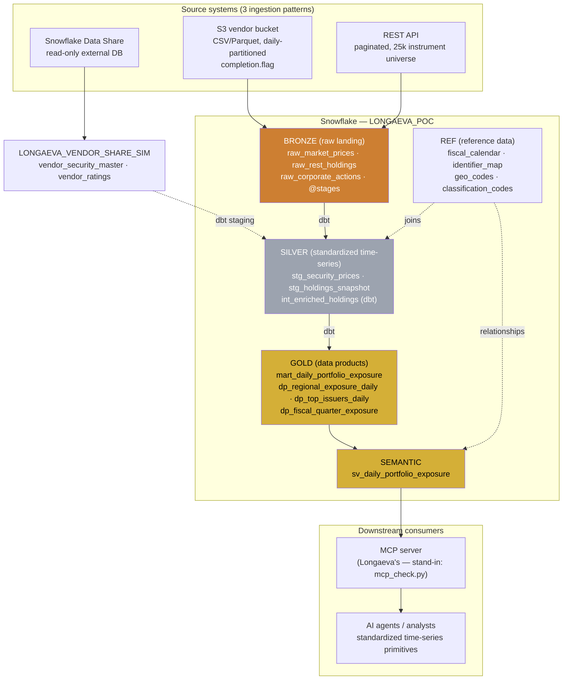
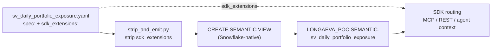
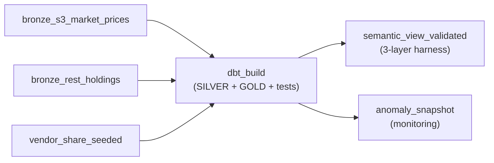
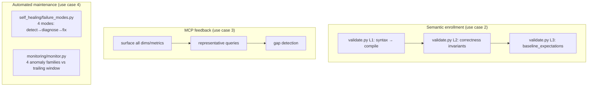
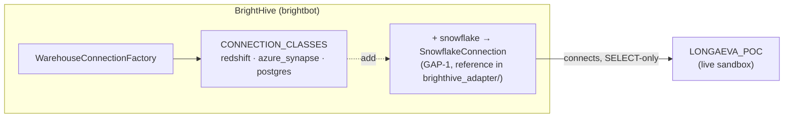

# Longaeva PoC Sandbox — Architecture

Visual map of the sandbox. Mirrors Longaeva's stack (Snowflake + dbt + Dagster +
custom MCP) so BrightHive's agents develop against a known-good target before the
trial. GitHub renders all Mermaid blocks natively.

## 1. End-to-end data flow (medallion → semantic → consumers)

## 2. Semantic-view YAML deploy pipeline (Grant's flow)

The extended YAML is the canonical artifact; SDK keywords are stripped before the
Snowflake DDL call. `strip_and_emit.py` implements exactly this.

## 3. Orchestration — Dagster asset graph

## 4. Validation & maintenance harnesses (the PoC use cases)

## 5. BrightHive integration point (GAP-1)

## Component → capability map

| Component | Dir | PoC use case | Status |
|---|---|---|---|
| Medallion DDL | `snowflake/` | environment | ✅ live |
| Synthetic seed | `seed/` | data substrate | ✅ ~450k rows |
| dbt project | `dbt/` | 1.x / 4.2 | ✅ 41 tests |
| Semantic view + YAML | `semantic/` | 2.x | ✅ |
| S3 / REST / Share ingestion | `sources/` | 1.1 / 1.2 / 1.3 | ✅ |
| Validation harness | `semantic/validate.py` | 2.3 | ✅ 3 layers |
| MCP queryability | `semantic/mcp_check.py` | 3.x | ✅ |
| Self-healing | `self_healing/` | 4.1 | ✅ 4 modes |
| Monitoring | `monitoring/` | 4.3 | ✅ 4 families |
| Orchestration | `orchestration/` | ELT infra | ✅ Dagster |
| BrightHive adapter | `brighthive_adapter/` | GAP-1 | ✅ connects |

See [`FIDELITY.md`](FIDELITY.md) for the build journal and [`../BRIGHTHIVE_GAPS.md`](../BRIGHTHIVE_GAPS.md) for the next-sprint plan.
