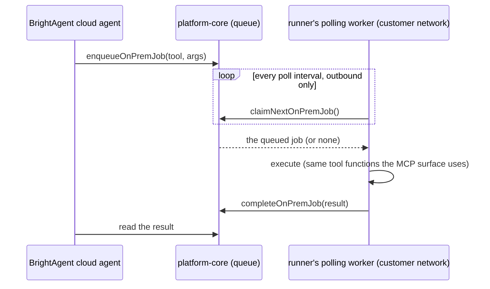

# ADR-0004: Outbound-only polling queue lets BrightAgent's cloud agent reach the on-prem runner

**Date:** 2026-08-14
**Status:** Accepted
**Who:** @drchinca (Kuri)
**Related:** [ADR-0002](0002-engineering-runs-on-the-customers-filesystem.md), [ADR-0003](0003-runner-packaged-for-a-linux-host-not-the-sql-server-box.md)

## The Problem

BH-1426 (BH-1421's hardest sub-problem, and the one that decides deployability): Loop Capital's
network terms are one static egress IP, allowlisted, TCP 1433 inbound only — for the SQL Server
itself, never for anything running on an install host. Every MCP surface BrightAgent has assumes
the server is reachable inbound. Asking a customer's security team for a second inbound rule onto
a host running remote code execution is exactly the kind of request that stalls a deal, and it
contradicts the "nothing installed on the server, nothing reaching in" posture ADR-0002 already
committed to.

Today the runner is only reached by **Frank's own harness**, over local stdio, on the same
machine. That solves the human-in-the-loop story. It does not solve the autonomous one:
BrightAgent's cloud agent — the watchdog, the nightshift, the proactive engineering loop — has no
path to trigger a `run_models` or `read_project_file` on a customer's on-prem project. Today,
engineering only happens when Frank's team is the one at the keyboard.

## Our Decision

**Outbound-only polling.** The runner dials out on an interval to ask "any work for me?" — the
same direction and the same security shape as BH-1425's report delivery already established
(outbound HTTPS, nothing listens). platform-core queues work; the runner claims it, executes with
the same tool logic the MCP surface already exposes, and posts the result back over the identical
outbound channel.

## Why This Choice

- **Zero inbound, by construction.** The worker only ever originates connections. There is no
  socket to allowlist, no port to open, nothing for a security reviewer to approve beyond "this
  host makes outbound HTTPS calls" — the same review an update-checker gets.
- **Reuses infrastructure this epic already built**, rather than inventing a third transport.
  BH-1425's outbound-delivery shape and BH-1431's idempotent-receiver shape are both instances of
  the same pattern this queue needs. A held-open connection (the rejected alternative below) would
  have been new plumbing top to bottom.
- **The latency cost is the right trade for this workload.** This queue carries autonomous
  engineering actions a watchdog decided to take — not interactive chat. Frank's own harness
  already covers the low-latency, human-in-the-loop case over local stdio; this queue only needs
  to beat "wait for a human to notice and run it by hand," which a 15–30s poll interval does
  comfortably.
- **Link-drop has an obvious, safe answer.** A claimed-but-never-completed job (worker died,
  network dropped mid-run) is just a stale claim — reclaimed by TTL, not a special failure mode
  requiring new machinery.

## The Cost

- **Not real-time.** A poll interval is a floor on responsiveness. Fine for "the watchdog noticed
  a failed model and wants it re-run"; wrong for a human waiting on a chat turn — which is exactly
  why Frank's harness keeps its own direct stdio path rather than being routed through this queue.
- **A second standing process on the customer's host.** Unlike the MCP surface (ADR-0003 —
  harness-spawned, no daemon), the poller genuinely must run continuously to be useful: the whole
  point is that BrightAgent can reach in whether or not Frank's team has a harness session open.
  That means BH-1427's packaging gains a second artifact to install and keep running — this one
  actually is daemon-shaped, and does need a supervisor (systemd), unlike the MCP binary.
- **One more credential to protect.** The worker holds the same service-key-equivalent (a
  runner-scoped token) the MCP config already carries for report delivery; compromise of the host
  compromises this queue's claim/complete calls the same way it already compromises report
  delivery. No new category of risk, but not a free lunch either.
- **Prototype-only tenant/authz model.** The spike scopes jobs by `workspaceId`/`projectId`
  exactly like BH-1431's report receiver, with the same service-key auth. It does not yet answer
  "can a customer's own harness see or cancel a cloud-enqueued job" — that's a real product
  question for whoever builds the UI on top of this, deliberately deferred.

## Alternatives We Considered

- **Outbound-held connection** (the plugin dials out once and holds a long-lived channel — e.g. a
  WebSocket or gRPC stream — that the cloud multiplexes tool calls over). Rejected for the spike:
  lower latency than polling, but new plumbing everywhere — connection lifecycle, reconnect/backoff,
  multiplexing multiple in-flight calls, and a security review that has to reason about a
  long-lived outbound socket instead of discrete request/response calls. The latency this would buy
  isn't needed for autonomous engineering actions; it would be needed if this queue were also
  carrying interactive chat, which it deliberately is not.
- **Site-to-site VPN** (AWS-to-Azure, plus identity federation): the POC-phase answer Doc 2 already
  named and deferred. Real network engineering coordination with the customer's team, on a
  timeline this epic does not control. Kept as a later option if a customer's security posture
  someday requires it; not the v1 answer.

## Working prototype

Demonstrated locally against the Loop Capital sandbox and a disposable Linux container (standing
in for the customer's host, `--network` isolated so it has no route back except the one it dials
out on): `enqueueOnPremJob` from a plain GraphQL call (standing in for the cloud agent), the
worker polling and claiming with zero inbound rule, `run_models` executing against the real
sandbox, and the result readable back in platform-core. Link-drop: killing the worker mid-claim
leaves the job `CLAIMED`; the next poller (or the same one, restarted) reclaims it once the lease
expires, verified by advancing past the TTL and re-polling.
