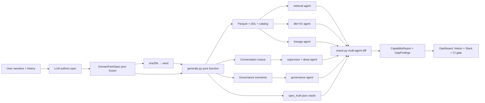

# Synthetic Warehouse — Capability Map for the BrightHive Agent Fleet

> Status: draft · Owner: BrightHive Platform · Last reviewed: 2026-06-24

## TL;DR

A **spec-driven, deterministic synthetic-warehouse pipeline** that doubles as the BrightHive platform's executable capability map. From a one-line niche narrative ("offshore wind robotics, 18 months of fleet ops"), an LLM authors a `DomainPackSpec`. A pure Python pipeline turns that spec into a warehouse (Parquet + DDL + catalog), a conversation corpus, and governance scenarios. The platform's own agent fleet is then run against those artifacts and scored against a hidden ground truth (`spec_truth.json`) the agents never see. Every score is reproducible from the spec; the same JSON file replays the same demo, the same eval, and the same dashboard forever.

## Glossary

- **Pack** — a frozen `DomainPackSpec` JSON file describing one domain (e.g. workforce_dev, automotive, offshore_robotics).
- **Spec truth** — the oracle file (`spec_truth.json`) emitted alongside the warehouse; agents never read it; the eval harness uses it to score outputs.
- **OSV** — Open Semantic View, BrightHive's warehouse-agnostic semantic-view YAML standard (see `agentic-project-mgmt/docs/specs/open-semantic-view.md`).
- **Capability map** — a per-agent × per-pack × per-time score matrix; the artifact this pipeline exists to produce.
- **Catalog snapshot** — the `list[_table_to_dict]` shape consumed by `dbt_agent_react.introspect_warehouse_schema`. The agent's existing input contract.
- **Gap finding** — a structured record emitted by the eval when the agent's output falls below `spec_truth`; carries dimension, examples missed, likely root cause, and suggested extension point in agent code.

## Why this exists

BrightHive is a multi-agent platform: retrieval, dbt+SV, governance, lineage, supervisor, deep-agent. Each has a contract, each has a ceiling, none of them have honest, comparable, reproducible measurement across niches. A spec-driven synth warehouse with hidden ground truth is the only artifact that can:

- Be fed to **every agent** in the platform.
- Score each agent **against the same oracle**.
- Track each agent's ceiling **over time**, niche by niche.
- Surface **cross-agent** gaps — failures where two agents are individually fine but their composition breaks.

The pipeline is therefore not a test fixture. It is the platform's **capability dashboard**, generated on demand from a 200-line spec.

## Five-layer warehouse, vocabulary-only swap per pack

The schema is identical across packs. A pack varies only the vocabulary, distributions, and FK cardinalities. This is the structural claim that makes cross-domain SQL trivial (`GROUP BY domain_type`).

| Layer | Tables | Per-pack swap |
|---|---|---|
| Platform | `dim_workspace`, `dim_domain_pack` | tag only |
| Domain | `dim_subject`, `dim_provider`, `dim_program`, `fact_enrollment`, `fact_outcome` | full vocab |
| Agent telemetry | `fact_agent_session`, `fact_tool_call`, `fact_trace` | none |
| Governance | `fact_governance_event`, `dim_policy` | policy IDs referenced by spec |
| Lineage | `fact_lineage_edge`, `dim_dataset_version` | upstream sources named by spec |

The agent telemetry, governance, and lineage layers are **domain-blind by design** — proves the platform claim that observability surfaces are uniform regardless of the domain on top.

## High-level architecture



## Why deterministic

Same spec ⇒ same `seed = sha256(canonical_json(spec))` ⇒ same warehouse bytes ⇒ same eval. Three properties fall out:

1. **Replay** — every shipped demo lives as a 200-line JSON file; CI regenerates it on demand.
2. **Diffability** — two specs side-by-side show exactly what changed about the demo; eval scores attribute changes to deltas.
3. **Library effect** — packs accumulate (workforce, automotive, fashion, robotics, …) — re-run any past pack from a 1-line command, watch ceilings drift over months.

## What's deterministic vs. LLM-creative

| Layer | Author | Deterministic? |
|---|---|---|
| Niche framing + narrative | User | n/a |
| `DomainPackSpec` | **LLM** (one shot, conversation-aware) | LLM call non-deterministic; spec frozen post-call |
| `seed = sha256(canonical_json(spec))` | Pipeline | yes |
| Row counts, distributions, FK graph, anomalies, agent telemetry, governance events, lineage edges | Pipeline | yes |
| Conversation corpus surface text | Pipeline (templated from persona block) | yes |
| Output Parquet/DDL/catalog/spec_truth | Pipeline | yes |
| Agent outputs (SV YAML, route choice, answer text) | **Agents** | no — variance is what we measure |

The LLM call happens once; the pipeline is replayable forever from the frozen spec.

## Three artifact families per run

Every run emits three families of artifacts, all from the same spec, all replayable:

| Family | Consumer | Eval dimension |
|---|---|---|
| **Warehouse**: Parquet + DDL + `catalog_snapshot.json` + `relationships.json` | dbt+SV, retrieval, lineage | entity / metric / PII / relationship / cross-table-metric |
| **Conversation corpus**: persona-grounded prompts with expected routes + grounded answer fragments | supervisor, deep-agent, retrieval | route / answer fidelity / grounding |
| **Governance scenarios**: policy + access requests with expected decisions | governance | policy / denial-rate / PII enforcement |

## The structural agent gap (measured, not papered over)

`scaffold_atlas_semantic_view` operates on **one `SilverSchema` at a time**. It has no signature for cross-table relationships, FK graphs, or multi-entity views. The synth pipeline preserves this gap as a **first-class eval dimension** rather than trimming scope to make the agent look good.

| Dimension | In scope today | Notes |
|---|---|---|
| Entity recovery | yes | per-table, agent's native surface |
| Per-table metric recovery | yes | agent's native surface |
| PII / sensitivity tag recovery | yes | spec carries tags; agent must surface them |
| **Relationship recovery** | **measured but expected to fail** | gap finding F1: scaffold has no `relationships=` arg |
| **Cross-table metric recovery** | **measured but expected to fail** | gap finding F2: scaffold has no multi-table signature |

Low scores on (4) and (5) auto-emit `GapFinding` records pointing at `atlas_semantic_view/scaffold.py:141` as the extension point. The pipeline is therefore a **roadmap generator** for the dbt+SV agent, not just a fixture.

## Cross-agent composition checks

The most valuable failure modes happen between agents. The eval harness scores four composition dimensions deterministically (no LLM judge):

| Composition check | Catches |
|---|---|
| Route → retrieve → answer fidelity | Supervisor routes correctly, retrieval grabs wrong table |
| SV-grounded answer integrity | dbt+SV produces correct YAML, answer agent ignores grain → wrong number |
| Governance gates retrieval | Retrieval surfaces a row, governance should have blocked PII column |
| Lineage closes the loop | Agent answers from derived metric; lineage edge missing or wrong |

Every check is a structural diff against `spec_truth`.

## Anomalies as deliberate stress tests

Anomalies are not realism noise — they carry *expected agent behavior*. The spec encodes both the perturbation and the response it should provoke:

```yaml
anomalies:
  - type: late_arriving_outcome
    rate: 0.012
    measures: "does lineage agent flag the freshness gap?"
    expected_governance_event: data_freshness_warning

  - type: schema_drift_rename
    column: home_port
    old_value: ABDN
    new_value: Aberdeen
    measures: "does lineage detect the rename mid-period?"
    expected_lineage_event: schema_drift_detected
```

Anomaly recovery becomes its own eval dimension.

## Temporal scoring — capability over time

Every run is a stamped record. The headline view is *capability at niche × agent × time*:

```
                    retrieval   dbt+SV   governance   lineage   supervisor   deep
workforce_dev         0.88      0.74       0.91        0.62       0.79      0.71
                      ↑0.04     ↓0.02      →           ↑0.11      ↓0.03     ↑0.06
offshore_robotics     0.71      0.55       0.83        0.41       0.68      0.52
                      NEW       NEW        NEW         NEW        NEW       NEW
```

Regressions are visible the day they happen. Niche elasticity is visible the moment a new pack lands. The pitch slide and the engineering metric are the same number.

## Where things live (no new repos)

| Artifact | Path |
|---|---|
| `DomainPackSpec` Pydantic schema | `brighthive-mock-data/canonical/spec/` |
| `generate.py` pure pipeline | `brighthive-mock-data/canonical/pipeline/` |
| Pack library (frozen `.json`) | `brighthive-mock-data/canonical/packs/` |
| Eval corpus (`EvalCase` rows + oracle) | `brightbot/evals/corpora/synth_warehouse/` |
| Open Semantic View standard | `agentic-project-mgmt/docs/specs/open-semantic-view.md` |
| Architecture (this doc) | `./CAPABILITY_MAP.md` |
| Flows + per-step contracts | `./FLOWS.md` |
| Decision record | `./ADR.md` |
| Skill orchestrator | `~/.claude/skills/synth-warehouse/` |

## Versioning roadmap

| Version | Scope |
|---|---|
| **v0.1** | one pack (workforce_dev), DuckDB-only, dbt+SV agent only, per-table eval, gap findings as JSON |
| v0.2 | second pack (offshore_robotics) → niche elasticity proof; conversation corpus + supervisor scoring |
| v0.3 | governance + lineage agents in eval; cross-agent composition checks |
| v0.4 | temporal dashboard (Notion + Slack), runs.parquet history |
| v0.5 | Snowflake + Redshift adapters via `seed_data/` extension; OSV adapter conformance suite |
| v1.0 | publishable benchmark — packs, oracle, leaderboard format |

## Anti-patterns

- **Trimming scope to make the agent score higher.** The whole point is honest measurement; gaps are the most valuable output.
- **LLM-judging where structural diff suffices.** Route correctness, SV entity match, governance decisions are all deterministic checks; reserve LLM judges for free-text answer quality.
- **Pipeline doing creative work.** Anything domain-specific must be in the spec, not in `generate.py`. Keep `generate.py` a pure function of spec + seed.
- **Hand-tuning packs to demo well.** A pack edited to make the agent pass is a pack that has lost its scientific value. Edit the agent, not the pack.
- **Treating SV YAML as Snowflake-coupled.** OSV is engine-neutral by design; see `open-semantic-view.md`.

## See also

- `./FLOWS.md` — per-step diagrams + Pydantic contracts
- `agentic-project-mgmt/docs/specs/open-semantic-view.md` — OSV format specification
- `./ADR.md` — decision record (v8 over v6.2)
- `brighthive-mock-data/README.md` — legacy 22-generator catalog (kept for one-off CSV demos)
