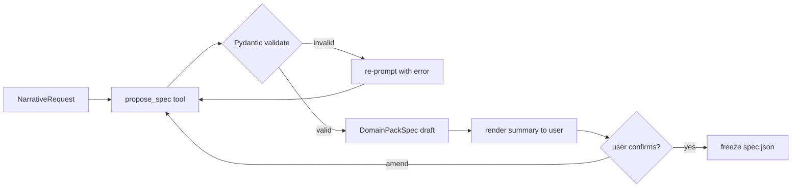
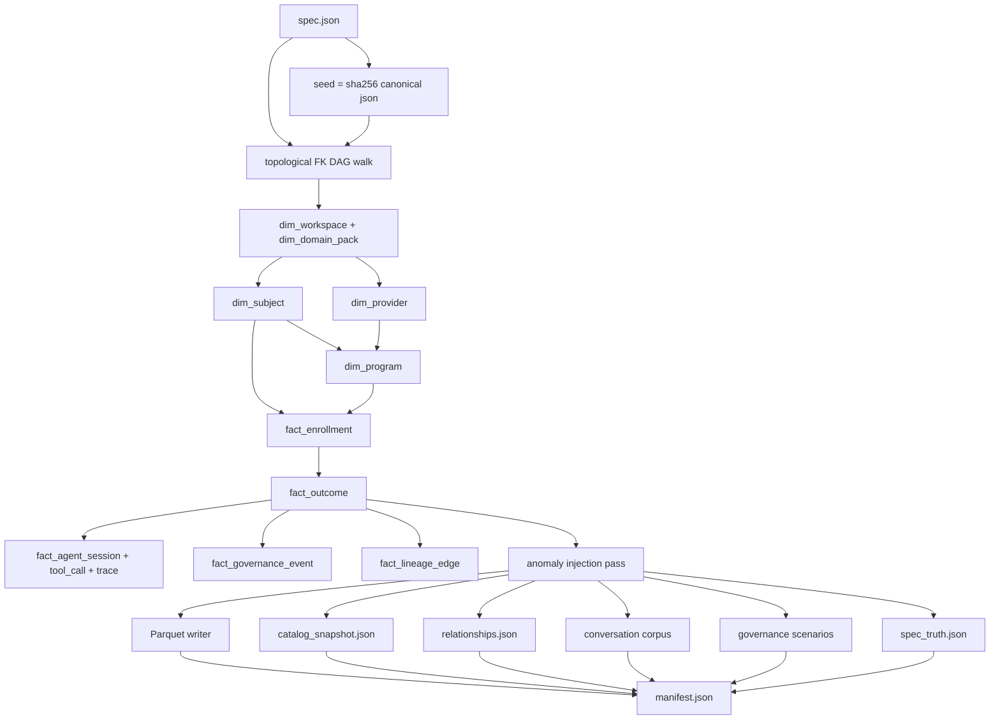
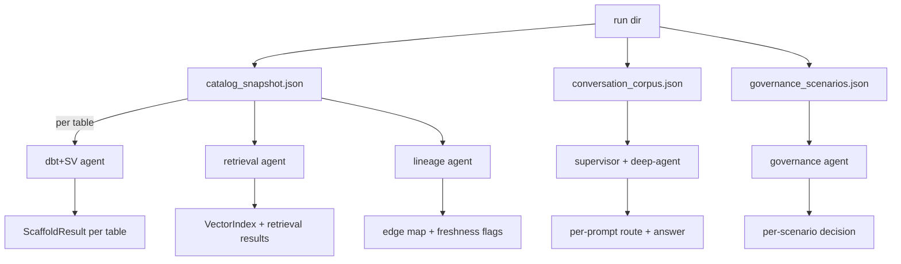
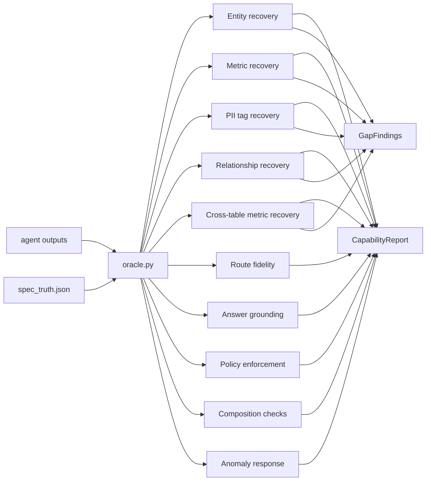
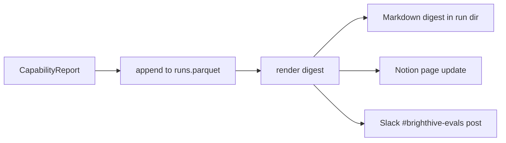

# Synthetic Warehouse — Flows & Per-Step Contracts

> Status: draft · Owner: BrightHive Platform · Last reviewed: 2026-06-24
> Companion to `./CAPABILITY_MAP.md`. Read that first for the why.

## TL;DR

Six steps. Five contracts. One frozen JSON spec. Each step is a pure function of the artifacts produced by the previous step, except step 2 (the LLM call) which is the only non-deterministic stage. Every other step replays identically given the same spec.

## End-to-end flow

```mermaid
sequenceDiagram
    participant U as User
    participant S as Skill /synth-warehouse
    participant L as LLM (spec author)
    participant G as generate.py
    participant A as Agent fleet
    participant O as oracle.py
    participant D as Dashboard

    U->>S: niche narrative + scope
    S->>L: propose_spec(narrative, history)
    L-->>S: DomainPackSpec (draft)
    S->>U: render summary; ask 1-3 clarifiers
    U->>S: confirm / amend
    S->>S: freeze spec → spec.json
    S->>G: generate(spec)
    G->>G: seed = sha256(canonical_json(spec))
    G-->>S: warehouse + corpus + scenarios + spec_truth
    S->>A: run agent fleet (parallel)
    A-->>S: per-agent outputs
    S->>O: score(outputs, spec_truth)
    O-->>S: CapabilityReport + GapFindings
    S->>D: append run; render dashboard
    S-->>U: summary + report card link
```

## Step 1 — Narrative intake

**Input**: free-text from user; conversation history; list of prior packs in the workspace.
**Output**: a normalized `NarrativeRequest`.

```python
@dataclass(frozen=True)
class NarrativeRequest:
    text: str
    workspace_history: list[PackRef]   # prior frozen specs in this workspace
    requested_scale: Scale | None      # XS/S/M/L; null → LLM proposes
```

## Step 2 — LLM authors `DomainPackSpec`

**Input**: `NarrativeRequest`.
**Output**: a draft `DomainPackSpec`. **The only non-deterministic step.**

The LLM uses a single tool, `propose_spec`, that forces structured output validated against the Pydantic schema. Validation failure → re-prompt with the validation error.



Confirmation/edit loop runs at the spec level, not the section level — section-by-section adds turns without adding control.

## Step 3 — `generate.py` (pure deterministic pipeline)

**Input**: frozen `DomainPackSpec`.
**Output**: a run directory with six artifacts.



### Run directory layout

```
runs/<pack_id>_<seed8>_<utc_ts>/
├── spec.json                    # frozen DomainPackSpec (input)
├── manifest.json                # seed, row counts, anomalies applied, pipeline version, git sha
├── tables/                      # one Parquet per table
│   ├── dim_workspace.parquet
│   ├── dim_subject.parquet
│   ├── …
│   └── fact_lineage_edge.parquet
├── ddl/
│   └── warehouse.sql            # CREATE TABLE statements (DuckDB v0.1)
├── catalog_snapshot.json        # list[_table_to_dict] — what the agent eats
├── relationships.json           # FK graph + cardinality hints
├── conversation_corpus.json     # persona-grounded prompts + expected routes
├── governance_scenarios.json    # policy + access requests + expected decisions
├── spec_truth.json              # ORACLE — agents never read this
└── README.md                    # run summary
```

### Determinism contract

- `seed = sha256(canonical_json(spec))[:16]` — hex int. Canonicalize keys before hashing.
- All RNGs derive from `seed`: `numpy.random.default_rng(seed)`, `Faker.seed(seed)`, `random.seed(seed)`.
- Anomaly injection uses a child RNG: `seed_anomaly = sha256(seed + b"anomaly")`.
- No clock reads, no `Math.random`, no hostname; the only entropy is `seed`.

## Step 4 — Agent fleet runs (parallel, independent)

**Input**: artifacts in the run directory.
**Output**: one structured result per agent.



**Per-agent contracts**:

| Agent | Input shape | Output shape |
|---|---|---|
| dbt+SV (`dbt_agent_react`) | `SilverSchema` per table | `ScaffoldResult{yaml, document, report}` |
| retrieval | catalog + sample rows | embedding index + per-prompt top-k |
| lineage | catalog + table history | inferred edge graph + freshness events |
| supervisor + deep-agent | conversation corpus | per-prompt `{route, answer, citations}` |
| governance | scenarios | per-scenario `{decision, policy_id, masked_columns}` |

The dbt+SV agent is invoked **per table** today (the existing contract). Multi-table is measured as a gap.

## Step 5 — `oracle.py` scores outputs vs `spec_truth`

**Input**: agent outputs + `spec_truth.json`.
**Output**: `CapabilityReport` + `list[GapFinding]`.



### Scoring rules

| Dimension | Method |
|---|---|
| Entity recovery | exact-match on entity name + primary_entity_column |
| Metric recovery | name + grain + unit + positive_direction match (exact); semantic similarity for label fallback |
| PII tag recovery | column-level boolean flag in agent's SV YAML matches spec's `pii: true` |
| Relationship recovery | edge-level F1 weighted by cardinality |
| Cross-table metric recovery | spanning-table metrics matched by canonical SQL form |
| Route fidelity | per-prompt expected vs observed agent route (exact) |
| Answer grounding | LLM judge on free-text answers against `spec_truth.expected_answer_contains_*` |
| Policy enforcement | per-scenario decision exact match |
| Composition checks | structural diffs across agent outputs (route → retrieve → answer) |
| Anomaly response | each anomaly's `expected_*_event` present in agent outputs |

### `GapFinding` contract

```python
@dataclass(frozen=True)
class GapFinding:
    dimension: str                          # e.g. "relationship_recovery"
    pack_id: str
    spec_truth_count: int
    agent_output_count: int
    examples_missed: list[dict]             # first 3, structured
    likely_root_cause: str                  # human-readable
    suggested_extension_point: str          # file:line in agent code
    severity: Literal["info","warn","block"]
```

Severity is a function of dimension and score. `block` severities prevent CI green; `warn` annotates without blocking; `info` records for trend tracking.

## Step 6 — Dashboard append + render

**Input**: `CapabilityReport`.
**Output**: row in `runs.parquet`; rendered Markdown digest; Notion page update; Slack post.



The Notion page is one entry per pack; each row carries the latest score, delta vs prior run, and links to the GapFindings list.

## Pydantic contracts (v0.1 surface)

```python
@dataclass(frozen=True)
class DomainPackSpec:
    spec_version: Literal["1.0.0"]
    pack_id: str
    narrative_seed: str
    workspace: WorkspaceDef
    entities: list[EntityDef]               # subject / provider / program / etc.
    relationships: list[RelationshipDef]    # FK graph w/ cardinality + conditions
    metrics_per_table: list[MetricDef]
    cross_table_metrics: list[CrossTableMetricDef]
    personas: list[PersonaDef]              # conversation corpus seed
    governance: GovernanceDef
    lineage: LineageDef
    anomalies: list[AnomalyDef]             # each with expected_*_event
    scale_presets: dict[Scale, ScalePreset]
    deterministic_seed: str | None          # null → derived from sha256(spec)
```

```python
@dataclass(frozen=True)
class CapabilityReport:
    pack_id: str
    seed: str
    run_id: str                             # <pack>_<seed8>_<ts>
    pipeline_version: str
    agent_versions: dict[str, str]
    scores: dict[Dimension, float]
    gap_findings: list[GapFinding]
    deltas_vs_prior: dict[Dimension, float] # null on first run
    composition_checks: list[CompositionCheck]
```

## Replay contract

| Action | Expected outcome |
|---|---|
| Re-run pipeline with same `spec.json` | byte-identical Parquet, byte-identical `spec_truth.json` |
| Re-run agent fleet on same warehouse | per-agent variance recorded; pipeline outputs unchanged |
| Edit one field of `spec.json`, re-run pipeline | diff is exactly the edited field's downstream effect |
| Compare two runs of same pack across weeks | `deltas_vs_prior` attributes score changes to agent variance, not pipeline drift |

## Failure modes & how the design handles them

| Failure mode | Mitigation |
|---|---|
| LLM hallucinates a spec field | Pydantic validation rejects; re-prompt loop |
| Generator non-determinism | All RNG keyed off `seed`; no clock/network/hostname |
| Agent output non-determinism | Recorded as agent variance; `deltas_vs_prior` exposes it |
| Spec drift between runs | `manifest.json` records pipeline + agent versions; reports cite both |
| Cross-pack inheritance creep | v0.1 forbids it; each pack stands alone |
| Anomaly tests gaming the score | Anomalies declared with expected agent response; score-and-shame asymmetric |

## See also

- `./CAPABILITY_MAP.md` — architecture and rationale
- `./ADR.md` — decision record
- `agentic-project-mgmt/docs/specs/open-semantic-view.md` — OSV format
- `brightbot/agents/dbt_agent/tools/atlas_semantic_view/scaffold.py` — agent contract source of truth
- `brightbot/evals/` — eval framework reused as the harness
