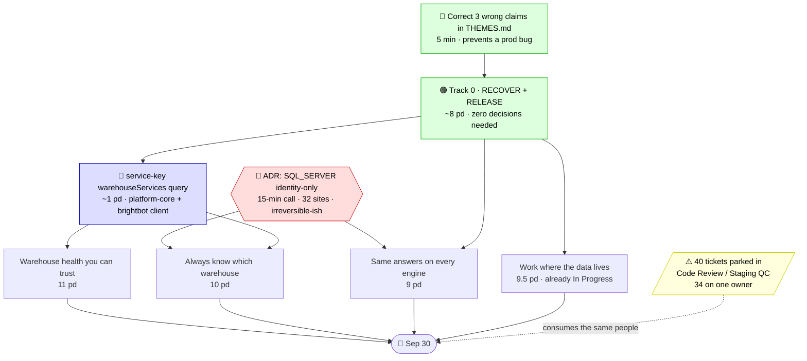

# 🎯 Roadmap — Aug 19 → Sep 30

The one sequenced do-list to the end of Q3. [THEMES.md](THEMES.md) owns the 92-spec
classification and the archive piles; **this file owns the dated frontier, the sizing, and the
order of work**. Every row below was verified against code on 2026-08-19 — `file:line` for what
exists, the exact zero-match grep for what doesn't. No unfalsifiable green.

**42 days. ~30 working days.** The audit that produced THEMES.md classified the specs but sized
them by eye (`S`/`M`/`L`). Sizing them against the repos changes the picture in both directions:
several `L` themes are mostly shipped, two `M` themes hide missing abstractions, and the pile
does not fit in the quarter. What follows is what fits, and why.

---

## 🚦 Decide first

THEMES.md opens with **"seven decisions block delegation."** Verified against code, that is not
the case: four were already settled by shipped code, one is a naming preference with no code
behind either name, and one is stated backwards. **One is real.**

| # | Decision | Verified state | Gates | Cost to decide | Cost to defer |
|---|---|---|---|---|---|
| **1** | **`SQL_SERVER`: own `WarehouseType` or alias?** | 🔴 **genuinely open** | catalog-and-identity, cross-engine-correctness | 15-min ADR — every fact is in hand, nothing to measure | **highest of the seven.** 32 dispatch sites, persisted lineage labels, customer-visible for Loop Capital |
| **2** | Correct the Project-ACTIVE row in THEMES.md | 🔴 **THEMES.md is factually wrong** | nothing — but the error is dangerous | 5 minutes | an engineer builds a second trigger → **duplicate activation runs in prod** |
| 3 | Scope call: does governance-enforced start this quarter? | 🟡 open | 23–28 pd — the largest single theme | free | it will not fit if added late |
| 4 | Scope call: rebase or rewrite the orphaned remediation branch? | 🟡 open | fleet-self-healing items 2/3/4 | free | ~7 pd of finished work rots further |

Everything else THEMES.md lists as a decision is archive work: **#2 engine port**, **#4 on-prem
dbt**, **#5 routine approval**, **#7 `@` sigil** were each answered by code that already shipped,
and **#1 warehouse fan-out** names two mechanisms that both return zero grep hits — the build is
identical either way, so pick a name in the ticket and move on. That is one ~30-minute
documentation pass, and it blocks nothing.

### Decision 1 in detail — the only one worth a meeting

The two layers are not in conflict. They answer different questions and both shipped correctly:

- **Identity** — `SQL_SERVER` is its own member: `warehouse-provider-typedefs.ts:23`, whose own
  comment at `:12` says it exists *"so the UI/OMD service type accurately reflects what the user
  connected."*
- **Wire protocol** — it is an alias: `warehouse_types.py:20` has no `sql_server` in the
  `Literal`; `warehouse.py:184-185` collapses it into `AZURE_SYNAPSE`.

The damage is downstream of that collapse: **32 dispatch sites** key on the normalized literal
with no fallback (`warehouse_connections.py:677`, `warehouse_writers.py:145`,
`database_size_tool.py:66`, `metric_snapshot_sql.py:39,48`, `connection_health_tool.py:54`,
`warehouse_query_tool.py:59`, dialect branches at `workflow_agent/tools.py:295,368`), and
`lineage_refresh_task.py:95` hardcodes `engine = "azure_synapse"` — **every Loop Capital lineage
graph is filed under Synapse.**

**Recommended decision: add the member for identity only, never for dispatch.** Move all 32 sites
to a `TDS_FAMILY` frozenset — the TypeScript side already established the pattern at
`warehouse-provider-mapping.ts:22`. That makes the sweep mechanical instead of 32 judgment calls,
with zero behavior change.

One correction to THEMES.md's framing: the claimed `lineage-adapter-sql-server.md` I-1 break is
narrower than stated. Provider selection keys on the **raw** secret type
(`lineage_provider_selection.py:52`), so it survives a new member untouched. Only the emitted
label breaks.

---

## 🕸️ What actually gates what



**One artifact unblocks the most work in a single move.** A service-key-authenticated
`warehouseServices { id name provider isDefault }` query in platform-core — mirroring
`getTransformationServicesForScheduledWatchdog` at `watchdog-typedefs.ts:56` — plus its brightbot
client. The watchdog runs with **no user JWT** (`pipeline_watchdog_task.py:140-147`,
`auth_method="local_dev"`), so it cannot read `isDefault` today. That one query is a hard
prerequisite for warehouse-health items 1 and 2 **and** catalog item 2. Build it once, ~1 pd, and
sequence it before either theme. Building those themes independently pays for it twice.

---

## 🧭 Legend

State is verified against code, never taken from a ticket's `Status` field.

| | Means |
|---|---|
| 🟢 **SHIPPED** | merged and provable at `file:line` — the theme lists work that is already done |
| 🟠 **PARTIAL** | some of it exists; the named remainder is real |
| 🟡 **OPEN** | genuinely absent — a named grep returns zero |
| 🔵 **RELEASE** | code is finished on `develop`/`staging`; only a prod cut remains |
| ⚠️ **RECOVER** | finished work at risk — orphaned branch, stale status, or unmerged |

---

## ⚠️ The prod release gate

`brightbot origin/main` is at `a66f4234` — the **2026-07-28** production cut. Every commit for
BH-1168, BH-1320, BH-1121 and BH-1351 landed on `develop`/`staging` **after** that date, and
`in main: 0` is confirmed for all four.

So today, in production: **the engineering agent still cannot write to a non-Redshift warehouse.**
`warehouse_writers.py` — Protocol at `:55`, four adapters, registry at `:141`, tests — is real, and
is not serving customers. Roughly a day of release work converts ~4 pd of finished code into
shipped capability. It is the highest-return item on this page.

---

## 📋 The frontier — verified size per theme

`Guess` is what THEMES.md assigned by eye. `Verified` is against code.

| Theme | Guess | Verified | Δ | What the delta is |
|---|---|---|---|---|
| [Finish BrightRoutines](THEME-brightroutines-closeout.md) | S | **0.75 pd** | ⬇️⬇️ | **Zero build.** All three items shipped; the claimed P0 was fixed 2026-07-12 |
| [Catch a bad number](THEME-blast-radius-quality.md) | L | **6–9 pd** | ⬇️⬇️ | Lineage port shipped with **six** adapters and two live triggers; the blast-radius walk is written and unit-tested |
| [Routine results land where teams work](THEME-routine-delivery.md) | M | **7–9 pd** | ⬇️ | ~70% shipped as BH-1397–1402. One real gap: `sink_config` has zero consumers |
| [Same answers on every engine](THEME-cross-engine-correctness.md) | L | **9 pd** | ⬇️ | 3 of 6 items shipped 07-23→07-31; ~4 pd of it is a release, not a build |
| [Drop in your legacy pipeline files](THEME-legacy-file-intake.md) | M | **9–10 pd** | → | The "three competing designs" are all paper — build one, don't unify three |
| [Work where the data lives](THEME-onprem-engineering.md) | L | **9.5 pd** | ⬇️ | Runner is shipped end-to-end in a repo the theme never names |
| [Always know which warehouse](THEME-catalog-and-identity.md) | L | **10 pd** | ⬇️ | 3 of 6 items ≥half shipped; the webapp half is the *most* complete, not missing |
| [Warehouse health you can trust](THEME-warehouse-health-truth.md) | L | **11 pd** | → | Item 7 fully shipped incl. test + seeder; item 3 is 4× its apparent size |
| [Turn on a project](THEME-project-activation.md) | M | **11 pd** | ⬆️ | Sized as greenfield, is ~60% done — but multi-repo binding is a real schema change |
| [Answer what it costs](THEME-cost-and-volume.md) | M | **14 pd** | ⬆️ | **Time-boxed, not effort-boxed** — see below |
| [The screen never lies](THEME-honest-surfaces.md) | M | **16 pd** | ⬆️⬆️ | Item 5 is a new run-history store across three repos, not webapp wiring |
| [Pipelines that fix themselves](THEME-fleet-self-healing.md) | L | **18 pd** | ⬆️ | ~7 pd of it is recovering an orphaned branch, not building |
| [Describe a routine and get one](THEME-routine-authoring.md) | L | **~20 pd** | ⬆️ | Wrong in both directions — drafting is cheaper, context-gathering is dearer |
| [Governance you declare is enforced](THEME-governance-enforced.md) | L | **23–28 pd** | ⬆️⬆️ | Largest by far, and 5–6 pd of it has no ticket at all |

**Total ≈ 165 person-days.**

---

## 🔬 De-risked to code — the corrections that change the plan

**The claimed live P0 does not exist.** THEMES.md's headline finding — *"one live P0 buried at
line 1,077, never lifted into a ticket"* — is refuted. It was fixed, ticketed (BH-991), merged
(`c3598a48`, PR #789) and regression-tested on **2026-07-12**, five weeks before the theme was
written. `detector.py:305-326` hard-disables the multi-user gate with a literal `False` and the
plain-language comment the theme asks for; `detector.py:325` stamps
`multi_user_path=disabled_no_hierarchy_signal` into the audit trail on every evaluation. It
**fails closed by blocking** — strictly more conservative than before, not waving anything
through. Test at `test_detector.py:112-131`. `git merge-base --is-ancestor` confirms it on
develop, staging **and** main.

**There is a real customer-facing defect, and it is in a different theme.**
`webapp/src/Governance/GovernancePolicyItem.tsx:55` — `const [isEnforced, setIsEnforced] =
useState(false);`. The **"Enforced" toggle is local React state**. Never persisted, never read by
anything. Its tooltip at `:83` reads *"Hard enforcement — BrightAgent will block violating
operations."* The same feature's own prose at `GovernancePolicies.tsx:31` says policies *"are not
enforced by the Brighthive platform."* A customer flips a switch that does nothing and is told it
blocks operations. **~0.5 pd to remove.** Ship it independently of everything else — it is the
exact failure the governance theme was written about.

**~3,200 lines of finished work are orphaned.** `origin/remediation-layer0-classifier-recall-gaps`
(HEAD `5339c784`, 2026-07-27) carries 21 files and **9 new test files** implementing most of
fleet-self-healing items 2, 3 and 4 — `verifying_loop.py`, `remediation_decision.py`,
`fix_memory_store.py`, `remediation_planner.py`. `gh pr list --head … --state all` returns `[]`:
**no PR was ever opened.** It references a spec that isn't in `docs/specs/`, which is why the
theme was written unaware of it. Sizing items 3/4 as fresh builds would double-spend ~7 pd. It is
also only half-wired — `evaluate_after_poll` has no caller, so the state machine enters
`VERIFYING` and nothing advances it. **Decide rebase-vs-rewrite before anyone opens an editor**;
`develop` moved under it when BH-1329 landed on 07-31 in adjacent files.

**The agent can merge its own pull request on the main dbt path.** GC-17 is exemplary where it
applies — `dbt_agent_react.py:262` omits `github_merge_pull_request` by explicit import list, with
a dispatch-time re-check at `pipeline_watchdog_task.py:696-706` and an adversarial test that
injects the leak and asserts zero attempts. But that covers the **remediation loop only**. On the
main dbt path the tool is bound at `dbt_agent_react.py:152,230` and listed at `:340`. The on-prem
theme's "cannot merge without a human" acceptance criterion would fail today. Worth a decision on
whether that is intended.

**Three themes point at the wrong epic.** legacy-file-intake claims `BH-1255`, which is *"Scheduled,
Versioned, Lineage-Aware Pipeline Runs"* — a different epic. routine-authoring claims `epic:
BH-897`, but BH-897 is a **Task** under BH-876, and BH-898–911 do not exist. governance-enforced
cites `BH-624`, which is *"Semantic View Lifecycle for Snowflake Tables"*. Fix before assigning.

**On-prem's "Where it lives" table omits the repo the work is in.** The runner is shipped
end-to-end on `main` of **`brightagent-engineering-runner`** — poll loop (`worker.py:122`),
lease/claim, installer, real-wire test — a repo the theme never names. An engineer reading the
theme today would rebuild it from scratch in `brightbot`. The actual gap is one caller:
`enqueueOnPremJob` is defined (`onprem-job-queue.ts:29`, resolver `resolvers.ts:436`) and has
**zero callers in any repo**. The queue has a drainer and no filler.

**Two "small" items are 4× their apparent size.** Warehouse-health item 3 (staleness gate) reads
as one field; it is 2 pd because **no healthy poll ever writes `healthPolledAt`** —
`pipeline_watchdog_task.py:537-545` only produces snapshots for connections that emitted a signal.
Ship the gate alone and every healthy row turns "Unknown". Honest-surfaces item 5 ("make run logs
readable") reads as webapp wiring; brightbot already pulls real per-step logs
(`project_runs.py:46`) and **the wire drops them** (`project_runs_poster.py:86-110`), and there is
**no run entity at all** — `syncProjectRuns` persists only `lastRunStatus`/`lastRunAt` onto each
TransformationNode. That is a new store across three repos: 6 pd.

**Cost-and-volume cannot produce a number for this quarter.** Item 1 needs cost-allocation tags on
AWS resources — `grep "Tags.of"` across both CDK repos returns **zero**. The Aspect is 1–2 pd; the
rest is redeploying 16 stacks across every workspace and org account, then ~24h for Cost Explorer
to activate the keys. **Tags do not backfill.** The first trustworthy month is the month *after*
rollout. The theme's own frontmatter already says `Park — confirm the ask is still live`; resolve
that with sales before spending any of the 14 days.

---

## 🛠️ The sequence

### Track 0 — Recover and release · ~8 pd · **start Monday, needs no decision**

Highest return per day on the page. Nothing here is new code.

| Item | Size | Why first |
|---|---|---|
| Land the orphaned remediation branch | 4 pd | recovers ~7 pd; rots further every week `develop` moves |
| Prod release of BH-1168/1320/1121/1351 | 1.5 pd | converts ~4 pd of finished code into shipped capability |
| Promote BrightRoutines `develop`→`main`, close 6 stale tickets | 0.75 pd | the whole theme |
| Remove the fake "Enforced" toggle | 0.5 pd | customer-facing, independent of everything |
| Correct the 3 wrong claims + 3 wrong epic IDs | 0.5 pd | prevents a duplicate-trigger prod bug and 3 misassignments |
| Write the SQL_SERVER ADR | 0.25 pd | unblocks Tracks 1 and 3 |

### Track 1 — Warehouse truth · ~22 pd · **run the two themes as one**

`warehouseServices` service-key query (1 pd) → warehouse-health (11) + catalog-and-identity (10).
They share the prerequisite and they share the `"Unknown"` label — **pick that word once**, or the
webapp union at `useHiveHealth.ts:53` and the health resolver will disagree. Needs the ADR for
catalog items 3–4.

### Track 2 — On-prem / Loop Capital · ~9.5 pd · **already In Progress**

BH-1403 and BH-1421 are live work. **Fix the "Where it lives" table before anyone else picks it
up.** The 5 pd item is item 4 (register the runner as a real engine) — platform-core has no
provider registry and 12+ hardcoded `provider === "DBT_CLOUD"` branches, several of which fall
through to Deepnote-shaped behavior on an unknown member.

### Track 3 — Cross-engine correctness · ~5 pd after Track 0 releases the rest

The un-fixed second copy of the Synapse quoting bug (`quality_check_agent.py:1025`, on the
LLM-generated-expectations path, still silently degrading to a 5000-row sample) plus the parity
tri-state. The 34 inline `warehouse_type == …` branches across 6 engine-neutral modules are the
missing dialect port that items 1 and 5 keep paying for — 3 pd to fix properly, or log it as debt.

---

## 📅 The six weeks

```
              Aug           Aug           Sep           Sep           Sep           Sep
              19-22         25-29         01-05         08-12         15-19         22-30
              ▲today                                                              ═╡ Q3 CLOSE
 Track 0  ▓▓▓▓▓▓▓▓▓▓▓▓
 Track 1              ░░░░░░░░░░░░░░░░░░░░░░░░░░░░░░░░░░░░
 Track 2  ▓▓▓▓▓▓▓▓▓▓▓▓▓▓▓▓▓▓▓▓▓▓▓▓
 Track 3                            ░░░░░░░░░░░░
 Backlog  ▓▓▓▓▓▓▓▓▓▓▓▓▓▓▓▓▓▓▓▓▓▓▓▓  ← the 40 parked tickets compete for these people
```

`▓ in flight · ░ planned.` Marks are effort shape, not instrumented dates.

---

## ⚪ Known gaps — tracked honestly

**The pile does not fit, and this roadmap does not pretend otherwise.** ~165 pd of verified theme
work against ~30 working days. Jira shows three engineers taking assignments (Kuri, Marwan,
Harbour), so nominal capacity is ~90 pd before review, QC and the existing backlog — realistically
60–70. Tracks 0–3 total **~45 pd**. That is the honest Sep 30 scope. The remaining ~120 pd —
governance-enforced, routine-authoring, honest-surfaces, cost-and-volume, project-activation,
legacy-file-intake, routine-delivery, blast-radius-quality, and the rest of fleet-self-healing —
is **post-Q3**, and saying so now is cheaper than discovering it in week five.

**The real delegation blocker is not the spec pile.** There are **no open sprints** in project BH,
and **40 tickets sit in `In Progress` / `Code Review` / `Staging QC`** — 34 assigned to one
person, the oldest untouched since 2026-07-07. Handing out 14 themes on top of that queue deepens
it. Track 0 exists partly to drain it.

**Ticket hygiene is the gate on four themes, not code.** `cost-and-volume` and `routine-delivery`
have **no real tickets at all** — their only references are catch-all epics (BH-171/172) and a
`Done` epic (BH-876). `legacy-file-intake`'s seven tickets are entirely unassigned. BH-1457 is
mis-parented under BrightRoutines when it is the warehouse-health bug. A theme with no refined,
assigned ticket cannot be delegated at any size.

**Jira status is not evidence and was not treated as such.** BH-991/992/993 show `Code Review`
while their code is on `main`. BH-767 and BH-769 show `Needs Refinement` while their code shipped.
BH-766 shows `Staging QC` but shipped as PII masking, not the enforcement point the governance
theme describes — do not read it as "item 1 is nearly done." Every state in this document came
from the repos.

**Two "Done when" criteria are unprovable today.** Fleet-self-healing's seeded-failure e2e needs
`BH_SELF_HEALING_FIXTURE_URL`, and that fixture service **exists in no repo** (5 pd, and it gates
every acceptance box on that theme). Routine-authoring's scored eval bar has no agreed threshold
number anywhere in the theme or in Jira.

**Three items are worth challenging before they are funded.** Catalog item 3 wants real
`DatabaseNode`s; the already-persisted `databases: [String!]` array
(`warehouse-verification-typedefs.ts:71`) satisfies drill-down, ambiguity detection and the
`defaultDatabase ∈ databases` guard today — the theme's own "Don't do" defers the 5-level graph for
lack of a second consumer, and the same argument applies. Blast-radius BH-1062 ("fetch and parse
`manifest.json`") describes an approach the code already superseded — it reads dbt-mcp Discovery.
`inline-context-anchors.md` was archived for colliding with the shipped `@` sigil; there is no
collision — the webapp picker **emits the dotted path the brightbot parser reads**
(`ChatField/index.tsx:137`), they are one feature. Its unbuilt half (`#` and `[` sigils,
BH-1354–1358) is real work with no rival design.
