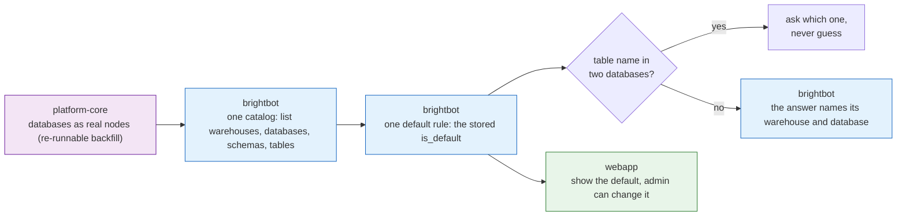

# Always know which warehouse you're talking to

> **Superseded specs:**
> - [warehouse-catalog-enumeration.md](./warehouse-catalog-enumeration.md)
> - [warehouse-catalog-mcp-surface.md](./warehouse-catalog-mcp-surface.md)
> - [warehouse-tables-mcp-surface.md](./warehouse-tables-mcp-surface.md)
> - [default-warehouse-ui-surfacing.md](./default-warehouse-ui-surfacing.md)
> - [warehouse-database-table-identity.md](./warehouse-database-table-identity.md)

> Delegation unit. Cap 150 lines.

## The goal

A customer with several warehouses can see all of them, drill from warehouse → database → table,
and always tell which one is the default. When they ask a question, the answer names the warehouse
and database it came from. When a name is ambiguous, the platform asks instead of guessing.

## Why now

Impact Capital has three registered warehouses, and **two parts of the platform disagree about
which one is the default** (BH-1457): the warehouse list names one, while the health check
connects to a different one — and that different one points at a database that no longer exists.
So an answer can quietly come from a warehouse the customer didn't mean. A confidently wrong
answer is worse than no answer, because nobody catches it.

## What to build

1. `brightbot` — one catalog module with four read verbs: list warehouses, list databases, list
   schemas, list tables. Today this is specced across three separate documents for one Python
   file; it's one module with one set of verbs.
2. `brightbot` — **one** way of deciding which warehouse is the default, used by every caller.
   Today the warehouse list and the connection check disagree, and that disagreement is the
   BH-1457 bug. **The workspace's stored `is_default` flag is the answer**; the connection check's
   independent guess (currently the first entry it finds) is the one to delete. Confirm on Impact
   Capital's workspace before and after.
3. `brighthive-platform-core` — store databases as real nodes so a warehouse's databases can be
   queried instead of guessed from strings. **This needs a backfill** for every warehouse that
   already exists — write it as part of this item, and make it re-runnable, because it will be run
   more than once.
4. `brighthive-platform-core` + `brightbot` — an ambiguity rule: when a table name matches in more
   than one database, ask which one. Never pick the first match silently.
5. `brighthive-webapp` — show which warehouse is the default, and let an admin change it. The
   backend for this already exists; only the UI is missing.
6. `brightbot` — every answer that reads from a warehouse states which warehouse and database it
   came from.

## Done when

- [ ] The warehouse list and the connection check agree on the default for Impact Capital's
      workspace — the BH-1457 mismatch is gone, confirmed against real staging
- [ ] The database backfill runs twice in a row without creating duplicates
- [ ] A customer can drill warehouse → database → schema → table from chat and from the webapp
- [ ] A table name present in two databases produces a question, not a guess — proven by a test
- [ ] The default warehouse is visible in the webapp and changeable by an admin
- [ ] An answer sourced from a warehouse states which warehouse and database it came from
- [ ] Real-behavior test against a workspace with **three** registered warehouses, not one

## Don't do

- **Adding a `sql_server` WarehouseType** — owned by
  [Same answers on every warehouse engine](THEME-cross-engine-correctness.md), and it needs
  decision 3 in [THEMES.md](THEMES.md) settled first.
- **The five-level Resource/Job graph** from [`warehouse-database-table-identity.md`](./warehouse-database-table-identity.md) §2 — its own
  §5 admits the registry driving it isn't being built this pass. Defer until a second consumer
  exists.
- **Any warehouse write path** — owned by
  [Same answers on every warehouse engine](THEME-cross-engine-correctness.md). The
  `WarehouseBuilder` write/DDL port bolted onto the identity spec mid-draft is superseded by that
  theme's item 2; don't build it here and don't build it twice.
- **The OpenMetadata service-identity collision fix** also bundled in there — that's a different
  system and belongs in its own bug ticket.
- **Table parity comparison** — owned by
  [Same answers on every warehouse engine](THEME-cross-engine-correctness.md), and it depends on
  item 3 landing first.
- **Warehouse health and staleness** — owned by
  [Warehouse health you can trust](THEME-warehouse-health-truth.md).

## Where it lives

| Repo | What changes |
|---|---|
| `brightbot` | one catalog module (4 verbs), single default-resolution path |
| `brighthive-platform-core` | database nodes, ambiguity rule, default resolution |
| `brighthive-webapp` | default badge + set-as-default action |
| `brighthive-e2e` | three-warehouse drill-down + ambiguity feature tests |

**Tickets:** BH-1370 (epic), BH-1395, BH-1396, BH-1362, BH-1457 (the default mismatch)

---

## Notes for whoever picks this up

**Read the source specs for facts, not for scope.** Their combined 1,958 lines collapse to the six
items above. Specifically:

- [`warehouse-database-table-identity.md`](./warehouse-database-table-identity.md) is 880 lines with **16 invariants** (over the 15 cap) and
  bundles five separable concerns. Only two of them — database nodes and the default/ambiguity
  ladder — are in this theme. The other three are listed under "Don't do" above.
- The three catalog specs (`-enumeration`, `-mcp-surface`, `-tables-mcp-surface`) are 835 lines of
  full template ceremony for three thin pass-through read verbs on one module. They are correctly
  *layered* — each defers its follow-on to the next — but that layering describes one piece of
  work, not three.
- [`warehouse-selection-on-mcp-tools.md`](./warehouse-selection-on-mcp-tools.md) (BH-1430) is **already `Done`** in Jira and self-discloses
  as "spec-after-code." Treat it as reference for how selection already threads through
  `get_database_size`; don't rebuild it.
