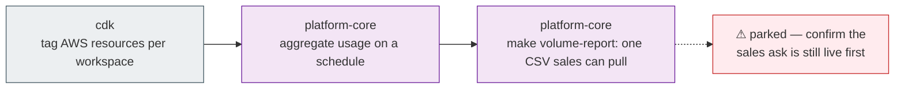

# Answer what it costs

> **Superseded specs:**
> - [cost-allocation-tagging.md](./cost-allocation-tagging.md)
> - [usage-metering-pipeline.md](./usage-metering-pipeline.md)
> - [volume-matrix-report.md](./volume-matrix-report.md)

> Delegation unit. Cap 150 lines.

## The goal

When an enterprise prospect asks "what will this cost us at our volume?", we answer with real
numbers from our own platform instead of an estimate. Sales can pull a per-customer volume and
cost picture without an engineer.

## Why now

This blocks enterprise deals — a named prospect asked for a volume matrix and we had nothing to
send. Three specs were written to answer it on the same day in April 2026, and **four months later
every ticket across all three is still unstarted.** That pattern suggests the problem was split
into three docs and then nobody owned any of them.

## What to build

The three source specs are one dependency chain, not three features. Build them in order — each
is useless without the one before it.

1. `brighthive-*-cdk` — tag AWS resources consistently enough that spend can be attributed to a
   workspace. Nothing downstream works without this.
2. `brighthive-platform-core` — aggregate usage per workspace on a schedule: rows processed,
   queries run, assets catalogued, agent calls.
3. `brighthive-platform-core` — a script sales runs themselves, e.g.
   `make volume-report WORKSPACE=<id> MONTH=2026-07`, emitting one CSV with a row per workspace per
   month: rows processed, queries run, assets catalogued, agent calls, and attributed AWS spend.
   No UI, no dashboard — one file they can attach to an email.

## Done when

- [ ] AWS spend can be attributed to a specific workspace from tags alone
- [ ] Usage numbers per workspace are stored and refreshed on a schedule
- [ ] A volume matrix for one real workspace can be produced without an engineer touching it
- [ ] Attributed spend is **within 5%** of the AWS bill for that period, with the unattributed
      remainder shown as its own line rather than silently absorbed
- [ ] Real-behavior test: the report runs against real AWS Cost Explorer data for a real
      workspace, not a fixture

## Don't do

- **Build 2 or 3 before 1.** Untagged resources make the join impossible; this is the reason to
  keep the ordering strict.
- **Customer-facing billing.** This is an internal sales and pricing input, not an invoicing
  feature. No customer sees these numbers directly yet.
- **Per-query cost attribution.** Workspace-level is what was asked for. Finer granularity is a
  later question.
- **A dashboard.** A report sales can pull is the ask. A UI comes only if the report gets used.
- **Reviving the 30-KPI analytics dashboard** — on mock data since April with every follow-on
  ticket unstarted. Parked as its own decision; see [THEMES.md](THEMES.md).

## Where it lives

| Repo | What changes |
|---|---|
| `brighthive-data-organization-cdk`, `brighthive-data-workspace-cdk` | cost-allocation tags |
| `brighthive-platform-core` | usage aggregation on a schedule |

**Tickets:** BH-118 (epic — Workspace/Orgs usage & pricing reporting, the exact-fit parent; was
under generic BH-171 infra) — no real child tickets exist yet; the three source specs' work is
unstarted, so file the three items above as fresh children rather than carrying 3 separate backlogs

---

## Notes for whoever picks this up

This is the clearest case in the whole consolidation of **fragmentation causing paralysis**. The
three source specs are 129, 146, and 161 lines, same author, same day (2026-04-16), and each one's
context section points at the next: tagging says it "blocks the volume matrix"; metering says its
output is "joined with Cost Explorer costs, produces the real volume matrix"; the matrix spec says
prospects "ask what it costs." One chain, three documents, zero progress in four months.

Before starting, confirm the commercial ask is still live. Four months of no movement on something
described as blocking enterprise sales means either the deal pressure passed or nobody owned it —
worth 5 minutes with sales before spending engineering time. If it is no longer live, park this
theme honestly rather than half-building it.
