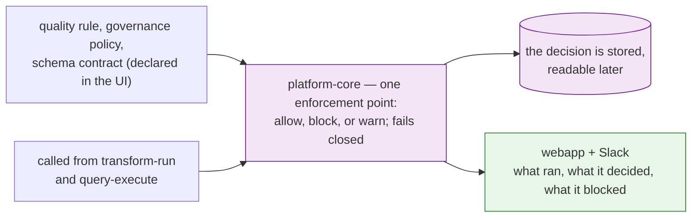

# Governance you declare is governance we enforce

> **Superseded specs:**
> - [governance-policy-enforcement.md](./governance-policy-enforcement.md)
> - [user-schema-contract-gates.md](./user-schema-contract-gates.md)
> - [project-governance-observability-convergence.md](./project-governance-observability-convergence.md)
> - [data-quality-rules.md](./data-quality-rules.md)
> - [data-product-tier-surfacing.md](./data-product-tier-surfacing.md)

> Delegation unit. Cap 150 lines.

## The goal

When a customer declares a rule — a quality expectation, a governance policy, a schema contract —
the platform actually applies it, tells someone when it's violated, and shows where it's enforced.
Today all three can be created and none are reliably applied. A data leader can build a whole
governance posture in the UI and have it change nothing.

## Why now

Two separate audits, written in June, each confirmed the same thing by reading the code: the
mutation that applies a governance rule exists, and **nothing ever calls it**. A customer can
build a complete governance posture in the UI and change nothing about what the platform allows.
This is the gap between what we show a data leader and what we actually do — the single most
damaging kind for a governance product to have.

## The one pattern behind all of it

Three different artifacts have the identical defect: **declared but never enforced.**

| Artifact | Gates | Created via | Applied? |
|---|---|---|---|
| Quality rule | data values | UI + GraphQL | inconsistently |
| Governance policy | who/what may run | UI | no |
| Schema contract | shape of transform input/output | UI | no |

Fixing them one at a time triples the work and produces three enforcement paths. Build **one**
enforcement point that all three artifacts register against, then wire each artifact to it.

## What to build

1. `brighthive-platform-core` — one place that answers "is this operation allowed?" Given the
   artifact, the operation, and the workspace, it returns **allow / block / warn** and stores what
   it decided as a record a customer can read back later. **Decide and record three things before
   writing it:** (a) it runs synchronously, in-line with the operation — an async check can't block
   anything; (b) it is called from the transform-run and query-execute paths *only* to start with,
   not everywhere; (c) on its own internal error it **fails closed** — a blocked operation is
   recoverable, an unchecked one isn't.
2. `brightbot` — actually call it. The rule-creation mutation exists and the agent never invokes
   it; that gap is the whole bug for policies.
3. `brightbot` — scope quality rules by tag and by group, so a customer can say "these rules apply
   to everything tagged Gold" instead of picking assets one at a time.
4. `brighthive-platform-core` — anchor a governance declaration to the lineage node it protects,
   so "where is this enforced" has an answer.
5. `brighthive-webapp` + Slack — show enforcement: which rules ran, what they decided, what got
   blocked. A violation nobody sees is not enforcement.
6. `brighthive-webapp` — surface the data-product tier that already exists in the graph but is
   never selected in the query. Read-only; do not let the UI author a tier.

## Done when

- [ ] A declared quality rule blocks or warns on a real violation, and the stored decision is
      readable afterwards through the API
- [ ] A governance policy denies an operation it forbids — proven end-to-end against a real
      backend, not unit-mocked
- [ ] When the check itself errors, the operation is blocked, not allowed — proven by a test
- [ ] A schema contract rejects a transform whose output shape drifted
- [ ] All three go through the **same** enforcement point — one code path, three registrations
- [ ] A customer can see, per lineage node, which governance applies and what it last decided
- [ ] Gold/Platinum tiers show in the products grid, sourced from the existing graph field

## Don't do

- **Rebuild quality-rule CRUD, persistence, or the execution engine.** BH-503 shipped all of it
  and is `Done` in Jira. Its spec still says `Ready`, which is stale metadata, not open work.
- **Three separate enforcement paths.** If the design ends with one per artifact type, it's wrong.
- **Let the UI author data-product tiers** — tier is derived from lineage depth, never from names
  or manual entry. Read-only surfacing only.
- **Blast-radius / downstream impact analysis** — owned by
  [Catch a bad number before your customers do](THEME-blast-radius-quality.md).
- **New backend engines for quality or policy** — the convergence spec explicitly defers those;
  keep that boundary.

## Where it lives

| Repo | What changes |
|---|---|
| `brighthive-platform-core` | the enforcement point, lineage anchoring, tier field selection |
| `brightbot` | call the enforcement point, tag/group rule scoping |
| `brighthive-webapp` | enforcement visibility, tier badges |
| `brightbot-slack-server` | violation alerts |

**Tickets:** BH-766, BH-767, BH-768, BH-769 (policy/quality enforcement gaps) + BH-1511, BH-1512,
BH-1513, BH-1514, BH-1515 (schema-contract gates, filed 2026-09-04 — see
[`user-schema-contract-gates.md`](./user-schema-contract-gates.md))

---

## ⚠️ Open decision — added 2026-09-04, verify before item 1 starts

Since this theme was written (2026-08-18), **BH-1464 shipped a real `authorize(subject, verb,
resource, ctx)` decision point**, and BH-1491 (Testing (Dev)) is extending it with ABAC attribute
conditions (`AttributeReader`, `PermissionCondition`). This theme's item 1 — "one place that
answers 'is this operation allowed?'" — has **not been ticketed or built**. Before it is: confirm
whether that one place *is* BH-1464's `authorize()` engine (extended to also gate quality-rule and
schema-contract artifacts, not just identity/role), or a genuinely separate mechanism. Building a
second "one enforcement point" alongside `authorize()` is the exact three-divergent-paths failure
this theme exists to prevent — just one layer up from the policy/quality/schema-contract split it
already caught.

This does **not** block BH-1511/BH-1512 (the schema-contract resolver + conformance validator,
filed 2026-09-04 under this theme) — column/type diffing is not an identity decision, so that part
is correct regardless of the answer. Only the final allow/block/warn *wiring* is open.

## Notes for whoever picks this up

Two of the source specs are audits rather than designs: [`governance-policy-enforcement.md`](./governance-policy-enforcement.md) (119
lines) documents four confirmed gaps between what BH-503 designed and what shipped, and
[`user-schema-contract-gates.md`](./user-schema-contract-gates.md) (140 lines) does the same for contracts and explicitly names the
policy gap as its sibling. They are the evidence for this theme, and they already identified the
shared pattern — the consolidation here is finishing that thought, not discovering it.

Keep the artifact boundary honest while sharing the mechanism: quality rules gate **data values**,
schema contracts gate **the shape of transform input and output**. They are not the same thing and
should not be merged into one artifact type — only one enforcement path.
