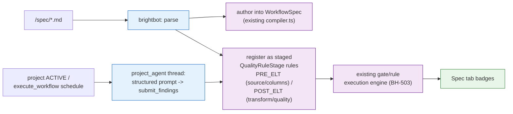

# Write a spec, get a working pipeline

> Delegation unit. Cap 150 lines.

## The goal

A customer writes what they want in plain markdown — sources, columns, transform logic, quality
bar, consumers — and BrightAgent turns that into real staged quality gates and a real WorkflowSpec,
using primitives that already exist: the `PRE_ELT`/`ELT`/`POST_ELT` quality-rule gate, the
`project_agent` activation-thread pattern (structured prompt → `submit_*_findings` tool →
notification), and the `execute_workflow` scheduler for anything recurring. No new engine.

## ⚠️ Corrections (three review passes — read before building)

1. **WorkflowSpec** (live, shipped) already does pipeline compile/validate/run — extend it, don't
   build a parallel Intent Graph.
2. **BH-172's enforcement point isn't built yet**; **Goal** already binds to `Project.goals`.
3. **The real primitives, grounded 2026-09-16:** `SYNC()` (named in prior memory/specs) is
   **vaporware — zero code**. The scheduler that's real is `execute_workflow` (BH-877–881,
   shipped, e2e-verified). Staged quality gates already exist —
   `QualityRuleStage: PRE_ELT | ELT | POST_ELT` — plus a `GOVERNED_BY`-edge binding that already
   indexes rules/policies onto lineage nodes. `project_activation_check_routes.py` is the real,
   live "proactive prompt fills an agent session with findings" pattern (`ACTIVATION_PROMPT` →
   `discover_data_assets`/`read_project_schema_file` → `submit_activation_findings`) — reuse its
   shape, don't invent a new one. PDF-summarize / CSV-to-table agent capability **does not
   exist anywhere** — real gap, explicitly out of scope here (see "Don't do").

## Why now

Honest answer: product-direction ask, not an incident. `Draft` until a real trigger names it.

## What to build

1. `brighthive-platform-core` — parse `/spec/*.md`; **Goal** binds to `Project.goals`; the other
   five sections (Source systems, Key columns, Transform logic, Data quality, Outputs/Consumers)
   are net-new parsed storage.
2. `brightbot` — author parsed sections into WorkflowSpec (existing mutations) AND register each
   as a `QualityRuleStage` rule: source/column declarations → `PRE_ELT`, transform-logic/quality
   sections → `POST_ELT`, via the existing `GOVERNED_BY` gate binding — not a new store, not a
   bespoke comparison. Hand-off tool set excludes `github_merge_pull_request`
   (`dbt_agent_react.py:229-230` can self-merge; mirror `REMEDIATION_TOOLS` +
   `test_gc_17_auto_merge_exclusion.py`).
3. `brightbot` — trigger the check by reusing the **real** `project_activation_check_routes.py`
   pattern (structured prompt → `submit_*_findings` tool → notification) against a `project_agent`
   thread, for on-ACTIVE and on-demand. For recurring re-checks, schedule via the real
   `execute_workflow` action — never a bespoke cron or `SYNC()` (doesn't exist).
4. `brighthive-platform-core` + `brighthive-webapp` — badges read the staged gate rules' real
   execution results (BH-503's engine), following honest-surfaces' never-false-green principle.

**Sequencing:** 1 → 2 → {3, 4} — 3 and 4 both only consume item 2's output; they don't block
each other.

## Done when

- [ ] A parsed spec registers real `PRE_ELT`/`POST_ELT` quality rules AND a WorkflowSpec, not a
      shadow record
- [ ] Self-merge structurally excluded — proven by a test mirroring `test_gc_17_auto_merge_exclusion.py`
- [ ] A project going ACTIVE (or an on-demand call) fires a real `project_agent` thread with
      findings, visible the same way activation findings are today
- [ ] A recurring check runs via `execute_workflow`, not a new scheduler
- [ ] Existing single-file Project specs keep working unmodified

## Don't do

- **Auto-apply anything, or a self-merge-capable tool set.**
- **A second Intent Graph, a second scheduler, or `SYNC()`** — unbuilt; don't design as if real.
- **PDF summarization or CSV-to-table generation** — confirmed real, unbuilt Ingestion Agent
  capability. Genuinely valuable, genuinely a different theme — don't fold it in here by accident.
- **Blast-radius analysis** — [blast-radius-quality](THEME-blast-radius-quality.md).
- **RCA/fix-authoring** — [fleet-self-healing](THEME-fleet-self-healing.md); a conformance
  failure is a new trigger source into that loop, not a second one.
- **The typed graph-visualizer UI** — separate, later.

## Where it lives

| Repo | What changes |
|---|---|
| `brighthive-platform-core` | spec storage, `PRE_ELT`/`POST_ELT` rule registration via existing gate typedefs |
| `brightbot` | markdown→WorkflowSpec + rule authoring, activation-thread-pattern trigger reuse |
| `brighthive-webapp` | badges reading real rule-execution results |

**Tickets:** BH-1255 (epic), BH-1527 → BH-1528 → {BH-1529, BH-1530} (bodies updated to reflect the
staged-gate + activation-thread mechanism — see PR #191)

---

## Not yet ready to delegate

No client trigger yet. Also, **resolved 2026-09-16, confirmed against `origin/develop`:** no
`Spec` tab and no `Observability` tab exist in `brighthive-webapp`
(`src/common/ProjectSidenav/ProjectSidenav.tsx`) — real tabs are Overview / Schemas / Flow /
Input Data Assets / Files / Data Products. `Flow` (≈ this doc's "Pipeline") is real but
feature-flagged, marked "not GA" in its own code comment. **Open product decision, not an
engineering call:** does spec-authoring get a new tab, fold into `Overview`, or ride behind the
same flag as `Flow`? BH-1527's "existing single-file specs parse unmodified" criterion assumed a
surface that doesn't exist — this is greenfield UI, not an extension. Source docs:
[projects-2.0-technical-requirements.md](projects-2.0-technical-requirements.md),
[projects-2.0-design-spec.md](projects-2.0-design-spec.md) (both now saved in-repo, reconciled).

## Notes for whoever picks this up

**PDF-summarize / CSV-to-table** is a real, separate gap worth its own theme if wanted — don't
let it get absorbed into this one's scope by accident. Shares WorkflowSpec-authoring with
[`brightroutines-ai-authored-workflowspec.md`](brightroutines-ai-authored-workflowspec.md) (BH-897).
