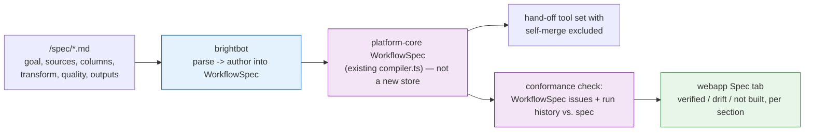

# Write a spec, get a working pipeline

> Delegation unit. Cap 150 lines.

## The goal

A customer writes what they want in plain markdown — the sources, the columns that matter, the
transform logic, the quality bar, who consumes the output — and BrightAgent authors that into the
platform's real workflow system, then keeps checking that what's deployed still matches what was
declared. Today a spec is a Project tab a human reads; nothing parses it into WorkflowSpec.

## ⚠️ Corrections (two review passes — read before building)

**Pass 1 (WorkflowSpec):** the first draft proposed a parallel "Intent Graph" inside brightbot
duplicating a **live, shipped** system — `WorkflowSpec` (`brighthive-platform-core/.../workflow/compiler.ts`,
`.../neo4j/workflow-spec.ts`), the default render path of a Project's `Flow` tab
(`brighthive-webapp/src/ProjectWorkflow/ProjectWorkflowPage.tsx:60,515-526`). Exactly the failure
`THEMES.md`'s own audit was written to catch. Rewritten to extend WorkflowSpec, not duplicate it;
the "no new write authority" claim was also false as written — corrected below.

**Pass 2 (unverified premise, still open):** `BH-172`'s enforcement point does **not exist in
code yet** — confirmed by grep, zero hits beyond WorkflowSpec's own unrelated `checkPolicies()`.
The reconciliation line below is a design intention pending BH-172, not a verified boundary. Also:
**this theme's own opening line — "today a spec is a Project tab a human reads" — is unconfirmed.**
No `ProjectSpecPage` exists in webapp; the live sidenav shows `Overview / Schemas / Flow / Input
Data Assets / Files / Data Products`, not `Spec / Pipeline / Observability` as both the technical
and design docs describe. Needs a human answer before BH-1527 is refined further — see below.

## Why now

Honest answer: this isn't an incident or a client blocker — it's a product-direction ask (a
"Projects 2.0" requirements + design-spec pair). No concrete trigger exists yet, so status stays
`Draft` (see "Not yet ready to delegate" below).

## What to build

1. `brighthive-platform-core` — parse `/spec/*.md` frontmatter + canonical H2 sections. **Goal**
   already has structured backing (`Project.goals` in `schema.graphql`, a real form in
   `ProjectOverviewProjectGoalForm.tsx`) — bind to it, don't re-parse from prose. The other five
   (Source systems, Key columns, Transform logic, Data quality, Outputs/Consumers) have no
   existing schema field — genuinely net new, merged by section name across multiple files.
2. `brightbot` — author the parsed sections **into WorkflowSpec** via its existing mutations
   (`createWorkflowSpec` → `upsertWorkflowStep` → `bindWorkflowStep` → `compileWorkflow`) — do not
   build a second compiler or graph store. Mirrors what
   [`brightroutines-ai-authored-workflowspec.md`](brightroutines-ai-authored-workflowspec.md)
   (BH-897) already designed for chat intent → WorkflowSpec, applied to spec markdown instead.
3. `brightbot` — a conformance check reading WorkflowSpec's own `issues` and run history vs. the
   parsed spec, flagging drift (declared-not-built / built-not-declared / logic-mismatch) — not a
   second store. Overlaps `THEME-governance-enforced.md`'s schema-contract check ("output shape
   drifted"); **proposed line, unverified — BH-172 isn't built yet: schema contracts would own
   write-time blocking, this owns everything else, read-only, no gating.**
4. `brighthive-platform-core` — read endpoint + on-demand trigger (`POST .../spec/verify` per the
   source doc's §2.5) surfacing per-section conformance status, sourced from WorkflowSpec's
   issues/runs, not a parallel record.
5. `brighthive-webapp` — Spec tab shows a badge per section (verified/drift/not-built), following
   [THEME-honest-surfaces.md](THEME-honest-surfaces.md)'s never-false-green principle rather than
   a fourth ad hoc status enum.

**Sequencing — this is a strict chain, not 4 parallel tickets:** 1 → 2 → 3 → 4. Do not assign in
parallel expecting independent completion; 2/3/4 each depend on their predecessor's output shape.

## Done when

- [ ] A spec with Goal/Source systems/Transform logic/Outputs sections authors a real WorkflowSpec
      (via the existing mutations) without hand-editing
- [ ] Authoring goes through a hand-off tool set with `github_merge_pull_request` excluded —
      proven by a test mirroring `test_gc_17_auto_merge_exclusion.py` (injects the leak, asserts
      zero attempts), not a prompt assertion
- [ ] A deployed model that diverges from its spec'd transform logic shows as drift, not silently
      green
- [ ] Existing single-file Project specs keep working unmodified
- [ ] Real-behavior test against a real project's spec and a real WorkflowSpec compile

## Don't do

- **Auto-apply anything, or use a self-merge-capable tool set.** `dbt_agent_react_graph`'s main
  tool list includes `github_merge_pull_request`
  (`brightbot/agents/dbt_agent/dbt_agent_react.py:229-230`) — this theme's hand-off must use a
  restricted set (the pattern `REMEDIATION_TOOLS` already establishes), never the main list.
- **A second "is this operation allowed" engine, or a second Intent Graph/compiler.** WorkflowSpec
  and BH-172 already own those. This theme parses markdown INTO WorkflowSpec and reads its
  existing issues/runs for conformance — it does not re-implement either.
- **Blast-radius/impact analysis on a conformance failure** — owned by
  [Catch a bad number before your customers do](THEME-blast-radius-quality.md).
- **RCA or fix-authoring on a failing pipeline** — owned by
  [Pipelines that fix themselves](THEME-fleet-self-healing.md). A conformance failure can become a
  trigger source into that loop; it is not a second healing loop.
- **The typed graph-visualizer UI** — track separately once parsing lands.

## Where it lives

| Repo | What changes |
|---|---|
| `brighthive-platform-core` | spec file/section storage, conformance-status read API, extends WorkflowSpec's schema/issues — no new store |
| `brightbot` | markdown-to-WorkflowSpec authoring, conformance checker |
| `brighthive-webapp` | Spec tab per-section badges |

**Tickets:** BH-1255 (epic), BH-1527 → BH-1528 → BH-1529 → BH-1530 (strict sequence; ticket
bodies updated post-correction — see PR #191)

---

## Not yet ready to delegate

Real evidence — an incident, a client blocker, a live bug — is this repo's own bar before a theme
leaves `Draft`. No client trigger exists yet (`clients/README.md`, Loop Capital notes checked).

**Blocking question, needs a human answer, not more grepping:** do `Spec` / `Pipeline` /
`Observability` exist as real tabs today, under different names, or are they aspirational in both
source docs? The live webapp sidenav has no `Spec` tab. If the premise is wrong, BH-1527's target
(what does it parse INTO, on top of what UI) needs re-scoping before refinement, not after.

## Notes for whoever picks this up

**BH-1255 carries 50+ `Needs Refinement` tickets** across other themes — real load, not a clean epic.

**Shares one mechanism with** [`brightroutines-ai-authored-workflowspec.md`](brightroutines-ai-authored-workflowspec.md)
(BH-897, unshipped) — both author into WorkflowSpec from natural input. Build the pipeline once.
