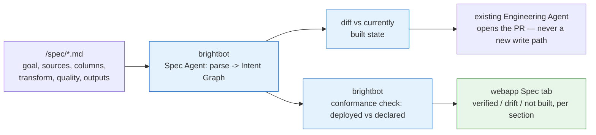

# Write a spec, get a working pipeline

> Delegation unit. Cap 150 lines.

## The goal

A customer writes what they want in plain markdown — the sources, the columns that matter, the
transform logic, the quality bar, who consumes the output — and BrightAgent builds the pipeline
from it, then keeps checking that what's deployed still matches what was declared. Today a spec
is a Project tab a human reads; nothing parses it, builds from it, or notices when reality drifts
from what was written.

## Why now

Honest answer: this isn't an incident or a client blocker — it's a product-direction ask (a
"Projects 2.0" requirements doc). This repo's own template wants a concrete trigger before a
theme is delegatable; there isn't one yet, so status stays `Draft` (see "Not yet ready to
delegate" below) rather than pretending otherwise.

## What to build

1. `brighthive-platform-core` — parse `/spec/*.md` frontmatter + canonical H2 sections (Goal,
   Source systems, Key columns, Transform logic, Data quality, Outputs, Consumers), merged by
   section name across multiple files in one project.
2. `brightbot` — new Spec Agent skill: turn the merged sections into a typed Pipeline Intent
   Graph, diff it against current built state, hand the diff to the **existing** Engineering
   Agent to build. The Spec Agent never writes dbt/SQL itself.
3. `brightbot` — a conformance check: deployed models/tests/schemas vs. the Intent Graph, flagging
   drift (declared-not-built, built-not-declared, logic mismatch). This answers "does deployed
   match declared" — a different question from BH-172's "is this operation allowed right now."
   Modeled on BH-172's one-enforcement-point shape (one check, artifacts register against it) but
   its own mechanism, cross-referenced to BH-172, not merged into it.
4. `brighthive-platform-core` — read endpoint surfacing per-section conformance status.
5. `brighthive-webapp` — Spec tab shows a badge per section (verified/drift/not-built), following
   [THEME-honest-surfaces.md](THEME-honest-surfaces.md)'s never-false-green principle (name what's
   wrong, mark unknown honestly) rather than a fourth ad hoc status enum.

## Done when

- [ ] A spec with Goal/Source systems/Transform logic/Outputs sections parses into an Intent Graph
      without hand-editing
- [ ] The Intent Graph diff hands off to the real Engineering Agent PR path — never writes SQL
      directly
- [ ] A deployed model that diverges from its spec'd transform logic shows as drift, not silently
      green
- [ ] Existing single-file Project specs keep working unmodified
- [ ] Real-behavior test against a real project's spec and a real deployed dbt model

## Don't do

- **Auto-apply anything.** Every build goes through the existing Engineering Agent PR path — this
  theme adds no new write authority.
- **A second "is this operation allowed" engine.** That's BH-172's job. This theme only diffs
  declared vs. deployed; it does not gate operations.
- **Blast-radius/impact analysis on a conformance failure** — owned by
  [Catch a bad number before your customers do](THEME-blast-radius-quality.md).
- **RCA or fix-authoring on a failing pipeline** — owned by
  [Pipelines that fix themselves](THEME-fleet-self-healing.md). A conformance failure can become a
  new *trigger source* into that existing loop; it is not a second healing loop.
- **The typed graph-visualizer UI** (source→transform→product→app swim lanes) as a build item
  here — track it separately once parsing lands; don't block this on a UI redesign.

## Where it lives

| Repo | What changes |
|---|---|
| `brighthive-platform-core` | spec file/section storage, conformance-status read API |
| `brightbot` | Spec Agent skill (parse + diff), conformance checker |
| `brighthive-webapp` | Spec tab per-section badges |

**Tickets:** BH-1255 (epic), BH-1527, BH-1528, BH-1529, BH-1530

---

## Not yet ready to delegate

This theme's own template requires real evidence — an incident, a client blocker, a live bug —
before `status` moves past `Draft`. What triggered this write-up is a product-direction doc, not
an incident. That's a legitimate reason to write the theme down; it isn't a reason to mark it
`Ready to delegate`. Flip status once a client ask or a concrete trigger names it.

## Notes for whoever picks this up

**Reconciled against a broader "Projects 2.0" doc (2026-09-16)** proposing three requirements.
Two of the three are **not** new work: a pipeline-to-data-product visualizer folds into
[THEME-honest-surfaces.md](THEME-honest-surfaces.md)'s badges + [THEME-governance-enforced.md](THEME-governance-enforced.md) item 6's tier
surfacing, and "proactive agentic monitoring" is already
[THEME-fleet-self-healing.md](THEME-fleet-self-healing.md) (brightbot #1043 already landing) +
[THEME-blast-radius-quality.md](THEME-blast-radius-quality.md) (✅ ready today). Do not re-spec
those — extend them. One real delta found and **not** duplicated here: a pre-merge **sandboxed
dry-run** step for proposed fixes, noted on THEME-fleet-self-healing.md instead.

**Same pattern, different domain**: [`brightroutines-ai-authored-workflowspec.md`](brightroutines-ai-authored-workflowspec.md)
(BH-897) designs the identical shape — intent → ground → draft → validate → human-gated build —
for Routines, not pipelines, and is itself unshipped (0/7 tickets). Worth noticing two initiatives
share one pattern before both get built independently; not a blocker on this theme.

**BH-1255 currently carries 50+ `Needs Refinement` tickets** spanning several other themes
(project-activation, fleet-self-healing, legacy-file-intake/SSIS, quality-rule bridging, tier
surfacing) — some THEMES.md says were "repointed" elsewhere, but the Jira parent field was never
actually moved (a known manual-move gap, see ROADMAP.md). Nesting here per the epic-home call
made when this theme was written; flagging the queue so whoever prioritizes sees the real load.
