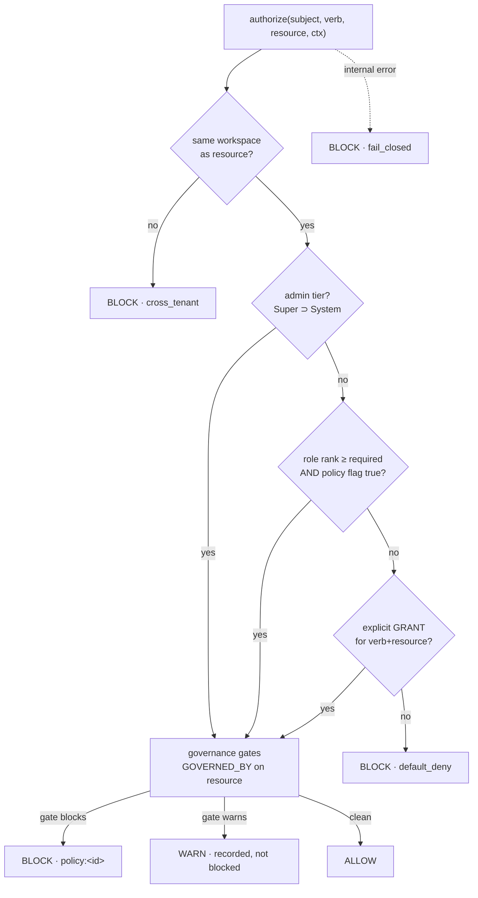

# Access decisions & governance enforcement

> **Extend, don't rewrite.** BrightHive already ships a Neo4j-authoritative 3-tier model
> (`AUTH_TIERS_AND_RBAC.md`). This spec unifies its two disjoint enforcement paths into **one
> decision point**, makes roles and policies **editable at runtime**, adds a **per-subject grant**
> primitive (the cancelled BH-217's scope), and makes `authorize()` the same gate
> `THEME-governance-enforced.md` needs — so access control and declared-governance enforcement
> converge on one code path instead of two.

## 1. Context

BrightHive is sold to enterprise data leaders as a governance product; today a customer can
declare a governance posture in the UI and change nothing about what the platform allows, and can
neither configure roles nor share a resource with named people. The cause is one absent
abstraction — a single answer to *"can this subject perform this verb on this resource?"* —
missing in the six places the product needs it.

### Use Case / Goal

A workspace admin edits the permission matrix and creates a custom role **without a deploy**;
shares a set of data assets read-only with three named users; restricts who may **trigger** a
pipeline; and a declared FERPA policy actually **blocks** a forbidden operation — all decided by
one `authorize()` that fails closed and records what it decided.

### How It Works Today (verified, real `file:line`)

- Two enforcement paths that never consult each other. `@authorized` checks role **rank**
  (`platform-core/src/graphql/directives/authorized.ts:212-331`); a separate manual path checks
  `WorkspacePolicyNode` **boolean flags** (`.../service/auth.ts:465-604`). The directive holds
  **zero** references to the policy flags — two "same" checks can disagree.
- Roles + policy flags are **frozen**. Roles are node labels + enum values + a hierarchy constant
  (`authorized.ts:63-79, 212-228`); policy flags are boolean literals written **once at workspace
  creation** (`.../service/workspace.ts:131-277`). No mutation edits either — existing workspaces
  are frozen at their seed values.
- **49 of 173 mutations** carry no schema directive; each relies on a hand-written check that can
  silently vanish (it did — `syncDataAssets` at `models/data-asset-openmetadata-sync.ts:68` has
  none).
- No per-subject grant. The only per-resource edge is binary `MANAGES`
  (`ogm/typedefs.ts:207-209`); "share read-only with users X,Y,Z" is inexpressible.
- Declared governance is inert. 4 live policies (FERPA, PII, Access, Retention) have zero
  enforcement code; the `GovernanceNode-[:ENFORCES]->CustomPolicyNode` edge is read by nothing.
- The agent layer is **role-blind** (`brightbot/mcp/permissions.py` maps scopes, never a caller's
  role) and the LangGraph run path trusts a client-supplied `session_info.workspace_id`
  (`super_agent/middleware/initialization_middleware.py:195` → cross-tenant warehouse read).

### The one decision point (resolution order — BLOCK wins, fails closed)



### Hard Limitations & Gaps this spec closes

Coarse (role-only, no per-resource), frozen (no runtime config), split (two paths), incomplete
(49 ungated), and blind (governance declared ≠ enforced; agents role-unaware). This spec closes
all of them on the existing graph. It does **not** adopt an external engine (see §5) and does
**not** rebuild governance-artifact CRUD (exists — §6).

## 2. Interface Contract (MDE)

> Per `docs/CLAUDE.md`: the FIRST thing here is the **port + registry**, then adapter #1. The
> decision engine is a swappable external system by construction, so a Cedar/OpenFGA adapter is a
> later registry entry, never a call-site rewrite (`~/.claude/rules/pluggable-scalable.md` PS-1).

### 2.0 Port + registry — the one authoritative decider (platform-core, TypeScript)

```typescript
// One authoritative decision point. brightbot/webapp NEVER re-derive a decision — they call it.
type Effect = "ALLOW" | "BLOCK" | "WARN";
interface Decision { effect: Effect; reason: string; decidedBy: DecisionLayer; obligations?: Obligation[]; }

interface AuthorizationPort {
  authorize(input: { subject: Subject; verb: Verb; resource: ResourceRef; ctx: RequestContext }): Promise<Decision>;
  explain(input: { subject: Subject; verb: Verb; resource: ResourceRef; ctx: RequestContext }): Promise<DecisionTrace>; // per-layer trace, for the UI + audit
}

type AuthorizationFactory = (deps: AuthDeps) => AuthorizationPort;
const AUTHORIZATION_ADAPTERS: Record<AuthorizationKind, AuthorizationFactory> = {
  neo4j_graph: makeGraphAuthorization,   // ← ADAPTER #1 (this spec). The design does not assume it.
  // cedar: makeCedarAuthorization,      // future — policy-as-code; adapter, not a rewrite (§5)
};
```

`makeGraphAuthorization` (**adapter #1, not the design**) resolves the §1 order against Neo4j:
tenant → admin tier → role rank + `WorkspacePolicyNode` flag → `GRANTED` edges → `GOVERNED_BY`
gates. It is the only place the two legacy paths merge.

### 2.1 Domain types (closed verb + resource sets — engine-agnostic, no vendor string)

```typescript
type Verb = "READ" | "CREATE" | "UPDATE" | "DELETE" | "RUN"        // RUN = trigger transform/pipeline/workflow
          | "SHARE" | "MANAGE_MEMBERS" | "MANAGE_GOVERNANCE" | "INVOKE_AGENT";
type ResourceKind = "WORKSPACE" | "PROJECT" | "DATA_ASSET" | "DATA_PRODUCT" | "TRANSFORMATION"
                  | "PIPELINE" | "WORKFLOW" | "AGENT" | "SESSION" | "WAREHOUSE" | "GOVERNANCE_ARTIFACT";
interface ResourceRef { kind: ResourceKind; id: string; workspaceId: string; }
interface Subject { userId: string; workspaceId: string; }   // resolved from token.sub → UserNode (Neo4j-authoritative)
```

### 2.2 GraphQL surface (platform-core)

```graphql
# READ — the live matrix (replaces the webapp's static doc), the caller's own grants, and a trace.
permissionMatrix(workspaceId: String!): PermissionMatrix!          # @authorized(requires: WORKSPACE_VIEWER)
myPermissions(workspaceId: String!): [ResolvedPermission!]!        # @authenticated
explainAccess(workspaceId: String!, verb: Verb!, resource: ResourceInput!): DecisionTrace!  # @authorized(requires: WORKSPACE_VIEWER)

# CONFIGURE roles + policy flags at runtime (no deploy). Editing = an admin-tier verb, audited.
updateWorkspacePolicy(input: UpdateWorkspacePolicyInput!): WorkspacePolicy!   # @authorized(requires: WORKSPACE_ADMIN)
createWorkspaceRole(input: CreateWorkspaceRoleInput!): WorkspaceRole!         # @authorized(requires: WORKSPACE_ADMIN)
updateWorkspaceRole(input: UpdateWorkspaceRoleInput!): WorkspaceRole!         # @authorized(requires: WORKSPACE_ADMIN)

# GRANT — the per-subject / per-resource primitive (BH-217). Additive; never crosses tenant.
grantAccess(input: GrantAccessInput!): Grant!      # @authorized(requires: WORKSPACE_ADMIN | resource-owner via authorize(SHARE))
revokeAccess(grantId: ID!): Boolean!               # same authority as the grant that created it

input GrantAccessInput { workspaceId: String!  subjectUserIds: [String!]!  verbs: [Verb!]!  resource: ResourceInput!  expiresAt: DateTime }
```

`@authorized` is refactored to **delegate to `authorize()`**; a field with no directive resolves
to **default-deny** at schema-build (INV-2). The `requires:`/`prohibits:` args become inputs to
`authorize`, not a second code path.

### 2.3 The GRANTED edge (ReBAC — Neo4j)

```cypher
// Additive per-subject grant. Subject MUST be a workspace member; workspaceId on the edge = the
// resource's workspace (INV-5 tenant isolation by construction).
(u:UserNode)-[:GRANTED {id, verbs: [String], workspaceId, createdAt, expiresAt}]->(r /* DataAssetNode | ProjectNode | TransformationServiceNode | ... */)
```

`MANAGES`/`CONTRIBUTES_TO` become the seed migration: an existing manager edge reads as a
`GRANTED {verbs:[READ,UPDATE,SHARE]}`. No behavior change on day one; the primitive generalizes it.

### 2.4 Governance registration (reuse BH-1255 — do NOT redefine)

`authorize()` consults the `GOVERNED_BY` edges bound by `declareGovernanceGate`
(`project-governance-observability-convergence.md` §2.1). A gate whose policy forbids the
`(verb, resource)` returns **BLOCK · policy:<id>** (block wins over an ALLOW); a warn-mode gate
returns **WARN**, recorded, non-blocking. This is the "apply" half `governance-policy-enforcement.md`
(BH-766) is missing — supplied here, not rebuilt.

### 2.5 brightbot — call the decider, re-bind the run path

The MCP/agent layer gains no second engine. It (a) resolves the caller's role into the tool
context so tools are role-aware, (b) calls `authorize()` (GraphQL) before any `RUN`/`SHARE`/write
tool, and (c) **re-binds** `session_info.workspaceId` to the authenticated identity on the
LangGraph run path (closes the cross-tenant warehouse read), mirroring the MCP path's server-side
binding.

## 3. Invariants (DbC)

- **INV-1 One decision point.** No authorization outcome SHALL be produced outside `authorize()`.
  Grep test: `@authorized` and every manual `AuthModel.check*` call site resolve through the port;
  `grep` finds one decision implementation + N call sites.
- **INV-2 Default-deny.** WHEN a gated field has no matching allow rule, THE System SHALL return
  BLOCK. A field reachable without any directive SHALL fail schema-build (not ship open).
- **INV-3 Fail-closed.** IF `authorize()` errors internally, THEN THE System SHALL return BLOCK,
  never ALLOW.
- **INV-4 Neo4j-authoritative.** THE decision SHALL derive from Neo4j role/policy/grant/gate edges,
  never from a JWT `custom:*` claim (claims stay advisory/UI-only).
- **INV-5 Tenant isolation.** For any decision, `subject.workspaceId`, `resource.workspaceId`, and
  every consulted edge's `workspaceId` SHALL match; a mismatch SHALL return BLOCK · cross_tenant. A
  `GRANTED` edge SHALL never cross workspaces.
- **INV-6 Block wins.** WHERE any consulted layer returns BLOCK, THE System SHALL return BLOCK
  regardless of any ALLOW from another layer (governance gate can veto a role allow).
- **INV-7 Grants are additive, bounded.** A `GRANTED` edge SHALL only *add* verbs to a member; it
  SHALL NOT grant a verb to a non-member and SHALL NOT exceed the workspace's tenant boundary.
- **INV-8 Config is data.** Creating/editing a role or a policy flag SHALL be a runtime mutation
  (no deploy); editing SHALL require `MANAGE_MEMBERS`/admin and SHALL be recorded (§9).
- **INV-9 WARN never blocks.** A WARN decision SHALL record and proceed; only BLOCK stops an op.
- **INV-10 Shadow safety.** WHILE a workspace or verb is in shadow mode (§11), `authorize()` SHALL
  compute + record the decision but SHALL NOT change the operation's outcome.
- **INV-11 Closed sets.** `Verb` and `ResourceKind` SHALL be closed enums; role names and grant
  targets are open workspace data, never code.
- **INV-12 Agents don't re-derive.** brightbot/webapp SHALL obtain decisions from `authorize()`
  (GraphQL), never compute a parallel verdict.

Budget: 12 invariants.

## 4. Acceptance Criteria (BDD)

```gherkin
Feature: One decision point — configurable roles, per-resource grants, enforced governance

  Scenario: Edit the permission matrix at runtime
    Given a workspace admin and a Viewer role with dataAssetRead=true
    When the admin sets dataAssetRead=false via updateWorkspacePolicy
    Then a Viewer's next READ on a data asset returns BLOCK
    And no deploy occurred and the change is recorded in the audit log

  Scenario: Create a custom role without a deploy
    Given a workspace admin
    When they create role "Analyst-RO" with READ on DATA_ASSET and DATA_PRODUCT only
    Then a user assigned "Analyst-RO" can READ a data asset and is BLOCKed from RUN on a pipeline

  Scenario: Share data assets read-only with three named users
    Given an owner of three data assets
    When they grantAccess(verbs:[READ]) for users X, Y, Z on those assets
    Then X, Y, Z can READ exactly those assets and no others
    And a fourth user W is BLOCKed

  Scenario: Restrict who can trigger a pipeline
    Given a pipeline and a grantAccess(verbs:[RUN]) to user X only
    When user Y (a workspace member without the grant) attempts RUN
    Then authorize returns BLOCK · default_deny

  Scenario: A previously ungated mutation is now default-denied
    Given syncDataAssets, which carried no authorization
    When an unauthorized caller invokes it
    Then it returns BLOCK (default-deny) rather than executing

  Scenario: A declared governance policy blocks a forbidden operation
    Given a FERPA policy gate bound to a data asset forbidding EXPORT-class reads
    When a user with role-READ attempts the forbidden operation
    Then authorize returns BLOCK · policy:<id> even though role rank would allow it

  Scenario: Fail closed on internal error
    Given authorize() raises while reading the graph
    When any gated operation is attempted
    Then the operation is BLOCKed, not allowed

  Scenario: Cross-tenant is blocked
    Given a valid token for workspace A
    When the caller targets a resource in workspace B (via arg or session_info)
    Then authorize returns BLOCK · cross_tenant

  Scenario: Shadow mode records but does not enforce
    Given verb RUN is in shadow mode for the workspace
    When a decision would be BLOCK
    Then the operation still proceeds and a shadow-divergence event is recorded

  Scenario: Explain a decision
    Given any subject, verb, and resource
    When explainAccess is called
    Then it returns the per-layer trace (tenant, tier, role, policy, grant, gate) and the final effect
```

Budget: 10 scenarios.

## 5. Out of Scope

- **Adopting Cedar / OpenFGA / OPA now.** The port (§2.0) leaves the door open; the first adapter
  is the Neo4j graph. An external engine is a future adapter with its own ADR, not this spec.
- **Rebuilding governance-artifact CRUD / quality-rule engine.** Exists (BH-503 Done); this spec
  supplies the *apply* decision, per `THEME-governance-enforced.md` "Don't do".
- **SSO / federation / provisioning** (BH-674 line) — orthogonal; a subject still resolves to a
  `UserNode` the same way.
- **The fix-now security holes as line items.** Default-deny (INV-2) + run-path re-bind (§2.5)
  close several structurally, but the specific holes (no gateway authorizer, `upsertWarehouseConfig`
  cross-workspace, `/ogm` claim-trust + missing `return`) get their **own** tickets under this epic
  and ship ahead of the full redesign (§11).
- **Org-level attribute rules beyond workspace/project/resource** (time-of-day, IP, data
  classification as a subject attribute) — a later ABAC extension; the closed verb/resource model
  is the foundation it would build on.

## 6. Dependencies

| Dependency | Owning spec / source | Status | Blocking? |
|---|---|---|---|
| `GovernanceGateBinding` / `GOVERNED_BY` edge | `project-governance-observability-convergence.md` §2.1 (BH-1255) | Spec'd | Blocking §2.4 |
| Governance artifact stores (Policy/Term/PII/QualityRule) | platform-core `schema.graphql` | Exists | Ready — §2.4 |
| `@authorized`/`@authenticated`/`@systemAdminOnly`/`@superAdminOnly` directives | `platform-core/src/graphql/directives/` | Exists | Refactor target — §2.2 |
| `WorkspacePolicyNode` / role nodes / `MANAGES` / `CONTRIBUTES_TO` | `platform-core/src/graphql/ogm/pipeline-typedefs.ts` | Exists | Extend — §2.1/§2.3 |
| Neo4j OGM + raw-Cypher service | platform-core | Exists | Ready |
| brightbot GraphQL client (token-validated) | `brightbot/utils/token_validator.py` | Exists | Ready — §2.5 |

## 7. Correctness Properties

### Property 1: Default-deny completeness
*For any* (subject, verb, resource) with no matching allow rule (role, policy flag, or grant),
`authorize()` returns BLOCK.
**Validates: §3 INV-2, §4 "A previously ungated mutation is now default-denied"**

### Property 2: Fail-closed
*For any* internal failure of `authorize()`, the returned effect is BLOCK.
**Validates: §3 INV-3, §4 "Fail closed on internal error"**

### Property 3: Tenant isolation
*For any* decision where subject and resource workspaces differ, the effect is BLOCK · cross_tenant,
independent of role or grant.
**Validates: §3 INV-5, §4 "Cross-tenant is blocked"**

### Property 4: Block wins
*For any* decision where at least one consulted layer yields BLOCK, the final effect is BLOCK.
**Validates: §3 INV-6, §4 "A declared governance policy blocks a forbidden operation"**

### Property 5: Single path
*For any* gated GraphQL field or agent tool, the produced verdict originates from `authorize()` —
no field or tool computes its own.
**Validates: §3 INV-1 / INV-12, §4 (all)**

### Property 6: Shadow safety
*For any* verb/workspace in shadow mode, the operation's outcome is identical to authorization
being absent, while the divergence is recorded.
**Validates: §3 INV-10, §4 "Shadow mode records but does not enforce"**

Budget: 6 properties.

## 8. Eval Criteria

The decision point is **deterministic** (graph resolution) — its behavior is pinned by §3/§7, not
an LLM judge, so no evaluator gates `authorize()` itself. The one LLM-shaped question —
*"does this operation violate this natural-language governance policy?"* — is owned by
`governance-policy-enforcement.md` (BH-766); its evaluator lives there and feeds a `GOVERNED_BY`
gate that `authorize()` consumes as a plain BLOCK/WARN. No new eval surface in this spec.

## 9. Observability Contract

- **Span**: `authz.decision` with attributes `workspace.id`, `authz.verb`, `authz.resource_kind`,
  `authz.effect`, `authz.decided_by`, `authz.shadow`. brightbot tool calls wrap it under
  `gen_ai.tool.execute`.
- **Log events**: `authz.allow`, `authz.block` (with `reason`), `authz.warn`, `authz.shadow_divergence`,
  `authz.policy_updated`, `authz.role_created`, `authz.grant_granted`, `authz.grant_revoked`
  (ids + counts only; never resource values).
- **Metrics**: `authz_decisions_total` tagged `effect`/`verb`/`resource_kind`/`workspace_id`;
  `authz_shadow_divergence_total` tagged `verb`/`workspace_id` (the gauge that must reach ~0 before
  a verb leaves shadow — §11).

## 10. Test Coverage Update

| Repo | Suite | What to add |
|---|---|---|
| `brighthive-platform-core` | `brighthive-platform-core/tests/` | One test per §2.2 mutation/query contract; L2 per §3 invariant observable via the API — default-deny on an undirected field, fail-closed, cross-tenant BLOCK, block-wins, grant additivity; a **real Neo4j** decision for INV-1/INV-4 (not a stubbed resolver) |
| `brighthive-webapp` | `brighthive-webapp/tests/e2e` (Playwright) + `cypress/` | L1: matrix editor writes `updateWorkspacePolicy` and the change reflects in `permissionMatrix`; L2: share-with-3-users flow blocks a 4th (§4) against the real backend |
| `brightbot` | `brightbot/tests/` + `brightbot/brightbot/evals/` | L2: a `RUN`/`SHARE` tool calls `authorize()` and is blocked without a grant; run-path `session_info.workspaceId` is re-bound to the authenticated identity (cross-tenant read blocked) — real GraphQL, not a mock |
| `brighthive-e2e` | `brighthive-e2e/e2e/` (cross-repo, 8 surfaces, 3 envs) | One feature test: owner shares assets read-only with X,Y,Z → X reads, W is denied — end-to-end against staging; one error-path: a denied `RUN` returns BLOCK from the real API |

**Real-behavior requirement** (`~/.claude/rules/test-behavior-real.md`): the platform-core INV-1/INV-4
case and the e2e share-flow MUST hit real Neo4j / the real backend. A suite of resolver-shape
assertions does not satisfy these rows — this is exactly the class of gate that must run for real.

Before the implementation PR: run platform-core + webapp e2e + brightbot + `brighthive-e2e`;
confirm every §2/§3/§4 entry has a case; confirm the real-backend rows are green.

## Areas Involved

| Area | Repo | Impact |
|---|---|---|
| Platform Core | `brighthive-platform-core` | The decision point + port; `@authorized` delegates to it; default-deny schema-build; `updateWorkspacePolicy`/`createWorkspaceRole`/`grantAccess`; `GRANTED` edge; consume `GOVERNED_BY` gates; close ungated mutations; the fix-now holes |
| Web App | `brighthive-webapp` | Static matrix page → live editor; member/role assignment wired to real mutations; per-resource **Share** UI (users × verbs); fix the phantom `editor` role + local-dev gate bypass |
| BrightBot | `brightbot` | Role in tool context; call `authorize()` before RUN/SHARE/write; re-bind run-path workspace; retire read-permissive fail-open once scopes issue |

## 11. Rollout & Migration (load-bearing — never flip 49-ungated to fail-closed at once)

```
Phase 0  Fix-now security holes (own tickets) — gateway authorizer, upsertWarehouseConfig membership,
         /ogm claim-trust + missing return, run-path re-bind, thread-owner skip. Ship first.
Phase 1  Land authorize() + port behind SHADOW mode: computes + records every decision, enforces
         nothing. Seed MANAGES/CONTRIBUTES_TO → GRANTED. Watch authz_shadow_divergence_total.
Phase 2  Flip @authorized to delegate to authorize() verb-by-verb / capability-by-capability once
         its shadow divergence is ~0. Default-deny becomes the schema-build rule (ungated = build error).
Phase 3  Ship runtime config (matrix editor + custom roles) and the Share UI + GRANTED grants.
Phase 4  Wire GOVERNED_BY governance gates into authorize() (BH-172 convergence). Default-deny endgame.
```

INV-10 guarantees Phase 1 changes no outcome; the divergence metric is the go/no-go for each
Phase-2 flip. No capability moves to enforce until its shadow decisions match observed behavior.

## Ticket Breakdown

All children of epic **BH-1464**, `issueType=Task`. Generated to Jira from this spec.

| Ticket | Summary | Size | Phase |
|---|---|---|---|
| — | `fix(platform-core): close unauthenticated reach — API GW authorizer + reject tokenless at resolver` | M | 0 |
| — | `fix(platform-core): membership-check upsertWarehouseConfig; /ogm node-membership not token claim + add return` | M | 0 |
| — | `fix(brightbot): re-bind run-path session_info.workspaceId to authenticated identity; thread-owner skip` | S | 0 |
| — | `feat(platform-core): AuthorizationPort + graph adapter — authorize()/explain() unifying role rank + policy flags` | L | 1 |
| — | `feat(platform-core): SHADOW mode + authz.decision telemetry + shadow_divergence metric` | M | 1 |
| — | `refactor(platform-core): @authorized delegates to authorize(); default-deny at schema-build (close 49 ungated)` | L | 2 |
| — | `feat(platform-core): GRANTED edge + grantAccess/revokeAccess; migrate MANAGES/CONTRIBUTES_TO` | M | 3 |
| — | `feat(platform-core): updateWorkspacePolicy + createWorkspaceRole/updateWorkspaceRole (runtime config)` | M | 3 |
| — | `feat(webapp): permission-matrix live editor + per-resource Share UI (users × verbs); fix phantom role + local-dev bypass` | L | 3 |
| — | `feat(brightbot): role-aware tool context + call authorize() before RUN/SHARE/write tools` | M | 3 |
| — | `feat(platform-core): consume GOVERNED_BY governance gates in authorize() (BH-172 convergence)` | M | 4 |
| — | `test(e2e): share-read-only-with-named-users + denied RUN, real backend` | S | 4 |

## Related

- **Prior art**: `AUTH_TIERS_AND_RBAC.md` (shipped 3-tier model), `NEO4J_DATA_MODEL.md` (IS_A edges).
- **Supersedes**: BH-217 (cancelled ABAC restriction model — its Workspace/Org/Project/User scoping
  is this spec's `GRANTED` edge + tenant invariant).
- **Partners**: `THEME-governance-enforced.md` (BH-172) — same enforcement point, other half.
- **ADR to record**: "Extend Neo4j (relationship-based) over adopting Cedar/OpenFGA" — in
  `platform-saas-ai-context/docs/decisions/decisions.md`.
