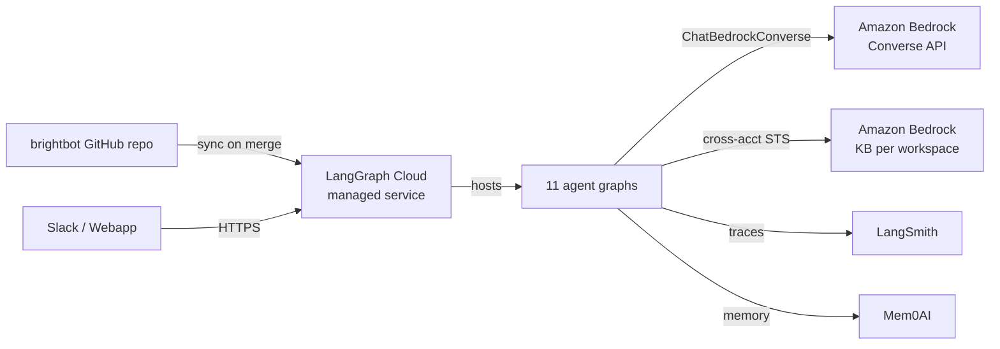
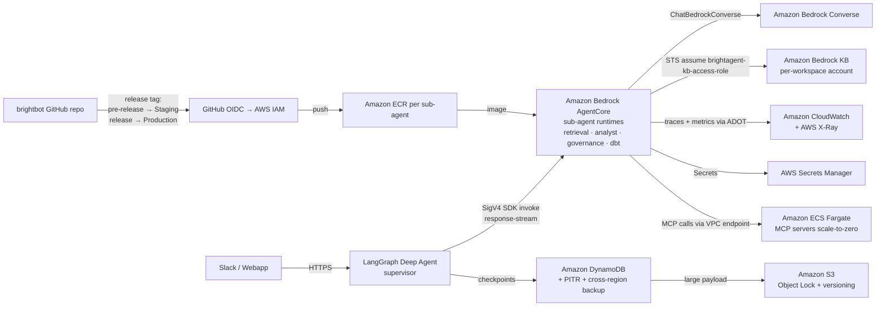

# Migrate BrightAgent Runtime to Amazon Bedrock AgentCore

> **v3 revision (2026-05-27)** — architecture model corrected from implementation learnings on the `agentcore-migration` branch (4 sub-agent runtimes live in Staging). **BrightAgent is NOT a monolith fronted by one API Gateway.** The **LangGraph Deep Agent (supervisor) remains the orchestration runtime**; **leaf sub-agents deploy as independent AgentCore Container runtimes**, invoked supervisor→sub-agent via the `bedrock-agentcore` **SDK (SigV4)** — not through API Gateway. This removes, as unnecessary, the inter-agent API Gateway HTTP API, the Lambda authorizer on the agent runtime, and the API-Gateway streaming-timeout workaround. Retained from v2: VPC networking + egress lockdown, durable DynamoDB state, MCP on ECS Fargate, platform-core CDK ownership, 2-env release flow, salted canary, statistical UAT gate.
>
> **What v3 deletes vs. v2** (the path we're taking makes these moot for the agent runtime): inter-agent API Gateway HTTP API ingress; Lambda authorizer in front of AgentCore; the "29s timeout / response-stream" ingress decision; reframing "all 11 graphs as AgentCore endpoints" (only leaf sub-agents become runtimes).
>
> **v2 revision (2026-05-08)** — incorporated Solutions Architect, DevOps, AWS best-practices, and BrightHive-AWS review: MCP on ECS Fargate (not Lambda); platform-core repo placement; 2-env flow; cross-account KB reuse; salted canary; statistical UAT gate.

## Problem

BrightAgent is deployed on **LangGraph Cloud** — a hosted managed service operated by LangChain, Inc. Our production runtime is synced from a GitHub repository into LangGraph Cloud's managed infrastructure, which hosts our agent graphs, exposes HTTP endpoints, and handles scaling. Every agent invocation in production depends on:

1. LangChain, Inc. as an external service provider (not AWS)
2. The LangSmith observability service (not AWS CloudWatch)
3. LangGraph Cloud's scaling, auth, persistence, and networking (not AWS-native)
4. Mem0AI's hosted memory service (not AWS) — currently called by the `search_memory_tool`/`add_memory_tool` at runtime

This is architecturally incompatible with our AWS Bedrock co-sell motion. AWS sellers cannot earn commission on BrightHive because our runtime is not deployed on AWS. We need "Deployed on AWS / Bedrock" status by **June 1, 2026** for the market announcement and AWS seller enablement.

As of Week 10 (May 1, 2026), canonical **AWS Bedrock Converse API** adoption completed (ChatBedrockConverse, brightbot PR #457). The agent-model contract is 100% on AWS Bedrock. This spec captures the next phase: **move the agent runtime itself onto AWS**, removing LangGraph Cloud, LangSmith, and Mem0AI as external services. LangChain remains an internal Python library — code dependency, not service dependency.

**Business deadline**: Bedrock-staged launch by June 1, 2026. AWS Bedrock team needs a test-and-approve target that is 100% AWS-hosted.

## Use Case / Goal

**Success**: BrightAgent's entire agent runtime is hosted on AWS, deployed to Amazon Bedrock AgentCore, observable through Amazon CloudWatch + AWS X-Ray, authenticated through Amazon Cognito, with zero runtime dependency on LangGraph Cloud, LangSmith, or Mem0AI's hosted services.

**End state**:
- **Leaf sub-agents** (retrieval, analyst, governance, dbt, …) each run as an independent Amazon Bedrock AgentCore Container runtime in the platform accounts
- The **LangGraph Deep Agent (supervisor)** orchestrates and invokes those runtimes **supervisor→sub-agent via the `bedrock-agentcore` SDK (SigV4)** — no API Gateway, no Lambda authorizer between agents; IAM is the trust boundary
- Observability emits OpenTelemetry via **AWS Distro for OpenTelemetry (ADOT)** Collector to Amazon CloudWatch Logs (Embedded Metric Format for metrics) + AWS X-Ray (traces)
- Secrets retrieval through AWS Secrets Manager (reuse existing per-env patterns)
- Agent-thread persistence on Amazon DynamoDB (checkpoints) + Amazon S3 (large-payload spillover) with **PITR**, **cross-region backup**, and **S3 Object Lock**
- **MCP servers on Amazon ECS Fargate (scale-to-zero)** — not Lambda (MCP is stdio-persistent, Lambda cannot hold stdio sessions; GraphQL Forge npm payload exceeds Lambda size comfortably)
- Long-term memory moved to an AWS-native store (Amazon OpenSearch vector + DynamoDB metadata) — Mem0AI self-hosted OR replaced
- LangChain remains a pip dependency; LangGraph remains a pip dependency — neither connects to hosted LangChain services at runtime
- `langsmith` Python package emits zero runtime network calls in production
- GitHub Actions CI/CD follows the **platform-core pattern**: release-tag-driven (`vX.Y.Z-pre-release` → Staging, `vX.Y.Z-release` → Production). `develop` environment is disabled.
- AWS sellers can sell BrightHive on Bedrock with commission attribution

**Who benefits**:
- **Sales / GTM (Suzanne's motion)**: Unlocks AWS seller co-sell commissions, unblocks June 1 market announcement
- **AWS Bedrock partnership**: Earns "Deployed on AWS" badge
- **Platform engineering**: One cloud (AWS) to operate, one IAM, one observability stack
- **Customers**: No cross-vendor data path

## Current Situation

### How It Works Today

**Production runtime stack** (as of 2026-05-08):
- **Compute**: LangGraph Cloud (LangChain, Inc. managed) — runs in one region, unknown account
- **Deploy**: GitHub → LangGraph Cloud sync on merge to `main`
- **Orchestration**: Deepagents 0.4.5 + LangGraph 0.4.x runtime (LangChain service)
- **Models**: Amazon Bedrock Converse API via `ChatBedrockConverse` ✅ AWS-native
- **KB**: Amazon Bedrock Knowledge Bases per workspace account; platform-side role STS-assumes `brightagent-kb-access-role-{workspace-acct-id}` for Retrieve/RetrieveAndGenerate ✅ cross-account AWS-native
- **Observability**: LangSmith (LangChain service) + partial OpenTelemetry via OTelToolMiddleware
- **Auth**: Amazon Cognito JWT for some endpoints. Platform User Pool (PROD: `us-east-1_uEuXw33N8`), Internal User Pool (PROD: `us-east-1_6bp03oRQ9`).
- **Secrets**: AWS Secrets Manager ✅ AWS-native
- **Agent state**: LangGraph Cloud's managed checkpointer (LangChain service) + `brighthive-agent-sessions` DynamoDB table (24h TTL) for session state
- **Memory**: Mem0AI (hosted)
- **HTTP**: FastAPI (`http/app.py`) served inside LangGraph Cloud's Starlette ingress
- **MCP servers**: GraphQL Forge, OpenMetadata MCP, dbt MCP — baked into the LangGraph Cloud Docker image

**11 deployed graphs** (`langgraph.json`): `deep_agent`, `project_agent`, `omni_agent`, `brightagent_studio`, `metadata_agent`, `simple_messaging_agent`, `slack_router_agent`, `description_generation_agent`, `schema_agent`, `quality_check_agent`, `quality_check_task`, `ingestion_agent`.

**BrightHive AWS account landscape** (from `AWS_ACCOUNTS.md` + `ENVIRONMENTS.md`):
- **Platform accounts** — shared infra hosts: Staging `873769991712`, Production `104403016368`
- **DEV account** `531731217746` — still exists, **not used for app deploys** (workflow_dispatch only). Available for spike/POC work.
- **Workspace accounts** — per-tenant BYOW. Hold the workspace Bedrock KBs, Redshift, etc.
- `develop` environment is **OFF**. Active environments: **Staging** + **Production** only.

**Deploy pattern reference — platform-core** (`brighthive-platform-core/.github/workflows/`):
- `release.yml` on `main` push → generates `vX.Y.Z.W-pre-release` and `vX.Y.Z.W-release` tags + GitHub Releases
- `deploy-staging.yml` triggers on `release: [prereleased]` → Staging account `873769991712`
- `deploy-production.yml` triggers on `release: [released]` → Production account `104403016368`
- `deploy-dev.yml` is `workflow_dispatch`-only (develop env disabled)
- CDK stack naming: `{Env}-BPC-{StackName}` (e.g. `Prod-BPC-CoreSubgraphApi`, `Staging-BPC-*`)
- Branch→env is **tag-driven**, not branch-push: `develop` → `staging` → `main` merges create tags; tags trigger deploys
- Env config: AWS Secrets Manager (NEO4J_SECRET_ARN, COGNITO_SECRET_ARN, PLATFORM_CORE_SECRET_ARN patterns `{env}/{env}-platform-*/credentials-*`). Lambda env vars set in CDK task definition.
- Intermediate merge PRs: "Develop => Staging (date)" then "Staging => Production (date)"

**Deploy pattern reference — webapp** (`brighthive-webapp/.github/workflows/deploy.yml`):
- Triggers on `release: [published]`; routes by `github.event.release.prerelease` boolean → Staging Amplify or Production Amplify
- Same 2-env tag pattern (pre-release vs release)

### Hard Limitations

1. **Not deployed on AWS**: Agent execution happens on LangChain, Inc. infrastructure. AWS cannot attribute billing, AWS sellers cannot earn commission.
2. **Four non-AWS service vendors**: LangChain runtime + LangSmith telemetry + Mem0AI memory + (possibly) LangGraph-api package surface. Customer data transits non-AWS vendors.
3. **LangSmith lock-in**: Traces live in LangSmith, not CloudWatch. We pay LangChain for observability on top of Bedrock inference.
4. **Deploy gated by LangGraph Cloud sync**: Our cadence is LangChain's sync cadence, not our CI/CD.
5. **HTTP stack is LangGraph Cloud's**: Our FastAPI endpoints share a Starlette app with LangGraph Cloud-specific endpoints.
6. **No AgentCore-native features**: Cannot use AgentCore's native memory, identity, gateway, runtime autoscaling.
7. **Agent state split across vendors**: Thread checkpoints in LangGraph Cloud; session state in our DynamoDB. Unifying requires an AWS-native checkpointer.
8. **`auth_handler.py:auth`** is consumed by LangGraph Cloud's auth middleware (declared in `langgraph.json`). AgentCore does not call it — we must rewire.

### Gaps

- No AgentCore-compatible entrypoint (AgentCore expects a Python `Runtime` callable; our graphs are `CompiledGraph` objects with LangGraph-specific serve semantics). *(Addressed on `agentcore-migration` branch: per-sub-agent `app/<agent>/main.py` entrypoints.)*
- ~~No AWS-native streaming ingress (REST API Gateway not viable — 29s timeout).~~ **Resolved by design in v3**: supervisor→sub-agent uses SDK invoke; no API Gateway ingress for the runtime.
- No AWS-native LangGraph checkpointer (LangGraph Cloud managed today). Need Amazon DynamoDB `BaseCheckpointSaver` with S3 spillover, PITR, cross-region backup.
- No checkpoint-migration shim for in-flight threads when traffic flips from LangGraph Cloud to AgentCore.
- No OpenTelemetry → CloudWatch export pipeline (LangSmith still emitting).
- `langgraph-api` imports have not been audited — if graph code imports from the LangGraph Cloud server package, we're re-exposing a LangChain runtime contract inside AgentCore.
- Mem0AI hosted-service egress has not been audited — swapping LangSmith for Mem0 as the off-AWS dependency is a hidden regression.
- No AgentCore IAM execution role / trust policy setup with `aws:PrincipalTag` session tags.
- No MCP-server deployment strategy outside the LangGraph Cloud container. MCP is **stdio-persistent transport**; Lambda cannot host it. Fargate scale-to-zero is the correct target (same pattern as `brightbot-slack-server`).
- No AgentCore-based CI/CD. Must match platform-core's release-tag pattern.
- No feature flag / canary routing. Must route traffic per-workspace via salted-hash stickiness.
- No `custom:workspace_id` claim on Cognito JWTs. Required for multi-tenant isolation at the authorizer.

## Proposals / Solutions

### Recommended Approach

**Target architecture**: The LangGraph **Deep Agent (supervisor)** orchestrates and invokes **leaf sub-agents**, each hosted as an independent Amazon Bedrock AgentCore Container runtime in the platform accounts. Supervisor→sub-agent calls use the `bedrock-agentcore` **SDK (SigV4)** — no API Gateway or Lambda authorizer between agents. Each runtime runs in **`networkMode: VPC`** with egress restricted to VPC endpoints. Amazon DynamoDB + Amazon S3 persist agent state. ADOT Collector exports OpenTelemetry to Amazon CloudWatch + AWS X-Ray. MCP servers deploy as Amazon ECS Fargate services with scale-to-zero. LangChain and LangGraph remain as Python library deps — no runtime call leaves to LangChain services.

> **Open question (resolve in BH-454):** where the **supervisor** itself runs once LangGraph Cloud is removed — its own AgentCore runtime, ECS Fargate, or co-located. v3 fixes the sub-agent topology; the supervisor's host is not yet decided and gates AC-3 (zero LangGraph-Cloud egress).

**Repo placement correction (v2)**:
- AgentCore runtime stack lives in **`brighthive-platform-core`** (NEW subfolder `infra/agentcore/`) alongside the existing `{Env}-BPC-*` CDK stacks. Same CDK app, same release workflow.
- MCP Fargate stack lives in **`brighthive-platform-core`** (NEW subfolder `infra/agentcore-mcp/`) in the same CDK app.
- Rationale: AgentCore is platform-shared (not per-workspace), so it must live with other platform infra. `brighthive-data-workspace-cdk` is for workspace-account resources only.

**Deploy pattern (mirror platform-core)**:
- New branches in brightbot: `staging`, `main` (keep `develop` as the working branch; not auto-deployed).
- Release flow: develop → staging (creates `vX.Y.Z.W-pre-release` tag) → main (creates `vX.Y.Z.W-release` tag).
- Workflows: `release.yml` (tag generation on main push), `deploy-staging.yml` (triggered by prerelease tag → push image to ECR, update AgentCore runtime version in account `873769991712`), `deploy-production.yml` (triggered by release tag → account `104403016368`). No `deploy-dev.yml`.
- CDK stack names: `Staging-BPC-AgentCore*`, `Prod-BPC-AgentCore*`.

**Streaming path (v3)**: supervisor→sub-agent uses the `bedrock-agentcore` SDK invoke response-stream directly — no API Gateway, so the 29s-timeout / response-buffering problem does not apply to the agent runtime. Client-edge streaming (Slack/webapp → supervisor) is unchanged from today's path and out of scope for the runtime migration.

**Migration strategy**: **Parallel run with salted-hash canary routing** at both Slack-server and webapp BFF. 1% → 10% → 50% → 100% over ~2 weeks. Stable routing via `sha256(workspace_id + canary_salt) % 100` — salt rotation enables re-bucketing if the 1% bucket is all low-volume tenants.

**Checkpoint-migration shim**: DynamoDB checkpointer with a LangGraph Cloud fallback layer. On `get_tuple` cache miss for `thread_id` created before cutover T0, attempt to fetch from LangGraph Cloud's checkpoint API, translate the payload, write into DynamoDB. Fallback removed in BH-466 final decommission.

**Tenant isolation (v3)**: the supervisor resolves `workspace_id` from the authenticated client session (existing path) and passes it into each sub-agent invocation payload. The sub-agent's AgentCore execution role applies `aws:PrincipalTag` session tags derived from `workspace_id` to scope `bedrock:Retrieve*` to the right KB per request. No API Gateway Lambda authorizer is introduced for the agent runtime; isolation is enforced at the supervisor boundary plus IAM session tags. (Cognito `custom:workspace_id` injection remains useful for the client edge but is no longer on the agent-runtime critical path — see BH-468 rescoped.)

### Alternatives Considered

| Approach | Pros | Cons | Why Not |
|----------|------|------|---------|
| Lift-and-shift to AWS ECS (self-hosted LangGraph) | Keeps existing LangGraph runtime; no code changes | Not AgentCore; misses co-sell badge; we still manage the runtime | Doesn't meet business goal |
| Move only models to Bedrock, keep LangGraph Cloud | Already done (Week 10) | Doesn't remove LangChain service dependency | Current state; insufficient |
| Rewrite graphs as native Bedrock Agents | Fully managed by AWS | Loses LangGraph control, middleware, 14-agent codebase | Too disruptive for June 1 |
| **Amazon Bedrock AgentCore with LangGraph-as-library** ✅ | Keeps our agent code; runtime on AWS; co-sell unlocked | Build AWS-native equivalents of LGC checkpointer, ingress, MCP hosting | Best trade-off for timeline and outcome |
| MCP on Lambda | Lower idle cost | **Does not work** — MCP is stdio-persistent; Lambda cannot hold sessions; GraphQL Forge npm install is ~500MB | Rejected post-review |
| MCP on ECS Fargate (scale-to-zero) ✅ | Persistent stdio sessions; existing BrightHive pattern (`brightbot-slack-server`); container image sizing works | Higher idle cost than Lambda (minimal with scale-to-zero) | Chosen |

## Areas Involved

| Area | Repo | Impact |
|------|------|--------|
| BrightBot | `brightbot` | AgentCore entrypoints module, DynamoDB checkpointer + migration shim, ADOT exporter, remove `langsmith` runtime calls, remove/replace Mem0AI, rewire `auth_handler.py`, release-tag deploy workflows matching platform-core |
| **Platform Core (infra)** | `brighthive-platform-core` | **AgentCore CDK owned here** (mechanism may be the AgentCore CLI / `@aws/agentcore-cdk` L3 constructs): per-sub-agent IAM execution role, per-sub-agent ECR repo, AgentCore Container runtimes in **`networkMode: VPC`**, DynamoDB + S3 state, ECS Fargate MCP cluster. **No API Gateway / Lambda authorizer for the agent runtime.** Stacks owned + release-deployed by the platform team (target naming `{Env}-BPC-AgentCore*`). Reuses existing release/deploy-staging/deploy-production workflows. |
| Slack Server | `brightbot-slack-server` | Edge canary routing via salted-hash workspace_id; reuse existing `PlatformAccountsTable.ApiUrls` pattern to resolve agent URL per workspace; per-backend metric emission |
| Webapp | `brighthive-webapp` | BFF endpoint URL resolution via same canary flag |
| Platform Core (app) | `brighthive-platform-core` | (Rescoped) Cognito pre-token `custom:workspace_id` injection is client-edge only — no longer required on the agent-runtime critical path |
| Data Organization CDK | `brighthive-data-organization-cdk` | No change — existing workspace-account ingestion stays |
| Data Workspace CDK | `brighthive-data-workspace-cdk` | No change — existing per-workspace Bedrock KB + unstructured data stays |

## Acceptance Criteria

- [ ] **AC-1** Each leaf sub-agent (retrieval, analyst, governance, dbt, …) executes as its own AgentCore runtime, invoked by the supervisor via SDK; integration test per sub-agent. The spec lists which `langgraph.json` graphs are sub-agent runtimes vs. supervisor-internal nodes.
- [ ] **AC-2** UAT parity run passes: **per-graph** pass rate (N≥200 eval runs per graph), bootstrap 95% CI on delta from LangGraph Cloud baseline, fail if CI upper bound < baseline − 2% on any graph; p95 latency budget met.
- [ ] **AC-3** Egress audit: zero runtime network calls from production AgentCore reach `api.smith.langchain.com`, `eu.smith.langchain.com`, `api.mem0.ai`, or any `*.langchain.com`/`*.mem0.ai` endpoint. `langsmith`, `langgraph-api` Python package audit shows zero runtime imports/calls.
- [ ] **AC-4** DynamoDB checkpointer stores and resumes agent state across AgentCore container restarts. **Migration shim** transparently fetches pre-T0 threads from LangGraph Cloud during canary.
- [ ] **AC-5** Supervisor→sub-agent invocation is **SigV4 (SDK)** with per-sub-agent IAM execution roles; no API Gateway or Lambda authorizer on the agent runtime. All sub-agent runtimes run `networkMode: VPC`. Streaming verified end-to-end via SDK response-stream (supervisor ← sub-agent).
- [ ] **AC-6** Canary routing at Slack-server and webapp BFF: 1%/10%/50%/100% with `sha256(workspace_id + salt) % 100` stable hashing; **kill-switch** (force-0%) tested; salt rotation supported.
- [ ] **AC-7** MCP servers (GraphQL Forge, OpenMetadata MCP, dbt MCP) run on Amazon ECS Fargate with scale-to-zero, invocable by AgentCore via VPC endpoint with **separate IAM roles per MCP** (no shared execution role). `aws:SourceVpce` condition on resource policies.
- [ ] **AC-8** GitHub Actions follows platform-core pattern: `release.yml` on main push generates `vX.Y.Z.W-pre-release` and `vX.Y.Z.W-release` tags; `deploy-staging.yml` on prerelease → account `873769991712`; `deploy-production.yml` on release → account `104403016368`. No develop-branch auto-deploy. **Pre-deploy eval gate** runs UAT scenario subset; deploy blocked on regression.
- [ ] **AC-9** End-to-end trace propagation verified: single trace ID spans Slack → slack-server → API Gateway → AgentCore → MCP Fargate → Bedrock. Integration test asserts trace linkage.
- [ ] **AC-10** Rollback tested: deliberately deploy a broken image to Staging AgentCore, measure time-to-recovery via force-0% canary + ECR tag revert. Documented in runbook.
- [ ] **AC-11** DR: DynamoDB PITR enabled, AWS Backup with cross-region copy configured, S3 Object Lock + versioning + SSE-KMS on spillover bucket. AgentCore regional failover path documented.
- [ ] **AC-12** AgentCore monthly cost ≤ LangGraph Cloud + LangSmith + Mem0AI combined monthly cost × 1.3 (30% budget buffer). **AWS Budgets** action wired to 80% threshold notification. Per-workspace cost attribution via CUR tags.
- [ ] **AC-13** AWS Bedrock team sign-off on "Deployed on AWS" badge / co-sell enablement.
- [ ] **AC-14** All LangChain-service and Mem0AI-service subscriptions cancelled within 14 days of 100% cutover (LangGraph Cloud, LangSmith, Mem0AI).

## Dependencies

| Dependency | Type | Status |
|------------|------|--------|
| Amazon Bedrock AgentCore GA/preview in `us-east-1` | Blocking | Confirm via BH-454 spike with AWS SA |
| ChatBedrockConverse migration (brightbot #457) | Blocking | Done (Week 10) |
| Bedrock KB multi-tenant file-id filtering (brightbot #428) | Non-blocking | Done (Week 6) |
| `brightagent-kb-access-role-{acct-id}` cross-account roles | Non-blocking | Live per workspace account |
| Cognito Platform + Internal User Pools | Non-blocking | Live |
| AWS Secrets Manager | Non-blocking | Live |
| BrightSignals AWS-native eventing (Week 9) | Non-blocking | Live — validates AWS-native pattern |
| Platform Core CDK app + release workflow pattern | Non-blocking | Live — reuse |
| Cognito pre-token-generation Lambda (NEW) | Blocking | Build in this spec |
| DynamoDB checkpointer + migration shim (NEW) | Blocking | Build in this spec |
| ADOT Collector exporter config (NEW) | Blocking | Build in this spec |
| AWS SA engagement on AgentCore ref architecture | Blocking | Request via Suzanne's AWS channel |
| Mem0AI replacement decision (self-host vs replace with OpenSearch + DDB) | Blocking | Decide in BH-454 spike |

## Ticket Breakdown

Parent epic: **BH-453**. Child tickets **BH-454 → BH-476** (23 total, v2).

### Core migration path (from v1, to be edited)

| Ticket | Summary | Points | Key changes in v2 |
|--------|---------|--------|-------------------|
| BH-454 | Spike: AgentCore region/availability + reference architecture walkthrough with AWS SA | **5** | Split from 2pts. Added: streaming path POC, MCP hosting decision confirmation, Mem0AI replacement path, checkpointer POC against LangGraph Cloud thread compatibility |
| BH-455 | brightbot: per-sub-agent AgentCore entrypoints + supervisor SDK-invoke client (`agentcore_client.py`, `agentcore_subagents.py`) | 3 | **v3**: not "wrap 11 graphs" — package leaf sub-agents as runtimes + supervisor SigV4 invoke. Base already on `agentcore-migration` branch. |
| BH-456 | brightbot: Amazon DynamoDB checkpointer | **8** | Was 5pts. Scope expanded to include serialization compatibility, hot-partition avoidance (composite PK `thread_id` + SK `checkpoint_ts`), PITR, and contract tests against LangGraph 1.0.x serialization |
| BH-457 | brightbot: Remove langsmith + Mem0AI + langgraph-api audit — OTel + ADOT → CloudWatch + X-Ray | **5** | Was langsmith-only. Now includes Mem0AI egress audit + `langgraph-api` import audit + `auth_handler.py` rewire |
| BH-458 | ~~Replace http/app.py LangGraph Cloud ingress with API Gateway streaming handler~~ | — | **v3: descoped for the agent runtime** (no API Gateway between agents). Reduces to the supervisor-hosting decision tracked in BH-454. |
| BH-459 | **platform-core:** AgentCore CDK ownership — per-sub-agent runtimes in `networkMode: VPC` | 5 | **v3**: was 8. CLI/`@aws/agentcore-cdk` allowed as mechanism; scope is platform-core ownership + VPC networking + cross-account STS for KB. No API Gateway/authorizer. Move CDK out of brightbot. |
| BH-460 | **platform-core:** MCP ECS Fargate stack — `{Env}-BPC-AgentCoreMCP` (NOT Lambda) | **8** | **Hosting decision corrected**. Scale-to-zero. Per-MCP IAM roles. VPC endpoints. Container images in ECR. |
| BH-461 | CI/CD: GitHub Actions matching platform-core pattern (release → pre-release → release tags) | **5** | Was 3. Adds pre-deploy eval gate, ECR image scanning + signing, no develop-branch auto-deploy |
| BH-462 | slack-server: canary routing with **salted-hash** workspace_id + **kill-switch** + metrics | 3 | Salt rotation, kill-switch, stable stickiness |
| BH-463 | webapp: BFF endpoint resolution via `PlatformAccountsTable.ApiUrls.agentRuntime` | 2 | Reuses existing ApiUrls mechanism — no new flag service |
| BH-464 | UAT parity — per-graph statistical gate + **continuous shadow eval** during canary | **5** | Was 3. Statistical rigor + shadow replay. |
| BH-465 | Cost observability — CloudWatch dashboard + AWS Budgets + Cost Anomaly Detection + CUR tags | 3 | Adds Budgets automation + CUR + anomaly detection |
| BH-466 | Decommission — LangGraph Cloud + LangSmith + Mem0AI; remove migration shim | 3 | Adds Mem0AI subscription cancellation |

### New tickets (v2 — from review)

| Ticket | Summary | Points |
|--------|---------|--------|
| BH-467 | **Checkpoint migration shim**: dual-read from LangGraph Cloud with translation layer into DynamoDB | 5 |
| BH-468 | **Cognito pre-token-generation Lambda** — inject `custom:workspace_id`. **v3: descoped off agent-runtime critical path** (client-edge only; isolation now via supervisor + IAM session tags) | 3 |
| BH-521 | **Thread-id propagation contract** — supervisor→sub-agent payload carries `thread_id`; sub-agent sets it on RunnableConfig so artifact S3 path is deterministic (fixes current fallback). Owner: Marwan | 2 |
| BH-469 | **KB-ID resolver service**: workspace → KB-ID lookup for AgentCore (reuse workspace_id resolver Lambda pattern from data-org-cdk #134) | 3 |
| BH-470 | **Trace-propagation contract + integration test** — Slack→APIGW→AgentCore→Fargate MCP→Bedrock | 5 |
| BH-471 | **Rollback gameday** — deliberately break staging AgentCore, measure recovery, document runbook | 3 |
| BH-472 | **Runbook + on-call handoff** — AgentCore pager flows, trace-reading guide | 3 |
| BH-473 | **DR plan** — DynamoDB PITR + AWS Backup cross-region + S3 Object Lock + regional failover runbook | 3 |
| BH-474 | **Load / soak test** — 2× peak for 4h against Staging AgentCore before 50% canary | 3 |
| BH-475 | **VPC endpoint + egress lockdown** — egress-deny AgentCore → public internet; only Bedrock/DDB/S3/Secrets/Fargate via VPC endpoints | 3 |
| BH-476 | **Drift detection** — `cdk diff` in CI weekly, CloudWatch alarm on drift | 2 |

**Total (v3)**: reduced from v2 — BH-458 descoped, BH-455/BH-459 points down, BH-468 off critical path, BH-477 added (+2). The API Gateway / Lambda-authorizer / streaming-ingress work is removed from the agent-runtime path.

## Decision Record

**DR-AC-1 (2026-05-27): Per-sub-agent runtime model adopted; monolithic API-Gateway ingress dropped.** The LangGraph Deep Agent (supervisor) stays as the orchestrator; leaf sub-agents become independent AgentCore runtimes invoked via SigV4 SDK. Rationale: independent scale/deploy per sub-agent; SDK invoke handles streaming natively, so the API Gateway 29s-timeout problem never arises on the high-frequency inter-agent path; auth simplifies to IAM. **Supersedes v2's monolithic-ingress assumption.** Consequences: API Gateway HTTP API + Lambda authorizer + streaming-ingress shim removed from the agent runtime (BH-458 descoped); Cognito `custom:workspace_id` injection no longer on the agent-runtime critical path (BH-468 client-edge only). **Open**: supervisor's own host post-LangGraph-Cloud (BH-454). **Retained as hard requirements**: VPC networking + egress lockdown (BH-475), durable DynamoDB state (AC-4), MCP on Fargate (AC-7), platform-core CDK ownership (BH-459).

## Related

- **Bedrock journal entries**: Weeks 6–11 (CoBuild AWS folder) — migration lead-up
- **Week 10 (May 1)**: Canonical Converse API adoption (brightbot #457) — prerequisite complete
- **Week 9 (Apr 24)**: BrightSignals AWS-native eventing — proves operational pattern
- **Reviews (2026-05-08)**: Solutions Architect, DevOps, AWS Best-Practices, BrightHive-AWS — incorporated in v2
- **Platform Core deploy pattern**: `brighthive-platform-core/.github/workflows/` (release.yml + deploy-staging.yml + deploy-production.yml) — source of truth for AgentCore CI/CD
- **Webapp deploy pattern**: `brighthive-webapp/.github/workflows/deploy.yml` — same 2-env tag flow
- **AWS accounts**: Staging `873769991712`, Production `104403016368`, DEV `531731217746` (not used for deploys)
- **Cognito pools**: Platform PROD `us-east-1_uEuXw33N8`, Internal PROD `us-east-1_6bp03oRQ9`
- **Existing cross-account KB pattern**: `brightagent-kb-access-role-{workspace-acct-id}` — reuse, do not rebuild
- **Strategic context**: June 1 Bedrock-staged launch; AWS seller co-sell commission enablement; Suzanne's AWS partnership motion
