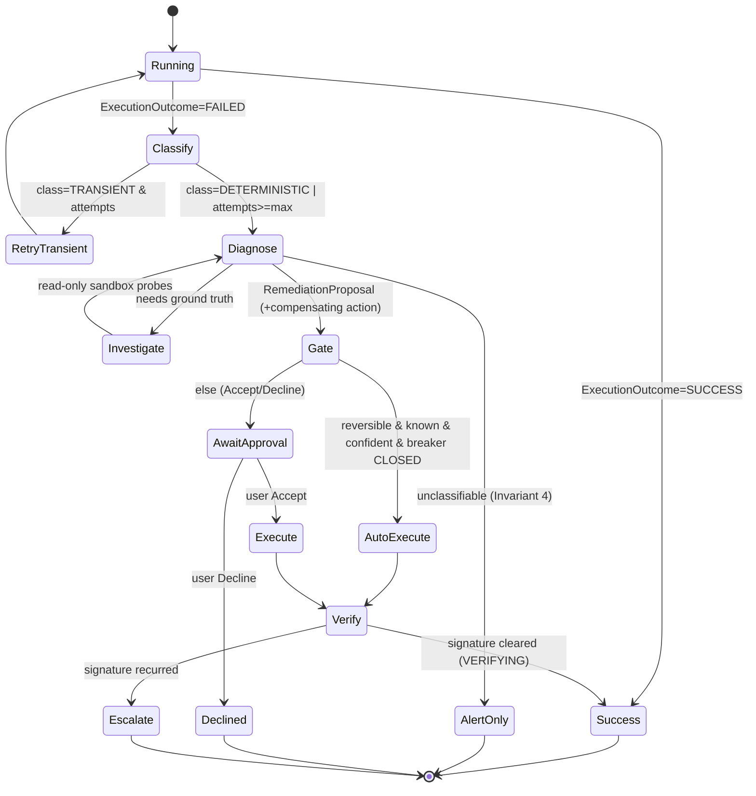

# Agentic Remediation Sandbox

> **Connective-tissue spec.** `self-healing-pipelines.md` (GC-11) defines the surgical-PR
> loop for 4 DATA_SHAPE modes; `proactive-pipeline-ingestion-monitoring.md` (BH-1036) defines
> the watchdog that detects failures and the cooldown/`VERIFYING` machinery. Neither defines
> (a) a **structured failure-outcome contract** the whole loop keys on, (b) a **computer** for
> the agent to *investigate* novel failures against ground truth, or (c) a **progressive-trust
> action gate** deciding Accept/Decline vs auto-execute+Undo. This spec adds exactly those
> three, reusing both siblings' mechanisms rather than replacing them.
>
> **Strategy + evidence:** `docs/AGENTIC_REMEDIATION_STRATEGY.md`.
> **Proof plan:** `docs/AGENTIC_REMEDIATION_TEST_PLAN.md` (Layer 0 already run — classifier
> precision 1.00, recall gaps found; see `clients/trials/loopcapital/sandbox/eval/LAYER0_RESULT.md`).
> Full authoring contract: `~/.claude/rules/spec-driven.md`.

## Contents
- [1. Context](#1-context)
- [2. Interface Contract](#2-interface-contract-mde)
- [3. Invariants](#3-invariants-dbc)
- [4. Acceptance Criteria](#4-acceptance-criteria-bdd--gherkin)
- [5. Out of Scope](#5-out-of-scope)
- [6. Dependencies](#6-dependencies)
- [7. Correctness Properties](#7-correctness-properties)
- [8. Eval Criteria](#8-eval-criteria)
- [9. Observability Contract](#9-observability-contract)
- [10. Test Coverage Update](#10-test-coverage-update)
- [Areas Involved](#areas-involved)
- [Ticket Breakdown](#ticket-breakdown)
- [Related](#related)

## 1. Context

Prospective customers (Loop Capital, Frank; 2026-07 demo gate) describe BrightAgent as a
proactive companion that, on a blocker it cannot solve on the optimal path, **drills down**
("why am I blocked? what's broken?"), tries a bounded number of times, then either fixes it
with approval or — for a fix it has safely done before — just does it and reports back with an
Undo. BrightAgent today cannot do this reliably: it is a LangGraph `deepagents` ReAct agent
whose failure handling is **prompt-driven** (on a tool error it feeds the error text back to
the model and hopes the model narrates the right next step). There is no structured failure
detection, no retry policy, no way to *investigate* a novel failure against the real system,
and no learned-trust gate. This spec defines the deterministic scaffolding that turns that
into a reliable operator loop — using the LLM only for diagnosis and fix-drafting, never as
the control loop itself.



### Use Case / Goal

Success = the three behaviors the customer named, each safe by construction:
1. **Optimal path:** job done → "complete." (verified, not assumed)
2. **First-time / complex / irreversible blocker:** *"I tried X three times, it failed
   because Y, here's my suggested fix — Accept / Decline?"* → on Accept, execute + verify +
   report.
3. **Seen-before, reversible, confident fix:** auto-execute, then *"I handled it"* with
   **Undo** — never a silent success, never for an irreversible action.

Who benefits: customers (less MTTR, no silent failures), and BrightHive's differentiation —
research (`AGENTIC_REMEDIATION_STRATEGY.md`) confirms the category leader refuses managed
remediation, the one vendor shipping it is single-engine, and **no vendor ships learned
trust**; only user-pinned allowlisting exists.

### How It Works Today

- **Agent loop:** `deepagents` supervisor + ReAct sub-agents (`brightbot/agents/super_agent/deep_agent.py`).
  Loop guards only — `ModelCallLimitMiddleware(run_limit=50, exit_behavior="end")` — which
  *stop* runaways, they do not re-attempt failed work.
- **Failure surfacing:** prompt-driven. dbt ReAct prompt says "when a tool returns an error,
  do not silently retry… report." No structured outcome object.
- **Remediation (partial, shipped):** `brightbot/agents/dbt_agent/remediation_agent.py` —
  `dbt_initialise → draft_or_alert → END`. Step 1 is deterministic
  `classify_data_shape_mode()` (`governance_agent/tools/root_cause_classifier.py`, pure regex,
  4 DATA_SHAPE modes, abstains otherwise — Invariant 4). If classified, a scoped ReAct agent
  bound to `REMEDIATION_TOOLS` (with `github_merge_pull_request` **excluded by construction**,
  GC-17) drafts a surgical fix + opens a PR. **Never merges, never guesses.**
- **Human gate:** `brightbot/utils/interrupt_utils.py` `interruptible()` (LangGraph
  `interrupt()`), already used for dbt-commit, quality-suites, ingestion confirm.
- **Alerts:** BrightSignals `publishNotification` + Slack Block Kit cards (Schedule/Dismiss
  precedent) + webapp inbox (dual-write per `proactive-pipeline-ingestion-monitoring.md`).
- **Fix-memory / trust:** none. BrightRoutines learns recurring *intents*, not *remediations*.
- **Sandbox / computer:** none. The agent has a fixed tool set; it cannot write and run an
  investigative script against the real system.

### Hard Limitations

- **No structured failure detection.** Success/failure is inferred from model prose, not a
  typed contract — so nothing downstream (retry, cooldown key, fix-memory) can key on it
  reliably.
- **No investigation surface.** For a failure outside the 4 known DATA_SHAPE modes, the agent
  cannot probe the real system to find the root cause; it can only abstain.
- **No retryable-vs-deterministic distinction.** `dbt_cloud_tools.py` has zero backoff
  (confirmed in `proactive-pipeline-ingestion-monitoring.md`); retrying a permission error 3×
  is theatre.
- **No reversibility model, no undo, no learned trust.** Auto-execution is impossible to offer
  safely today.
- **AgentCore has no native human-approval primitive** (confirmed: only OAuth-consent /
  Policy / Payments-auth). The gate must live in LangGraph `interrupt()`, not AgentCore.

### Gaps

1. No `ExecutionOutcome` DTO / outcome classifier (structured detection).
2. No failure-class taxonomy (TRANSIENT vs DETERMINISTIC) driving retry.
3. No investigation sandbox (read-only AgentCore Code Interpreter surface).
4. No `RemediationProposal` with a required compensating (Undo) action.
5. No progressive-trust action gate (reversibility × history × confidence).
6. No fix-memory store keyed on `(workspace_id, failure_signature)`.
7. No RemediationProposal notification card (Slack + webapp) with Accept/Decline/Undo.
8. No wiring of the `VERIFYING` post-fix loop (BH-1091) or a breaker over *auto-execution*.

## 2. Interface Contract (MDE)

> **Engine-agnostic (per `docs/CLAUDE.md`):** the sandbox is a PORT with AgentCore Code
> Interpreter as the first adapter behind a registry — never hardcoded. Mirrors the
> `PIPELINE_SOURCE_ADAPTERS` convention in `proactive-pipeline-ingestion-monitoring.md`.

```python
# --- Structured failure detection (Gap 1/2) -----------------------------------
class OutcomeStatus(str, Enum):
    SUCCESS = "success"
    FAILED = "failed"
    BLOCKED = "blocked"          # needs human/dependency before it can even run

class FailureClass(str, Enum):
    TRANSIENT = "transient"      # throttling/429, timeout, lock contention -> retry w/ backoff
    DETERMINISTIC = "deterministic"  # schema/permission/contract -> do NOT retry, diagnose
    UNKNOWN = "unknown"          # classify best-effort; treated as DETERMINISTIC for safety

@dataclass(frozen=True)
class ExecutionOutcome:
    status: OutcomeStatus
    failure_class: FailureClass | None          # None iff status==SUCCESS
    error_text: str | None                       # raw tool/driver error (redacted before persist)
    failure_signature: str                       # stable hash; SAME shape as AutomationSignature.fingerprint
    workspace_id: str
    source_type: str                             # dbt|databricks|etl|... (aligns w/ PipelineHealthSignal)
    job_id: str                                  # stable per-connection id (see BH-1045 job_id rule)
    detected_at: datetime

# classify_execution_outcome is deterministic wherever possible; it REUSES the shipped
# classify_data_shape_mode() for the DATA_SHAPE sub-classification. It NEVER calls an LLM to
# decide success vs failure.
def classify_execution_outcome(*, tool_result: Any, ctx: "RequestContext") -> ExecutionOutcome: ...

# --- Investigation sandbox (Gap 3) — PORT + first adapter ---------------------
class SandboxCapability(str, Enum):
    READ_ONLY = "read_only"      # investigation: query/inspect, ZERO mutation
    MUTATE = "mutate"            # execute an approved fix; ALWAYS gated (Invariant 5)

class DiagnosticSandbox(Protocol):
    """A computer the agent can run code in, against ground truth."""
    def capabilities(self) -> frozenset[SandboxCapability]: ...
    async def run(self, *, code: str, capability: SandboxCapability,
                  ctx: "RequestContext") -> "SandboxResult": ...

@dataclass(frozen=True)
class SandboxResult:
    stdout: str
    stderr: str
    exit_code: int
    files_written: list[str]                     # paths inside the ephemeral session only

# First adapter: AgentCore Code Interpreter. SANDBOX network mode for READ_ONLY (no public
# internet; warehouse reached via the scoped IAM execution role). Per-session microVM,
# memory sanitized on exit. NEVER the default system interpreter for MUTATE (no exec role).
SANDBOX_ADAPTERS: dict[str, type[DiagnosticSandbox]] = {
    "agentcore_code_interpreter": AgentCoreCodeInterpreterSandbox,
}
def build_sandbox(*, adapter: str, ctx: "RequestContext") -> DiagnosticSandbox: ...

# --- Remediation proposal + gate (Gaps 4/5) -----------------------------------
class Reversibility(str, Enum):
    REVERSIBLE = "reversible"        # a compensating action exists and is verified
    IRREVERSIBLE = "irreversible"    # merge, DROP, destructive DDL — NEVER auto-execute
    UNKNOWN = "unknown"              # conservative default == IRREVERSIBLE for gating

@dataclass(frozen=True)
class RemediationProposal:
    failure_signature: str
    diagnosis: str                               # plain-language: what broke, why, the fix
    fix_action: "RemediationAction"              # the surgical change to apply
    compensating_action: "RemediationAction | None"  # the Undo; None => cannot auto-execute
    reversibility: Reversibility
    confidence: float                            # 0..1 from the diagnosis/judge
    idempotency_key: str                         # dedupe re-runs (LangGraph re-runs nodes on resume)

class GateDecision(str, Enum):
    AUTO_EXECUTE = "auto_execute"    # reversible & known-approved & confident & breaker CLOSED
    AWAIT_APPROVAL = "await_approval"  # Accept/Decline via interrupt()
    ALERT_ONLY = "alert_only"        # unclassifiable / no fix drafted

def decide_gate(*, proposal: RemediationProposal, history: "FixMemoryRecord | None",
                breaker: "CircuitBreakerStatus", ctx: "RequestContext") -> GateDecision: ...

# --- Fix memory (Gap 6) — "I've done this before" -----------------------------
class FixMemoryStore(Protocol):
    async def lookup(self, *, workspace_id: str, failure_signature: str) -> "FixMemoryRecord | None": ...
    async def record(self, *, outcome: "RemediationOutcomeRecord") -> None: ...  # idempotent on idempotency_key

@dataclass(frozen=True)
class FixMemoryRecord:
    workspace_id: str
    failure_signature: str
    approved_count: int                          # times a human Accepted this fix shape
    auto_executed_count: int
    last_verified_ok: bool                       # did the last application actually clear the signature
    reversibility: Reversibility

# --- Notification card (Gap 7) — reuses BrightSignals dual-write --------------
# stage = "remediation_proposal"; renderer REQUIRED in BOTH brightbot-slack-server AND
# brighthive-webapp (mirrors the 5-missing-renderer lesson in
# proactive-pipeline-ingestion-monitoring.md Invariant 15). Buttons are a function of
# GateDecision: AWAIT_APPROVAL -> [Accept, Decline]; AUTO_EXECUTE (post-hoc) -> [Undo Fix].
```

## 3. Invariants (DbC)

1. `WHEN a task/step completes, THE System SHALL emit exactly one ExecutionOutcome; success vs
   failure SHALL be derived from the structured tool result, NEVER parsed from the model's
   natural-language narration.`
2. `WHEN failure_class is TRANSIENT, THE System SHALL retry with bounded backoff up to
   MAX_TRANSIENT_RETRIES (named constant, workspace-overridable); WHEN DETERMINISTIC or
   UNKNOWN, THE System SHALL NOT retry and SHALL proceed to diagnosis.`
3. `WHEN diagnosis runs, investigation code SHALL execute only in a DiagnosticSandbox with
   capability READ_ONLY, and the READ_ONLY adapter SHALL expose no MUTATE capability.`
   **REVISED 2026-07-23 after live reachability testing (see
   `clients/trials/loopcapital/sandbox/eval/SANDBOX_REACHABILITY.md`).** The original
   invariant required "no public-internet egress (AgentCore SANDBOX network mode)". That
   is EMPIRICALLY WRONG for this system: AgentCore SANDBOX mode CANNOT reach the warehouses
   (Snowflake, Redshift Serverless, dbt Cloud) — all three were confirmed reachable ONLY
   in `Security: Public` network mode, connecting directly over the internet with the real
   driver. Snowflake/dbt Cloud are SaaS (never inside a VPC); Redshift Serverless has a
   public endpoint by default. **Read-only safety therefore does NOT come from network
   isolation — it comes from three enforced layers, none of which is the network:**
   (a) the `AgentCoreCodeInterpreterSandbox` adapter's `capabilities()` returns
   `frozenset({READ_ONLY})` and its `run()` raises on any non-READ_ONLY capability
   (MUTATE can never execute through the investigation adapter — Invariant 5 by
   construction); (b) every investigation query passes `assert_read_only_sql`
   (the shipped guard, `brightbot/tools/warehouse_base.py`) which rejects multi-statement,
   non-SELECT-start, and any DML/DDL keyword even inside a CTE body; (c) the query runs
   under a scoped read-only DB credential. The ephemeral single-tenant microVM
   (sanitized on session exit) + the workspace-scoped credential (Invariant 11) remain
   the isolation guarantees. A future MUTATE path (fix execution) is a SEPARATE adapter/
   capability and is out of scope for this READ_ONLY investigation layer.`
4. `IF a failure is not classifiable into a known remediable mode, THEN THE System SHALL
   ALERT_ONLY — it SHALL NOT draft or execute a guessed fix (inherits self-healing Invariant 4;
   verified live — classifier precision 1.00 / abstention 1.00 at Layer 0).`
5. `WHEN reversibility is IRREVERSIBLE or UNKNOWN, THE System SHALL NOT auto-execute regardless
   of history or confidence — the ONLY path is AWAIT_APPROVAL. github_merge_pull_request SHALL
   remain excluded from every mutation tool surface at the code level (GC-17).`
6. `THE System SHALL offer AUTO_EXECUTE only WHEN all hold: reversibility==REVERSIBLE AND a
   non-null compensating_action exists AND history.approved_count >= AUTO_EXEC_MIN_APPROVALS
   AND confidence >= AUTO_EXEC_MIN_CONFIDENCE AND the circuit breaker is CLOSED.`
7. `WHEN a fix is auto-executed, THE System SHALL surface an "Undo Fix" affordance and SHALL
   NOT surface "Accept" (there is no pending decision); WHEN awaiting approval, THE System
   SHALL surface Accept/Decline and SHALL NOT execute until Accept.`
8. `WHEN any fix (auto or approved) is applied, THE System SHALL transition the failure
   signature to VERIFYING and re-check it (BH-1091): cleared -> positive confirmation on the
   same thread; recurred -> immediate escalation bypassing normal cooldown. THE System SHALL
   NEVER report "job done" without a positive verification.`
9. `Every RemediationAction SHALL carry an idempotency_key; re-applying the same key SHALL be a
   no-op (LangGraph re-runs the interrupted node from the start on resume — un-keyed actions
   double-apply).`
10. `THE System SHALL emit a RemediationProposal to BOTH live BrightSignals surfaces (Slack +
    webapp) with a registered renderer for the "remediation_proposal" stage on each; a proposal
    visible on only one surface (or present but blank) is an incomplete emission (inherits
    proactive-monitoring Invariant 1/15).`
11. `THE System SHALL scope every sandbox and every mutation to the workspace's own scoped
    credential (AgentCore Identity / IAM execution role), resolved from the validated principal
    — NEVER a caller-supplied workspace_id, NEVER a shared credential (OWASP LLM06 least
    privilege).`
12. `WHILE the auto-execution circuit breaker is OPEN for a workspace/tier, THE System SHALL
    force AWAIT_APPROVAL for all fixes (never AUTO_EXECUTE), and an admin SHALL be able to trip
    it fleet-wide (kill switch; NIST AI RMF MANAGE 2.4).`

## 4. Acceptance Criteria (BDD — Gherkin)

```gherkin
Feature: Agentic remediation sandbox

  Scenario: Transient failure is retried, not diagnosed
    Given a task fails with a 429 rate-limit error
    When the outcome is classified
    Then failure_class is TRANSIENT
    And the task is retried with backoff up to the max
    And no remediation proposal is drafted while retries remain

  Scenario: Deterministic failure skips retry and is diagnosed
    Given a task fails with "invalid identifier 'SETTLEMENT_CCY'"
    When the outcome is classified
    Then failure_class is DETERMINISTIC
    And it is classified as schema_drift and a proposal is drafted

  Scenario: Unclassifiable failure alerts only, never guesses
    Given a task fails with "Login failed for user (SQL error 18456)"
    When diagnosis runs
    Then the decision is ALERT_ONLY
    And no fix is drafted or executed

  Scenario: Read-only investigation of a novel failure
    Given a failure with no known mode
    When the agent investigates
    Then it runs code only in a READ_ONLY sandbox with no mutation capability
    And no write reaches the customer system during investigation

  Scenario: First-time reversible fix requires Accept
    Given a reversible fix with no prior approval history
    When the gate decides
    Then the decision is AWAIT_APPROVAL
    And the card shows Accept and Decline, not Undo
    And nothing executes until the user Accepts

  Scenario: Irreversible fix never auto-executes
    Given a fix whose reversibility is IRREVERSIBLE
    And it has been approved many times before
    When the gate decides
    Then the decision is AWAIT_APPROVAL, never AUTO_EXECUTE

  Scenario: Seen-before reversible fix auto-executes with Undo
    Given a reversible fix with approved_count >= the minimum and high confidence
    And the circuit breaker is CLOSED
    When the gate decides
    Then the decision is AUTO_EXECUTE
    And after execution the card shows "Undo Fix" and reports it handled the job

  Scenario: No compensating action blocks auto-execution
    Given an otherwise-eligible reversible fix whose compensating_action is null
    When the gate decides
    Then the decision is AWAIT_APPROVAL, not AUTO_EXECUTE

  Scenario: Applied fix is verified, not assumed
    Given a fix has been applied (auto or approved)
    When the VERIFYING re-check runs
    Then a positive confirmation is posted only if the signature cleared
    And if the signature recurred a higher-severity escalation fires immediately

  Scenario: Open breaker forces approval
    Given the auto-execution circuit breaker is OPEN
    When an otherwise-auto-eligible fix is evaluated
    Then the decision is AWAIT_APPROVAL

  Scenario: Retry-after-resume does not double-apply
    Given a fix action with an idempotency key was partially applied
    When the node re-runs on resume
    Then re-applying the same key is a no-op

  Scenario: Proposal reaches both surfaces or is incomplete
    Given a remediation proposal is emitted
    When delivery runs
    Then it is rendered with visible content in both Slack and the webapp inbox
```

## 5. Out of Scope

- **Sub-hourly detection cadence** — inherited from `proactive-pipeline-ingestion-monitoring.md`
  Out of Scope; this spec consumes its watchdog signals, it does not change scheduling.
- **New failure MODES** beyond self-healing's 4 DATA_SHAPE modes — a JOB_RUNTIME failure with
  no data-shape root cause is retry/escalate/alert-only, never a fabricated mode.
- **Auto-merge** of any PR — permanently out (GC-17); merge stays a human/GitHub gate.
- **Building AgentCore itself** — consumes the Code Interpreter primitive; the runtime
  migration is `agentcore-deployment-migration.md`'s scope.
- **The full BrightSignals unification** (BH-1053) — reuse the dual-write, don't wait on it.

## 6. Dependencies

| Dependency | Type | Status |
|---|---|---|
| `classify_data_shape_mode` (root_cause_classifier.py) | Non-blocking | Ready (shipped; Layer 0 recall gaps identified — one small PR) |
| `remediation_agent.py` (draft_or_alert loop) | Non-blocking | Ready (shipped) — generalize beyond dbt |
| `interruptible()` / LangGraph `interrupt()` | Non-blocking | Ready (shipped) |
| BrightSignals dual-write + Slack/webapp renderers | Blocking (Inv 10) | Partial — `remediation_proposal` stage renderer is NEW in both repos |
| AgentCore Code Interpreter | Blocking (Inv 3, sandbox) | GA 2025-10-13; **confirm VPC/customer-network reach** before Layer 3 |
| AgentCore Identity / IAM execution role | Blocking (Inv 11) | Available; per-workspace scoping to design |
| `VERIFYING` cooldown state (BH-1091) | Blocking (Inv 8) | Spec'd in self-healing-pipelines.md, unbuilt |
| Auto-execution circuit breaker | Blocking (Inv 12) | Pattern exists (`brightroutines-online-judge-eval-circuit-breaker.md`), extend to remediation |
| Bedrock model access (`dbt_react_model`) | Blocking for Layer 1 eval | Needs creds w/ `bedrock:InvokeModel` |

## 7. Correctness Properties

### Property 1: No mutation without a gate
*For any* RemediationAction with `capability=MUTATE`, execution occurs only after a
`GateDecision` of AUTO_EXECUTE or a human Accept — never during investigation, never on an
IRREVERSIBLE/UNKNOWN reversibility.
**Validates: §3 Invariant 3, 5; §4 Scenarios "Read-only investigation", "Irreversible fix never auto-executes"**

### Property 2: Auto-execution is fully gated
*For any* AUTO_EXECUTE decision, all of {reversible, compensating_action present, approved_count
≥ min, confidence ≥ min, breaker CLOSED} held at decision time.
**Validates: §3 Invariant 6, 12; §4 Scenarios "Seen-before…", "No compensating action…", "Open breaker…"**

### Property 3: No success claim without verification
*For any* applied fix, a "job done"/positive confirmation is emitted only after the VERIFYING
re-check observed the failure signature cleared.
**Validates: §3 Invariant 8; §4 Scenario "Applied fix is verified, not assumed"**

### Property 4: Idempotent remediation
*For any* RemediationAction replayed with the same idempotency_key, the effect equals applying
it once.
**Validates: §3 Invariant 9; §4 Scenario "Retry-after-resume does not double-apply"**

## 8. Eval Criteria

| Evaluator | Node | Mode | Threshold | Method |
|---|---|---|---|---|
| OutcomeClassifierEvaluator | `classify_execution_outcome` | GATE | abstention ≥ 0.95 (no false-confident class); known-class ≥ 0.90 | Deterministic, labeled corpus (Layer 0 harness — extend) |
| DiagnosisFixEvaluator | `draft_or_alert` | GATE | drafted fix correct-and-surgical ≥ 3/4 on the 4 modes, zero destructive-scope violations, N≥3 samples | LLM-judge + deterministic diff-scope check (Layer 1) |
| RemediationScopeEvaluator | mutation action | GATE | diff scoped to the failure; no unrelated files (reuse from proactive-monitoring §8) | Deterministic diff analysis |
| AutoExecSafetyEvaluator | `decide_gate` | GATE | zero AUTO_EXECUTE on IRREVERSIBLE/UNKNOWN or breaker-OPEN across the fixture suite | Deterministic |
| VerifyLoopEvaluator | VERIFYING re-check | GATE | positive confirmation iff signature cleared (real re-run, not mocked) | Real-behavior (Layer 2) |

## 9. Observability Contract

- **Span**: `gen_ai.tool.execute` with `gen_ai.tool.name=remediation.<node>` (OTel GenAI);
  a `remediation.gate.decision` span attribute = `auto_execute|await_approval|alert_only`.
- **Attributes**: `workspace.id`, `remediation.failure_signature`, `remediation.failure_class`,
  `remediation.reversibility`, `remediation.confidence`, `remediation.breaker_status`,
  `remediation.sandbox_capability`.
- **Log events**: `remediation.outcome_classified`, `remediation.investigated`,
  `remediation.proposed`, `remediation.gate_decided`, `remediation.executed`,
  `remediation.verified` (ok/recurred), `remediation.undone`, `remediation.breaker_opened` (WARN).
- **Metrics**: `remediation.auto_exec_rate`, `remediation.accept_rate`, `remediation.decline_rate`,
  `remediation.verify_recur_rate` (a leading trust-failure indicator), `remediation.undo_rate`.

## 10. Test Coverage Update

Mandatory. Extend the real suites before implementation.

| Repo | Suite | What to add |
|---|---|---|
| `brightbot` | `tests/unit/` + `brightbot/evals/` (L0/L1/L2 per `brightbot/CLAUDE.md`) | L0: `ExecutionOutcome`/`RemediationProposal`/enum shapes; **the Layer 0 classifier corpus already exists at `clients/trials/loopcapital/sandbox/eval/` — port it into the repo eval suite**. L1: `decide_gate` returns the right `GateDecision` per §4 gate scenarios against a fake `FixMemoryStore` + breaker. L2: real-behavior — a `DiagnosticSandbox` READ_ONLY probe round-trips against a real sandbox (or captured replay); the VERIFYING re-check observes a real cleared/recurred signature (not mocked). |
| `brighthive-webapp` | `tests/e2e` (Playwright) + `cypress/` | Playwright: the `remediation_proposal` card renders with Accept/Decline (first-time) and Undo (auto-executed) against the real UI; a proposal with a missing renderer must FAIL the test (guards Inv 10). |
| `brighthive-platform-core` | `tests/` | One test per new GraphQL/notification contract entry; the dual-write reaches both surfaces; workspace-scoping cannot be spoofed (Inv 11). |
| `brightbot-slack-server` | its test suite | The `remediation_proposal` Block Kit renderer produces non-empty content; Accept/Decline/Undo action-ids route to the right BrightBot call idempotently. |
| `brighthive-e2e` | `e2e/` (cross-repo) | One happy-path feature test: inject a known DATA_SHAPE failure in the Longaeva sandbox → proposal appears in UI+Slack → Accept → fix applied → VERIFYING confirms cleared. One error-path: unclassifiable failure → ALERT_ONLY, no fix. |

**Real-behavior requirement** (`~/.claude/rules/test-behavior-real.md`): the `brightbot` L2 row
and the `brighthive-e2e` happy path must hit a real sandbox/warehouse (or captured replay), not
mocks — this is the difference between "the demo works" and "the shapes typecheck."

Before opening the implementation PR: run every suite above, confirm each §2/§3/§4/§8 entry has
a new case, all green.

## Areas Involved

| Area | Repo | Impact |
|---|---|---|
| Outcome contract, retry policy, gate, fix-memory, sandbox port | `brightbot` | New `remediation/` module; generalize `remediation_agent.py`; extend classifier |
| AgentCore Code Interpreter adapter + IAM exec role | `brightbot` + `brighthive-platform-core` | First `DiagnosticSandbox` adapter; per-workspace scoped credential |
| RemediationProposal card | `brighthive-webapp` + `brightbot-slack-server` | New `remediation_proposal` renderer + Accept/Decline/Undo actions |
| Dual-write + VERIFYING + breaker | `brightbot` + `brighthive-platform-core` | Reuse proactive-monitoring dual-write; wire BH-1091; extend breaker to auto-exec |

## Ticket Breakdown

> Generated via `/create-jira-ticket` once the live epic is resolved
> (`mcp__jira__jira_get_epics(boardId=152, done=false)`). All `issueType: "Task"`.
> Sequenced per `AGENTIC_REMEDIATION_TEST_PLAN.md` layers so each ships behind a proven gate.

| Ticket | Summary | Points | Epic |
|---|---|---|---|
| — | Close the 4 classifier recall gaps + port the Layer 0 eval corpus into `brightbot/evals/` (Layer 0 → GO) | 2 | BH-XXX |
| — | `ExecutionOutcome` DTO + `classify_execution_outcome` (deterministic, reuses classifier) + TRANSIENT/DETERMINISTIC taxonomy | 5 | BH-XXX |
| — | Bounded retry policy (backoff on TRANSIENT; skip-and-diagnose on DETERMINISTIC) around workflow_agent + watchdog; closes dbt_cloud_tools backoff gap | 3 | BH-XXX |
| — | Generalize `remediation_agent` → `RemediationProposal` producer (diagnosis + fix + compensating action + reversibility + idempotency key) | 5 | BH-XXX |
| — | `RemediationProposal` card: dual-write + Slack + webapp renderers + Accept/Decline (Layer 1 experience) | 5 | BH-XXX |
| — | `DiagnosticSandbox` port + AgentCore Code Interpreter READ_ONLY adapter (investigation, no mutation) + scoped IAM role | 8 | BH-XXX |
| — | `FixMemoryStore` + `decide_gate` progressive-trust logic (reversibility × history × confidence) | 5 | BH-XXX |
| — | Auto-execute path + Undo affordance + `VERIFYING` post-fix loop (BH-1091) + auto-exec circuit breaker | 8 | BH-XXX |
| — | E2E: Longaeva sandbox happy-path + Loop Capital SQL Server disk/JOB_RUNTIME error-path | 3 | BH-XXX |

## Related

- **Strategy**: `docs/AGENTIC_REMEDIATION_STRATEGY.md`
- **Test plan**: `docs/AGENTIC_REMEDIATION_TEST_PLAN.md` (+ `clients/trials/loopcapital/sandbox/eval/LAYER0_RESULT.md`)
- **Sibling specs**: `self-healing-pipelines.md` (GC-11, surgical PR + BH-1091 VERIFYING),
  `proactive-pipeline-ingestion-monitoring.md` (BH-1036 watchdog + dual-write + cooldown),
  `brightroutines-online-judge-eval-circuit-breaker.md` (breaker pattern),
  `agentcore-deployment-migration.md` (the runtime this rides on)
- **Feature doc**: `docs/features/agentic-remediation.md` (create after shipping)
