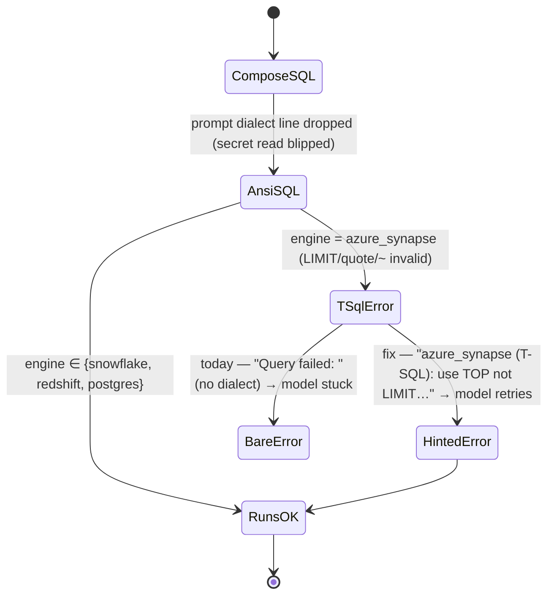

# Spec: Analyst run_warehouse_query must name the dialect on failure (Synapse silent-degrade fix)

**Ticket:** BH-1120 (BUGS-V3 epic) · **Status:** Draft · **Author:** Kuri · **Last-Reviewed:** 2026-07-31

## 1. Context

The analyst agent answers live-aggregate questions ("total rows", "min/max over a
column") by composing SQL and running it through `run_warehouse_query`
(`brightbot/agents/dbt_agent/tools/warehouse_query_tool.py`). The tool is
warehouse-agnostic: it resolves the workspace's real `warehouse_type` from the secret
at execution time and builds the right connection.

The **dialect the LLM writes in** is grounded by one prompt section
(`get_warehouse_context_section`, `analyst_system_prompt.py`) that names the engine:
"This workspace's data warehouse is **{warehouse_type}**". But that section is dropped
whenever `resolve_analyst_warehouse_type` returns `None` — which it does on *any*
transient secret-read failure (`analyst_agent_react.py:114-116`, non-fatal by design).
When the dialect line is absent, the model composes generic **ANSI** SQL: `LIMIT n`,
`"double"` quoting, POSIX `~` regex.

On Snowflake / Redshift / Postgres that ANSI shape executes. On **azure_synapse**
(SQL Server family — Loop Capital's live engine) every one is a T-SQL syntax error:
`LIMIT` must be `SELECT TOP n`, identifiers use `[brackets]`, and `~` has no T-SQL
equivalent. The tool then returns a bare `f"Query failed: {exc}"` — the raw TDS error,
with **no dialect context to self-correct from**. So azure_synapse silently
under-performs the other three engines exactly when the secret is momentarily
unreadable at prompt-build time: the model has no signal telling it to switch to T-SQL.

The tool is the one site that *always* knows the true engine at execution (it resolves
it to open the connection). The fix: when a query fails, name the dialect and hand back
a per-engine correction hint so the model fixes `LIMIT`→`TOP` on retry — independent of
whether the prompt carried the dialect line.



## 2. Interface Contract (MDE)

New dialect-hint helper + a typed error carrying the resolved engine, both in
`warehouse_query_tool.py`:

```python
class WarehouseQueryError(RuntimeError):
    """A warehouse query failed after the engine was resolved; carries warehouse_type."""
    def __init__(self, message: str, *, warehouse_type: str | None) -> None: ...

def dialect_correction_hint(warehouse_type: str | None) -> str:
    """One-line per-engine SQL correction guidance for a failed query, or '' if unknown."""
```

`run_warehouse_query_data` raises `WarehouseQueryError(str(exc), warehouse_type=...)`
when execution fails *after* the engine is resolved (connection resolution itself still
raises `ValueError` as before). The `@tool` wrapper appends
`dialect_correction_hint(warehouse_type)` to the failure `ToolMessage`.

No GraphQL / wire / DTO change. Return shape of a *successful* call is unchanged
(`{warehouse_type, row_count, truncated, rows}`).

## 3. Invariants (DbC)

- **I-1** WHEN a query fails on `azure_synapse`, THE failure message SHALL name the
  engine and state the T-SQL row-cap (`SELECT TOP n`, not `LIMIT n`).
- **I-2** WHEN a query fails on any engine whose type resolved, THE failure message
  SHALL name that engine — never a dialect-less "Query failed".
- **I-3** THE correction hint SHALL be engine-correct: azure_synapse → TOP/brackets/no
  `~`; snowflake → `LIMIT`/RLIKE; redshift/postgres → `LIMIT`/POSIX `~`.
- **I-4** A *successful* query's return payload SHALL be byte-for-byte unchanged (no
  regression for the happy path on any engine).

## 4. Acceptance Criteria (BDD)

```gherkin
Feature: run_warehouse_query names the dialect when a query fails

  Scenario: Synapse query error carries a T-SQL correction hint
    Given a workspace whose warehouse type is azure_synapse
    And an LLM-composed query using LIMIT
    When run_warehouse_query executes and the driver rejects LIMIT
    Then the failure message names azure_synapse
    And it instructs to use SELECT TOP n instead of LIMIT

  Scenario: Snowflake query error names snowflake, not a generic failure
    Given a workspace whose warehouse type is snowflake
    When a query fails
    Then the failure message names snowflake

  Scenario: Successful query is unchanged
    Given any workspace engine
    When a valid read-only query runs
    Then the payload is {warehouse_type, row_count, truncated, rows} exactly as before
```

## 5. Out of Scope

- **`resolve_analyst_warehouse_type` returning None** — leaving it non-fatal is correct
  (the analyst must still boot without a warehouse). This spec makes the *tool* robust
  to the dropped prompt line rather than forcing the prompt line to always be present.
- **`warehouse_type_from_secret` defaulting unknown `type` → redshift**
  (`warehouse.py:187`) — a separate engine-misroute slice; only fires on a
  non-canonical secret `type` string. Tracked separately, not fixed here.
- **Synapse MPP stat views** (`sys.dm_pdw_nodes_db_partition_stats` vs
  `sys.dm_db_partition_stats`) — a distinct under-coverage in `get_database_size`
  /`synapse_table_stats`, separate slice.
- Changing the prompt text or making the LLM compose better SQL up front.

## 6. Dependencies

- `warehouse_type_from_secret`, `AZURE_SYNAPSE`/`SNOWFLAKE`/`REDSHIFT`/`POSTGRES`
  literals (`warehouse_types.py`) — exist.
- No new external dependency.

## 7. Correctness Properties

### Property 1: A failed query always carries its engine

*For any* workspace whose engine resolved, a failed `run_warehouse_query` returns a
message naming that engine — the model is never left to guess the dialect after an error.

**Validates: §3 I-1, I-2, §4 Scenario "Synapse query error carries a T-SQL correction hint"**

### Property 2: The hint is engine-correct

*For any* of the four engines, `dialect_correction_hint` returns guidance valid for that
engine's dialect (Synapse never told to use `LIMIT`; Snowflake never told `TOP`).

**Validates: §3 I-3, §4 Scenario "Snowflake query error names snowflake"**

## 9. Observability Contract

- **Log events**: existing `[WAREHOUSE_QUERY] query failed: <exc>` retained; the
  returned `ToolMessage` gains the engine name + hint (no new span).

## 10. Test Coverage Update

- **L0/L2 unit** (`brightbot/tests/unit/agents/dbt_agent/` or the analyst tool test
  home): parametrize `dialect_correction_hint` over all 4 engines — assert Synapse hint
  says TOP/brackets and NOT `LIMIT`; snowflake/redshift/postgres say `LIMIT`. Assert
  `WarehouseQueryError` carries `warehouse_type`. Assert the `@tool` failure `ToolMessage`
  contains the engine name (real-behavior via a fake connection that raises on execute).
- **e2e (§10b):** deferred to a live Loop Capital (azure_synapse) analyst run asserting a
  `LIMIT`-using query recovers to `TOP` on retry — logged as follow-up, not silently skipped.
