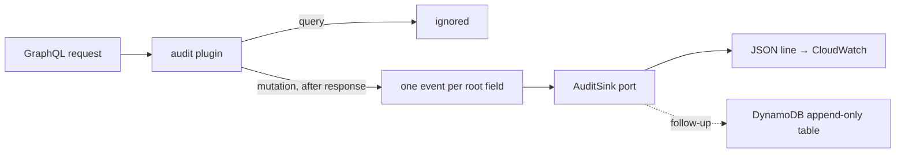

# Audit every mutation — one plugin, no per-endpoint logging

## 1. Context

Who changed what on a project is not recorded anywhere in platform-core. Creating, editing, activating, deleting a project, linking assets, running a pipeline and editing a workflow spec leave no trace (code audit, 2026-10-06). Adding a log line to each resolver doesn't scale: every new mutation would need someone to remember it.

So audit becomes a property of the server. One Apollo Server plugin sees every GraphQL operation; for each mutation it writes one audit event per root field, on all three servers (Lambda API, Express/ECS API, the OGM server). A mutation added tomorrow is audited without touching it.



## 2. Interface Contract (MDE)

```ts
interface AuditEvent {
  event: "platform.audit.action";
  timestampUtc: string;            // ISO 8601
  service: "platform-core";
  surface: "graphql" | "ogm";
  action: string;                  // mutation root field name, e.g. "updateProject"
  status: "success" | "error";
  errorCodes: string[];            // extensions.code of errors on this field
  userId: string;                  // JWT sub, or "" when unauthenticated
  authMethod: "jwt" | "service_key" | "anonymous";
  workspaceId: string;             // first workspaceId found in the arguments, else ""
  resourceIds: Record<string, string>; // allowlisted id-shaped arguments only (id, *Id), max 20
  argumentNames: string[];         // top-level argument names, never values
  durationMs: number;
  requestId: string;               // operation correlation id (trace id when present)
  deploymentEnv: string;
}

interface AuditSink {
  write(events: AuditEvent[]): Promise<void>;
}
```

The first adapter is a JSON-line sink on a dedicated logger (`platform.audit`), shipped to CloudWatch with the rest of the service logs. It's the same event family as brightbot's `brightbot.audit.action`, so one Logs Insights query covers both. A DynamoDB adapter is a follow-up behind the same port.

## 3. Invariants (DbC)

- **INV-1** WHEN a mutation request completes (success or error), THE System SHALL emit exactly one event per root field, with no code in the resolver.
- **INV-2** THE System SHALL NOT emit events for queries or subscriptions.
- **INV-3** THE System SHALL NOT record argument values, except allowlisted id-shaped fields (`id` or names ending in `Id`) whose values are strings; any key that looks like a secret (`token`, `password`, `secret`, `key`, `credential`) is dropped even if id-shaped.
- **INV-4** IF the sink fails or throws, THEN THE System SHALL log the failure and SHALL NOT change the GraphQL response or its HTTP status.
- **INV-5** The actor SHALL come from the verified request context (JWT `sub`), never from an argument.

## 4. Acceptance Criteria (BDD)

```gherkin
Feature: Every mutation is audited automatically

  Scenario: A mutation with no audit code is recorded
    Given a mutation whose resolver has no audit code
    When user A calls it in workspace W
    Then one audit event exists with action = the field name, userId = A, workspaceId = W, status = success

  Scenario: Failed mutation
    Given a mutation that throws a FORBIDDEN error
    When user A calls it
    Then the event has status = error and errorCodes contains FORBIDDEN

  Scenario: Values never leak
    Given a mutation called with a password argument and a projectId argument
    Then the event's resourceIds contains projectId
    And no password value or other argument value appears anywhere in the event

  Scenario: Two root fields in one request
    When one request runs two mutations
    Then two events are emitted

  Scenario: Queries are not audited
    When user A runs a query
    Then no audit event is emitted

  Scenario: Sink outage
    Given the audit sink throws
    When user A calls a mutation
    Then the mutation's response is unchanged
```

## 5. Out of Scope

- Durable store and retention (DynamoDB adapter, follow-up).
- Reading audit back in the webapp (needs the durable store).
- brightbot HTTP routes (follow-up: same shape as a FastAPI middleware).
- Auditing reads.

## 6. Dependencies

None. Wires into `src/server.ts`, `src/servers/apollo-server-options.ts`, `src/graphql/ogm/ogm-server.ts`.

## 7. Correctness Properties

### Property 1: Coverage by construction
*For any* mutation field in the schema, a completed request produces an event without per-field code.
**Validates: §3 INV-1, §4 "A mutation with no audit code is recorded"**

### Property 2: No values recorded
*For any* arguments, the event contains only argument names and allowlisted id strings.
**Validates: §3 INV-3, §4 "Values never leak"**

### Property 3: Audit never breaks a request
*For any* sink failure, the response is byte-identical to the one without audit.
**Validates: §3 INV-4, §4 "Sink outage"**

## 8. Eval Criteria

Omitted, because there is no LLM behavior.

## 9. Observability Contract

- **Log event:** `platform.audit.action` (one JSON line per event, logger `platform.audit`).
- **Failure log:** `[audit] sink write failed` with the error type only.
- **Metrics:** none new.

## 10. Test Coverage Update

| Layer | Where | Cases |
|---|---|---|
| L1/L2 behavior | platform-core `tests/unit/audit-plugin.test.ts` (added to the CI allowlist) | A real `ApolloServer` with the plugin and a small schema, driven by `executeOperation`: success, error codes, two root fields, query ignored, values never recorded, secret-looking id dropped, sink throwing leaves the response unchanged |
| Wiring | same file | The three server configs include the plugin |
