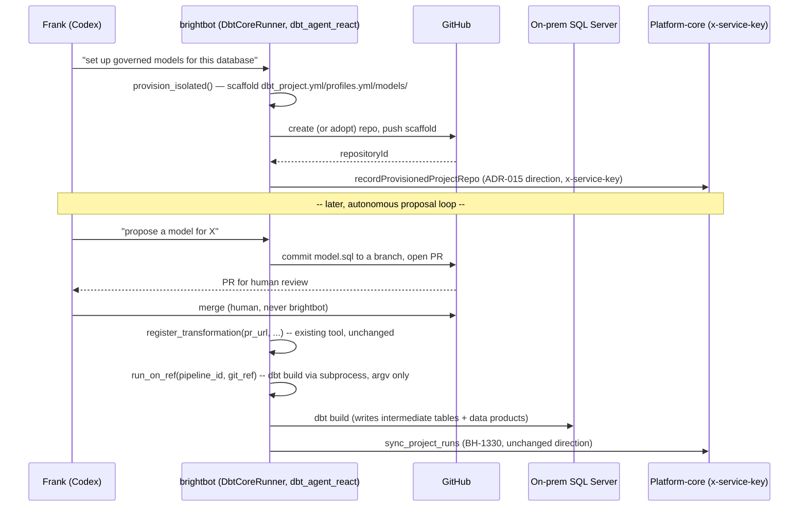

# Autonomous dbt Project Lifecycle Management (Local + On-Prem)

> Full contract: `~/.claude/rules/spec-driven.md`. Sections 7–9 are conditional — keep them only
> when they apply. §10 is mandatory. Engine-agnostic-by-default rule (`docs/CLAUDE.md`) applies:
> this spec adds an ADAPTER to the EXISTING `PipelineRunner` port — it does not invent a new port.

## 1. Context

`on-prem-sql-server-warehouse.md`'s draft `DbtCoreRunner` only sketches `run_on_ref()` against a
dbt project that's assumed to already exist. For Loop Capital (no cloud warehouse, no dbt Cloud, no
pre-existing dbt project targeting their on-prem SQL Server), nothing creates that project, nothing
proposes/manages the models inside it over time, and nothing decides when a build actually runs
given there's no dbt Cloud job scheduler on Frank's box. The good news, confirmed by reading the
real code: **the gap is an adapter, not a port.** `PipelineRunner`
(`brightbot/pipelines/core/port.py`) already models full project lifecycle —
`provision_isolated`/`teardown` (create/destroy, with `resource_refs` explicitly documented to
include dbt's `projectId/connectionId/environmentId/repositoryId/jobId`), `set_schedule` (cron),
`run_on_ref` (governed branch-pinned execution — built for "the remediation loop commits the fix to
a branch, then runs the pipeline on that ref to prove it builds green before a human merges"), plus
the full observe surface. dbt Cloud's adapter already implements all of it. The registry has
`DBT_CLOUD`, `SNOWFLAKE_NATIVE`, `DATABRICKS` — no `DBT_CORE`. This spec adds that fourth adapter,
implementing the SAME Protocol against local `dbt` Core + an on-prem SQL Server target, plus the
two pieces the cloud adapters never needed: which dbt-sqlserver connector to vendor, and what
triggers a run when there's no dbt Cloud host. It also builds the reproducible local sandbox that
makes the whole thing testable without ever touching Frank's real server.

### Use Case / Goal

Frank uses Codex, backed by BrightAgent's local plugin (`brightagent-local-plugin.md`). When no dbt
project targets his on-prem SQL Server yet, BrightAgent provisions one — a real
`dbt_project.yml`/`profiles.yml`/model folder in a real GitHub repo, wired to
`ProjectOutput.gitRepoUrl` the same way any BrightAgent-managed project is. BrightAgent then
proposes new/changed models over time — never writing directly, always PR-gated and human-merged,
exactly matching `register_transformation`'s existing "call this after the PR has been merged"
contract — executes builds locally via the new `DbtCoreRunner`, and reports run history back to
Platform Core through the SAME brightbot→platform-core direction (ADR-015) `project-engine-run-
sync.md` (BH-1330) already established. Success: a workspace whose only warehouse is on-prem SQL
Server gets the full governed-dbt experience — creation, proposal, execution, run history — with
zero manual dbt CLI usage by Frank and zero new architecture invented where an existing pattern
already fits.



### What Already Exists vs. Net-New (verified against code, 2026-08-12)

The reason this epic is an adapter-plus-sandbox, not a ground-up build: most of the lifecycle
machinery is already live. Compose it — don't rebuild it.

**Reuse (already built):**

| Capability | Where it lives | How this spec reuses it |
|---|---|---|
| Full lifecycle Protocol | `PipelineRunner` (`pipelines/core/port.py`) — `provision_isolated`/`teardown`/`set_schedule`/`run_on_ref` + observe verbs | `DbtCoreRunner` implements it; no port change |
| A working reference adapter | `DbtCloudRunner` (`pipelines/adapters/dbt_cloud/runner.py`) — `provision_isolated` creates project→connection→env→repo→job, atomic-or-compensating; `run_on_ref` branch-pinned; `set_schedule` read-modify-write | The shape `DbtCoreRunner` mirrors (minus dbt-Cloud-only refs) |
| dbt project scaffolding | `materialize_dbt_project` tool (`dbt_agent/tools/materialize_dbt_project/`) writes `dbt_project.yml`+`models/` to `~/.brighthive/dbt/<ws>/<run>/` | `provision_isolated` composes it (adds the missing `profiles.yml`) |
| Governed write | `register_transformation` (`dbt_agent/tools/registration_tools.py:34`, post-merge) + `github_create_pull_request` (`dbt_agent/tools/github_tools.py`) | `propose_dbt_model` composes PR-open; `register_transformation` stays unchanged |
| Engine-agnostic chat selection | `_runner_and_ctx` (`dbt_agent/tools/pipeline_lifecycle_tools.py:79`) reads `state["pipeline_engine"] or DBT_CLOUD` | Chat path picks `DBT_CORE` the moment it's registered — no call-site change |
| Real run-history sync | ADR-015 direction (`project-engine-run-sync.md`, BH-1330) | `recordProvisionedProjectRepo` reuses the exact `x-service-key` direction |

**Genuinely net-new (this epic's real weight):**

| Gap | Evidence it doesn't exist yet |
|---|---|
| `dbt-core` + `dbt-sqlserver` vendored | zero matches repo-wide for `dbt-sqlserver`/`dbt_sqlserver` |
| Local subprocess dbt execution | every adapter under `pipelines/adapters/` drives an HTTP API — no `dbt` CLI path anywhere |
| Warehouse-connected `profiles.yml` generation | `materialize_dbt_project` writes no `profiles.yml`; nothing points dbt at a warehouse |
| `DBT_CORE` registry slot | `PIPELINE_RUNNERS` has `DBT_CLOUD`/`SNOWFLAKE_NATIVE`/`DATABRICKS` only |
| `RunnerConfig` for local dbt | current shape is dbt-Cloud-only (`api_endpoint`/`api_token`/`account_id`/`project_id`) — no warehouse creds, project dir, or dbt target |
| MCP runner selection un-hardcode | `mcp/tools/pipeline_lifecycle.py:_resolve_runner` is hardcoded to `build_runner(kind=DBT_CLOUD)` — `DbtCoreRunner` is unreachable over MCP until this reads the workspace engine |
| Reproducible sandbox | no local Docker SQL Server flavor, no staging-capture tooling, no synthetic-data generator under `clients/trials/loopcapital/` |

### Reproducible Loop Capital Sandbox (the validation substrate)

`DbtCoreRunner` can only be built and tested against something that behaves like Frank's on-prem SQL
Server. We don't have — and won't touch — his real server. Instead we reproduce its SHAPE locally,
from what staging already knows about the Loop Capital workspace:

1. **SSO to staging** — Kuri authenticates (Cognito/Okta). The capture tool never persists the token.
2. **Fetch artifact STRUCTURE via the platform (read-only)** — platform-core GraphQL for the
   workspace catalog (table + column + type via DataAsset introspection), `ProjectOutput.gitRepoUrl`
   + `TransformationService.gitHubRepos` for linked repos, and the linked repos' SQL / dbt /
   `.dtsx` / `.rdl` file tree. Reuses the `BH_API_URL` / `run_local.sh` override seams the e2e suite
   already ships.
3. **Land the shape** in `clients/trials/loopcapital/sandbox/` — a committed, sanitized
   `schema_manifest.json` (names / types / topology; no rows, no secrets). Anything possibly
   sensitive (raw captures, real model bodies) lands in a **gitignored** `sandbox/_raw/`, used only
   on the capturing machine.
4. **Synthesize rows** — a deterministic, seeded generator builds shape-faithful synthetic data from
   the manifest (types, key relationships, rough cardinality). No real client row is ever committed
   or loaded.
5. **Nuke-and-recreate locally** — `make sandbox-nuke` + `make sandbox-recreate` tear down and
   rebuild a local Docker SQL Server (a Docker flavor beside the existing `loopcapital_sqlserver_ec2`
   stack) loaded with the manifest schema + synthetic rows. The result simulates Frank's setup
   faithfully enough to develop and test `DbtCoreRunner` end-to-end, and any teammate can recreate it
   from git alone — no client data required.

This is what makes the epic's §10 real-behavior tests runnable: `run_on_ref` executes a real
`dbt build` against this local SQL Server, not a mock.

### How It Works Today

- `PipelineRunner` Protocol (`brightbot/pipelines/core/port.py`) — full lifecycle already designed:
  `provision_isolated`/`teardown`, `set_schedule`, `run_on_ref`, plus
  `list_pipelines`/`get_run_detail`/`get_run_logs`/`list_runs`/`get_run_outputs`.
  `IsolatedPipelineSpec` takes `repo_template`; `ProvisionResult.resource_refs` is explicitly
  documented as dbt-shaped (`projectId/connectionId/environmentId/repositoryId/jobId`).
- Registry — `DBT_CLOUD`, `SNOWFLAKE_NATIVE`, `DATABRICKS` adapters; no `DBT_CORE` entry;
  `build_runner(kind=..., config=...)` is the only factory call site (PS-3).
- Governed-write precedent is real and live: `register_transformation`
  (`brightbot/agents/dbt_agent/tools/registration_tools.py:34`) docstring: *"Call this after the PR
  has been merged."* Calls Platform Core's `createTransformation` with `source_url=pr_url` — the
  agent never writes a model directly; it proposes via PR, a human merges, then this tool registers.
  The live dbt path is the ReAct **subagent** `dbt_agent_react_graph`
  (`brightbot/agents/dbt_agent/dbt_agent_react.py`), which the deepagents super-agent
  `super_agent/deep_agent.py:deep_agent_graph` spawns as `CompiledSubAgent(name="dbt")` —
  `dbt_workflow = wrap_subagent_runnable(inner=dbt_agent_react_graph, label="dbt")`
  (`deep_agent.py:178`). That super-agent is the deployed root graph (registered under the
  `deep_agent`/`project_agent`/`omni_agent`/`superduper_agent` aliases in `langgraph.json`), so
  `dbt_agent_react` is never a standalone deployment — it's the dbt tool-runner the super-agent
  delegates to via its `task` tool. The older `dbt_agent/dbt_agent.py` and
  `super_agent/nodes/agents/dbt.py` call sites are **deprecated** (`brightbot/CLAUDE.md`: *"New dbt
  features/fixes/streaming MUST land in dbt_agent_react"*) — `propose_dbt_model` joins the dbt
  subagent's toolset, never a deprecated graph. Verified against code and a live staging dbt run
  (LangSmith), 2026-08-12.
- Project↔engine↔repo linkage already exists in Platform Core:
  `ProjectOutput.gitRepoUrl: String` (`schema.graphql:2726`, one repo per project),
  `ProjectOutput.transformationServiceId: String` (link to a `TransformationService`), and a
  `TransformationService` can itself hold multiple `gitHubRepos: [GitHubRepoOutput!]`
  (`schema.graphql:2868`) via `addGitHubRepo`/`removeGitHubRepo`/`enableGitHubRepo`
  (`schema.graphql:4353-4355`).
- `project-engine-run-sync.md` (BH-1330, in progress) sets the direction (**ADR-015**): brightbot
  owns the `PipelineRunner` port and enumerates the engine, then POSTs the assembled result to
  Platform Core over the `x-service-key` seam; Platform Core never calls the port directly (would
  hardcode a vendor, violating INV-1 there). The browser-facing trigger goes through a separate
  `@authorized` forwarder mutation that hands off to a brightbot HTTP route (`X-Api-Key`), which runs
  the work async and reports back. This spec's writes reuse that exact direction.

### Hard Limitations

- No dbt-sqlserver adapter is vendored anywhere in brightbot (confirmed zero matches for
  `dbt-sqlserver`/`dbt_sqlserver`) — `DbtCoreRunner` has nothing to connect dbt to a SQL Server
  target until one is selected and pinned.
- No dbt Cloud-equivalent scheduler exists for a project running purely on Frank's local machine —
  `Schedule(cron=...)` has no long-lived host to enforce it when Frank's laptop isn't a server. What
  triggers a "scheduled" local run is unresolved by any existing spec.
- The only governed-write pattern that exists (`register_transformation`) assumes an always-on
  Platform Core connection at call time — fine for the one-shot "PR merged, now register" step, but
  `brightagent-local-plugin.md`'s own Hard Limitations already flag "no local governance degradation
  path exists" for a write attempted while genuinely offline.
- `provision_isolated`'s dbt `resource_refs` vocabulary was designed against dbt Cloud's object
  model — a local dbt Core project has no `connectionId`/`environmentId`/`jobId` equivalents;
  `DbtCoreRunner` must decide what it puts in those keys (or legitimately leaves absent) without
  inventing dbt-Cloud-shaped state that doesn't exist locally.
- We do not have Loop Capital's real server DNS/IP, a scoped login, or the in-scope DB list — all
  client-side blockers. This spec never requires them: the sandbox is fed artifact STRUCTURE from
  *staging*, and rows are synthesized.

### Gaps

- `DbtCoreRunner` adapter implementing the FULL `PipelineRunner` Protocol — `provision_isolated`
  (scaffold + create/adopt a GitHub repo), `teardown`, `set_schedule` (record intent honestly),
  `run_on_ref`, and the observe surface reading local dbt artifacts (`manifest.json`,
  `run_results.json`) instead of an API.
- dbt-sqlserver adapter/connector selection (vendor pick, pin, vet) + `profiles.yml` generation.
- `DBT_CORE` registry entry + `RunnerConfig` extension for local execution.
- MCP runner selection un-hardcode so `DbtCoreRunner` is reachable over MCP, not just chat.
- Local orchestration trigger design — candidates: on Codex session start, a local cron the plugin
  installs, or manual-only for v1. None designed today (v1 = manual + recorded intent, INV-6).
- Autonomous model-proposal skill wired to `dbt_agent_react`, reusing `register_transformation`'s
  PR-merged-then-register contract for the local/on-prem case.
- Project→repo write-back for a freshly-provisioned local project — a mutation on the SAME ADR-015
  direction BH-1330 uses, not a new one.
- Reproducible sandbox: staging-capture tooling, synthetic-data generator, and a local Docker SQL
  Server nuke/recreate flow under `clients/trials/loopcapital/`.

## 2. Interface Contract (MDE)

**Adapter first, port unchanged** — per `docs/CLAUDE.md`, the port already exists; this section
defines the fourth adapter, the write-back surface it needs, and the sandbox tooling that validates it.

```python
# brightbot/pipelines/core/port.py — registry addition only (no Protocol change)
DBT_CORE: Final[str] = "dbt_core"
PIPELINE_RUNNERS[DBT_CORE] = lambda config: _lazy_dbt_core_runner(config)

# brightbot/pipelines/adapters/dbt_core/runner.py (new)
class DbtCoreRunner:  # implements PipelineRunner in full — not a subset
    def capabilities(self) -> frozenset[RunnerCapability]:
        return frozenset({
            RunnerCapability.LIST_PIPELINES, RunnerCapability.RUN_ON_REF,
            RunnerCapability.PROVISION_ISOLATED, RunnerCapability.SCHEDULE_MUTATE,
            RunnerCapability.LIST_RUNS, RunnerCapability.RUN_OUTPUTS,
        })  # LIVE_LOGS, CANCEL_RUN absent: a local subprocess has no cancel-in-flight API

    async def provision_isolated(
        self, *, spec: IsolatedPipelineSpec, ctx: RequestContext
    ) -> ProvisionResult:
        """Scaffold dbt_project.yml/profiles.yml/models/ + create (or adopt) a GitHub repo.

        resource_refs for this adapter: repositoryId, profile_target (the dbt profile name
        pointed at SqlServerConnection's DSN). connectionId/environmentId/jobId are dbt-Cloud-
        shaped and stay ABSENT — never fabricated to fill the envelope.
        created_refs records creation order for teardown on partial failure (Property 1).
        """
        ...

    async def run_on_ref(
        self, *, pipeline_id: str, git_ref: str, ctx: RequestContext
    ) -> RunHandle:
        """Checkout git_ref, run `dbt build` via subprocess (argv list, never shell=True),
        against the on-prem target resolved from the scaffolded profile."""
        ...

    async def set_schedule(
        self, *, pipeline_id: str, schedule: Schedule, ctx: RequestContext
    ) -> Pipeline:
        """Record schedule intent on the Pipeline. NEVER claims a host enforces it — the
        returned Pipeline carries schedule_cron plus a typed 'no enforcing host in v1' note."""
        ...
    # list_pipelines / get_run_detail / get_run_logs / list_runs / get_run_outputs:
    # read local dbt artifacts (manifest.json, run_results.json) directly — never regex-parse
    # free-text logs (mirrors BH-1330's INV-1 rationale for get_run_outputs).

# brightbot/agents/dbt_agent/tools/propose_model.py (new tool file; added to the dbt subagent's
# toolset — dbt_agent_react_graph, which deep_agent.py:178 wraps as CompiledSubAgent(name="dbt")
# inside the deepagents super-agent — NOT the deprecated dbt_agent.py / super_agent/nodes/agents/dbt.py paths)
def propose_dbt_model(
    model_name: str, model_sql: str, description: str, project_repo_ref: str,
) -> Command:
    """Commit model_sql to a new branch, open a PR against project_repo_ref (composes the
    existing github_create_pull_request). Returns pr_url. NEVER writes directly to the target
    SQL Server and NEVER merges its own PR."""
    ...
# Existing tool, reused UNCHANGED after a human merges the PR:
# register_transformation(pr_url, transformation_service_id, model_name, ...)
#   — brightbot/agents/dbt_agent/tools/registration_tools.py:34
```

```graphql
# platform-core — extends project-run-sync-typedefs.ts's brightbot->platform-core direction
# (ADR-015). Own mutation, not a field on syncProjectRuns — a project is provisioned at most
# once per lifecycle, a run syncs repeatedly.
extend type Mutation {
  """brightbot -> platform-core, x-service-key. Records a freshly-provisioned local dbt
  project's repo on the Project. Idempotent: never overwrites an existing gitRepoUrl."""
  recordProvisionedProjectRepo(
    input: RecordProvisionedProjectRepoInput!
  ): RecordProvisionedProjectRepoResult!
}
input RecordProvisionedProjectRepoInput {
  workspaceId: ID!
  projectId: ID!
  repoUrl: String!
  transformationServiceId: String!
}
type RecordProvisionedProjectRepoResult {
  updated: Boolean!
  reasonIfSkipped: String   # e.g. "gitRepoUrl already set" — never silently no-op
}
```

```text
# agentic-project-mgmt — reproducible sandbox tooling (clients/trials/loopcapital/)
make capture-loopcapital    # SSO'd, READ-ONLY: platform-core GraphQL + linked GitHub
                            #   -> sandbox/schema_manifest.json (committed) + sandbox/_raw/ (gitignored)
make sandbox-synthesize     # schema_manifest.json -> deterministic seeded synthetic rows (no real client data)
make sandbox-nuke           # docker compose down -v: destroy the local SQL Server volume
make sandbox-recreate       # docker compose up + load manifest schema + synthetic rows (idempotent, git-only)
```

```json
// clients/trials/loopcapital/sandbox/schema_manifest.json — committed shape (no rows, no secrets)
{
  "captured_at": "2026-08-12T00:00:00Z",   // stamped by the caller, never a live secret
  "source": "staging",                       // never Frank's on-prem server
  "tables": [
    { "name": "dbo.Portfolio",
      "columns": [{ "name": "PortfolioId", "type": "INT", "nullable": false, "key": "pk" }],
      "row_estimate": 0 }
  ],
  "artifacts": { "dbt_models": ["models/staging/stg_portfolio.sql"], "ssis": [], "ssrs": [] }
}
```

## 3. Invariants (DbC)

- **INV-1** — `DbtCoreRunner` depends only on the `PipelineRunner` Protocol's own types
  (`RunHandle`, `ProvisionResult`, `Pipeline`, …) — no dbt-Cloud-shaped field is fabricated to fill
  an envelope it doesn't have (mirrors PS-4).
- **INV-2** — `provision_isolated` is atomic-or-compensating: on any step failure, `status` is
  `FAILED` and every resource created before the failure is recorded in `created_refs` for teardown
  — no orphaned repo or half-written project directory.
- **INV-3** — `DBT_CORE` is never selected by the engineering agent's runner-selection routing for a
  workspace whose warehouse already has a working `DBT_CLOUD`/other engine connection — it is a
  fallback, not a default (extends `on-prem-sql-server-warehouse.md`'s existing invariant to cover
  provisioning, not just execution).
- **INV-4** — No model text reaches the SQL Server without a merged, human-reviewed PR.
  `propose_dbt_model` SHALL NOT call `dbt build`/`run_on_ref` itself, and `run_on_ref` SHALL only
  execute against `git_ref`s that exist on the remote (i.e. already pushed/merged) — never a local
  uncommitted working tree.
- **INV-5** — `run_on_ref`'s subprocess invocation uses an argv list; no `shell=True`, no string
  interpolation of `pipeline_id`/`git_ref` into a shell command (carried over from
  `on-prem-sql-server-warehouse.md`, restated here since this spec is where it's implemented).
- **INV-6** — WHEN `set_schedule` is called against `DbtCoreRunner`, THE System SHALL return a typed
  "no enforcing host in v1" status alongside the recorded cron — it SHALL NOT report success as if a
  scheduler will fire it.
- **INV-7** — `recordProvisionedProjectRepo` is idempotent: WHEN `ProjectOutput.gitRepoUrl` is
  already set, THE System SHALL NOT overwrite it — it returns `updated: false` with `reasonIfSkipped`,
  matching BH-1330's INV-2 idempotence precedent.
- **INV-8** — The staging-capture tool is READ-ONLY: it SHALL NOT write or mutate any staging
  resource, and SHALL NOT persist the SSO token or any credential to any file under version control.
- **INV-9** — No real Loop Capital ROW data and no credential is ever committed. Committed artifacts
  are the schema manifest + synthetic data + tooling only; raw captures live under a gitignored
  `sandbox/_raw/`.
- **INV-10** — `make sandbox-recreate` is deterministic and idempotent: the same
  `schema_manifest.json` + seed produce the same local SQL Server every run, reproducible from git
  alone with no staging access.
- **INV-11** — The capture tool NEVER connects to Frank's real on-prem server; its only source is the
  staging platform (which already holds the Loop Capital workspace catalog + linked repos).
- **INV-12** — Synthetic rows conform to the captured DDL (types, nullability, key relationships) so
  `dbt build` exercises the same shapes Frank's models will hit.

## 4. Acceptance Criteria (BDD — Gherkin)

```gherkin
Feature: Autonomous dbt project lifecycle management (local + on-prem)

  Scenario: Provision a new local dbt project when none exists
    Given a workspace whose SQL Server warehouse has no dbt project registered
    When the engineering agent calls DbtCoreRunner.provision_isolated()
    Then a dbt_project.yml/profiles.yml/models/ scaffold is created
    And a GitHub repo is created (or an existing one adopted per repo_template)
    And ProjectOutput.gitRepoUrl is set via recordProvisionedProjectRepo

  Scenario: Provisioning fails partway and cleans up
    Given provision_isolated fails after creating the GitHub repo but before writing the scaffold
    When the failure is detected
    Then status is FAILED and created_refs lists the repo for teardown
    And no orphaned repo is left unaccounted for

  Scenario: Re-provisioning is a no-op when a project already exists
    Given a workspace whose Project already has gitRepoUrl set
    When provision_isolated is invoked again
    Then no second repo is created
    And recordProvisionedProjectRepo returns updated: false, reasonIfSkipped: "already set"

  Scenario: Model proposal never writes directly
    Given a proposed model change
    When propose_dbt_model runs
    Then a PR is opened against the project's repo
    And no dbt build or SQL Server write occurs until a human merges the PR

  Scenario: A merged model runs and writes real tables
    Given a PR has been merged by a human
    When run_on_ref executes against the merged ref
    Then dbt build completes against the on-prem SQL Server
    And intermediate tables/data products are materialized with real row/model counts
    And register_transformation registers the transformation with source_url=pr_url

  Scenario: No dbt-sqlserver adapter configured surfaces a typed error
    Given DbtCoreRunner has no dbt-sqlserver connector configured
    When run_on_ref or provision_isolated is attempted
    Then a typed capability-unavailable error is returned, never a crash or silent no-op

  Scenario: Schedule intent is recorded honestly
    Given a workspace on DbtCoreRunner with no local scheduler host running
    When set_schedule is called with a cron expression
    Then the Pipeline reflects the requested cron
    And the response states no host currently enforces it

  Scenario: DBT_CORE is never chosen over an existing working engine
    Given a workspace with a functioning DBT_CLOUD connection
    When the engineering agent needs to run or provision a dbt project
    Then DBT_CORE is never selected

  Scenario: DbtCoreRunner is reachable over MCP, not just chat
    Given a workspace whose pipeline_engine is dbt_core
    When a pipeline-lifecycle MCP tool resolves the runner
    Then DbtCoreRunner is selected (the runner is no longer hardcoded to dbt Cloud)

  Scenario: Capture Loop Capital artifact structure from staging, read-only
    Given a staging SSO session for the Loop Capital workspace
    When make capture-loopcapital runs
    Then schema_manifest.json is written with table/column/type + artifact topology
    And no staging resource is mutated
    And no credential or real row lands in a committed file

  Scenario: Recreate the sandbox from git alone
    Given schema_manifest.json is committed and no staging access is available
    When make sandbox-nuke && make sandbox-recreate runs
    Then a local Docker SQL Server is rebuilt with the manifest schema and seeded synthetic rows
    And the result is identical across repeated runs for the same seed

  Scenario: dbt build runs against the local sandbox
    Given the recreated local Docker SQL Server
    When DbtCoreRunner.run_on_ref executes a merged dbt project ref
    Then dbt build completes and materializes tables into the local SQL Server
```

## 5. Out of Scope

- **Real Loop Capital ROW data, credentials, or a live connection to Frank's on-prem server** —
  never. The sandbox is fed artifact STRUCTURE captured from *staging* (schema/DDL/topology), and
  rows are synthesized. `DbtCoreRunner` is validated only against the local Docker / EC2 SQL Server
  stand-in and a Brighthive-owned sandbox GitHub repo.
- **Committing real client model bodies** — raw captures (real SQL/dbt/`.dtsx`/`.rdl` contents) stay
  in the gitignored `sandbox/_raw/`; only sanitized shape + synthetic derivations are committed.
- **A persistent local scheduler daemon** — v1 ships manual-trigger (Codex-invoked) + recorded
  schedule intent only (INV-6). Actually enforcing cron on Frank's machine is a follow-on.
- **Frank's own SQL Database Project (`.sqlproj`)/.NET C# app workflow** — untouched. That's Frank's
  pre-existing development process; this spec's dbt project is a separate, BrightAgent-managed
  artifact in its own repo, targeting the same SQL Server.
- **New engine adapters beyond dbt Core** — Airflow stays roadmap; this spec only fills the
  `DBT_CORE` registry slot.
- **Write-gated governance UI in the webapp** — this spec is the brightbot + platform-core write-back
  plumbing; any webapp surfacing of provisioned projects is a follow-on ticket.

## 6. Dependencies

| Dependency | Type | Status |
|---|---|---|
| `on-prem-sql-server-warehouse.md` (`sql_server` WarehouseType, `SqlServerConnection`) | Blocking — the profile `DbtCoreRunner` scaffolds needs this connection class | Draft |
| dbt-sqlserver adapter selection (vendor pick, pin, vet) | Blocking — no adapter exists to select yet | Not started |
| `dbt_agent_react` dbt subagent (`dbt_agent/dbt_agent_react.py`, spawned by the deepagents super-agent `super_agent/deep_agent.py:deep_agent_graph`) | Blocking — `propose_dbt_model` joins this subagent's toolset, never a deprecated graph | Live, extend |
| Staging SSO + platform-core read access for the Loop Capital workspace | Blocking — the capture tool's only source of real artifact structure | Available (staging) |
| `project-engine-run-sync.md` / BH-1330 (ADR-015 direction, `x-service-key` seam) | Non-blocking — this spec reuses the pattern, doesn't wait on BH-1330 shipping | In progress |
| `brightagent-local-plugin.md` (`dbt-model-proposal` skill) | Non-blocking — this spec is what UNBLOCKS that skill | Draft |
| `register_transformation` (`registration_tools.py:34`) | Non-blocking — reused unchanged | Live |

## 7. Correctness Properties

### Property 1: Provisioning is atomic-or-compensating

*For any* `provision_isolated` call that fails partway, every resource created before the failure
point is present in `created_refs`, and none is left unrecorded for teardown.

**Validates: §3 INV-2, §4 Scenario "Provisioning fails partway and cleans up"**

### Property 2: No model write reaches the warehouse without a merged PR

*For any* model text that lands in the target SQL Server via `run_on_ref`, a corresponding PR on the
project's repo was merged before that execution — `run_on_ref` never executes an unmerged or
local-only ref.

**Validates: §3 INV-4, §4 Scenarios "Model proposal never writes directly", "A merged model runs and
writes real tables"**

### Property 3: Repo write-back is idempotent

*For any* project whose `gitRepoUrl` is already set, a second `recordProvisionedProjectRepo` call
never changes it.

**Validates: §3 INV-7, §4 Scenario "Re-provisioning is a no-op when a project already exists"**

### Property 4: Sandbox recreation is deterministic and git-only

*For any* committed `schema_manifest.json` + seed, `make sandbox-recreate` produces the same local
SQL Server, using no staging access.

**Validates: §3 INV-10/INV-12, §4 Scenario "Recreate the sandbox from git alone"**

### Property 5: No client secret or real row ever enters git

*For any* run of the capture tool, every committed file is free of credentials and real client rows;
sensitive captures remain under the gitignored `_raw/`.

**Validates: §3 INV-8/INV-9, §4 Scenario "Capture Loop Capital artifact structure from staging,
read-only"**

## 8. Eval Criteria

| Evaluator | Node | Mode | Threshold | Method |
|---|---|---|---|---|
| RunnerSelectionEvaluator | engineering-agent runner-selection routing | GATE | 100% — `DBT_CORE` never chosen when a working `DBT_CLOUD`/other engine exists | Deterministic |
| ProvisioningAtomicityEvaluator | `DbtCoreRunner.provision_isolated` | GATE | 100% of injected-failure cases leave `created_refs` complete, zero orphaned resources | Deterministic |
| GovernedWriteEvaluator | `propose_dbt_model` → `run_on_ref` path | GATE | 100% — no code path reaches `run_on_ref` with an unmerged ref | Deterministic |

## 9. Observability Contract

- **Span**: `gen_ai.tool.execute` with `gen_ai.tool.name=dbt_core_provision`
- **Span**: `gen_ai.tool.execute` with `gen_ai.tool.name=dbt_core_run` (`runner.kind=dbt_core`)
- **Span**: `gen_ai.tool.execute` with `gen_ai.tool.name=propose_dbt_model`
- **Attributes**: `workspace.id`, `project.id`, `runner.kind`, `provision.status`,
  `schedule.enforced` (bool, always `false` in v1), `pr.url`
- **Log events**: `dbt_core.provision_started`, `dbt_core.provision_failed_compensated`,
  `dbt_core.run_on_ref_started`, `dbt_core.run_on_ref_success`, `model_proposal.pr_opened`,
  `model_proposal.registered_post_merge`, `project_repo.recorded`, `project_repo.record_skipped`
- **Sandbox tooling (local operator scripts, not a served surface)**: log events
  `sandbox.capture_started`, `sandbox.capture_completed` (table/artifact counts, zero row counts),
  `sandbox.recreate_completed`
- **Metrics**: none

## 10. Test Coverage Update

| Repo | Suite | What to add |
|---|---|---|
| `brightbot` | `brightbot/tests/` + `brightbot/brightbot/evals/` | L0: `DBT_CORE` registry key + `DbtCoreRunner` implements every `PipelineRunner` method. L1: runner-selection never picks `DBT_CORE` when `DBT_CLOUD` is configured; `propose_dbt_model` never calls `run_on_ref`; MCP `_resolve_runner` picks `DbtCoreRunner` for a `dbt_core` workspace. L2 (real-behavior): `provision_isolated` against a real sandbox GitHub repo + real scaffold on disk, including an injected-failure case asserting `created_refs`/teardown (Property 1); `run_on_ref` executing a real `dbt build` against the local Docker SQL Server sandbox with real row/model counts; `register_transformation` called with a real merged PR's `source_url`. |
| `brighthive-platform-core` | `brighthive-platform-core/tests/` | L0: `recordProvisionedProjectRepo` mutation shape. L2: idempotence (INV-7) against a real Neo4j test instance — second call with `gitRepoUrl` already set returns `updated: false`. |
| `agentic-project-mgmt` | `clients/trials/loopcapital/sandbox/` | Recreate smoke test: `make sandbox-recreate` builds the local SQL Server from the committed manifest with zero staging access, then a connection lists the expected tables (Property 4). Guard test: no committed file under `sandbox/` contains a credential pattern or a non-synthetic row marker (Property 5). |
| `brighthive-e2e` | `brighthive-e2e/e2e/` | One feature test: provision a project → propose a model (PR opened) → merge (harness merges as "human") → `run_on_ref` executes → real tables appear in the sandbox SQL Server → `register_transformation` + `recordProvisionedProjectRepo` both land in platform-core. One error-path test: no dbt-sqlserver adapter configured → typed error, not a crash. |

**Real-behavior requirement**: the `brightbot` L2 cases must hit the real sandbox GitHub repo and the
real local Docker SQL Server sandbox — construct-only tests asserting `resource_refs` shape alone
don't satisfy this row.

Before opening the implementation PR: run `brightbot`'s full suite + evals,
`brighthive-platform-core`'s suite, the `agentic-project-mgmt` sandbox smoke/guard tests, and the new
`brighthive-e2e` feature test; confirm each new §2/§3/§4/§8 entry has a corresponding new test case;
confirm all suites are green.

## Areas Involved

| Area | Repo | Impact |
|---|---|---|
| `DbtCoreRunner` adapter + `DBT_CORE` registry entry + `RunnerConfig` extension | `brightbot` | New adapter implementing the existing `PipelineRunner` Protocol in full; no port change |
| MCP runner selection | `brightbot` | Un-hardcode `mcp/tools/pipeline_lifecycle.py:_resolve_runner` to read the workspace engine |
| Model-proposal tool | `brightbot` | New `propose_dbt_model` tool file under `dbt_agent/tools/`, added to the `dbt_agent_react` subagent's toolset (the dbt subagent the deepagents super-agent `deep_agent_graph` spawns) — never a deprecated graph |
| Project→repo write-back | `brighthive-platform-core` | New `recordProvisionedProjectRepo` mutation, `x-service-key` guarded, same direction as BH-1330's `syncProjectRuns` |
| Reproducible sandbox tooling | `agentic-project-mgmt` (`clients/trials/loopcapital/sandbox/`, `infra/loopcapital_sqlserver_ec2` + new Docker flavor) | Staging-capture (read-only) + synthetic-data generator + local Docker SQL Server nuke/recreate; feeds §10 real-behavior tests |

## Ticket Breakdown

Grouped into five tracks under **BH-1403**. Track A builds the substrate everything else is tested
against, so it lands first.

| Track | Ticket | Summary | Points |
|---|---|---|---|
| A · Sandbox | BH-1404 | Staging-capture tool (SSO'd, read-only): platform-core GraphQL + linked GitHub → `schema_manifest.json` + gitignored `_raw/` | 5 |
| A · Sandbox | BH-1405 | Local Docker SQL Server flavor + `sandbox-nuke`/`sandbox-recreate` make targets (beside `loopcapital_sqlserver_ec2`) | 3 |
| A · Sandbox | BH-1406 | Deterministic synthetic-data generator from `schema_manifest.json` + seeded load | 3 |
| B · Runner | BH-1407 | Vendor + pin `dbt-core` + `dbt-sqlserver`, generate `profiles.yml` into the scaffold | 3 |
| B · Runner | BH-1408 | `DBT_CORE` registry entry + `DbtCoreRunner` skeleton (`capabilities()`) + `RunnerConfig` extension (warehouse creds, project dir, dbt target) | 2 |
| B · Runner | BH-1409 | `provision_isolated`/`teardown` — scaffold (compose `materialize_dbt_project` + `profiles.yml`) + create/adopt GitHub repo, atomic-or-compensating | 5 |
| B · Runner | BH-1410 | `run_on_ref` — subprocess `dbt build`, argv-only, against `SqlServerConnection`-resolved target; parse `run_results.json` → `RunHandle`/`RunStatus`/`RunDetail` | 5 |
| B · Runner | BH-1411 | Observe verbs (`list_pipelines`/`get_run_detail`/`get_run_logs`/`list_runs`/`get_run_outputs`) reading local dbt artifacts | 3 |
| B · Runner | BH-1412 | `set_schedule` — record intent, typed no-enforcing-host status (INV-6) | 2 |
| B · Runner | BH-1413 | Un-hardcode MCP runner selection (`mcp/tools/pipeline_lifecycle.py:_resolve_runner`) to read the workspace `pipeline_engine` | 2 |
| C · Govern | BH-1414 | `propose_dbt_model` tool added to the `dbt_agent_react` subagent's toolset (spawned by the deepagents super-agent) — PR-gated, never self-merge, never a direct write | 3 |
| D · Sync | BH-1415 | `recordProvisionedProjectRepo` mutation (platform-core) + brightbot call site, ADR-015 direction | 3 |
| E · Tests | BH-1416 | Real-behavior L2: provisioning (incl. injected-failure/teardown) + `run_on_ref` real `dbt build` against the local Docker sandbox + `register_transformation` with a real merged PR | 5 |
| E · Tests | BH-1417 | `brighthive-e2e` feature test: provision → propose → PR → merge → register → run → history syncs; + error-path (no dbt-sqlserver → typed error) | 2 |

**Total: 46 points, 14 tickets.**

## Related

- **Depends on**: `docs/specs/on-prem-sql-server-warehouse.md` (`SqlServerConnection`, `sql_server` WarehouseType)
- **Unblocks**: `docs/specs/brightagent-local-plugin.md`'s `dbt-model-proposal` skill
- **Pattern reused (not duplicated)**: `docs/specs/project-engine-run-sync.md` (BH-1330, ADR-015 direction)
- **Existing code reused unchanged**: `brightbot/agents/dbt_agent/tools/registration_tools.py:34` (`register_transformation`), `materialize_dbt_project`, `github_create_pull_request`
- **Live integration point**: the `dbt_agent_react` subagent (`brightbot/agents/dbt_agent/dbt_agent_react.py`), which the deepagents super-agent `super_agent/deep_agent.py:deep_agent_graph` spawns as `CompiledSubAgent(name="dbt")` at `deep_agent.py:178` (deployed under the `deep_agent`/`project_agent`/`omni_agent`/`superduper_agent` aliases) — per `brightbot/CLAUDE.md`, never the deprecated `dbt_agent/dbt_agent.py` / `super_agent/nodes/agents/dbt.py`
- **Sandbox target**: `clients/trials/loopcapital/sandbox/` + `infra/loopcapital_sqlserver_ec2` (+ new local Docker flavor)
