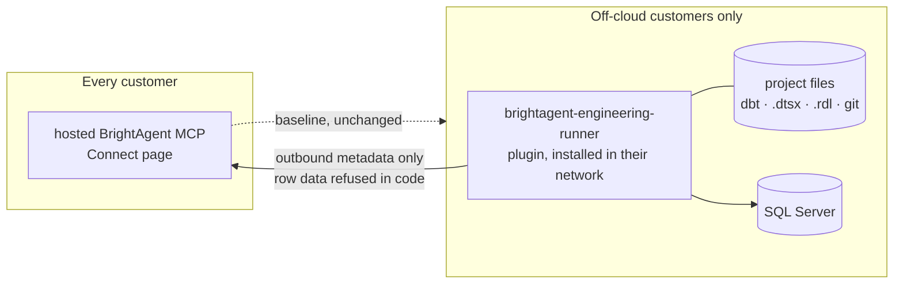

# BrightAgent off-cloud plugin

> Rewritten 2026-08-14 against what shipped. The 2026-08-12 draft speculated two servers
> (`brightagent-context`, `mssql-local`) before BH-1421 landed; the engineering half exists now
> and is called `brightagent-engineering-runner`. Dependencies #1, #3 and #9 are resolved below
> with fetched evidence, and §5's "sync is blocked" claim was simply wrong — outbound metadata
> delivery ships, with zero-copy enforced in code.

## 1. Context

**The plugin is the exception, not the path.** Every BrightAgent customer connects to the hosted
MCP surface at `brightagent-mcp.{env}.brighthive.net/mcp`, wired from the workspace Connect page.
That is the product and it does not change. A minority of customers — Loop Capital among them —
have no cloud warehouse at all: three SQL Servers on their own network, dbt Core that must run
where the project tree is, SSIS/SSRS sources on a filesystem our cloud cannot see. For them, and
only them, an extension gets installed inside their network.

What forced this spec's rewrite is a packaging problem, not an architecture one. The execution
split is settled and correct: a server in our cloud cannot reach a customer's disk
([ADR-0002](../adr/0002-engineering-runs-on-the-customers-filesystem.md)), and nothing dials in
([ADR-0004](../adr/0004-outbound-polling-queue-for-onprem-engineering-work.md)). But a customer
today wires **two unrelated MCP servers by hand** — the hosted surface copied from the Connect
page, and the runner copied from `mcp.example.json`. Two entries, two names, two things to keep in
sync. It reads as two products when it is one product plus an extension.



### What shipped since the first draft

| Capability | State | Where |
|---|---|---|
| Engineering runner, 10 MCP tools over stdio | **Ships** (BH-1421) | `brightagent-engineering-runner` |
| Linux-host packaging + installer | **Ships** (BH-1427) | `packaging/install.sh` |
| Outbound run-report delivery, zero-copy enforced | **Ships** (BH-1425) | `report_delivery.py`, `assert_carries_no_row_data` |
| Outbound polling worker (cloud reaches in without an inbound rule) | **Ships** (BH-1426) | `worker.py` |
| Agent Plugins package (`plugin.json` + `mcp.json`) | **Ships** (BH-1442) | runner repo root |
| Control-plane receiver for those reports | Spec'd, unbuilt (BH-1431) | `onprem-run-report-receiver.md` |
| Governed context served offline (context-down cache) | **Unbuilt** | — |

The first draft's `mssql-local` is superseded: the runner is that server, built on the
`WarehousePort`/`SqlServerConnection` adapter as intended. The first draft's `brightagent-context`
local-cache mode is **not** superseded — it remains the real unbuilt gap.

### Correcting two claims from the first draft

**"Zero-copy sync is blocked pending confirmation" — wrong.** Outbound metadata delivery ships.
`report_delivery.py` spools failed sends to a disk-capped queue, keys idempotency on dbt's own
`invocation_id`, and calls `assert_carries_no_row_data` before anything leaves the host. The
direction is outbound-only by construction: nothing in that module listens. What remains open is
the *other* direction — serving governed context to the runner when the cloud is unreachable.

**INV-3 is about duplication, not about sync.** `on-prem-engineering-runner.md` INV-3 says the
runner SHALL NOT expose monitoring tools, because disk/Agent-jobs/catalog/health already ship in
the hosted MCP over the warehouse connection, and a second local copy is a weaker door onto the
same data. It is a no-duplicate-tool-surface rule. It says nothing about whether on-prem metadata
may reach the cloud — it may, it should, and it already does. Off-cloud is a topology fact, not a
prohibition.

## 2. Interface Contract (MDE)

Both schemas were fetched verbatim on 2026-08-14, resolving Dependency #1.

```
# plugin.json — required: $schema, name. additionalProperties: false.
# name pattern: ^(?!.*(?:--|\.\.))[a-z0-9](?:[a-z0-9.-]*[a-z0-9])?$  (max 64)
# optional: version, description, author{name,email,url}, homepage, repository,
#           license, keywords[], extensions{<reverse-domain>: {}}
{
  "$schema": "https://agent-plugins.org/schemas/1.0.0/plugin.schema.json",
  "name": "brightagent-engineering-runner"
}

# mcp.json — required: $schema, mcpServers. No other top-level field permitted.
# server ∈ oneOf{stdio, streamable-http, sse}, each additionalProperties: false
#   stdio:           required type, command;  optional args[], env{}, cwd
#   streamable-http: required type, url;      optional headers{}
#   sse:             required type, url;      optional headers{}
{
  "$schema": "https://agent-plugins.org/schemas/1.0.0/mcp.schema.json",
  "mcpServers": {
    "brightagent-engineering": { "type": "stdio", "command": "./bin/brightagent-onprem" }
  }
}
```

Two constraints in the standard's prose, not its schema — both fail silently when broken, because
a non-conformant client simply accepts the config:

| Constraint | Verbatim | Consequence here |
|---|---|---|
| `command` shape | *"MUST be either a bare executable name or a plugin-relative path beginning with `./`"*; expansion *"does not apply to `env` keys, `command`, or fixed component locations"* | An absolute path — what every hand-written config in our docs uses — is non-conformant. `${PLUGIN_ROOT}` does not help. |
| No secrets in `env` | *"Configured `env` values are visible package data, not a portable secret mechanism. Plugins MUST NOT embed credentials or other secrets in `env`."* | The manifest carries no `env` at all. The installer's wrapper sources `/etc/brightagent-onprem/env` (mode `600`, service-user owned) before exec. |

A plugin-relative `command` only resolves against the plugin root, so the **install directory is
the plugin root**: `install.sh` writes `plugin.json`, `mcp.json` and `bin/brightagent-onprem`
together under `INSTALL_DIR`.

Runner tool surface (10 tools, unchanged by this spec — see `on-prem-engineering-runner.md` §2):
`list_project_files`, `read_project_file`, `write_project_file`, `list_models`, `run_models`,
`build_models`, `test_models`, `check_connection`, `run_report`, `send_run_report`.

## 3. Invariants (DbC)

| # | Invariant |
|---|---|
| INV-1 | `THE System SHALL declare exactly one MCP server in mcp.json` — the runner. The hosted surface is the customer's baseline; re-declaring it hands an off-cloud customer a duplicate of a connection they already have, with a bearer token the package cannot supply. |
| INV-2 | `THE System SHALL NOT write any credential into plugin.json or mcp.json.` Required by the standard, and correct regardless: a SQL password belongs in a mode-`600` file the installer wrote, not in visible package data. |
| INV-3 | `THE System SHALL declare command as a plugin-relative "./" path.` An absolute path is non-conformant and `${PLUGIN_ROOT}` does not expand there. |
| INV-4 | `WHERE the manifests and the bin/ wrapper are installed, THE System SHALL place them under a single root` — a plugin-relative command resolves against the plugin root and nothing else. |
| INV-5 | `THE System SHALL NOT transmit row-level data outbound` — enforced in code by `assert_carries_no_row_data` before delivery, not by convention. |
| INV-6 | `IF a capability requires cloud connectivity that is unavailable, THEN THE System SHALL return a typed unavailable response` — never a silent no-op or a fabricated success. |

## 4. Acceptance Criteria (BDD — Gherkin)

```gherkin
Feature: BrightAgent's off-cloud plugin

  Scenario: The package validates as an Agent Plugins 1.0.0 package
    Given plugin.json and mcp.json at the package root
    When they are validated against the published 1.0.0 schemas
    Then both pass with no additional properties

  Scenario: The command is plugin-relative
    Given mcp.json's stdio server entry
    When its command is inspected
    Then it begins with "./" and is not an absolute path

  Scenario: No credential is present in the package
    Given the installed plugin directory
    When every manifest in it is inspected
    Then no env block is present and no credential appears in any file

  Scenario: The relative command resolves to the installed wrapper
    Given a host where packaging/install.sh has run
    When a harness loads the plugin directory
    Then the stdio server starts from the wrapper and serves the runner's tools

  Scenario: The plugin does not duplicate the customer's hosted connection
    Given an off-cloud customer already connected to the hosted BrightAgent MCP
    When they install this plugin
    Then exactly one additional server appears, and the hosted connection is untouched

  Scenario: Metadata leaves the host, row data does not
    Given a completed dbt run on the customer's host
    When the run report is delivered outbound to the control plane
    Then it carries models, lineage and outcomes
    And a payload containing row values is refused before it is sent

  Scenario: A delivery failure does not lose the run
    Given the control plane is unreachable
    When a run report is delivered
    Then it spools to disk and is retried on the next delivery, keyed on dbt's invocation_id
```

## 5. Out of Scope

- **Context-down cache** — serving governed catalog/glossary/lineage to the runner with no cloud
  connectivity. The real remaining gap; needs its own spec.
- **Proxying engineering tools through the cloud** — the hosted MCP listing `run_models` and
  dispatching over the outbound queue. [ADR-0004](../adr/0004-outbound-polling-queue-for-onprem-engineering-work.md)
  rules this out for interactive turns: *"wrong for a human waiting on a chat turn."* The queue
  carries autonomous work only.
- **Re-declaring the hosted MCP inside the package** — INV-1. Deliberate, not an omission.
- **New skills** (`sqlserver-health`, `change-impact`, `nl-to-tsql-query`) — the existing
  `brightbot/brightbot/skills/system/*/SKILL.md` convention applies; separate tickets below.
- **Governance write-gating in local mode** (local dbt PR + queued cloud review).
- **Connect-page change** — offering the package to off-cloud workspaces instead of a raw JSON
  snippet. Follow-up ticket below.

## 6. Dependencies

| Dependency | Status |
|---|---|
| #1 `mcp.json` field-level schema | **Resolved 2026-08-14** — fetched verbatim; root is `$schema` + `mcpServers` only, three server variants, all `additionalProperties: false`. |
| #3 Claude Code's support for the standard | **Resolved 2026-08-14** — agent-plugins.org publishes conformance requirements for clients but **no support matrix at all**; it names no client application. The "Claude Code is excluded" claim was never grounded, and the dual-packaging requirement it justified is dropped. Separately: Claude Code loads stdio MCP servers via `.mcp.json` today, demonstrated against this runner. |
| #9 Physical home for the package | **Resolved** — the runner repo, which already ships the wheel, the installer and `mcp.example.json`. |
| BH-1427 packaging / install path | **Merged** — this builds on the wrapper it writes. |
| BH-1431 control-plane receiver | Spec'd, unbuilt — the receiving half of delivery that already ships. |
| T-SQL dialect coverage in the NL→query generator | Unverified — blocks `nl-to-tsql-query` only. |

## 7. Correctness Properties

### Property 1: No credential is ever visible package data

*For any* file in the installed plugin directory, the file SHALL NOT contain a warehouse
credential or control-plane API key. Configuration reaches the runner only through the
installer-written env file.

**Validates: §3 INV-2, §4 Scenario "No credential is present in the package"**

### Property 2: Zero-copy holds on every outbound delivery

*For any* payload delivered to the control plane, the content SHALL be metadata, lineage or run
outcomes — never a row value read from the customer's warehouse. Enforced before send, not
asserted after.

**Validates: §3 INV-5, §4 Scenario "Metadata leaves the host, row data does not"**

### Property 3: The declared command resolves to the installed wrapper

*For any* install produced by `packaging/install.sh`, the plugin-relative `command` in `mcp.json`
SHALL resolve to an executable wrapper under the same root as the manifests.

**Validates: §3 INV-3 and INV-4, §4 Scenario "The relative command resolves to the installed wrapper"**

## 8. Eval Criteria

Not applicable. This spec adds no LLM-powered behavior — it is packaging plus a conformance
contract. The runner deliberately ships no LLM client (`on-prem-engineering-runner.md` INV-7:
*"the agent reasons in our control plane; this executes"*).

## 9. Observability Contract

Unchanged from `on-prem-engineering-runner.md`. Packaging emits no telemetry of its own; it
changes how a process is launched, not what it reports.

## 10. Test Coverage Update

| Repo | Suite | What landed / what to add |
|---|---|---|
| `brightagent-engineering-runner` | `tests/test_plugin_manifests.py` | **Landed (BH-1442)** — 9 L0 cases: both manifests validate against the published schemas (vendored under `tests/schemas/`, plus a live check that the vendored copies still match); `command` is plugin-relative; no server carries `env`; the declared path matches the wrapper `install.sh` writes; `plugin.json` version tracks `pyproject.toml`. Guards were negative-checked — flipping `command` to absolute and adding a password to `env` fails three of them. |
| `brightagent-engineering-runner` | `tests/test_mcp_client_end_to_end.py` | **Already exists** — a real MCP session against the real server. The L2 real-behavior layer this spec's L0 pass sits on top of. |
| `brightagent-engineering-runner` | — | **To add**: an install-path case on a Linux host asserting that after `install.sh`, the plugin directory loads and the relative command resolves. Needs root + the ODBC driver, so it belongs with the container harness ADR-0004's prototype already uses, not the macOS unit run. |
| `brighthive-e2e` | `brighthive-e2e/e2e/` | **To add**: one feature test where a client loads the installed plugin directory and calls a runner tool end-to-end against the sandbox SQL Server. |

**Known gap, stated rather than hidden**: the runner repo has **no `.github/workflows/`** — PRs
#2–#6 merged with no automated test run, and #8's only check is a review bot that skips drafts.
The suites above are real and green locally; nothing enforces them on push. Its own ticket below.

## Areas Involved

| Area | Repo | Impact |
|---|---|---|
| Plugin package + installer | `brightagent-engineering-runner` | `plugin.json`, `mcp.json`, `install_plugin_manifests`, conformance suite |
| Connect page | `brighthive-webapp` | Offer the package to off-cloud workspaces instead of a raw snippet |
| Run-report receiver | `brighthive-platform-core` | BH-1431, tracked in its own spec |
| Skills | `brightbot` | New `SKILL.md` entries under the existing convention |

## Ticket Breakdown

| Ticket | Summary | Points | Epic |
|---|---|---|---|
| BH-1442 | Ship the runner as one Agent Plugins package — **done**, PR #8 | 2 | BH-1421 |
| — | CI for the runner repo: run pytest + ruff + shellcheck on every PR | 2 | BH-1421 |
| — | Connect page offers the off-cloud package for off-cloud workspaces | 3 | BH-1421 |
| — | Install-path test on a Linux host: plugin directory loads, relative command resolves | 2 | BH-1421 |
| — | `brighthive-e2e` feature test: load the plugin, call a runner tool against the sandbox | 3 | BH-1421 |
| — | Context-down cache — governed context with no cloud connectivity (needs its own spec first) | 8 | BH-1421 |
| — | `sqlserver-health` + `change-impact` skills under the existing convention | 3 | BH-1421 |
| — | `nl-to-tsql-query` skill — verify T-SQL dialect coverage first | 2 | BH-1421 |

## Related

- **The runner itself**: `on-prem-engineering-runner.md` (tool surface, INV-1..INV-7)
- **The connection layer**: `on-prem-sql-server-warehouse.md` (`WarehousePort`/`SqlServerConnection`)
- **The receiving half of sync**: `onprem-run-report-receiver.md` (BH-1431)
- **How the cloud reaches in**: `onprem-outbound-job-queue.md` + [ADR-0004](../adr/0004-outbound-polling-queue-for-onprem-engineering-work.md)
- **Standard**: `https://agent-plugins.org` — schemas and prose fetched 2026-08-14; both schemas
  vendored at `brightagent-engineering-runner/tests/schemas/` with a live drift check
