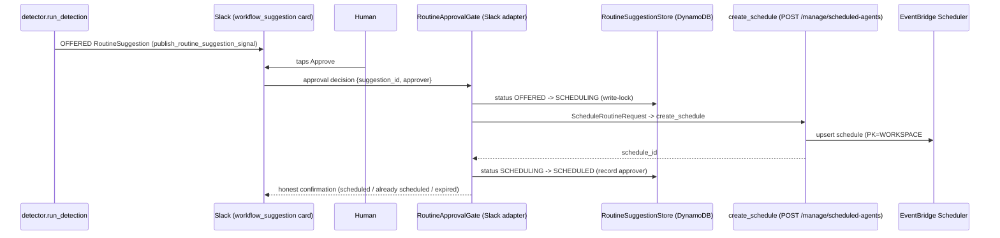
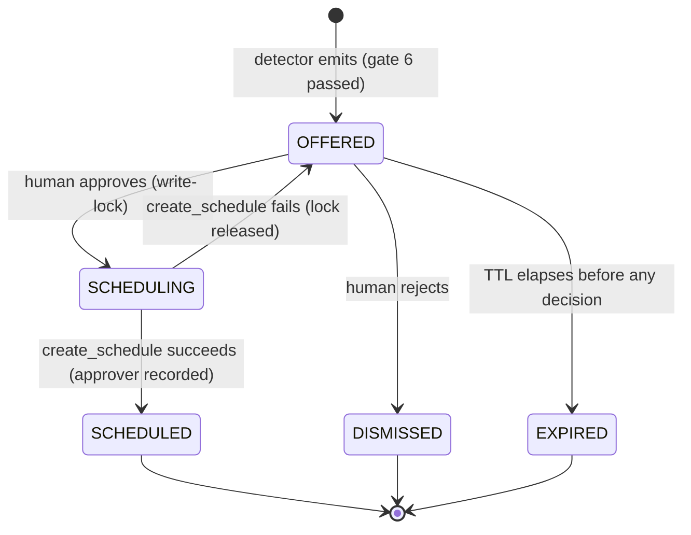

# BrightRoutine approve-and-schedule — the Slack-approval → schedule wire

> Loop Capital trial **success criterion 9**: a human approves a proposed recurring
> automation in Slack, and on approval it becomes a scheduled routine. Ties to
> **criterion 8** (every action under a BrightRoutine is governed and auditable).
>
> A **BrightRoutine** = trigger + watched target + action + governance gate, PROPOSED
> by the agent and APPROVED by a human. This spec defines **the one missing seam**: the
> wire from a Slack approval tap to `ScheduleRoutineRequest` to `create_schedule`. The
> propose path exists (detector → Slack card). The approve primitive exists
> (`interruptible`). The wire between them does not.

## Contents

- [1. Context](#1-context)
- [2. Interface Contract (MDE)](#2-interface-contract-mde)
- [3. Invariants (DbC)](#3-invariants-dbc)
- [4. Acceptance Criteria (BDD — Gherkin)](#4-acceptance-criteria-bdd--gherkin)
- [5. Out of Scope](#5-out-of-scope)
- [6. Dependencies](#6-dependencies)
- [7. Correctness Properties](#7-correctness-properties)
- [8. Eval Criteria](#8-eval-criteria)
- [9. Observability Contract](#9-observability-contract)
- [10. Test Coverage Update](#10-test-coverage-update)
- [Ticket Breakdown](#ticket-breakdown)
- [Related](#related)

## 1. Context

Three pieces already exist in `brightbot`; the seam that joins them does not.

1. **Propose** — the shadow-mode detector (`brightbot/routines/detector.py::run_detection`)
   groups `ProactiveSignal` rows, clears 8 trust gates (gate 6 = `LLMRoutineJudge`,
   confidence ≥ 0.85, `brightbot/routines/judge.py`), and emits an **OFFERED**
   `RoutineSuggestion` (`routines/dtos.py:197-231`). `publish_routine_suggestion_signal`
   (`routines/signal_publisher.py:49-104`) pushes it to Slack as a workflow-suggestion card
   (BrightSignals `publishNotification`, stage `STAGE_WORKFLOW_SUGGESTION`).
2. **Approve primitive** — `interruptible(payload)` (`utils/interrupt_utils.py:102-131`),
   payload shape `{"action":"<NODE>-<verb>","fields":{...}}`, resume value carries
   approve(filled fields) or a cancel signal. Real callers: `dbt_agent_react.py:435`,
   `quality_tools.py:655`, `ingestion_tools.py:820`. **None wired to routine suggestions.**
3. **Schedule** — `create_schedule` POST (`brightbot/routes/scheduled_agents_routes.py:661-773`)
   writes `PK=WORKSPACE#`, `SK=SCHEDULE#`, upserts an EventBridge Scheduler schedule.
   `SCHEDULABLE_ACTIONS` (:90-96) already includes `execute_workflow` and
   `detect_recurring_patterns`.

**The gap**: `langgraph.json:43` registers the `detect_recurring_patterns` graph but there is
**no routine-proposal-approval graph** — nothing consumes a Slack approval and converts an
OFFERED `RoutineSuggestion` into a `ScheduleRoutineRequest` and a `create_schedule` call. The
approval identity + service-key auth mechanics across slack-server → platform-core → brightbot
are specified in `slack-routine-suggestion-scheduling.md` (BH-876) and are **not re-specified
here**; this spec defines the *approval-gate seam* inside brightbot and the
`ScheduleRoutineRequest → create_schedule` conversion.

### Approval flow (proposed)



### RoutineSuggestion lifecycle (the states this seam drives)



## 2. Interface Contract (MDE)

Engine-agnostic first: the approval decision arrives from a surface (Slack today, webapp/Teams
plausibly next), so the seam is a **Port + Registry**, then the Slack adapter as the first
adapter. Domain types are the real DTOs already in `routines/dtos.py` — no new DTO is invented.

### 2.1 Port — `RoutineApprovalGate` (the seam)

```python
# brightbot/routines/approval_gate.py (NEW)
from typing import Protocol
from brightbot.routines.dtos import (
    RoutineSuggestion, RoutineSuggestionStatus, ScheduleRoutineRequest,
)

class RoutineApprovalDecision(BaseModel):        # NEW domain type (not a wire/vendor type)
    routine_suggestion_id: str
    workspace_id: str
    approver_user_id: str            # resolved BrightHive user (audit — criterion 8)
    approved: bool                   # True = approve, False = reject/dismiss
    idempotency_key: str             # e.g. f"approve:{routine_suggestion_id}"

class RoutineApprovalOutcome(BaseModel):         # NEW domain type
    routine_suggestion_id: str
    final_status: RoutineSuggestionStatus        # SCHEDULED | DISMISSED | EXPIRED
    schedule_id: str | None                      # set iff SCHEDULED
    already_scheduled: bool                       # True on idempotent replay

class RoutineApprovalGate(Protocol):
    async def resolve(self, decision: RoutineApprovalDecision) -> RoutineApprovalOutcome: ...
```

### 2.2 Registry — one switch site

```python
# brightbot/routines/approval_gate.py (NEW)
from typing import Callable, Final

ApprovalGateFactory = Callable[[ApprovalGateConfig], RoutineApprovalGate]

APPROVAL_SURFACE_SLACK: Final[str] = "slack"

APPROVAL_GATE_ADAPTERS: Final[dict[str, ApprovalGateFactory]] = {
    APPROVAL_SURFACE_SLACK: SlackRoutineApprovalGate,   # first adapter (see 2.3)
}

def build_approval_gate(*, surface: str, config: ApprovalGateConfig) -> RoutineApprovalGate:
    return APPROVAL_GATE_ADAPTERS[surface](config)
```

### 2.3 First adapter — `SlackRoutineApprovalGate` (the first adapter, not the design)

Reuses the existing HITL primitive `interruptible(payload)` (`utils/interrupt_utils.py:102-131`)
and the existing state store `RoutineSuggestionStore` (`routines/store.py:110-115`). The approval
node runs inside a NEW LangGraph graph (`routine_approval` — to register in `langgraph.json`
alongside the existing `detect_recurring_patterns` at :43).

```python
# interruptible payload emitted by the approval node
{
  "action": "ROUTINE-approve_schedule",
  "fields": {
    "routine_suggestion_id": "rsug_01JZ...",
    "title": "Weekly earnings report",        # redaction-safe title only (never raw signal text)
    "proposed_cadence": "WEEKLY",
    "proposed_delivery": "WEBAPP",
  },
}
# resume value (approve): {"action": "approve", "approver_user_id": "user_123"}
# resume value (reject):  {"action": "cancel"}   -> _is_cancel() True -> DISMISSED
```

On approve, the adapter builds the real `ScheduleRoutineRequest`
(`routines/dtos.py:234-250`) from the suggestion and POSTs to the existing downstream:

```text
Downstream (existing, unchanged): POST /manage/scheduled-agents  -> create_schedule
  (brightbot/routes/scheduled_agents_routes.py:661-773)
  action_type = "detect_recurring_patterns" | "execute_workflow"  (SCHEDULABLE_ACTIONS :90-96)
  Response 200: schedule row { schedule_id, workspace_id, action_type, cron_expression, ... }
  Response 4xx: 400 non-schedulable action_type / bad cron
```

Read-only governed lookups the external agent uses for criterion-9 visibility (unchanged, cited):
`list_routines` (`mcp/tools/list_routines.py:135`), `list_scheduled_agents`,
`list_workspace_signals` — all principal-scoped and FeatureFlag-gated (`mcp/capabilities.py`).

## 3. Invariants (DbC)

1. WHEN a `RoutineSuggestion` is not OFFERED (or SCHEDULING held by the same idempotency key),
   THE System SHALL NOT create a schedule.
2. IF a decision is `approved=False`, THEN THE System SHALL transition the suggestion to
   DISMISSED and SHALL NOT create any schedule.
3. IF a suggestion is EXPIRED, THEN a late approval tap SHALL NOT create a schedule and SHALL
   return `final_status=EXPIRED`.
4. WHEN the same `idempotency_key` resolves twice (double-tap), THE System SHALL create at most
   one schedule and return `already_scheduled=True` on the replay.
5. A BrightRoutine SHALL reach SCHEDULED only via an explicit human approval — no headless /
   auto-schedule path exists (the detector emits OFFERED, never SCHEDULED).
6. THE System SHALL record `approver_user_id` on the SCHEDULED transition (audit, criterion 8).
7. THE `interruptible` payload `fields` SHALL carry only the redaction-safe `title` and
   scheduling hints — never raw signal/prompt text and never any secret.
8. WHILE a suggestion is in SCHEDULING, THE System SHALL treat it as write-locked; a second
   distinct approver SHALL NOT start a parallel schedule creation.
9. IF `create_schedule` fails, THEN the suggestion SHALL return to OFFERED (lock released), not
   remain stuck in SCHEDULING.
10. THE `ScheduleRoutineRequest.action_type` SHALL be a member of `SCHEDULABLE_ACTIONS`
    (`scheduled_agents_routes.py:90-96`); a non-schedulable action SHALL be rejected before any
    state transition.
11. Every call site depends only on the `RoutineApprovalGate` Protocol, never on Slack SDK types
    or `interrupt()` directly outside the Slack adapter (PS-4).

## 4. Acceptance Criteria (BDD — Gherkin)

```gherkin
Feature: Slack-driven BrightRoutine approve-and-schedule

  Scenario: Approve creates a schedule and marks SCHEDULED
    Given an OFFERED RoutineSuggestion S in workspace W
    When approver B approves S in Slack
    Then create_schedule is called with a ScheduleRoutineRequest derived from S
    And a schedule row is written with PK=WORKSPACE#W and a SCHEDULE# SK
    And S transitions to SCHEDULED
    And approver_user_id=B is recorded on S
    And Slack shows a scheduled confirmation with the routine title

  Scenario: Reject dismisses without scheduling
    Given an OFFERED RoutineSuggestion S in workspace W
    When approver B rejects S in Slack (cancel signal)
    Then no schedule is created
    And S transitions to DISMISSED

  Scenario: Tapping an expired suggestion does nothing but is honest
    Given a RoutineSuggestion S that is EXPIRED in workspace W
    When B taps Approve on the stale Slack card
    Then no schedule is created
    And the outcome final_status is EXPIRED
    And Slack shows an honest "this suggestion has expired" message

  Scenario: Double approve creates a single schedule (idempotent)
    Given an OFFERED RoutineSuggestion S in workspace W
    When B approves S twice with the same idempotency_key
    Then exactly one schedule row exists for S
    And the second outcome has already_scheduled=True
    And S is SCHEDULED

  Scenario: Non-schedulable action is rejected before any state change
    Given an OFFERED RoutineSuggestion S whose derived action_type is not in SCHEDULABLE_ACTIONS
    When B approves S
    Then create_schedule is not called
    And S remains OFFERED

  Scenario: Schedule creation failure releases the lock
    Given an OFFERED RoutineSuggestion S in workspace W
    And create_schedule returns a 5xx
    When B approves S
    Then S returns to OFFERED (not stuck in SCHEDULING)
    And Slack shows a retryable error
```

## 5. Out of Scope

- Slack action-button identity/auth wiring (Slack user → BrightHive user, service-key acting-user
  mode) — fully specified in `slack-routine-suggestion-scheduling.md` (BH-876). This spec assumes
  `approver_user_id` is already resolved by that path.
- The detector, trust gates, and gate-6 judge — specified in `brightroutines-intent-loop.md`.
- Making a WorkflowSpec executable on a cron — specified in
  `brightroutines-execute-workflow-schedule.md` (`execute_workflow`, owner revalidation).
- Slack card visual design / Block Kit copy (follows existing `buildNotificationBlocks`).
- Webapp / Teams approval adapters (registry seam is here; adapters land under rule-of-two when
  the second surface is real).

## 6. Dependencies

| Dependency | Type | Status |
|---|---|---|
| `RoutineSuggestion` + statuses (`routines/dtos.py:46-52,197-231`) | Blocking (reused) | Ready |
| `ScheduleRoutineRequest` (`routines/dtos.py:234-250`) | Blocking (reused) | Ready |
| `interruptible` HITL primitive (`utils/interrupt_utils.py:102-131`) | Blocking (reused) | Ready |
| `create_schedule` route (`scheduled_agents_routes.py:661-773`) | Blocking (reused) | Ready — live |
| `RoutineSuggestionStore` (`routines/store.py:110-115`, GSI4 :403-405) | Blocking (reused) | Ready |
| Slack approval identity/auth (`slack-routine-suggestion-scheduling.md`) | Blocking (sibling spec) | In review (BH-876) |
| `LLMRoutineJudge` gate 6 ≥ 0.85 (`routines/judge.py`) | Non-blocking (upstream) | Ready |
| NEW `routine_approval` graph in `langgraph.json` (alongside :43) | This spec adds | — |

## 7. Correctness Properties

### Property 1: No schedule without explicit human approval

*For any* `RoutineSuggestion` that reaches SCHEDULED, there exists exactly one
`RoutineApprovalDecision` with `approved=True` whose `approver_user_id` is recorded on the
suggestion; no code path transitions OFFERED→SCHEDULED without one.

**Validates: §3 Invariant 1, 5, 6, §4 Scenario "Approve creates a schedule and marks SCHEDULED"**

### Property 2: Approval is idempotent — one decision, at most one schedule

*For any* set of decisions sharing an `idempotency_key`, the number of schedule rows created for
that suggestion is ≤ 1, and every resolution after the first returns `already_scheduled=True`.

**Validates: §3 Invariant 4, 8, §4 Scenario "Double approve creates a single schedule (idempotent)"**

### Property 3: Terminal-state taps never schedule

*For any* suggestion in DISMISSED or EXPIRED, no decision produces a schedule; the outcome
reports the terminal `final_status` honestly.

**Validates: §3 Invariant 2, 3, §4 Scenario "Tapping an expired suggestion does nothing but is honest"**

## 8. Eval Criteria

| Evaluator | Node | Mode | Threshold | Method |
|---|---|---|---|---|
| RoutineJudge (existing gate 6) | detector gate 6 (upstream) | GATE | median confidence ≥ 0.85 | LLM judge (N=3 quorum) |
| SuggestionRelevanceEvaluator | approval node (card render) | OBSERVE | relevance ≥ 0.8 | LLM judge |

The gate-6 `LLMRoutineJudge` (`routines/judge.py`) is the upstream governance gate — this spec
does not re-implement it. `SuggestionRelevanceEvaluator` observes (does not block) whether the
approved card's title/description still matches the workspace's recent intent at approval time,
catching stale offers before a human is asked to approve.

## 9. Observability Contract

- **Span**: `gen_ai.tool.execute` with `gen_ai.tool.name=routine_approval` wrapping the approval
  node; child span `brightroutine.schedule.create` around the `create_schedule` call.
- **Attributes**: `workspace.id`, `routine_suggestion_id`, `approver` (`approver_user_id`),
  `brightroutine.final_status`, `brightroutine.schedule_id`, `brightroutine.already_scheduled`,
  `brightroutine.idempotency_key`.
- **Log events**: `routine_suggestion.approved`, `routine_suggestion.rejected`,
  `routine_suggestion.scheduled`, `routine_suggestion.expired`,
  `routine_suggestion.schedule_failed` (lock released).
- **Metrics**: none new (reuses scheduler route counters).

## 10. Test Coverage Update

### a. In-repo layered evals (`brightbot/tests/` + `brightbot/brightbot/evals/routines/`)

Extend the existing routines suites — do not create sibling files.

- **L0 (surface)** — one case per §2 contract entry: `RoutineApprovalDecision` /
  `RoutineApprovalOutcome` shapes; `build_approval_gate(surface="slack")` returns the Slack
  adapter; `APPROVAL_GATE_ADAPTERS` registry has exactly the Slack key.
- **L1 (routing)** — approve decision reaches the `routine_approval` graph node; reject
  (`_is_cancel` True) routes to the DISMISSED transition; non-`SCHEDULABLE_ACTIONS` action_type
  rejected before dispatch (§4 scenario 5).
- **L2 (behavior)** — one case per §3 invariant observable from outside:
  - **Real-behavior (required)**: approve → hits the **real** `create_schedule` route
    (`scheduled_agents_routes.py:661-773`) against LocalStack DynamoDB + Scheduler, assert a real
    schedule row is written with `PK=WORKSPACE#`/`SK=SCHEDULE#` and the suggestion row's
    `GSI4PK=SUGGESTION_STATUS#<ws>#SCHEDULED` (Property 1). Mirrors
    `test_write_signal_persists_real_row` (real store, not a mock).
  - idempotent double-approve → single schedule row, `already_scheduled=True` (Property 2).
  - EXPIRED tap → no row, `final_status=EXPIRED` (Property 3).
  - `create_schedule` 5xx → suggestion returns to OFFERED (Invariant 9).
  - span/log assertions from §9 alongside each behavior (`routine_suggestion.scheduled` etc.).

### b. Cross-repo e2e (`brighthive-e2e/e2e/features/scheduler/`)

Extend the existing BH-947 scheduler chain directory:

- **Feature test (happy path)**: chat produces recurring intent → detector emits OFFERED
  suggestion → real Slack approval action → real slack-server → real platform-core → brightbot
  `create_schedule` on staging → assert suggestion is SCHEDULED and a real EventBridge schedule
  fires. Hits real staging services, not stubs.
- **Surface test**: `create_schedule` contract holds against the real backend on approval.
- **Error path**: reject → DISMISSED, no schedule (real backend).

**Self-verification**: run `brightbot/tests` + `evals/routines` + the `brighthive-e2e` scheduler
chain; confirm each §2/§3/§4/§7/§8 entry has a matching new case and all suites are green before
the implementation PR opens.

## Ticket Breakdown

All children of epic **BH-1255**, `issueType=Task`, `parentKey="BH-1255"`.

| Ticket | Repo | Summary | Points |
|---|---|---|---|
| BH-XXXX (to create) | `brightbot` | `feat(brightbot): add RoutineApprovalGate port + registry + Slack adapter reusing interruptible` | 3 |
| BH-XXXX (to create) | `brightbot` | `feat(brightbot): register routine_approval graph in langgraph.json; OFFERED→SCHEDULING→SCHEDULED transitions with idempotency + lock release` | 3 |
| BH-XXXX (to create) | `brightbot` | `feat(brightbot): build ScheduleRoutineRequest from approved suggestion and call create_schedule; record approver on SCHEDULED` | 2 |
| BH-XXXX (to create) | `platform-core` | `feat(platform-core): expose approver + SCHEDULED status transition to the suggestion write-side signal (audit, criterion 8)` | 2 |
| BH-XXXX (to create) | `brightbot` | `test(brightbot): L0/L1/L2 approval-gate suites incl. real create_schedule behavior + span/log assertions` | 3 |
| BH-XXXX (to create) | `brighthive-e2e` | `test(e2e): chat → OFFERED suggestion → Slack approve → schedule fires on staging` | 2 |

## Related

- **Parent epic**: BH-1255 (pipeline run lifecycle / BrightRoutines lineage-scoped runs)
- **Sibling — approval identity/auth**: `slack-routine-suggestion-scheduling.md` (BH-876) —
  resolves the Slack-user → BrightHive-user + service-key acting-user path this spec depends on.
- **Sibling — schedulable action**: `brightroutines-execute-workflow-schedule.md` (BH-876 P1) —
  `execute_workflow` + `create_schedule` downstream this spec targets.
- **Sibling — propose loop**: `brightroutines-intent-loop.md` — detector, trust gates, gate-6
  judge that emit the OFFERED suggestion.
- **Loop Capital trial**: success criterion 9 (human approves → scheduled routine) + criterion 8
  (every BrightRoutine action governed and auditable).
