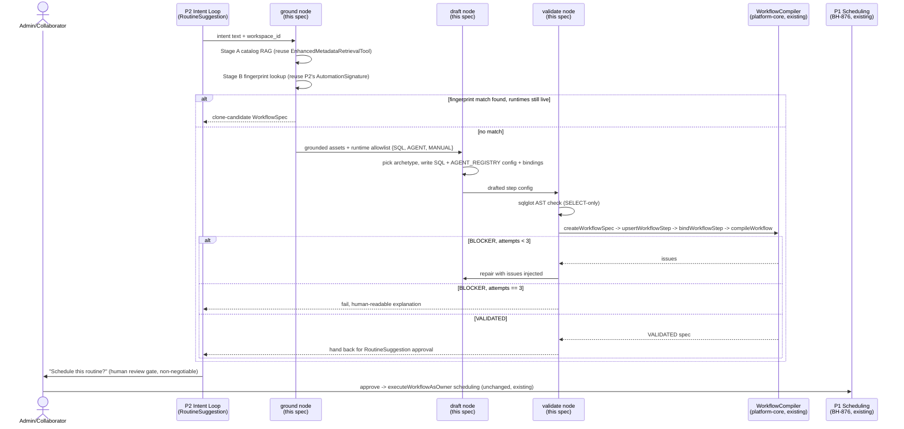

# BrightRoutines — AI-Authored WorkflowSpec Generation from Intent

> Full contract: `~/.claude/rules/spec-driven.md`. Sections 7–9 are conditional — kept where
> applicable per this spec's content.

## Contents

1. [Context](#1-context)
2. [Interface Contract (MDE)](#2-interface-contract-mde)
3. [Invariants (DbC)](#3-invariants-dbc)
4. [Acceptance Criteria (BDD — Gherkin)](#4-acceptance-criteria-bdd--gherkin)
5. [Out of Scope](#5-out-of-scope)
6. [Dependencies](#6-dependencies)
7. [Correctness Properties](#7-correctness-properties)
8. [Eval Criteria](#8-eval-criteria)
9. [Observability Contract](#9-observability-contract)
10. [Test Coverage Update](#10-test-coverage-update)
- [Areas Involved](#areas-involved)
- [Ticket Breakdown](#ticket-breakdown)
- [Related](#related)

## 1. Context

The BrightRoutines P1 epic (BH-876, 6 PRs open for review, CI-green, independently re-verified —
see §6 Dependencies for current per-PR status) makes an *existing* WorkflowSpec schedulable
end-to-end. It assumes a human has already hand-built a compiled WorkflowSpec in the webapp's
Workflow Studio before any of that scheduling machinery is useful — every routine still starts
with human authoring.

The `#releases` post announcing P1 named this out loud as the next gap: AI generation of workflow
content itself — steps, bindings, SQL/agent config — rather than a human hand-building the
WorkflowSpec DAG before it can be scheduled. This spec owns that gap. It sits between the P2
intent-loop spec (`brightroutines-intent-loop.md`, BH-882–889 — detects *that* a routine should
exist) and the P1 scheduling substrate (BH-876, PRs open for review — runs a routine once it
exists): P2 says "the user keeps asking for X," this spec turns that into a runnable, compiled
WorkflowSpec, and P1 schedules it.



### Use case / goal

A user (via P2's proactive suggestion, or a direct request) asks BrightAgent for something like
"weekly earnings report" without hand-building a WorkflowSpec. This spec's `ground → draft →
validate` pipeline either finds an existing compatible spec to clone, or drafts a new
multi-step DAG (SQL extraction → AGENT narration, optionally + a MANUAL review checkpoint),
validates it against the platform's real compiler until it's `VALIDATED`, and hands it to a human
for explicit approval before P1's existing scheduling ever touches it. Success looks like: the
user never opens the Workflow Studio, and the resulting schedule is indistinguishable (from P1's
perspective) from one a human built by hand.

### How it works today

- **BH-876/BH-877/BH-878/BH-879 (P1, PRs open for review, not yet merged)**: `executeWorkflowAsOwner`
  schedules and runs an *existing* `VALIDATED` WorkflowSpec. It has no opinion on how that spec
  was authored.
- **`WorkflowCompiler.compile()`** (`brighthive-platform-core/src/graphql/service/workflow/compiler.ts`)
  is the authoritative validator: topo-sorts `dependsOn` edges (cycle = BLOCKER), requires SQL
  steps to have `sqlTemplate`, requires input bindings to resolve to a real `assetId` or `fqn`,
  and only marks a spec `VALIDATED` when zero BLOCKER-level issues exist.
- Of `StepRuntime`'s 8 enum values
  (`brighthive-platform-core/src/graphql/ogm/workflow-spec-typedefs.ts:19-28`), only 3 are
  actually safe to author into today — see Hard Limitations below.
- `AgentAdapter` (AGENT runtime) delegates to a **closed registry** of 6 agent kinds
  (`summary-agent`, `anomaly-agent`, `schema-doc-agent`, `enrichment-agent`, `dq-agent`,
  `custom-agent` — `brightbot/agents/workflow_agent/registry.py`). Authoring an AGENT step means
  picking one of these, not writing new agent code.
- **`EnhancedMetadataRetrievalTool._vector_search()`** (`brightbot/tools/enhanced_metadata_retrieval.py`)
  already does "NL question → OpenAI `text-embedding-3-small` embed → workspace-scoped RediSearch
  KNN → top-K grounded catalog assets." This is the reusable retrieval primitive this spec's Stage
  A calls directly.
- **P2's `AutomationSignature.fingerprint`** (`brightroutines-intent-loop.md` §3) is a deterministic
  hash over normalized action/object/scope/parameter-keys, already designed to group recurring
  intents and link them to `linked_workflow_spec_id` on `RecurringAutomationPattern`/
  `RoutineSuggestion` rows. This spec's Stage B reuses that link, rather than building a second
  retrieval mechanism.
- BrightBot today has **zero** existing calls to `createWorkflowSpec`/`upsertWorkflowStep`/
  `bindWorkflowStep`/`compileWorkflow` — it only *consumes* WorkflowTriggers pushed to
  `POST /workflow/run`. Authoring a WorkflowSpec from brightbot is greenfield.
- `dbt_agent_react.py` (`brightbot/agents/dbt_agent/`) is the closest existing shape to model:
  a deterministic grounding node followed by a constrained authoring loop, terminating in a
  human-reviewed gate (a GitHub PR, in that case) before anything ships.

### Hard limitations

- **DBT and PYTHON runtimes' `checkStatus()` are stubbed to always return `RUNNING`**
  (`compiler.ts` adapters). A workflow using either never reaches a terminal state — this directly
  violates the Invariant 7 fix committed on BH-879's open PR this epic (schedule row stuck
  "running" forever, overlap lock held indefinitely). **AI must not author into these runtimes
  until their adapters are fixed** — that is separate ticket work, out of this spec's scope.
- **INGEST is a full stub** — logs and returns fake success, does nothing real. Same exclusion.
- **EXTERNAL is fire-and-forget with no poll status** — can't verify success, breaks the same
  terminal-state contract for a different reason (no control over the receiver). Excluded.
- **SNOWFLAKE_CORTEX is live but out of scope** — it's a schema/governance surface (deploys
  semantic views), not a data-delivery routine, and its compiler path requires a hand-attached
  YAML on an existing asset, not something to originate from scratch here.
- **`MANUAL` is a no-op, not a real wait-state.** It returns SUCCESS immediately if output bindings
  have an `fqn` — it does not actually block execution. Any use of MANUAL as a "human checkpoint"
  is a UI/audit-trail signal only, never a real gate. `compileWorkflow`'s existing BLOCKER/WARNING
  set has no concept of a runtime approval gate.
- **Cross-workspace pattern matching is a hard non-goal for v1** (see §5) — not a temporary
  limitation but a governance decision matching P2's own Invariant 1.

**Net limitation for v1: this spec can only produce read-and-narrate / read-and-flag routines
against data already in the warehouse and catalog.** Transformation, ingestion, custom compute,
and external delivery are not achievable until DBT/PYTHON/INGEST/EXTERNAL adapters are fixed
elsewhere.

#### The 5 satisfiable archetypes (SQL → AGENT → optional MANUAL)

1. **Weekly/monthly metric summary report** — SQL aggregate → `summary-agent` narrates. This is
   P2's own worked example and golden case 1 (§8).
2. **Anomaly/threshold check on a metric** — SQL pull → `anomaly-agent` flags deviations →
   optional MANUAL checkpoint (audit-trail signal only, per the limitation above).
3. **Data-quality spot-check on a table** — SQL row-count/null-rate/freshness check → `dq-agent`
   verdict.
4. **Schema/documentation freshness nudge** — SQL lists undocumented tables/columns →
   `schema-doc-agent` drafts descriptions. Blurs into governance tooling, not pure routine
   automation — kept in scope but flagged.
5. **Simple enrichment/classification pass** — SQL pulls unclassified rows → `enrichment-agent`
   classifies → MANUAL sign-off before anything downstream trusts the classification.

Golden case 2 (§8, "forecast of best product next quarter") is a boundary case against archetype
1's shape — it tests that the `draft` node does not silently over-claim statistical forecasting.
Golden case 3 (§8, "total average best students per month") exercises archetypes 1 and 3 against
deliberately ambiguous phrasing, testing metric normalization against Stage A's grounded schema
rather than compile success alone.

### Gaps

- No AI-authoring entry point exists in brightbot at all (greenfield on that side).
- No policy check in `compiler.ts` blocks a non-allowlisted runtime for AI-originated specs
  specifically — relying on prompt discipline alone is a real prompt-injection risk (see §3).
- No `WorkflowSpecNode.authoredBy` field exists to distinguish AI-originated specs from
  human-authored ones, which the new policy check needs.
- No SQL-safety AST check exists for this authoring path (the existing regex-based check in
  `workflow_agent/tools.py` is a known-fragile pattern this spec must not extend or depend on).
- No eval corpus exists yet for "does the drafted spec actually satisfy the request" — this spec
  defines the first three golden cases (§8).

## 2. Interface Contract (MDE)

```
# brightbot internal graph node — not a public HTTP surface.
# Entry point: invoked by P2's RoutineSuggestion schedule flow (BH-885) when an
# intent needs a multi-step DAG, in place of that flow's current trivial
# single-AGENT-step wrapper.

def author_workflow_spec(
    workspace_id: str,
    intent_text: str,
    owner_user_id: str,
) -> WorkflowSpecAuthoringResult:
    """ground -> draft -> validate graph. Raises nothing; failures are terminal states."""

class WorkflowSpecAuthoringResult(BaseModel):
    outcome: Literal["CLONE_CANDIDATE", "VALIDATED", "FAILED"]
    workflow_spec_id: str | None      # set for CLONE_CANDIDATE and VALIDATED
    spec_version: str | None
    failure_reason: str | None        # human-readable, set only for FAILED
    attempts: int                     # 1-3; number of draft->validate loop iterations


# GraphQL mutations this spec CONSUMES, unmodified (already exist, BH-876):
#   createWorkflowSpec(input: { workspaceId, projectId }): WorkflowSpec
#   upsertWorkflowStep(input: UpsertWorkflowStepInput): WorkflowStep
#   bindWorkflowStep(input: BindWorkflowStepInput): WorkflowStep
#   compileWorkflow(input: { workspaceId, projectId }): CompileResult

# GraphQL/schema addition this spec ADDS (platform-core):
type WorkflowSpecNode {
  # ...existing fields unchanged...
  authoredBy: WorkflowSpecAuthor!  # NEW
}

enum WorkflowSpecAuthor {
  HUMAN
  AI
}

# compiler.ts checkPolicies() NEW branch:
#   IF spec.authoredBy == AI AND any step.runtime NOT IN {SQL, AGENT, MANUAL}
#   THEN emit BLOCKER "AI-authored specs may only use SQL, AGENT, or MANUAL runtimes"
```

## 3. Invariants (DbC)

1. A `VALIDATED` spec is never auto-scheduled. `author_workflow_spec` always hands its result
   back to the human-review gate (P2's `RoutineSuggestion` approval, BH-885) — it never calls
   `executeWorkflowAsOwner` directly.
2. AI-originated specs (`authoredBy == AI`) may only use `SQL`, `AGENT`, or `MANUAL` runtimes.
   Enforced deterministically in `compiler.ts::checkPolicies()`, not by prompt discipline alone.
3. Every bound `assetId` in a drafted step traces back to Stage A's grounded retrieval set for
   that request. No step may bind to an asset the retrieval stage did not surface.
4. All retrieval (Stage A catalog RAG, Stage B fingerprint lookup) is workspace-scoped by
   construction — partitioned storage, not a post-hoc filter. No code path may compare across
   `workspace_id` values.
5. `draft` node tool access is strictly read-only against the warehouse. No mutating tool
   (`write_to_redshift` or equivalent) is available to the authoring loop.
6. The `draft → validate` retry loop is bounded at 3 attempts. On the 3rd BLOCKER, the pipeline
   terminates in `FAILED` with a human-readable reason — it never retries indefinitely.
7. Regenerating a routine never mutates a `VALIDATED` spec in place. Every generation produces a
   new `WorkflowSpec`/version; an existing schedule's `executeWorkflowAsOwner` run reads a
   specific `specVersion` and must never race an in-place edit.
8. Catalog metadata (table/column descriptions, tags) fed into the `draft` node's context is
   treated as untrusted data, never as instructions — the `draft` node's system prompt must say
   so explicitly, and Invariant 2's deterministic backstop must hold even if this framing fails.

## 4. Acceptance Criteria (BDD — Gherkin)

```gherkin
Feature: AI-authored WorkflowSpec generation from intent

  Scenario: Weekly earnings report generates cleanly on the first attempt
    Given a workspace with a grounded earnings/revenue catalog asset
    When the ground node receives intent "weekly earnings report" with no fingerprint match
    Then the draft node produces a SQL step bound to the grounded asset and an AGENT step using summary-agent
    And the validate node reaches VALIDATED within 1 attempt

  Scenario: Fingerprint match short-circuits generation
    Given a workspace with an existing RoutineSuggestion linking a live-runtime WorkflowSpec
    And a new intent whose AutomationSignature.fingerprint matches that suggestion's pattern
    When the ground node processes the new intent
    Then the result is CLONE_CANDIDATE referencing the existing WorkflowSpec
    And no draft or validate node executes

  Scenario: Forecasting request does not over-claim
    Given a workspace with a grounded product-performance catalog asset
    When the ground node receives intent "forecast of best product next quarter" with no fingerprint match
    Then the draft node produces a SQL step trending historical performance and an AGENT step narrating it
    And the generated spec's title/description does not claim statistical forecasting without an explicit trend-summary caveat

  Scenario: Ambiguous request resolves to a concrete metric using grounded schema
    Given a workspace with a grounded student-performance catalog asset
    When the ground node receives intent "total average best students per month" with no fingerprint match
    Then the draft node resolves the ambiguous phrasing to a concrete aggregate query bound to the grounded asset
    And the validate node reaches VALIDATED

  Scenario: No matching data in workspace is reported honestly
    Given a workspace with no catalog asset relevant to the intent
    When the ground node runs Stage A retrieval
    Then the pipeline reports "no matching data in this workspace"
    And the draft node never executes and never binds to a hallucinated asset

  Scenario: BLOCKER triggers bounded repair, not infinite retry
    Given a draft that fails compileWorkflow with a BLOCKER issue
    When the validate node processes the failure
    Then the draft node is invoked again with the BLOCKER issues injected into context
    And this repeats at most 2 more times
    And the 3rd consecutive BLOCKER terminates the pipeline in FAILED with a human-readable reason

  Scenario: Non-allowlisted runtime is rejected deterministically even if prompt discipline fails
    Given a drafted spec with authoredBy=AI containing a DBT step (simulating a prompt-injection or model error)
    When compileWorkflow runs checkPolicies()
    Then the result is a BLOCKER naming the disallowed runtime
    And this holds regardless of what the draft node's system prompt said

  Scenario: Regeneration never mutates a live schedule's spec in place
    Given an existing VALIDATED WorkflowSpec with an active executeWorkflowAsOwner schedule
    When a user requests regeneration of the same routine
    Then a new WorkflowSpec version is created
    And the existing schedule's specVersion reference is untouched

  Scenario: Cross-workspace data never leaks through retrieval
    Given two workspaces, A and B, each with similar recurring intents
    When workspace A's ground node runs Stage A and Stage B retrieval
    Then no result includes any asset, fingerprint, or WorkflowSpec belonging to workspace B
```

## 5. Out of Scope

- Actually shipping the code — this spec is a design/spec-authoring artifact; implementation
  tickets follow in §11.
- Autonomous scheduling of AI-generated specs. Scheduling always requires an explicit
  Admin/Collaborator approval through P2's existing `RoutineSuggestion` flow (Invariant 1).
- DBT, PYTHON, INGEST, EXTERNAL runtime support for AI authoring — blocked on those adapters'
  `checkStatus()` stubs being fixed (separate tickets, not this spec's problem).
- Real statistical forecasting / predictive modeling — v1 can only narrate historical trends via
  an LLM reasoning over SQL results, not run an actual forecasting model (see golden case 2, §8).
- A second vector index over compiled WorkflowSpecs (`workflow_spec_vector_idx`). Explicitly
  deferred to a v2 stretch goal, gated on production telemetry showing fingerprint-only matching
  (Stage B) has a measurable miss rate. Not built speculatively.
- Cross-workspace / cross-tenant pattern sharing of any kind, including a "BrightHive starter
  gallery." A separate product decision requiring explicit legal/governance sign-off if ever
  pursued — not a relaxable default of this spec.
- Cost/resource governance beyond a WARNING-level heuristic flag (§3 Invariants do not include a
  hard BLOCKER for unbounded SQL scans in v1 — flagged as a known gap, not solved here).

## 6. Dependencies

| Dependency | Type | Status |
|---|---|---|
| BH-876 P1 scheduling substrate (`executeWorkflowAsOwner`, terminal bridge, notification fanout) | Blocking | 6 PRs open for review, CI-green, not yet merged |
| P2 intent-loop spec (`brightroutines-intent-loop.md`), specifically `AutomationSignature.fingerprint` and `RoutineSuggestion` DTOs (BH-882–884) | Blocking | Drafted, not implemented |
| BH-885 `RoutineSuggestion` schedule/dismiss routes (this spec's PR 5 wires into its §7 step 3) | Blocking for PR 5 only | Drafted, not implemented — this spec's ticket 5 must sequence after BH-885 merges |
| `EnhancedMetadataRetrievalTool` (Stage A catalog RAG) | Blocking | Live, reused unmodified |
| `WorkflowCompiler.compile()` / `checkPolicies()` extension point | Blocking | Live; this spec adds one new branch |
| `sqlglot` (SQL AST validation) | Blocking | Already a brightbot dependency (used only in `evals/online/gates.py` today; this spec adds a second call site) |
| `AGENT_REGISTRY` closed set (`brightbot/agents/workflow_agent/registry.py`) | Blocking | Live, reused unmodified |

## 7. Correctness Properties

### Property 1: No unapproved execution

*For any* AI-authored WorkflowSpec reaching `VALIDATED`, no `executeWorkflowAsOwner` call occurs
against it until an Admin/Collaborator has explicitly approved it through the `RoutineSuggestion`
flow.

**Validates: §3 Invariant 1, §4 Scenario "Weekly earnings report generates cleanly"**

### Property 2: Deterministic runtime containment

*For any* WorkflowSpec with `authoredBy == AI`, the set of runtimes used by its steps is a subset
of `{SQL, AGENT, MANUAL}`, enforced by `checkPolicies()` independent of what the `draft` node's
LLM call produced.

**Validates: §3 Invariant 2, §4 Scenario "Non-allowlisted runtime is rejected deterministically"**

### Property 3: Grounded-only binding

*For any* drafted step's input binding, the bound `assetId` is a member of the Stage A retrieval
result set computed for that authoring session — never a value the `draft` node introduced on its
own.

**Validates: §3 Invariant 3, §4 Scenario "No matching data in workspace is reported honestly"**

### Property 4: Workspace isolation under retrieval

*For any* two distinct `workspace_id` values A and B, no output of Stage A or Stage B retrieval
for A contains any identifier (asset, fingerprint, WorkflowSpec) whose owning workspace is B.

**Validates: §3 Invariant 4, §4 Scenario "Cross-workspace data never leaks through retrieval"**

### Property 5: Bounded repair

*For any* authoring session, the number of `draft → validate` loop iterations is at most 3; the
3rd consecutive `BLOCKER` result terminates in `FAILED`, never a 4th attempt.

**Validates: §3 Invariant 6, §4 Scenario "BLOCKER triggers bounded repair, not infinite retry"**

## 8. Eval Criteria

Three golden cases form the initial eval corpus for the `draft`/`validate` nodes. Each targets a
different honesty/correctness edge — not just compile success.

| Evaluator | Node | Mode | Threshold | Method |
|---|---|---|---|---|
| `WeeklyEarningsReportEval` — reference case: generates VALIDATED on attempt 1 | `draft`/`validate` | GATE | attempts == 1 AND outcome == VALIDATED | Deterministic (compile result + attempt count) |
| `ForecastOverclaimEval` — "forecast of best product next quarter" does not claim statistical forecasting without a caveat | `draft` | GATE | title/description matches `forecast\|predict` only alongside an explicit "trend summary, not a prediction" caveat string | LLM judge (checks for honest framing, not just keyword absence) |
| `AmbiguousMetricNormalizationEval` — "total average best students per month" resolves to a concrete, defensible metric bound to a real grounded asset | `draft`/`validate` | GATE | outcome == VALIDATED AND all `assetId`s in Stage A's grounded set | Deterministic (binding-membership check) + LLM judge (metric defensibility) |
| `RuntimeAllowlistBackstopEval` — simulated non-allowlisted-runtime draft is rejected by `checkPolicies()` regardless of prompt framing | `validate` (compiler) | GATE | BLOCKER present, naming the disallowed runtime | Deterministic |
| `NoHallucinatedBindingEval` — across the full golden corpus, zero drafted bindings reference an assetId outside Stage A's result set | `draft` | GATE | 0 violations across corpus | Deterministic |

## 9. Observability Contract

- **Span**: `gen_ai.tool.execute` with `gen_ai.tool.name=workflow_spec_authoring`, sub-spans for
  `ground`, `draft`, `validate` node executions (OTel GenAI convention, matching existing
  brightbot streaming-middleware instrumentation).
- **Attributes**: `workspace.id`, `gen_ai.request.model`, `gen_ai.usage.input_tokens`,
  `brightagent.authoring.outcome` (`CLONE_CANDIDATE|VALIDATED|FAILED`),
  `brightagent.authoring.attempts` (1-3), `brightagent.authoring.archetype` (which of the 5
  satisfiable shapes was selected, when applicable).
- **Log events**: `workflow_spec_authoring.started`, `workflow_spec_authoring.clone_candidate`,
  `workflow_spec_authoring.blocker_retry` (per attempt, with issue summary),
  `workflow_spec_authoring.validated`, `workflow_spec_authoring.failed`
  (with `failure_reason`).
- **Metrics**: `workflow_spec_authoring.attempts_histogram` (bucketed 1/2/3), `.clone_candidate_rate`
  (fraction of sessions short-circuited by Stage B), `.failure_rate`.

## 10. Test Coverage Update

| Repo | Suite | What to add |
|---|---|---|
| `brightbot` | `brightbot/tests/` (unit/integration) + `brightbot/brightbot/evals/` (L0 surface / L1 routing / L2 behavior) | L0: one case per §2 `WorkflowSpecAuthoringResult` shape. L1: one case per §4 scenario where node routing is observable (fingerprint-match short-circuit vs. full draft/validate path). L2: one case per §3 invariant + one per §8 evaluator — the 3 golden-case evals (§8) are the L2 core. |
| `brighthive-platform-core` | `brighthive-platform-core/tests/` | One test for the new `checkPolicies()` branch (§2/§4 "Non-allowlisted runtime is rejected" scenario) against a real compile call, not a mock — this is the deterministic backstop and needs its own explicit real-behavior test per `test-behavior-real.md`. One test for `WorkflowSpecNode.authoredBy` field round-tripping through `createWorkflowSpec`. |
| `brighthive-e2e` | `brighthive-e2e/e2e/features/scheduler/` | Extend `test_execute_workflow_local_lifecycle.py` with a case driving `ground → draft → validate` end-to-end against a local Neo4j + local warehouse stub (no SSO, matching this epic's established local-verification pattern), confirming a real `VALIDATED` WorkflowSpec lands and plugs into the existing BH-876 `executeWorkflowAsOwner` path with no changes needed there. |

**Real-behavior requirement**: the platform-core `checkPolicies()` test and the e2e local-lifecycle
extension must both hit the real `compileWorkflow` mutation against a real local Neo4j — not a
mocked compiler. This is the load-bearing safety gate (§3 Invariant 2); a mocked test proves the
test's own assumptions, not the actual backstop.

Before opening the implementation PR: run every suite listed above, confirm each new §2/§3/§4/§8
entry has a corresponding new test case, and confirm all suites are green.

## Areas Involved

| Area | Repo | Impact |
|---|---|---|
| WorkflowSpec schema + compiler policy | `brighthive-platform-core` | Add `WorkflowSpecNode.authoredBy` field; add one `checkPolicies()` branch. No changes to existing mutations. |
| AI authoring pipeline | `brightbot` | New `ground`/`draft`/`validate` graph, new supervisor subagent registration, new `sqlglot`-based SQL validator (separate from existing regex check). |
| RoutineSuggestion integration | `brightbot` | Extend BH-885's §7 step 3 to call this pipeline for multi-step intents, falling back to the existing trivial single-AGENT-step wrapper for genuinely single-step intents. Sequenced after BH-885 merges. |
| Cross-repo verification | `brighthive-e2e` | New local, no-SSO e2e case per §10. |

## Ticket Breakdown

**Status as of 2026-07-03**: 2 of 7 tickets shipped (as a demo/backstop, not
the full agent) — see below. The `ground`/`draft`/`validate` LangGraph nodes
themselves remain unbuilt; real BH-897 is still its own epic pending approval
of this spec's direction.

| Ticket | Summary | Points | Epic | Status |
|---|---|---|---|---|
| [BH-911](https://brighthiveio.atlassian.net/browse/BH-911) | `brighthive-platform-core`: `WorkflowSpecNode.authoredBy` field + `checkPolicies()` runtime-allowlist BLOCKER branch, bundled with an artifact-presence WARNING (~200 lines) | 2 | BH-897 | **Shipped**, merged to develop |
| [BH-910](https://brighthiveio.atlassian.net/browse/BH-910) | `brightbot`: throwaway demo script (`scripts/demo_workflow_from_intent.py`) hand-simulating ground→draft→validate with 3 real calls — proves the concept against real local infra, explicitly non-shippable | 2 | BH-897 | **Shipped** (demo only), merged to develop |
| — | `brightbot`: `ground` node — Stage A catalog RAG call + Stage B fingerprint lookup against P2's pattern/suggestion links, no LLM (~300 lines incl. tests) | 3 | BH-897 | Not started |
| — | `brightbot`: `draft` node — constrained ReAct loop, AGENT_REGISTRY-restricted config drafting, `sqlglot` AST SQL validator (~500 lines) | 5 | BH-897 |
| — | `brightbot`: `validate` node — WorkflowSpec GraphQL client (create/upsert/bind/compile round-trip), bounded BLOCKER-retry loop, streaming middleware wiring (~450 lines) | 5 | BH-897 |
| — | `brightbot`: supervisor registration (`deep_agent.py::init_agent_graphs`) + routing description + L1 shape evals (~250 lines) | 3 | BH-897 |
| — | `brightbot`: wire into BH-885's `RoutineSuggestion` schedule flow §7 step 3, replacing the trivial wrapper when a multi-step draft is warranted — **sequence after BH-885 merges** | 3 | BH-897 |
| — | `brighthive-e2e`: local no-SSO e2e case extending `test_execute_workflow_local_lifecycle.py` per §10 | 2 | BH-897 |

**Sequencing**: platform-core ticket and `ground` ticket can run in parallel; `draft` depends on
`ground`'s output contract; `validate` depends on `draft`'s output shape; supervisor registration
depends on `validate`; the BH-885 integration ticket depends on supervisor registration AND on
BH-885 itself being merged (not concurrent, to avoid both PRs racing the same schedule-flow file).

## Related

- **Predecessor spec (P1, PRs open for review)**: `docs/specs/brightroutines-execute-workflow-schedule.md`
- **Predecessor spec (P2, drafted)**: `docs/specs/brightroutines-intent-loop.md`
- **Jira epic**: BH-876; this spec's ticket parent: BH-897
