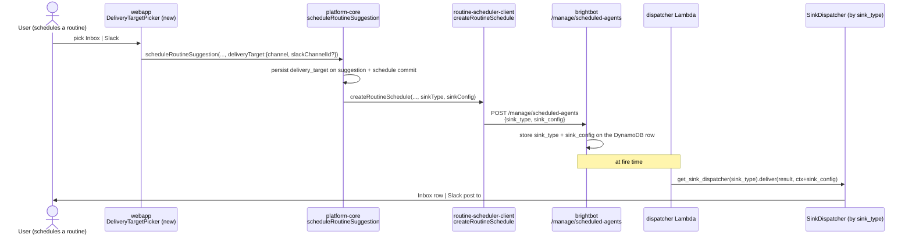

# SPEC: BrightRoutines — Per-Routine Delivery Target, Result Provenance, and PDF Output

> Scope: three net-new capabilities on top of the shipped
> `execute_workflow` scheduling substrate — (1) a **per-routine delivery
> target** the user picks when they schedule (Inbox, a specific Slack channel,
> or Email), stored *on the schedule row* and honored by a sink that routes to
> it; (2) **result provenance** — the generated SQL and the produced artifact
> (uri + format) captured on the run and surfaced on the routine card so a user
> can corroborate what ran; (3) **PDF** as a real output artifact format.
> Everything else — the cron, EventBridge, the dispatcher, `executeWorkflowAsOwner`,
> the terminal bridge, the EMAIL channel enum — is already built and is
> **referenced, not redefined**, from the two specs below.

**Terms (inherited, not redefined).** The `execute_workflow` schedule row, the
EventBridge cron path, `cadenceToCron` (MONTHLY = `0 8 1 * *`, 1st of month
08:00 UTC), the dispatcher → `ActionResult` → `SinkDispatcher.deliver()` chain,
the overlap lock, and the owner-revalidation guarantees are all defined in
[`brightroutines-execute-workflow-schedule.md`](./brightroutines-execute-workflow-schedule.md)
§1–§3 and are **implemented + verified live on staging**. The `DeliveryHint`
enum (`WEBAPP | SLACK | EMAIL | BOTH | ALL`) and the recipient-resolution rules
are defined in [`brightroutines-email-delivery.md`](./brightroutines-email-delivery.md)
§2. The `RoutineSuggestion` DTO and status lifecycle come from
[`brightroutines-intent-loop.md`](./brightroutines-intent-loop.md). This spec
adds exactly three things and their wire/persistence/UX surfaces.

**Port note (per `docs/CLAUDE.md` engine-agnostic rule).** Delivery already has
a Port: `SinkDispatcher` (ABC in `scheduled_agent_dispatcher/contracts.py`) with
a `SINK_REGISTRY`. Today the registry holds two keys that *both* map to the same
`LangGraphWebhookSink` — i.e. the registry exists but there is only one real
adapter. This spec adds the **second and third adapters** (`InboxSink`,
`SlackChannelSink`) behind the existing port + registry — a config/registry
change, never a call-site branch. Artifact rendering likewise gets a
`ArtifactRenderer` port with `MarkdownRenderer` (existing behavior) as adapter #1
and `PdfRenderer` as adapter #2.

## 1. Context

BrightRoutines schedule and fire correctly — a Monthly routine really does get
an EventBridge cron of `0 8 1 * *` and really does run `executeWorkflowAsOwner`
on the 1st. But three things a user asks the moment they see "Monthly
counterparty exposure digest · INBOX · On" have no honest answer today:

1. **"I want this in Slack channel #risk-desk, not my inbox."** There is no
   per-routine channel choice. The schedule row stores a bare `sink_type`
   string (defaulting to `langgraph_webhook`), no `sink_config`, no channel id.
   Both registered sinks map to the same `LangGraphWebhookSink`, which reads
   only `schedule_id`/`workspace_id` from `schedule_context` and records run
   state back onto the row — it has no concept of a delivery destination. Where
   a routine's result surfaces today is decided entirely by standing
   subscriptions, not by the routine. `proposedDelivery` exists on the
   suggestion but is a hint that never becomes a stored, routed target.

2. **"Show me the SQL so I can corroborate it."** `generate_sql()` returns a
   validated SQL string but persists it nowhere structured. `signal_completion`
   posts `artifacts: list[str]` (S3 URIs) with no format and no SQL.
   `ActionResult` carries `{status, run_id, output_type, output}` where `output`
   is just the run metadata JSON. The `executeWorkflowAsOwner` selection set
   requests neither SQL nor artifact. So the routine card can never show "here
   is the query that ran and the file it produced."

3. **"Is the artifact a PDF?"** `store_artifact` supports `markdown | json |
   csv` only; the `format` arg is documented but not branched on. There is no
   PDF renderer and no PDF dependency anywhere in brightbot. `PDF` is in the
   webapp/OGM output-artifact enum but nothing ever produces one.

This spec closes all three. It does **not** touch the cron, the dispatcher
lifecycle, owner revalidation, or the EMAIL channel — those are done.

### 1.1 The delivery-target flow (what changes)



### 1.2 The provenance flow (what changes)

```mermaid
flowchart LR
    A[generate_sql → sql string] --> B[signal_completion:<br/>+executedSql +artifacts{uri,format}]
    B --> C[executeWorkflowAsOwner selection:<br/>+executedSql +artifacts]
    C --> D[ActionResult.raw_data carries sql+artifacts]
    D --> E[terminal bridge writes<br/>last_run_sql + last_run_artifacts on row]
    E --> F[RoutineSuggestion SDL:<br/>lastRunSql, lastRunArtifacts]
    F --> G[webapp routine card:<br/>SQL disclosure + artifact link]
```

## 2. Interface Contract (MDE)

### 2.0 Ports first (the design), then adapters

```python
# scheduled_agent_dispatcher/contracts.py — EXISTING port, unchanged signature.
class SinkDispatcher(ABC):
    @abstractmethod
    def deliver(self, result: ActionResult, schedule_context: dict[str, Any]) -> None: ...

# NEW: schedule_context now carries an optional sink_config the adapter reads.
# {"schedule_id", "workspace_id", "sink_config": {"channel": DeliveryChannel, "slack_channel_id"?: str}}
```

```python
# brightbot/agents/workflow_agent/artifact_renderer.py — NEW port.
class ArtifactRenderer(Protocol):
    def render(self, *, content: str, filename: str) -> RenderedArtifact: ...
    # RenderedArtifact = { bytes: bytes, content_type: str, extension: str }

ARTIFACT_RENDERERS: Final[dict[ArtifactFormat, ArtifactRenderer]] = {
    MARKDOWN: MarkdownRenderer(),   # adapter #1 — existing string-write behavior
    JSON:     JsonRenderer(),
    CSV:      CsvRenderer(),
    PDF:      PdfRenderer(),         # adapter #2 — net-new
}
```

### 2.1 Delivery channel enum + registry adapters (the net-new sinks)

```python
# The user-facing target. Distinct from DeliveryHint (which is a channel-SET on
# the suggestion); DeliveryTarget is the single resolved destination on a schedule.
class DeliveryChannel(str, Enum):
    INBOX = "INBOX"      # webapp notification inbox (maps sink_type=inbox_notification)
    SLACK = "SLACK"      # a specific Slack channel (maps sink_type=slack_channel)
    EMAIL = "EMAIL"      # per brightroutines-email-delivery.md (maps sink_type=email)

SINK_REGISTRY: dict[str, SinkDispatcher] = {
    "langgraph_webhook":         _langgraph_sink,   # existing default, unchanged
    "frontend_webhook_markdown": _langgraph_sink,   # existing, unchanged
    "inbox_notification":        InboxSink(),        # NEW adapter
    "slack_channel":             SlackChannelSink(), # NEW adapter
    "email":                     EmailSink(),         # NEW adapter (delegates to brightroutines-email-delivery.md path)
}
```

`InboxSink.deliver` reads `schedule_context["workspace_id"]` +
`sink_config` recipients and calls the existing `publishNotification`
fan-out (visibility=user). `SlackChannelSink.deliver` reads
`sink_config["slack_channel_id"]` and posts via the existing
`SlackChannel.chat.postMessage`. Neither invents a destination — both read it
from the persisted `sink_config`.

### 2.2 brightbot schedule create — accept + store `sink_config`

`ScheduleCreateRequest` (`routes/scheduled_agents_routes.py`) gains one optional
field; the stored DynamoDB row gains one column:

```python
class ScheduleCreateRequest(BaseModel):
    action_type: str
    cron_expression: str
    action_payload: dict[str, Any] = Field(default_factory=dict)
    sink_type: str = Field(default=DEFAULT_SINK_TYPE)
    sink_config: dict[str, Any] | None = None   # NEW: {channel, slack_channel_id?}
    enabled: bool = True
```

`sink_config` is validated against `sink_type` at create time
(`slack_channel` requires `slack_channel_id`; `inbox_notification`/`email`
require none). It is a routing config, never a secret — the forbidden-token
recursive guard (`_find_forbidden_fields`) still runs on it.

### 2.3 platform-core `scheduleRoutineSuggestion` — accept a delivery target

```graphql
input DeliveryTargetInput {
  channel: String!            # "INBOX" | "SLACK" | "EMAIL"
  slackChannelId: ID          # required iff channel == "SLACK"
}

scheduleRoutineSuggestion(
  workspaceId: ID!
  routineSuggestionId: ID!
  recipientUserIds: [ID!]
  actingUserId: ID
  cadence: String
  deliveryTarget: DeliveryTargetInput   # NEW — optional; defaults to INBOX
): RoutineSuggestion!
```

The resolver maps `deliveryTarget.channel` → `sink_type` (INBOX→`inbox_notification`,
SLACK→`slack_channel`, EMAIL→`email`), builds `sink_config`, persists
`delivery_target` on the suggestion commit (`UpdateExpression`,
`routine-suggestion.ts`), and passes `sinkType` + `sinkConfig` into
`createRoutineSchedule`.

### 2.4 `createRoutineSchedule` — carry sink_type + sink_config

```typescript
createRoutineSchedule({
  auth, workspaceId, projectId, cronExpression, title, routineSuggestionId,
  sinkType: string,                 // NEW
  sinkConfig?: Record<string, unknown>,  // NEW
}) -> { scheduleId }
// POSTs sink_type + sink_config to brightbot /manage/scheduled-agents
```

### 2.5 Result provenance on the wire

```python
# brightbot signal_completion — gains executed_sql + structured artifacts.
signal_completion(
    status: str,
    rows_processed: int = 0,
    artifacts: list[ArtifactRef] | None = None,   # was list[str]; ArtifactRef = {uri, format}
    executed_sql: str | None = None,               # NEW
    error_message: str | None = None,
    ai_explanation: str | None = None,
)
```

```graphql
# executeWorkflowAsOwner selection set gains (platform-core):
executedSql: String
artifacts: [WorkflowArtifact!]!     # WorkflowArtifact { uri: String!, format: String! }
```

```graphql
# RoutineSuggestion type gains (surfaced on the card):
type RoutineSuggestion {
  # ...existing fields...
  lastRunSql:       String
  lastRunArtifacts: [WorkflowArtifact!]
}
```

### 2.6 webapp surfaces

- **Delivery-target picker** on the schedule dialog: a mobile-first control
  (works at 320px) offering Inbox / Slack channel (with a channel picker) /
  Email. Adds `deliveryTarget` to the `SCHEDULE_MUTATION` variables in
  `useRoutineSuggestions.ts`. **Must not** send a `cadence` arg it doesn't own
  (that path already 400s — see the hook's existing note).
- **Provenance disclosure** on the routine card: a collapsed "Show SQL" reveals
  `lastRunSql` in a read-only code block; artifact links render per
  `lastRunArtifacts[].format` (a PDF gets a PDF icon + download).

## 3. Invariants (DbC)

- INV-1 `WHERE a routine has a stored delivery_target, THE System SHALL deliver its result only through that target's sink` — the routine's own choice wins over standing subscriptions for that routine's result.
- INV-2 `WHEN channel == SLACK, THE System SHALL NOT create the schedule unless slack_channel_id is present` — no half-configured Slack routine.
- INV-3 A `slack_channel_id` in `sink_config` is always a channel the workspace's Slack integration can post to — cross-workspace channel ids are rejected at create (tenant isolation, P0).
- INV-4 `sink_config` SHALL never contain a token/secret field — the recursive forbidden-field guard runs on it exactly as on `action_payload`.
- INV-5 `lastRunSql` is the SQL that actually executed on the run it is attached to — never a re-generated or template SQL. If the run produced no SQL (pure agent task), `lastRunSql` is null, not a fabricated query.
- INV-6 `WHEN store_artifact is called with format == PDF, THE System SHALL produce a real PDF (application/pdf) rendered from the content` — never a text file with a `.pdf` name.
- INV-7 A routine turned off (SCHEDULED → OFFERED) SHALL deliver nothing on any channel — inherited from the schedule-delete gate; the new sinks add no new emission source.
- INV-8 An unknown/unsupported `sink_type` SHALL be rejected at create time, never at fire time — a schedule that cannot deliver never gets stored.

Budget: 8 invariants.

## 4. Acceptance Criteria (BDD — Gherkin)

```gherkin
Feature: Per-routine delivery target, provenance, and PDF

  Scenario: Schedule a routine to a specific Slack channel
    Given an OFFERED routine suggestion
    When the user schedules it with deliveryTarget {channel: SLACK, slackChannelId: "C123"}
    Then the schedule row stores sink_type "slack_channel" and sink_config {slack_channel_id: "C123"}
    And when the routine fires, its result is posted to channel C123
    And no inbox row is created for that routine result

  Scenario: Schedule to Inbox (default)
    Given an OFFERED routine suggestion
    When the user schedules it with no deliveryTarget
    Then the schedule row stores sink_type "inbox_notification"
    And the result lands in the recipients' notification inbox

  Scenario: Slack target without a channel id is rejected
    Given an OFFERED routine suggestion
    When the user schedules it with {channel: SLACK} and no slackChannelId
    Then the schedule is not created
    And the error names the missing slack_channel_id

  Scenario: The card shows the SQL that ran
    Given a SCHEDULED routine that runs a SQL_QUERY workflow
    When the routine completes a run
    Then lastRunSql on the suggestion equals the SQL that executed
    And the routine card can reveal it read-only

  Scenario: A pure agent routine shows no fabricated SQL
    Given a SCHEDULED routine whose workflow runs no SQL
    When it completes
    Then lastRunSql is null
    And the card shows no SQL disclosure

  Scenario: PDF artifact is a real PDF
    Given a routine whose workflow calls store_artifact(format="PDF")
    When it runs
    Then the stored object's content type is application/pdf
    And lastRunArtifacts contains an entry with format "PDF"
    And the card offers it as a PDF download

  Scenario: sink_config carrying a token is rejected
    Given a schedule create whose sink_config contains an auth_token field
    Then the create is rejected by the forbidden-field guard
```

Budget: 7 scenarios.

## 5. Out of Scope

- Changing the cron / EventBridge / dispatcher lifecycle — done, referenced only.
- The EMAIL rendering template + recipient resolution — owned by
  `brightroutines-email-delivery.md`; this spec only routes to its sink.
- Rich HTML/branded PDF layout beyond a clean counts+SQL+result render (follow-up).
- Standing per-user channel *preferences* (a global "always Slack" setting) —
  this spec is per-routine, chosen at schedule time.
- Retroactively backfilling `lastRunSql` for runs that already happened before
  this ships — provenance attaches to runs from this point forward.

## 6. Dependencies

- **Built + verified (referenced):** the `execute_workflow` schedule substrate,
  dispatcher, terminal bridge, owner revalidation
  (`brightroutines-execute-workflow-schedule.md`, implemented-verified-staging).
- **Built (referenced):** `DeliveryHint.EMAIL`/`ALL` + the email fan-out branch
  (`brightroutines-email-delivery.md`). The `email` sink here delegates to it.
- **New dep — PDF renderer:** a single PDF library in brightbot. Pick one
  (`reportlab` — pure-Python, no system libs, smallest footprint; vs `weasyprint`
  — HTML/CSS but needs system libs). Decide in the PR; `reportlab` is the default
  for a Lambda/container with no apt layer. **This is a `pyproject.toml` change,
  not a secret** — no secret approval needed.
- Slack channel posting reuses the existing `SlackChannel.chat.postMessage` +
  the workspace's already-provisioned bot token — **read-only use of an existing
  secret, no new secret minted or written.**
- The Slack channel picker needs a `channelsForWorkspace`-style query; if one
  doesn't already exist, that is a prerequisite slice (small).

## 7. Correctness Properties

### Property 1: The routine's channel choice is honored
*For any* routine with a stored `delivery_target`, its result is delivered through exactly that target's sink and no other.
**Validates: §3 INV-1, §4 "Schedule a routine to a specific Slack channel"**

### Property 2: No half-configured Slack routine exists
*For any* stored schedule with `sink_type == slack_channel`, `sink_config.slack_channel_id` is present and workspace-scoped.
**Validates: §3 INV-2, INV-3, §4 "Slack target without a channel id is rejected"**

### Property 3: Provenance is real, never fabricated
*For any* run, `lastRunSql` is either the SQL that executed on that run or null — never a regenerated or template query.
**Validates: §3 INV-5, §4 "A pure agent routine shows no fabricated SQL"**

### Property 4: A PDF is a PDF
*For any* artifact stored with `format == PDF`, the stored object is `application/pdf` rendered from the content.
**Validates: §3 INV-6, §4 "PDF artifact is a real PDF"**

### Property 5: No secret ever rides in a routing config
*For any* schedule create, `sink_config` passes the same recursive forbidden-field guard as `action_payload`.
**Validates: §3 INV-4, §4 "sink_config carrying a token is rejected"**

Budget: 5 properties.

## 8. Eval Criteria

The SQL a routine runs is LLM-authored (`generate_sql`), so provenance display
depends on that SQL being the real executed one — but correctness of *the SQL
itself* is already gated by the workflow-agent's existing SELECT-only + compile
guards (`brightroutines-execute-workflow-schedule.md`). This spec adds no new
LLM decision; it surfaces an already-produced artifact. No net-new evaluator —
§3 invariants + §4 scenarios cover the provenance/routing/PDF correctness
deterministically.

## 9. Observability Contract

- **Log events**: `routine_delivery.routed` (with `sink_type`),
  `routine_delivery.slack_channel_missing`, `routine_provenance.sql_captured`,
  `routine_provenance.sql_absent`, `artifact.pdf_rendered`,
  `artifact.pdf_render_failed`.
- **Attributes**: `workspace_id`, `routine_suggestion_id`, `schedule_id`,
  `sink_type`, `artifact_format`, `sql_present` (bool) — never the SQL text or
  the Slack channel name in logs, only ids/flags.
- **Metrics**: `routine_delivery_total` tagged `sink_type`, `workspace_id`;
  `artifact_pdf_render_failure_total` tagged `workspace_id`.
- **Span**: the PDF render runs under `gen_ai.tool.execute` with
  `gen_ai.tool.name=store_artifact`, `brightagent.artifact.format=PDF`,
  `brightagent.artifact.output_size_bytes`.

## 10. Test Coverage Update

### a. In-repo layered tests

- **L0** (one per §2 contract entry):
  - `ScheduleCreateRequest` accepts `sink_config`; row stores it (brightbot).
  - `scheduleRoutineSuggestion` accepts `deliveryTarget`; SDL exposes
    `lastRunSql`/`lastRunArtifacts` (platform-core).
  - `SCHEDULE_MUTATION` sends `deliveryTarget`, still omits `cadence` (webapp).
- **L1** (routing, one per §4 dispatch scenario):
  - SLACK target → `SlackChannelSink`; INBOX → `InboxSink`; EMAIL → email path
    (via `get_sink_dispatcher(sink_type)`).
  - unknown `sink_type` rejected at create (INV-8).
- **L2** (one per observable §3 invariant):
  - INV-1 result routes only to the chosen sink (assert no inbox row on a Slack
    routine).
  - INV-3 cross-workspace `slack_channel_id` rejected.
  - INV-4/§4 `sink_config` forbidden-field guard.
  - INV-5 pure-agent run → `lastRunSql == null`.
  - INV-6 PDF stored object content-type is `application/pdf`.
- **Real-behavior** (per `test-behavior-real.md`):
  - `SlackChannelSink` exercised against the *bound* Slack client posting to a
    real test channel (captured), not a mocked `chat.postMessage`.
  - `PdfRenderer` exercised end-to-end: render → `S3Backend.write` → read back →
    assert magic bytes `%PDF` and a parseable PDF, not a text file.
  - `signal_completion` round-trip with `executed_sql` set → assert it lands on
    the schedule row and surfaces on `lastRunSql`.

### b. Cross-repo e2e (`brighthive-e2e`)

- **Feature (happy path):** schedule a routine with `deliveryTarget {SLACK,
  C…}`, fire it (run-now against a throwaway project), assert the Slack channel
  received the post AND `lastRunSql`/`lastRunArtifacts` are populated on the
  suggestion. Extends the existing `e2e/features/scheduler/` suite — does not
  fork a new file.
- **Surface:** `scheduleRoutineSuggestion` with `deliveryTarget` against the
  real staging backend returns a suggestion carrying the resolved target.
- **Error path:** `{channel: SLACK}` with no `slackChannelId` → create rejected
  end-to-end (INV-2).

### c. Prove-live (gated — the four-part ask's "prove it fires on cron")

On a **throwaway workspace** (never LC without a separate, workspace-named
approval — see memory `reset-mutation-test-against-oneten`): schedule a routine
with a near-term cron, watch EventBridge → dispatcher → `executeWorkflowAsOwner`
→ SQL execute → PDF artifact → delivery to the chosen channel, end-to-end, once,
read-only (a SELECT-only routine; no writes to the warehouse). Capture the run
id, the executed SQL, the artifact object, and the delivered message as the
proof. This is verification, not a code artifact; it runs after §10a/§10b are
green and only against a workspace explicitly approved for live writes.

### Self-verification (before the implementation PR)

Run the layered suites + the e2e; confirm each §2/§3/§4 entry has a new case;
confirm the Slack post is verified against the real bound client (captured), the
PDF against real magic bytes, and `lastRunSql` against a real executed query —
not mocks.

## 11. PR Split

Ordered by dependency; one PR per repo per concern, each under the size ladder.

| PR | Repo | Scope | Ticket | Size |
|---|---|---|---|---:|
| 1 | `brightbot` | `sink_config` on `ScheduleCreateRequest` + row; `InboxSink`/`SlackChannelSink`/`EmailSink` adapters behind the existing registry; forbidden-field guard on `sink_config` | BH-1401 | <400 |
| 2 | `brightbot` | `ArtifactRenderer` port + `PdfRenderer` (reportlab); `store_artifact` branches on format; `signal_completion` carries `executed_sql` + `ArtifactRef` | BH-1402 | <400 |
| 3 | `brighthive-platform-core` | `DeliveryTargetInput` on `scheduleRoutineSuggestion`; persist `delivery_target`; `createRoutineSchedule` carries `sinkType`+`sinkConfig`; `executedSql`/`artifacts` in the selection set + terminal-bridge write; `lastRunSql`/`lastRunArtifacts` on the SDL type | BH-1403 | <500 |
| 4 | `brighthive-webapp` | delivery-target picker (mobile-first) on the schedule dialog; `deliveryTarget` in `SCHEDULE_MUTATION`; SQL disclosure + artifact links (incl. PDF) on the routine card | BH-1404 | <500 |
| 5 | `brightbot-slack-server` | channel-post formatting for a routine result delivered to a specific channel (if the sink posts via slack-server rather than direct `chat.postMessage`) | BH-1405 | <300 |
| 6 | `brighthive-e2e` | §10b feature + surface + error-path tests | BH-1406 | <300 |

Execution order: PR-1 and PR-2 (brightbot) can go in parallel; PR-3
(platform-core) depends on both for the sink_type mapping + provenance fields;
PR-4 (webapp) depends on PR-3's SDL; PR-5 depends on PR-1's `slack_channel`
sink; PR-6 is the final gate. New sinks stay inert until a routine actually
carries a non-default `delivery_target`, so PR-1/2/3 are safe to land ahead of
the UI.
