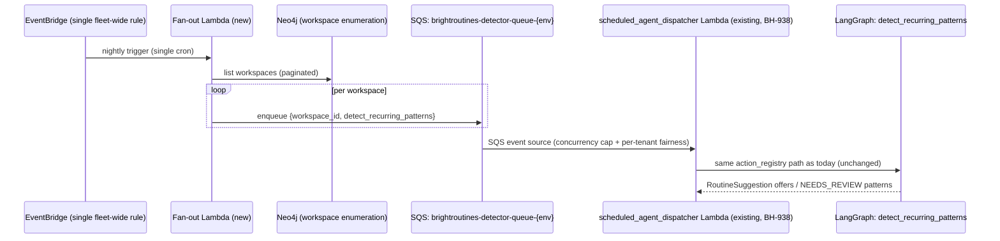

# BrightRoutines detector fan-out: single cron + SQS + per-tenant fairness

> Replaces one EventBridge Scheduler entry per workspace (thundering-herds at 00:00 UTC, N
> failure surfaces, no per-tenant fairness) with a single fleet-wide cron that fans out over SQS
> per pluggable-scalable.md PS-8. Full contract: `~/.claude/rules/spec-driven.md`.

## Contents

1. [Context](#1-context)
2. [Interface Contract (MDE)](#2-interface-contract-mde)
3. [Invariants (DbC)](#3-invariants-dbc)
4. [Acceptance Criteria (BDD — Gherkin)](#4-acceptance-criteria-bdd--gherkin)
5. [Out of Scope](#5-out-of-scope)
6. [Dependencies](#6-dependencies)
7. [Correctness Properties](#7-correctness-properties)
8. [Observability Contract](#8-observability-contract)
9. [Test Coverage Update](#9-test-coverage-update)
- [Glossary](#glossary)
- [Migration Plan](#migration-plan)
- [Areas Involved](#areas-involved)
- [Ticket Breakdown](#ticket-breakdown)
- [Related](#related)

## Glossary

- **Fan-out Lambda**: new Lambda that lists workspaces and enqueues one SQS message per
  workspace — replaces the per-workspace EventBridge Scheduler entries this spec retires.
- **Thundering herd**: every per-workspace schedule firing at the same wall-clock instant
  (00:00 UTC today), spiking concurrent LangGraph runs and dispatcher Lambda invocations.
- **Per-tenant fairness**: no single workspace's detector runs can starve every other
  workspace's share of dispatcher concurrency — enforced via a token bucket or per-tenant queue,
  not just a global concurrency cap.
- **`detect_recurring_patterns`**: the LangGraph graph (`brightbot/langgraph.json`) that runs
  BrightRoutines' nightly per-workspace detector (`brightbot/routines/detector_task.py`).

## 1. Context

BH-884 registers one EventBridge Scheduler entry per workspace, each targeting the
`scheduled_agent_dispatcher` Lambda with `action_type=detect_recurring_patterns` (confirmed:
`brightbot/routes/scheduled_agents_routes.py::_put_scheduler_schedule`, invoked once per
schedule row from a schedule's create/update path). At N workspaces this means N EventBridge
Scheduler entries all firing at the same wall-clock instant (00:00 UTC by convention), N
independent failure surfaces to monitor (no fleet-wide view), and no mechanism preventing one
large workspace's detector run from starving the dispatcher's concurrency budget for every other
workspace scheduled at the same tick.



### Use Case / Goal

BrightRoutines' nightly detector scales to hundreds of workspaces without a synchronized spike
at midnight, without N independently-monitored schedules, and without one large workspace
starving smaller ones' detection runs of dispatcher capacity.

### How It Works Today

- **Per-workspace scheduling**: `_put_scheduler_schedule()` in
  `brightbot/routes/scheduled_agents_routes.py` creates one EventBridge Scheduler entry per
  schedule row (env vars `DISPATCHER_LAMBDA_ARN`/`SCHEDULER_ROLE_ARN`/`SCHEDULER_GROUP_NAME`,
  default group `"scheduled-agents"`). A `detect_recurring_patterns` schedule is one row like any
  other action type — `ACTION_TYPE_DETECT_RECURRING_PATTERNS` is in `SCHEDULABLE_ACTIONS` and
  `ACTION_REQUIRED_INPUTS` alongside `execute_workflow`/`quality_check_task`/`profiler_task`, with
  no special-cased fan-out logic.
- **Dispatch**: EventBridge Scheduler invokes the `scheduled_agent_dispatcher` Lambda
  (`brighthive-platform-core/lambdas/scheduled_agent_dispatcher/main.py`) directly per schedule —
  no queue in between. `action_registry.py` routes `detect_recurring_patterns` to the same
  `LangGraphActionHandler` used for `quality_check_task`/`profiler_task`.
- **Detector execution**: the dispatcher's LangGraph handler invokes brightbot's
  `detect_recurring_patterns_graph` (`brightbot/routines/detector_task.py`), which calls
  `run_detection()` (`brightbot/routines/detector.py`) for that one workspace.
- **No user-facing UI**: grepped `brighthive-webapp/src` for `detect_recurring_patterns` — zero
  hits. These schedules are created directly via the scheduler API (e.g. a provisioning script
  for BH-884's rollout), not through webapp's schedule-creation UI. This spec's AC about the
  webapp flow returning 409 is a forward-looking guard against a UI surface that doesn't exist
  yet, not a fix to an existing one.
- **BH-938** (parallel effort, same epic) adds a CDK stack + DLQ + alarm for the dispatcher
  Lambda itself — orthogonal to this spec's fan-out redesign; the dispatcher keeps the same
  action-routing logic either way.

### Hard Limitations

- EventBridge Scheduler has no native "fan out to N targets from one rule" primitive — the single
  fleet-wide cron this spec wants requires an intermediate Lambda (the fan-out Lambda) to expand
  one trigger into N SQS messages. There's no way to skip that hop.
- Tearing down N existing per-workspace schedules is an irreversible-in-place migration: once a
  schedule row's EventBridge entry is deleted, the only way back is re-running the create path
  for every affected workspace. This is why this spec's rollout must be staged with a working
  fallback path (§ Migration Plan), not a single cutover.
- Workspace enumeration for the fan-out Lambda has to hit either Neo4j directly or platform-core's
  GraphQL API — there is no existing "list every workspace with a detect_recurring_patterns
  schedule" query; one has to be added (or the fan-out Lambda targets *every* workspace
  unconditionally, moving the opt-in/opt-out decision to feature-flag gating, per
  `brightbot/utils/feature_flags.py`'s existing per-workspace primitive).

### Gaps

- No SQS queue exists for this purpose today (`brightroutines-detector-queue-{env}` is entirely
  new).
- No fan-out Lambda exists.
- The dispatcher Lambda's current trigger is EventBridge Scheduler direct-invoke, not an SQS
  event source — wiring an SQS trigger onto the same Lambda (or a queue-consuming variant) is new
  work, coordinated with BH-938's CDK stack (whichever lands second should build on the other's
  `ScheduledAgentDispatcherStack`/queue infra rather than duplicating it).
- No per-tenant fairness mechanism (token bucket or per-tenant queue) exists anywhere in this
  codebase for any workload — this is new design, not an extension of an existing pattern.
- No load-test harness exists for "100 workspaces, verify no workspace exceeds 3× fair share."

## 2. Interface Contract (MDE)

```python
# brighthive-platform-core/lambdas/detector_fanout/main.py (new Lambda)

def lambda_handler(event: dict, context) -> dict:
    """Triggered by a single EventBridge rule (nightly). Lists workspaces with an
    active detect_recurring_patterns schedule, enqueues one SQS message per
    workspace on brightroutines-detector-queue-{env}. Idempotent per invocation —
    re-running a partially-failed fan-out re-enqueues, relying on the dispatcher's
    existing overlap lock (schedule_state.py) to no-op a still-running detection."""
```

```json
// SQS message shape (matches EventBridge Scheduler's existing target_input,
// so action_registry.py's LangGraphActionHandler needs zero changes):
{
  "schedule_id": "<per-workspace schedule row id>",
  "workspace_id": "<workspace uuid>",
  "action_type": "detect_recurring_patterns"
}
```

```python
# New DynamoDB-backed or SQS-native fairness primitive (design TBD in
# implementation ticket — this spec fixes the CONTRACT, not the mechanism):
class DetectorFairnessGate(Protocol):
    async def acquire(self, *, workspace_id: str) -> bool: ...  # True = proceed, False = defer
    async def release(self, *, workspace_id: str) -> None: ...
```

## 3. Invariants (DbC)

- INV-1: WHEN the fan-out Lambda enumerates workspaces, THE System SHALL enqueue exactly one SQS
  message per workspace with an active `detect_recurring_patterns` schedule — no duplicates, no
  silently-dropped workspaces on a paginated listing.
- INV-2: WHILE the migration is in progress (§ Migration Plan Phase 2), THE System SHALL support
  BOTH the old per-workspace EventBridge path AND the new fan-out path running simultaneously
  without double-triggering the same workspace's detector in the same night — enforced by the
  existing overlap lock in `schedule_state.py` (a workspace's `running` flag blocks a second
  concurrent invocation regardless of which path triggered it).
- INV-3: THE System SHALL NEVER let one workspace's dispatcher-consumed messages exceed 3× the
  fair per-workspace share of concurrency in a fleet-wide fan-out window (this spec's own load-test
  AC, restated as an invariant).
- INV-4: WHEN the webapp's (future) create-schedule flow receives a `detect_recurring_patterns`
  action type after this migration completes, THE System SHALL return 409 or auto-route to the
  fleet cron — never silently create a new orphaned per-workspace EventBridge entry that the
  fan-out Lambda doesn't know about.
- INV-5: THE System SHALL configure the dispatcher's SQS consumer with `VisibilityTimeout` greater
  than the detector run's measured p99 duration, `MaxReceiveCount=3`, and a DLQ — matching this
  spec's own AC and BH-938's DLQ precedent for the same Lambda.

## 4. Acceptance Criteria (BDD — Gherkin)

```gherkin
Feature: Detector fan-out with per-tenant fairness

  Scenario: Single cron enqueues one message per workspace
    Given 50 workspaces each have an active detect_recurring_patterns schedule
    When the nightly EventBridge rule fires the fan-out Lambda
    Then exactly 50 messages are enqueued on brightroutines-detector-queue-{env}
    And each message's workspace_id is unique

  Scenario: Dispatcher processes fan-out messages identically to direct EventBridge invokes
    Given a workspace's detect_recurring_patterns message is consumed from the queue
    When the dispatcher's LangGraphActionHandler runs
    Then the resulting detector behavior is identical to today's direct-EventBridge-invoke path
    And no code change was needed in action_registry.py or detector_task.py

  Scenario: One large workspace cannot starve the fleet
    Given 100 workspaces are enqueued in one fan-out cycle
    And one workspace's messages are artificially delayed/retried at a high rate
    When the dispatcher consumes the queue under its configured concurrency cap
    Then no single workspace consumes more than 3x the fair per-workspace share of concurrency

  Scenario: Migration-window overlap lock prevents double-triggering
    Given a workspace still has its OLD per-workspace EventBridge schedule active
    And the NEW fan-out path also enqueues that same workspace the same night
    When both paths reach the dispatcher
    Then schedule_state.py's overlap lock ensures only one detection run actually executes

  Scenario: Exhausted SQS retries land in the DLQ, not silently dropped
    Given a workspace's detector message fails 3 times (MaxReceiveCount)
    When the queue's redrive policy triggers
    Then the message lands in the DLQ for manual inspection/replay
    And no other workspace's processing is affected

  Scenario: Post-migration create-schedule request is guarded
    Given the per-workspace EventBridge schedules have been torn down (Migration Plan Phase 3)
    When a caller attempts to create a NEW detect_recurring_patterns schedule via the old API path
    Then the request returns 409 (or is auto-routed to the fleet cron, per implementation choice)
    And no orphaned EventBridge entry is created outside the fan-out Lambda's visibility
```

## 5. Out of Scope

- Changing `detect_recurring_patterns`' actual detection logic (`run_detection()`,
  `detector_task.py`) — this spec only changes HOW the workspace-level invocation is triggered,
  never what it does once triggered.
- BH-957's online-eval circuit breaker — orthogonal; the breaker gates offer-vs-shadow decisions
  inside `run_detection`, unaffected by how that call gets scheduled.
- BH-938's dispatcher CDK stack — parallel effort in the same epic; this spec's SQS event source
  should be added as an extension to whichever stack lands first, not a competing definition.
- A generalized "fan-out fairness" library for OTHER action types (`execute_workflow`,
  `quality_check_task`) — this spec is scoped to `detect_recurring_patterns` only. Generalizing
  the fairness gate to other action types is a natural follow-up, not this spec's job.
- Real-time/sub-nightly re-triggering — the fan-out still runs once per configured cadence
  (nightly by convention today), not continuously.

## 6. Dependencies

| Dependency | Type | Status |
|------------|------|--------|
| BH-884 (detector + per-workspace scheduling) | Blocking (this spec replaces its scheduling mechanism) | Ready (Done) |
| BH-938 (dispatcher CDK stack, DLQ, alarms) | Non-blocking, should coordinate | In review (PR #1016) |
| A workspace-enumeration query (Neo4j or GraphQL) | Blocking for the fan-out Lambda | Not started — needs its own scoping (does it enumerate ALL workspaces, or only ones with an active schedule row?) |
| Per-tenant fairness mechanism design | Blocking for INV-3/AC "one large workspace cannot starve" | Not started — this spec fixes the CONTRACT (§2 `DetectorFairnessGate`), not the concrete token-bucket-vs-per-tenant-queue choice, which needs its own design pass in the implementation ticket |

## 7. Correctness Properties

### Property 1: Fan-out completeness

*For any* set of workspaces with an active `detect_recurring_patterns` schedule at fan-out time,
every workspace in that set receives exactly one enqueued SQS message — no workspace is silently
skipped by a pagination bug, and no workspace receives more than one message per fan-out cycle.

**Validates: §3 Invariant 1, §4 Scenario "Single cron enqueues one message per workspace"**

### Property 2: Migration-window safety

*For any* workspace mid-migration (both the old per-workspace EventBridge schedule and the new
fan-out path capable of triggering it the same night), the existing overlap lock in
`schedule_state.py` guarantees at most one detection run executes — the migration can never cause
a workspace's detector to run twice concurrently.

**Validates: §3 Invariant 2, §4 Scenario "Migration-window overlap lock prevents double-triggering"**

### Property 3: Fairness bound holds under load

*For any* fan-out cycle with N workspaces and a fixed dispatcher concurrency cap, no single
workspace's share of consumed concurrency exceeds 3× (N-workspace fair share) — verified
empirically by the load test named in this spec's own AC, not just by code review.

**Validates: §3 Invariant 3, §4 Scenario "One large workspace cannot starve the fleet"**

## 8. Observability Contract

- **Span**: new `brightroutines.fanout.run` span on the fan-out Lambda invocation, with a child
  span `brightroutines.fanout.enqueue` per workspace.
- **Attributes**: `brightroutines.fanout.workspaces_enumerated`,
  `brightroutines.fanout.messages_enqueued`, `brightroutines.fanout.enumeration_source`
  (`neo4j`/`graphql`).
- **Log events**: `brightroutines.fanout.started`, `brightroutines.fanout.completed`,
  `brightroutines.fanout.workspace_skipped` (with reason — e.g. schedule disabled) so a
  pagination bug that silently drops workspaces is greppable, not just a missing metric.
- **Metrics**: `brightroutines.fanout.queue_depth` (gauge, sampled from SQS
  `ApproximateNumberOfMessagesVisible`), `brightroutines.fanout.per_workspace_concurrency_share`
  (for the fairness invariant's live verification, not just the one-time load test).

## 9. Test Coverage Update

| Repo | Suite | What to add |
|---|---|---|
| `brighthive-platform-core` | `tests_cdk/test_detector_fanout_stack.py` (new, mirrors `tests_cdk/test_scheduled_agent_dispatcher_stack.py`'s real-`Template.from_stack()` pattern) | CDK synth assertions: SQS queue exists with `VisibilityTimeout`/`MaxReceiveCount`/DLQ configured (§3 INV-5), fan-out Lambda has the workspace-enumeration IAM scoped correctly (no wildcard). |
| `brighthive-platform-core` | `lambdas/detector_fanout/tests/test_main.py` (new) | Unit: fan-out logic with an injected fake workspace-lister — one message per workspace, no duplicates, pagination doesn't drop entries (§4 Scenario "Single cron enqueues..."). |
| `brightbot` | `tests/unit/routines/test_detector_task.py` (extend existing) | L1: assert `detect_recurring_patterns_graph`'s behavior is IDENTICAL whether invoked via the SQS-consumed path or the direct-EventBridge path (§4 Scenario "Dispatcher processes fan-out messages identically") — same input shape, same output. |
| `brighthive-e2e` | `e2e/features/scheduler/` (new feature test) | Real-behavior: seed N synthetic workspace schedules against staging, trigger the fan-out Lambda manually, assert N messages land on the real SQS queue and N detector runs complete — the load-test scenario at a smaller N (staging-safe scale, not the full 100-workspace load test which runs separately as an ops exercise, not CI). |

**Real-behavior requirement**: the brighthive-e2e feature test above (real SQS, real staging
workspaces) satisfies this row — the CDK synth + unit tests above are necessary but not
sufficient on their own.

Before opening the implementation PR: run all three new/extended suites, confirm every §2/§3/§4
entry has a corresponding case, and confirm all suites are green. The 100-workspace load test
(§4's own AC) is a separate one-time verification exercise against a real or synthetic-at-scale
environment — document its result in the PR description, since it isn't a repeatable CI gate.

## Migration Plan

BH-943's AC explicitly requires tearing down live per-workspace EventBridge schedules — this is
the one part of this spec that is a live-infrastructure change, not purely additive, and needs
its own staged rollout rather than a single cutover:

1. **Phase 1 — additive.** Deploy the fan-out Lambda + SQS queue + dispatcher SQS event source.
   Existing per-workspace EventBridge schedules keep running unmodified. No teardown yet. Both
   paths CAN double-trigger a workspace on the same night during this phase — INV-2's overlap
   lock is what makes that safe, not an accident of timing.
2. **Phase 2 — shadow validation.** Run the fan-out path in parallel with the old path for
   >= 1 week. Compare: does every workspace that fired via the old path also get a fan-out
   message the same night? Any workspace the fan-out enumeration missed is a bug to fix before
   Phase 3, not a "close enough."
3. **Phase 3 — cutover.** Once Phase 2 shows 100% parity, tear down the per-workspace EventBridge
   Scheduler entries for `detect_recurring_patterns` schedules ONLY (never touch
   `execute_workflow`/`quality_check_task`/`profiler_task` schedules — those keep their existing
   per-workspace EventBridge mechanism; this migration is scoped to one action type). Wire the
   webapp-flow 409/auto-route guard (INV-4) at the same time so no new orphaned schedule can be
   created outside the fan-out Lambda's visibility going forward.
4. **Rollback**: if Phase 3's teardown reveals a gap the shadow validation missed, the per-workspace
   creation code path (`_put_scheduler_schedule`) is NOT deleted in this spec — it's left in
   place, unused, so a rollback is "recreate the EventBridge entries via the existing function,"
   not "resurrect deleted code."

## Areas Involved

| Area | Repo | Impact |
|------|------|--------|
| Fan-out Lambda + SQS | `brighthive-platform-core` | New Lambda, new SQS queue, new CDK stack (or extension of BH-938's) |
| Dispatcher SQS event source | `brighthive-platform-core` | `scheduled_agent_dispatcher` Lambda gains an SQS trigger alongside its existing EventBridge Scheduler direct-invoke |
| Migration / teardown | `brightbot` | `_put_scheduler_schedule`/`_delete_scheduler_schedule` gain the 409/auto-route guard (INV-4); per-workspace EventBridge entries for `detect_recurring_patterns` torn down in Phase 3 |
| E2E load/shadow validation | `brighthive-e2e` | New feature test + the one-time 100-workspace load-test exercise |

## Ticket Breakdown

| Ticket | Summary | Points | Epic |
|--------|---------|--------|------|
| — | Scope the workspace-enumeration query (Neo4j vs GraphQL, all-workspaces vs schedule-filtered) — small design spike before the fan-out Lambda can be built | 2 | BH-876 |
| — | Fan-out Lambda + SQS queue + CDK (extends or coordinates with BH-938's stack) | 5 | BH-876 |
| — | Dispatcher SQS event source wiring (VisibilityTimeout/MaxReceiveCount/DLQ per INV-5) | 3 | BH-876 |
| — | Per-tenant fairness mechanism design + implementation (token bucket vs per-tenant queue — needs its own design decision) | 8 | BH-876 |
| — | Migration Phase 1+2 (additive deploy + shadow validation tooling/dashboard) | 5 | BH-876 |
| — | Migration Phase 3 (teardown + webapp 409/auto-route guard) | 3 | BH-876 |
| — | 100-workspace load test + results documentation | 3 | BH-876 |
| — | brighthive-e2e feature test for the fan-out path | 2 | BH-876 |

**Total: 31 points, 8 tickets.**

## Related

- **Spec**: `docs/specs/brightroutines-intent-loop.md` (parent spec — BH-884's per-workspace
  scheduling is what this spec replaces)
- **Rule**: `~/.claude/rules/pluggable-scalable.md` PS-8 (the bulk-fan-out pattern this spec
  implements)
- **Sibling effort**: BH-938 (`drchinca/BH-938/scheduled-agent-dispatcher-cdk`,
  brighthive-platform-core PR #1016) — the dispatcher Lambda's CDK stack; this spec's SQS event
  source should extend that stack, not duplicate it.
- **Feature doc**: `docs/features/brightroutines-detector-fanout.md` (create after shipping)
