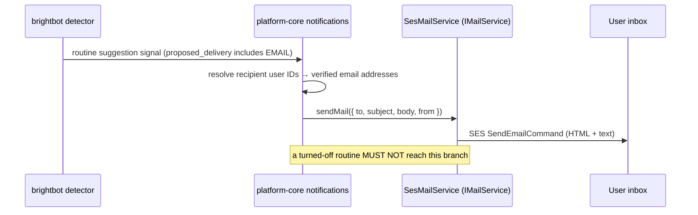

# SPEC: BrightRoutines — Email Delivery Channel

> Scope: add **email** as a first-class routine delivery channel alongside the
> existing WEBAPP and SLACK channels. Today a routine suggestion (and, later,
> a scheduled routine's result) can be delivered to the webapp inbox and to
> Slack; there is no way to reach a user who lives in neither. This spec adds
> `DeliveryHint.EMAIL`, the fan-out branch that renders and sends the email,
> and the recipient-address resolution — reusing the SES `IMailService` that
> already ships in platform-core.

**Terms.** The `RoutineSuggestion` DTO, its status lifecycle, the
`brightroutines-{env}` single-table layout, and the notification fan-out from
brightbot's detector through platform-core's `notifications` model are all
defined in `brightroutines-intent-loop.md` §3–§6 — this spec does not redefine
them. `DeliveryHint` is the enum on the `RoutineSuggestion`/intent DTOs
(`brightbot/brightbot/routines/dtos.py`) that today has members
`WEBAPP | SLACK | BOTH`. The one net-new term is **`DeliveryHint.EMAIL`** and
its composite forms.

## 1. Context

Routine suggestions and results fan out to two channels today. A user who
doesn't open the webapp and isn't in the Slack workspace never learns a
routine was offered or ran — the loop is invisible to them. Email is the
lowest-common-denominator reach: every BrightHive user has a verified email
(it's their Cognito identity). The delivery infrastructure already exists —
platform-core ships `SesMailService implements IMailService` (real
`@aws-sdk/client-ses`), currently used only for workspace-policy-confirmation
emails. What's missing is (a) a `DeliveryHint.EMAIL` the detector/classifier
can propose, (b) a fan-out branch in the notification path that renders a
routine email and calls `mailService.sendMail(...)`, and (c) recipient-address
resolution from the owner/recipient user IDs the suggestion already carries.

Cognito's own login/OTP/verification emails are unrelated and out of scope —
this is product notification email, sent by us through SES.



## 2. Interface Contract (MDE)

### 2.1 DTO — extend `DeliveryHint` (`brightbot/brightbot/routines/dtos.py`)

```python
class DeliveryHint(str, Enum):
    WEBAPP = "WEBAPP"
    SLACK = "SLACK"
    EMAIL = "EMAIL"          # net-new
    BOTH = "BOTH"            # retained: WEBAPP + SLACK (back-compat, unchanged meaning)
    ALL = "ALL"              # net-new: WEBAPP + SLACK + EMAIL
```

`BOTH` keeps its exact current meaning (WEBAPP + SLACK) so no existing row
changes behavior. `ALL` is the net-new "every channel" value. A bare `EMAIL`
means email-only.

### 2.2 Notification fan-out — email branch (`platform-core notifications`)

```
# Consumes the routine suggestion signal; when proposed_delivery includes EMAIL,
# renders and sends via the existing IMailService.
deliverRoutineEmail(input: {
  workspaceId: ID,
  routineSuggestionId: ID,
  recipientUserIds: [ID],       # already carried on the suggestion's ownership
  title: string,                # counts-only payload, matching Slack/webapp
}) -> { delivered: Boolean, skippedReason?: "no_verified_email" | "not_email_channel" }
```

### 2.3 Recipient resolution

```
# user IDs (owner + recipientUserIds, workspace-membership-validated) → addresses
resolveVerifiedEmails(userIds: [ID], workspaceId: ID) -> [EmailAddress]
```

Reuses the same membership validation the webapp/Slack fan-out already applies
(`brightroutines-intent-loop.md` §6, "validated to be workspace members before
delivery"). A user ID that resolves to no verified email is dropped with a
logged `no_verified_email`, never a crash.

## 3. Invariants (DbC)

- INV-1 `WHEN proposed_delivery does NOT include EMAIL, THE System SHALL NOT send any routine email.`
- INV-2 `WHEN a routine is turned off (SCHEDULED → OFFERED), THE System SHALL NOT send any further email for it` — mirrors the existing "off means off" guard (`brightroutines-your-routines-persistence.md` Property 2); email must not become a leak that outlives the toggle.
- INV-3 `EMAIL recipients are always a subset of workspace members` — no email to a non-member, ever (tenant-isolation, P0).
- INV-4 email body is **counts-only** — title + routine_suggestion_id + evidence counts, matching the Slack (`renderWorkflowSuggestionDetails`) and webapp payloads exactly; no raw prompt, no row-level data.
- INV-5 a per-address send failure is isolated — one bad address (bounce/SES reject) SHALL NOT abort delivery to the others.
- INV-6 `BOTH` means WEBAPP+SLACK and NOTHING else; only `EMAIL` or `ALL` trigger the email branch.

Budget: 6 invariants.

## 4. Acceptance Criteria (BDD — Gherkin)

```gherkin
Feature: Routine email delivery

  Scenario: Email-only suggestion reaches the owner's inbox
    Given a routine suggestion with proposed_delivery = EMAIL
    And the owner has a verified email and is a workspace member
    When the suggestion is offered
    Then exactly one email is sent to the owner's address
    And the body contains the routine title and no row-level data

  Scenario: ALL fans out to every channel
    Given a routine suggestion with proposed_delivery = ALL
    When the suggestion is offered
    Then a webapp inbox row, a Slack card, and an email are all produced

  Scenario: BOTH does not send email
    Given a routine suggestion with proposed_delivery = BOTH
    When the suggestion is offered
    Then a webapp row and a Slack card are produced
    And no email is sent

  Scenario: Turned-off routine stops emailing
    Given a scheduled routine with EMAIL delivery
    When the user turns it off
    Then no further email is sent for that routine

  Scenario: A recipient with no verified email is skipped, others still get it
    Given a suggestion targeting two recipients, one without a verified email
    When the suggestion is offered
    Then the recipient with an email receives it
    And the other is skipped with a logged no_verified_email
    And delivery does not error
```

Budget: 5 scenarios.

## 5. Out of Scope

- Email templating/branding beyond a plain counts-only HTML+text body (a
  richer template is a follow-up).
- User-facing per-channel notification **preferences** UI (choosing EMAIL in
  the webapp) — this spec adds the channel; the preference surface is separate.
- Digest/batching (one email per suggestion here; digests are future work).
- Cognito login/verification email — unrelated, unchanged.
- Scheduled routine **result** emails — this spec covers the suggestion-offer
  email; result delivery reuses the same branch but is ticketed separately.

## 6. Dependencies

- Existing SES `IMailService` (`platform-core src/service/mail/ses-mail-service.ts`) — reused, not rebuilt.
- `SETUP_EMAIL_ADDRESS` env (the verified SES `from` address) — already set for policy emails.
- Recipient-membership validation from `brightroutines-intent-loop.md` §6.
- SES sandbox status: staging SES must be out of sandbox (or recipients verified) to reach arbitrary member addresses — verify before rollout.

## 7. Correctness Properties

### Property 1: Email only when opted in
*For any* suggestion, an email is sent **iff** `proposed_delivery ∈ {EMAIL, ALL}`.
**Validates: §3 INV-1, INV-6, §4 "BOTH does not send email"**

### Property 2: Off means off, on email too
*For any* routine turned off, zero emails are sent after the off transition.
**Validates: §3 INV-2, §4 "Turned-off routine stops emailing"**

### Property 3: Recipients are always members
*For any* email sent, every `to` address belongs to a validated workspace member.
**Validates: §3 INV-3**

### Property 4: Partial-failure isolation
*For any* multi-recipient send, a single address failure never prevents the others' delivery.
**Validates: §3 INV-5, §4 "A recipient with no verified email is skipped"**

Budget: 4 properties.

## 8. Eval Criteria

Not LLM behavior — delivery is deterministic. §3 invariants + §4 scenarios
cover correctness. No evaluator entry.

## 9. Observability Contract

- **Log events**: `routine_email.started`, `routine_email.sent`,
  `routine_email.skipped_not_email_channel`, `routine_email.skipped_no_verified_email`,
  `routine_email.send_failure` (per-address, isolated).
- **Attributes**: `workspace_id`, `routine_suggestion_id`, `recipient_count`,
  `sent_count`, `skipped_count` — never the email address or any PII in logs.
- **Metrics**: `routine_email_sent_total`, `routine_email_failure_total`
  tagged `workspace_id`.

## 10. Test Coverage Update

### a. In-repo layered tests
- **L0** — the `deliverRoutineEmail` contract (§2.2): request/response shape, `skippedReason` codes.
- **L1** — fan-out routing: `EMAIL` and `ALL` reach the email branch; `BOTH`/`WEBAPP`/`SLACK` do not (one case per §4 routing scenario).
- **L2** — one case per §3 invariant observable from outside: off-means-off (INV-2), members-only (INV-3), partial-failure isolation (INV-5), counts-only body (INV-4). Uses the real `SesMailService` against a captured SES stub or SES sandbox — a real-behavior test, not a mocked `sendMail`.

### b. Cross-repo e2e (`brighthive-e2e`)
- One feature test: `EMAIL`-delivery suggestion → assert an email is dispatched (SES sandbox / captured send) end-to-end.
- One error-path: recipient with no verified email → skipped, others delivered, no error.

### Self-verification (before the implementation PR)
Run the layered suites + the e2e; confirm each §2/§3/§4 entry has a new case; SES send verified against a real (sandbox) SES call, not a mock.

## 11. PR Split

1. **brightbot** — extend `DeliveryHint` enum (`EMAIL`, `ALL`); classifier/detector may propose them; store round-trips them. (S)
2. **platform-core** — `deliverRoutineEmail` fan-out branch + `resolveVerifiedEmails`, wired to the existing `IMailService`; log events. (M)
3. **brighthive-e2e** — feature + error-path email-delivery tests. (S)

Ordered: 1 → 2 → 3. Each behind no feature flag change until 2 lands; email
fan-out is inert until a suggestion actually carries `EMAIL`/`ALL`.
