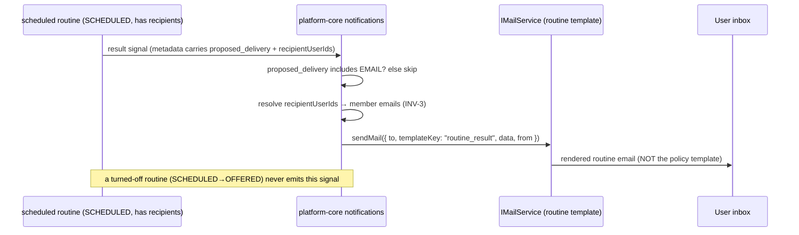

# SPEC: BrightRoutines — Email Delivery Channel

> Scope: add **email** as a routine delivery channel alongside the existing
> WEBAPP and SLACK channels, for the **scheduled-routine result** (not the
> offer — see §1.1 for why). This spec adds `DeliveryHint.EMAIL`, extends the
> signal payload so delivery intent + recipients actually cross the wire,
> parameterizes the mail port so a routine template isn't rendered through the
> policy-email template, and adds recipient-address resolution.

**Terms.** The `RoutineSuggestion` DTO, its status lifecycle, the
`brightroutines-{env}` single-table layout, and the notification fan-out from
brightbot's detector through platform-core's `notifications` model are all
defined in `brightroutines-intent-loop.md` §3–§6 — this spec does not redefine
them. `DeliveryHint` is the enum on the `RoutineSuggestion`/intent DTOs
(`brightbot/brightbot/routines/dtos.py`) that today has members
`WEBAPP | SLACK | BOTH`. The one net-new term is **`DeliveryHint.EMAIL`** and
its composite forms.

## 1. Context

Routine suggestions and results fan out to two channels today. A user who
doesn't open the webapp and isn't in the Slack workspace never learns a
routine ran — the loop is invisible to them. Email is the lowest-common-
denominator reach: every `UserNode` carries a non-null, unique `emailAddress`
in Neo4j (`typedefs.ts` — `emailAddress: EmailAddress! @unique`).

**What must be built (three real gaps, none of them "just wiring"):**

1. **A routine email template.** `IMailService` is bound to
   `SendgridMailService` (`inversify.config.ts` → `.to(SendgridMailService)`),
   whose `sendMail` is hardcoded to the policy-confirmation SendGrid template
   `d-e5b52ec0…` (it maps `subject → workspace_name`, `body → policy_body`).
   Sending a routine email through it verbatim renders as a *policy* email.
   The port must be parameterized with a template selector (and a routine
   template added), OR a second mail path stood up. `SesMailService` exists in
   the tree but is **not bound** — choosing it means an explicit re-bind + SES
   provisioning, not "reuse."
2. **Delivery intent + recipients on the wire.** `build_routine_suggestion_signal`
   (`signal_publisher.py`) emits metadata of exactly `{title,
   routine_suggestion_id}` — `proposed_delivery` and recipients are dropped.
   The email branch has nothing to key on today.
3. **The recipient set only exists at schedule time.** At OFFER, a suggestion
   has no owner/recipients (`decodeOwnership` returns null pre-schedule); they
   are set when the user schedules. So email attaches to the **scheduled-
   routine result**, where ownership + `recipientUserIds` exist — not the offer.

Cognito's own login/OTP/verification emails are unrelated and out of scope —
this is product notification email.

### 1.1 Why result, not offer

The offer email was the original scope; it's dropped because an OFFERED
suggestion has no recipients to send to (they don't exist until schedule) and
no per-suggestion suppression on the notification path — an offer email would
have no honest "off means off" story. The scheduled-result email attaches to a
routine the user explicitly turned on, whose ownership + recipient list are
recorded, and whose SCHEDULED→OFFERED turn-off is the natural suppression gate.



## 2. Interface Contract (MDE)

### 2.1 DTO — extend `DeliveryHint` (`brightbot/brightbot/routines/dtos.py`)

```python
class DeliveryHint(str, Enum):
    WEBAPP = "WEBAPP"
    SLACK = "SLACK"
    EMAIL = "EMAIL"          # net-new
    BOTH = "BOTH"            # retained: WEBAPP + SLACK (back-compat, unchanged meaning)
    ALL = "ALL"              # net-new: WEBAPP + SLACK + EMAIL
```

`BOTH` keeps its exact current meaning (WEBAPP + SLACK) so no existing row
changes behavior. `ALL` is the net-new "every channel" value. A bare `EMAIL`
means email-only.

### 2.2 Signal payload extension (`brightbot` — PR-1)

`build_routine_suggestion_signal` (and the result-signal equivalent) must add
the two fields the email branch keys on. Counts-only still holds — these are
routing metadata, not row data:

```python
# signal_publisher.py — metadata gains:
{
  "title": suggestion.title,
  "routine_suggestion_id": suggestion.routine_suggestion_id,
  "proposed_delivery": suggestion.proposed_delivery.value,   # net-new on the wire
  "recipient_user_ids": suggestion.recipient_user_ids,       # net-new; scheduled → non-empty
}
```

### 2.3 Mail port parameterization (`platform-core` — PR-2)

`IMailService.sendMail` today takes `{to, subject, body, from}` and the bound
`SendgridMailService` forces the policy template. Extend the port to select a
template so a routine email doesn't render as a policy email:

```
sendMail({ to, from, templateKey: "policy" | "routine_result", data: object }) -> Result
```

`policy` preserves the existing behavior byte-for-byte (back-compat). The
adapter maps `routine_result` → a new SendGrid dynamic template (or, if SES is
chosen instead, an explicit re-bind + SES provisioning — decide in §6).

### 2.4 Notification fan-out — email branch (`platform-core` — PR-2)

```
# Consumes the result signal; only when proposed_delivery ∈ {EMAIL, ALL}.
deliverRoutineEmail(input: {
  workspaceId: ID,
  routineSuggestionId: ID,
  recipientUserIds: [ID],       # from the signal (2.2), set at schedule time
  title: string,                # counts-only, matching Slack/webapp
}) -> { delivered: Boolean, skippedReason?: "no_verified_email" | "not_email_channel" | "no_recipients" }
```

### 2.5 Recipient resolution

```
# member-validated user IDs → addresses
resolveVerifiedEmails(userIds: [ID], workspaceId: ID) -> [EmailAddress]
```

Reuses `filterRecipientsToWorkspaceMembers` (already in `routine-suggestion.ts`)
for INV-3, then reads each member's `UserNode.emailAddress` (non-null in Neo4j).
An empty resolved set → `no_recipients`, logged, never a crash. "Verified" here
means present+unique in Neo4j — SES/SendGrid deliverability is a §6 concern, not
an identity guarantee.

## 3. Invariants (DbC)

- INV-1 `WHEN proposed_delivery does NOT include EMAIL, THE System SHALL NOT send any routine email.`
- INV-2 `WHEN a routine is turned off (SCHEDULED → OFFERED), THE System SHALL NOT emit a result signal for it` — enforced upstream: only a SCHEDULED routine's run emits the result signal, so turn-off (which flips it to OFFERED and deletes the cron) removes the only source. Mirrors the "off means off" guard (`brightroutines-your-routines-persistence.md` Property 2). This is why email attaches to the result, not the offer (§1.1): the offer has no such gate.
- INV-3 `EMAIL recipients are always a subset of workspace members` — no email to a non-member, ever (tenant-isolation, P0).
- INV-4 email body is **counts-only** — title + routine_suggestion_id + evidence counts, matching the Slack (`renderWorkflowSuggestionDetails`) and webapp payloads exactly; no raw prompt, no row-level data.
- INV-5 a per-address send failure is isolated — one bad address (bounce/SES reject) SHALL NOT abort delivery to the others.
- INV-6 `BOTH` means WEBAPP+SLACK and NOTHING else; only `EMAIL` or `ALL` trigger the email branch.

Budget: 6 invariants.

## 4. Acceptance Criteria (BDD — Gherkin)

```gherkin
Feature: Routine email delivery (scheduled-routine result)

  Scenario: Email-only scheduled routine result reaches its recipients
    Given a SCHEDULED routine with proposed_delivery = EMAIL
    And each recipient has an emailAddress and is a workspace member
    When the routine runs and produces a result
    Then exactly one email per recipient is sent
    And it renders via the routine_result template, not the policy template
    And the body contains the routine title and no row-level data

  Scenario: ALL fans out to every channel
    Given a SCHEDULED routine with proposed_delivery = ALL
    When the routine runs
    Then a webapp inbox row, a Slack card, and an email are all produced

  Scenario: BOTH does not send email
    Given a SCHEDULED routine with proposed_delivery = BOTH
    When the routine runs
    Then a webapp row and a Slack card are produced
    And no email is sent

  Scenario: Turned-off routine stops emailing
    Given a SCHEDULED routine with EMAIL delivery
    When the user turns it off (SCHEDULED → OFFERED, cron deleted)
    Then it no longer runs, so no result signal and no email are emitted

  Scenario: A recipient with no email is skipped, others still get it
    Given a run targeting two recipients, one with no resolvable emailAddress
    When the routine runs
    Then the recipient with an address receives it
    And the other is skipped with a logged no_verified_email
    And delivery does not error
```

Budget: 5 scenarios.

## 5. Out of Scope

- Rich HTML branding beyond the counts-only routine_result template (follow-up).
- User-facing per-channel notification **preferences** UI (choosing EMAIL in
  the webapp) — this spec adds the channel; the preference surface is separate.
- Digest/batching (one email per run here; digests are future work).
- Cognito login/verification email — unrelated, unchanged.
- **The offer email** — dropped by design (§1.1): no recipients at OFFER, no
  suppression gate. Only the scheduled-result email is in scope.

## 6. Dependencies

- **Mail-provider decision (blocking §2.3)**: `IMailService` is bound to
  `SendgridMailService` (policy template locked). Either (a) add a SendGrid
  `routine_result` dynamic template + parameterize the port, or (b) re-bind
  `SesMailService` and provision SES. This spec assumes (a) unless a follow-up
  ADR chooses (b) — the choice gates §2.3 and the sandbox question below.
- `SETUP_EMAIL_ADDRESS` env (the `from` address) — already set for policy email.
- Recipient-membership validation via `filterRecipientsToWorkspaceMembers`
  (`routine-suggestion.ts`) + `UserNode.emailAddress` (Neo4j, non-null/unique).
- The result-signal path (a SCHEDULED routine's run publishing a result signal)
  must exist and carry the §2.2 fields. If result signals aren't emitted yet,
  that is a prerequisite, not part of this spec.
- **Deliverability** (only if SES is chosen in (b)): staging SES sandbox status
  must be checked (`aws sesv2 get-account`) — out-of-sandbox or per-recipient
  verified before rollout. Moot under (a) SendGrid.

## 7. Correctness Properties

### Property 1: Email only when opted in
*For any* suggestion, an email is sent **iff** `proposed_delivery ∈ {EMAIL, ALL}`.
**Validates: §3 INV-1, INV-6, §4 "BOTH does not send email"**

### Property 2: Off means off, on email too
*For any* routine turned off, zero emails are sent after the off transition.
**Validates: §3 INV-2, §4 "Turned-off routine stops emailing"**

### Property 3: Recipients are always members
*For any* email sent, every `to` address belongs to a validated workspace member.
**Validates: §3 INV-3**

### Property 4: Partial-failure isolation
*For any* multi-recipient send, a single address failure never prevents the others' delivery.
**Validates: §3 INV-5, §4 "A recipient with no verified email is skipped"**

Budget: 4 properties.

## 8. Eval Criteria

Not LLM behavior — delivery is deterministic. §3 invariants + §4 scenarios
cover correctness. No evaluator entry.

## 9. Observability Contract

- **Log events**: `routine_email.started`, `routine_email.sent`,
  `routine_email.skipped_not_email_channel`, `routine_email.skipped_no_verified_email`,
  `routine_email.send_failure` (per-address, isolated).
- **Attributes**: `workspace_id`, `routine_suggestion_id`, `recipient_count`,
  `sent_count`, `skipped_count` — never the email address or any PII in logs.
- **Metrics**: `routine_email_sent_total`, `routine_email_failure_total`
  tagged `workspace_id`.

## 10. Test Coverage Update

### a. In-repo layered tests
- **L0** — the `deliverRoutineEmail` contract (§2.4): request/response shape, `skippedReason` codes incl. `no_recipients`.
- **L1** — fan-out routing: `EMAIL` and `ALL` reach the email branch; `BOTH`/`WEBAPP`/`SLACK` do not (one case per §4 routing scenario).
- **L2** — one case per §3 invariant observable from outside: members-only (INV-3), partial-failure isolation (INV-5), counts-only body (INV-4), template-is-routine-not-policy (§1 gap 1). INV-2 (off means off) is verified at the signal source — assert a turned-off routine emits no result signal.
- **Real-behavior**: exercise the *bound* mail adapter (`SendgridMailService` with the new `routine_result` templateKey) against a captured send — NOT a mocked `sendMail`, and NOT `SesMailService` (which isn't bound). Per `test-behavior-real.md`, test the adapter production actually uses.

### b. Cross-repo e2e (`brighthive-e2e`)
- One feature test: a SCHEDULED `EMAIL`-delivery routine run → assert an email is dispatched (captured send) end-to-end.
- One error-path: a recipient with no resolvable address → skipped, others delivered, no error.

### Self-verification (before the implementation PR)
Run the layered suites + the e2e; confirm each §2/§3/§4 entry has a new case; the send verified against the real bound provider (captured), not a mock.

## 11. PR Split

1. **brightbot** — (a) extend `DeliveryHint` enum (`EMAIL`, `ALL`); classifier/detector may propose them; store round-trips them. (b) **Extend the signal payload** (§2.2) so `proposed_delivery` + `recipient_user_ids` cross the wire — without this, PR-2 has nothing to key on. (S–M)
2. **platform-core** — (a) **parameterize `IMailService`** with `templateKey` + add the `routine_result` template (§2.3); `policy` path unchanged. (b) `deliverRoutineEmail` fan-out branch on the result signal + `resolveVerifiedEmails`; log events. (M)
3. **brighthive-e2e** — feature + error-path email-delivery tests. (S)

Ordered strictly 1 → 2 → 3: PR-2's branch can't be wired until PR-1 puts
delivery intent + recipients on the wire, and can't render correctly until the
template is parameterized. Email fan-out stays inert until a scheduled routine
actually carries `EMAIL`/`ALL`. **Blocking decision before PR-2**: SendGrid
template (default) vs SES re-bind — see §6.
