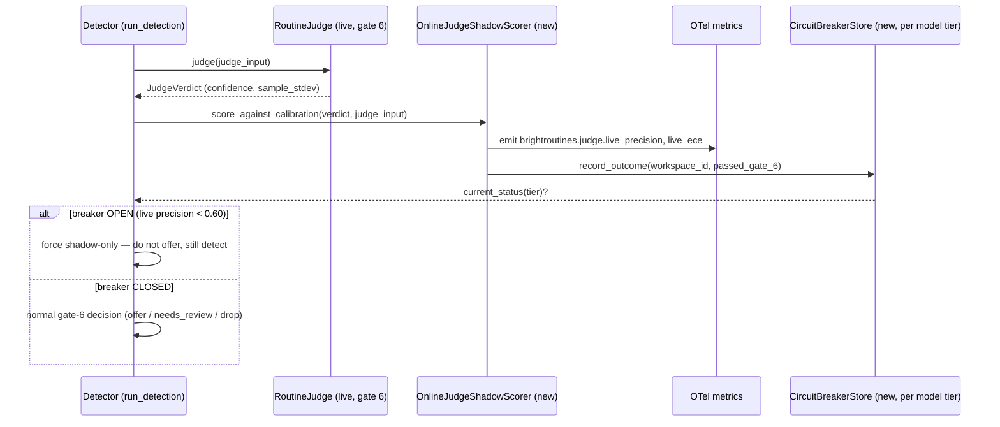

# BrightRoutines online judge eval + live circuit breaker

> Binds `brightroutines-intent-loop.md` §11's named-but-unimplemented circuit breaker to a
> concrete live-precision metric, a CLOSED/OPEN state machine, and a canary-cohort rollout path
> for judge-model swaps. Full contract: `~/.claude/rules/spec-driven.md`.

## Contents

1. [Context](#1-context)
2. [Interface Contract (MDE)](#2-interface-contract-mde)
3. [Invariants (DbC)](#3-invariants-dbc)
4. [Acceptance Criteria (BDD — Gherkin)](#4-acceptance-criteria-bdd--gherkin)
5. [Out of Scope](#5-out-of-scope)
6. [Dependencies](#6-dependencies)
7. [Correctness Properties](#7-correctness-properties)
8. [Eval Criteria](#8-eval-criteria)
9. [Observability Contract](#9-observability-contract)
10. [Test Coverage Update](#10-test-coverage-update)
- [Glossary](#glossary)
- [Areas Involved](#areas-involved)
- [Ticket Breakdown](#ticket-breakdown)
- [Related](#related)

## Glossary

- **Gate 6**: the judge-confidence check in `run_detection`'s gate pipeline (`detector.py`) — the
  step this spec's breaker sits downstream of.
- **Model tier**: the judge model identity (`BRIGHTROUTINES_JUDGE_MODEL`) that breaker state is
  scoped by — fleet-wide per tier, not per workspace (see INV-5).
- **Canary cohort**: the subset of workspaces flagged to route to a new judge-model tier before a
  fleet-wide flip, implemented via the existing per-workspace `is_feature_enabled()` primitive.
- **Proxy label**: a delayed, indirect signal of offer quality (dismiss rate, schedule rate,
  `NEEDS_REVIEW` disposition) used in place of ground truth, which is unavailable at detection
  time (see Hard Limitations).
- **ECE (Expected Calibration Error)**: how far a model's stated confidence diverges from its
  actual accuracy, bucketed by confidence — reported here, not gated (Hard Limitations).
- **Shadow-only**: the breaker-OPEN state where `run_detection` keeps persisting
  `RecurringAutomationPattern` rows (detection continues) but stops emitting `RoutineSuggestion`
  offers.

## 1. Context

BrightRoutines' spec §11 names a circuit breaker ("if live precision falls below 0.60, stop
surfacing offers and keep shadow detection only") but nothing implements it. BH-888/BH-944
built the *offline* eval — a labeled 60-case corpus, batch precision/recall/Brier/ECE, gating
promotion P2→P3. That answers "was the judge good on a fixed corpus." It does not answer "is
the judge good *right now*, on live traffic" — the question the P3→P4 circuit breaker and the
team's stated top eval tier (in-flight/online evals for self-healing) require. Once offers go
live (P3), there is no shadow-scored second opinion, no canary cohort, no drift trip — a judge
that degrades after promotion (model swap, prompt drift, distribution shift in real workspaces)
has no automated signal until a human notices bad offers.



### Use Case / Goal

An operator (or an automated alert) can answer "is the live judge still trustworthy?" without
waiting for a human to notice a bad offer. When live precision genuinely degrades, the system
auto-flips to shadow-only (offers stop, detection keeps running) instead of silently degrading
suggestion quality for every workspace indefinitely. A canary rollout option lets a judge model
swap (e.g. Sonnet → a fine-tuned Bedrock model) prove itself on N% of workspaces before a
fleet-wide flip.

### How It Works Today

- **Offline eval** (BH-944/BH-888): `brightbot/evals/routines/judge_evaluator.py`'s
  `evaluate_judge_against_corpus()` runs the injected `RoutineJudge` against
  `judge_corpus.jsonl` (60 labeled cases), producing a `JudgeCalibrationReport` with precision,
  recall, F1, Brier, ECE. `JudgeCalibrationReport.passes_shadow_promotion_gate()` gates P2→P3.
  This only runs offline, gated by `BH_RUN_LIVE_EVALS=1`, against a static corpus — it never
  touches production `run_detection()` traffic.
- **Live judge** (BH-884/BH-956/BH-961): `LLMRoutineJudge.judge()`
  (`brightbot/routines/judge.py`) samples `DEFAULT_SAMPLES=3` calls, returns median confidence +
  `sample_stdev` (BH-961), emitted on the `brightroutines.judge.evaluate` OTel span.
  `detector.py`'s gate 6 compares the verdict against `MIN_JUDGE_CONFIDENCE` (0.70, env-var
  `BRIGHTROUTINES_MIN_JUDGE_CONFIDENCE`), with a `judge_verdict_is_ambiguous()` check (BH-961)
  routing high-variance/near-threshold verdicts to a new `NEEDS_REVIEW`
  `RecurringAutomationPattern` status instead of a binary offer/drop.
- **Per-workspace feature flags**: `brightbot/utils/feature_flags.py`'s
  `is_feature_enabled(feature, workspace_id=...)` already supports per-workspace gating (used
  today for capture middleware's global-on/per-workspace-opt-out split, BH-973) — a reusable
  seam for a canary cohort.
- **run_detection** (`brightbot/routines/detector.py`) already takes an optional injected
  `score_store: RoutineScoreStore | None` (BH-950) that no-ops when absent — the established
  pattern for adding an optional cross-cutting concern without breaking existing callers.

### Hard Limitations

- The live judge's own self-reported confidence is not a calibrated probability (BH-956: ECE
  ~0.46 at the 0.70 operating point on the offline corpus) — a *live* ECE reading inherits the
  same property. Any live metric based on raw confidence must be read as a classification
  signal, not a probability, exactly as the offline gate already treats it.
- There is no ground truth at detection time. Precision needs a *label* — "was this offer
  actually good" — which the live pipeline cannot know synchronously. Live precision can only
  be computed retrospectively, once a proxy signal exists (schedule rate, dismiss rate, an
  admin's `NEEDS_REVIEW` disposition, or a delayed human label).
- `run_detection` runs per-workspace, once per nightly cron per workspace (pre-BH-943 fan-out).
  There is no cross-workspace aggregation point today — a circuit breaker computed per-workspace
  from a single nightly run has very low statistical power (bulk of workspaces produce 0-1
  candidate groups per run).

### Gaps

- No mechanism computes a live precision/ECE metric from real `run_detection` traffic.
- No mechanism persists a "frozen calibration operating point" to compare live verdicts against
  (the offline eval's threshold is a constant, not a frozen snapshot that live scoring reads).
- No circuit-breaker state machine (CLOSED → OPEN → back to CLOSED) exists anywhere in
  `brightbot/routines/`.
- No canary-cohort mechanism for judge-model rollout exists (only the feature-flag primitive
  that could implement one).
- §11's own text names the breaker; the spec has never been revised to bind it to a concrete
  metric name, which is what BH-957's own AC calls for.

## 2. Interface Contract (MDE)

```python
# brightbot/routines/online_eval.py (new module)

class CircuitBreakerStatus(str, Enum):
    CLOSED = "CLOSED"    # judge trusted, offers surface normally
    OPEN = "OPEN"        # judge untrusted, shadow-only (no offers, detection continues)

@dataclass(frozen=True, slots=True)
class LiveJudgeOutcome:
    """One gate-6 verdict's classification against the frozen calibration point."""
    workspace_id: str
    passed_gate_6: bool          # verdict.confidence >= MIN_JUDGE_CONFIDENCE
    confidence: float
    sample_stdev: float
    observed_at: datetime

class CircuitBreakerStore(Protocol):
    """Persists per-model-tier breaker state + rolling outcome window."""
    async def record_outcome(self, outcome: LiveJudgeOutcome) -> None: ...
    async def current_status(self, *, tier: str) -> CircuitBreakerStatus: ...
    async def live_precision(self, *, tier: str, window_days: int = 7) -> float | None: ...

class OnlineJudgeShadowScorer:
    """Scores a live JudgeVerdict against the frozen calibration point, emits
    live_precision/live_ece, and records the outcome on the CircuitBreakerStore."""
    async def score_against_calibration(
        self, *, verdict: "JudgeVerdict", judge_input: "JudgeInput"
    ) -> LiveJudgeOutcome: ...

# detector.py — new optional param on run_detection, same no-op-when-absent
# pattern as score_store (BH-950):
async def run_detection(
    *,
    workspace_id: str,
    ...,
    circuit_breaker: CircuitBreakerStore | None = None,
) -> list[RoutineSuggestion]: ...
```

```text
# New OTel metrics (brightroutines.judge.* namespace, extends BH-945's span contract)
brightroutines.judge.live_precision   (gauge, tagged workspace_id, model_tier)
brightroutines.judge.live_ece         (gauge, tagged workspace_id, model_tier, reported not gated)
brightroutines.circuit_breaker.status (gauge: 0=CLOSED, 1=OPEN, tagged model_tier)
```

## 3. Invariants (DbC)

- INV-1: WHEN `circuit_breaker` is `None`, THE System SHALL behave identically to pre-BH-957
  `run_detection` (no live scoring, no breaker check) — back-compat for every existing caller.
- INV-2: WHILE the breaker is OPEN for a model tier, THE System SHALL NOT append any
  `RoutineSuggestion` to `offered` for that tier's workspaces, but SHALL still run gates 1-8 and
  persist `RecurringAutomationPattern` rows (shadow detection continues).
- INV-3: THE System SHALL NEVER flip OPEN→CLOSED or CLOSED→OPEN on a single outcome — the
  breaker's `current_status()` reads a rolling window (`ABSOLUTE_MIN_EVALUATED_FLOOR`-equivalent
  floor before any status other than CLOSED is possible), mirroring the offline gate's existing
  statistical-power floor (BH-884 self-review M8).
- INV-4: THE System SHALL compute live precision from a proxy label (dismiss-within-N-days rate,
  or `NEEDS_REVIEW`→human-disposition, or schedule rate), NEVER from the judge's own
  self-reported confidence alone — confidence is not ground truth (Hard Limitations).
- INV-5: THE System SHALL scope breaker state by model tier (`BRIGHTROUTINES_JUDGE_MODEL`), not
  by workspace, given the per-workspace statistical-power gap (Hard Limitations) — canary cohort
  is the per-workspace dimension (§ Interface), breaker status is fleet-wide per tier.
- INV-6: IF the canary cohort feature flag is unset for a workspace, THE System SHALL fall back
  to the existing (non-canary) judge model — no workspace loses service because of a
  misconfigured or absent flag.

## 4. Acceptance Criteria (BDD — Gherkin)

```gherkin
Feature: Online judge eval + circuit breaker

  Scenario: Healthy judge — offers surface normally
    Given the circuit breaker for the active model tier is CLOSED
    And a candidate clears gates 1-5, 7-8, and gate 6 passes cleanly
    When run_detection evaluates the candidate
    Then a RoutineSuggestion is offered exactly as it would be without the breaker wired

  Scenario: Simulated low live precision opens the breaker
    Given a rolling window of outcomes yields live precision < 0.60
    And the window has at least the statistical-power floor of evaluated outcomes
    When current_status() is queried for that model tier
    Then it returns OPEN

  Scenario: Open breaker suppresses offers, not detection
    Given the circuit breaker for the active model tier is OPEN
    And a candidate clears every gate including gate 6
    When run_detection evaluates the candidate
    Then no RoutineSuggestion is offered
    And a RecurringAutomationPattern is still persisted (shadow detection unaffected)

  Scenario: Below the statistical-power floor, breaker never opens
    Given fewer outcomes than the floor have been recorded this window
    When current_status() is queried
    Then it returns CLOSED regardless of the outcomes' pass rate

  Scenario: No circuit_breaker injected — pre-BH-957 behavior preserved
    Given run_detection is called without a circuit_breaker argument
    When a candidate clears every gate
    Then a RoutineSuggestion is offered — identical to current production behavior

  Scenario: Canary cohort — a new judge model tier only scores live for flagged workspaces
    Given a workspace has the canary feature flag enabled for model tier "haiku-v2"
    And a workspace without the flag defaults to the existing tier
    When run_detection runs for both workspaces
    Then only the flagged workspace's gate-6 outcome is recorded against "haiku-v2"'s breaker state
    And the unflagged workspace's outcome is recorded against the existing tier's breaker state
```

## 5. Out of Scope

- Real-time (sub-nightly) breaker evaluation — this spec scores at the same cadence
  `run_detection` already runs (nightly per workspace, or per BH-943's future fan-out).
- Automatic model rollback (reverting `BRIGHTROUTINES_JUDGE_MODEL` env var) — the breaker
  suppresses offers, it does not change which model is called. A human decides whether to also
  swap models.
- A UI/dashboard for breaker status — OTel metrics are the interface; visualization is a
  separate, later ticket if wanted.
- Retroactively re-scoring historical `RecurringAutomationPattern` rows — this spec only scores
  outcomes going forward from when it ships.
- BH-943's SQS fan-out redesign — this spec assumes the current per-workspace EventBridge
  scheduling model; if BH-943 lands first, the breaker's per-tier aggregation is unaffected
  (it's already fleet-wide, not per-workspace-schedule).

## 6. Dependencies

| Dependency | Type | Status |
|------------|------|--------|
| BH-944 (labeled corpus + offline eval) | Non-blocking | Ready (Done — corpus exists, 60 cases) |
| BH-961 (judge sample variance + NEEDS_REVIEW) | Non-blocking | Ready (Done — `sample_stdev` and `judge_sample_stdev` already available as an input signal) |
| BH-950 (W/P/U scoring, `RoutineScoreStore` injection pattern) | Non-blocking | Ready (Done — precedent for the `run_detection` optional-injection pattern this spec follows) |
| Proxy-label source (dismiss rate / schedule rate per BH-885/886, or NEEDS_REVIEW disposition per BH-961) | Blocking for INV-4 | Partially ready — dismiss/schedule routes exist; NEEDS_REVIEW disposition UI does not (tracked separately) |
| `brightbot/utils/feature_flags.py` per-workspace flag | Non-blocking | Ready (existing primitive, reused for canary cohort) |

## 7. Correctness Properties

### Property 1: Shadow detection is never blocked by the breaker

*For any* candidate group and any circuit breaker status (OPEN or CLOSED), gates 1-8 evaluate
identically and a `RecurringAutomationPattern` row persists whenever the candidate would have
persisted one without the breaker — only the final `RoutineSuggestion` offer step is gated by
breaker status.

**Validates: §3 Invariant 2, §4 Scenario "Open breaker suppresses offers, not detection"**

### Property 2: No flip without statistical power

*For any* rolling outcome window smaller than the statistical-power floor, `current_status()`
returns CLOSED regardless of the pass/fail ratio in that window.

**Validates: §3 Invariant 3, §4 Scenario "Below the statistical-power floor, breaker never opens"**

### Property 3: Backward compatibility with no injected breaker

*For any* call to `run_detection` that omits `circuit_breaker`, the resulting `offered` list is
identical to the same call made before this spec's changes land.

**Validates: §3 Invariant 1, §4 Scenario "No circuit_breaker injected"**

## 8. Eval Criteria

| Evaluator | Node | Mode | Threshold | Method |
|---|---|---|---|---|
| LiveJudgePrecisionEvaluator | `run_detection` gate 6 (post-hoc, via proxy label) | OBSERVE | report only; breaker OPEN trip is the enforcement, not this evaluator | Deterministic (proxy-label agreement rate over rolling window) |
| CircuitBreakerStateEvaluator | `CircuitBreakerStore.current_status` | GATE | breaker must return CLOSED under the healthy-judge scenario fixture | Deterministic |

## 9. Observability Contract

- **Span**: extends the existing `brightroutines.detect.candidate` span (no new span) with a
  new attribute `brightroutines.circuit_breaker.status` (`CLOSED`/`OPEN`) and, when OPEN,
  `brightroutines.candidate.decision` gains a new value `"suppressed_by_circuit_breaker"`
  (alongside the existing `offered`/`gate_failed`/`needs_review`/`skipped_cooldown`).
- **Attributes**: `workspace_id`, `brightroutines.judge.tier` (already emitted per BH-884),
  `brightroutines.circuit_breaker.status`.
- **Log events**: `brightroutines.circuit_breaker.opened` (WARNING level, fired once per
  CLOSED→OPEN transition, not per suppressed candidate — avoids log-spam on a fleet-wide flip),
  `brightroutines.circuit_breaker.closed` (INFO, fired on recovery).
- **Metrics**: `brightroutines.judge.live_precision` (gauge), `brightroutines.judge.live_ece`
  (gauge, reported per Hard Limitations — not gated), `brightroutines.circuit_breaker.status`
  (gauge, 0/1, tagged `model_tier`).

## 10. Test Coverage Update

| Repo | Suite | What to add |
|---|---|---|
| `brightbot` | `tests/unit/routines/test_online_eval.py` (new) — L0/L1/L2 per `brightbot/CLAUDE.md` | L0: `CircuitBreakerStatus` enum shape, `LiveJudgeOutcome` frozen-dataclass shape. L1: `run_detection` routes to `offered` vs `suppressed_by_circuit_breaker` decision correctly based on injected fake `CircuitBreakerStore`. L2: one case per §4 Gherkin scenario (6 scenarios → 6 test functions minimum), one case per §3 invariant, `InMemoryCircuitBreakerStore` fake with a documented failure-injection mode (timeout/error) per `pluggable-scalable.md` PS-10. |
| `brightbot` | `tests/integration/routines/test_online_eval_localstack.py` (new) | Real-behavior case per `test-behavior-real.md`: a `DynamoDbCircuitBreakerStore` (if persisted to DynamoDB, mirroring `RoutineScoreStore`'s adapter pattern) round-trips a real outcome write + `current_status()` read against real LocalStack DynamoDB — not just the in-memory fake. |
| `brighthive-e2e` | `e2e/features/scheduler/` | One feature test: seed enough proxy-label outcomes to trip the breaker (or use a test-only override), trigger `run_detection` via the existing manual-run path, confirm no suggestion offers while patterns keep persisting. |

**Real-behavior requirement**: the LocalStack DynamoDB round-trip test above satisfies this row —
an in-memory-only test suite would not.

Before opening the implementation PR: run `tests/unit/routines/test_online_eval.py`,
`tests/integration/routines/test_online_eval_localstack.py`, and the new e2e feature test; all
green; confirm every §2/§3/§4/§8 entry has a corresponding case.

## Areas Involved

| Area | Repo | Impact |
|------|------|--------|
| Signal detection / judge | `brightbot` | New `online_eval.py` module (`CircuitBreakerStore` Protocol + adapters), `run_detection` gains optional `circuit_breaker` param, new OTel metrics/log events |
| Spec | `agentic-project-mgmt` | This spec; §11 revision in `brightroutines-intent-loop.md` binding the breaker to the concrete metric name once implemented |
| E2E | `brighthive-e2e` | New feature test exercising the breaker via the existing manual-run scheduler path |

## Ticket Breakdown

| Ticket | Summary | Points | Epic |
|--------|---------|--------|------|
| — | Add `CircuitBreakerStore` Protocol + `InMemoryCircuitBreakerStore` fake + `LiveJudgeOutcome`/`CircuitBreakerStatus` DTOs | 3 | BH-876 |
| — | Wire `run_detection`'s optional `circuit_breaker` param — gate the offer step, preserve shadow detection, back-compat when absent | 3 | BH-876 |
| — | Add live-precision computation from a proxy label (dismiss rate first, since BH-885/886 routes already exist) + statistical-power floor | 5 | BH-876 |
| — | `DynamoDbCircuitBreakerStore` adapter + real-behavior LocalStack test | 3 | BH-876 |
| — | OTel metrics/log events (`live_precision`, `live_ece`, `circuit_breaker.status`, open/close log events) | 2 | BH-876 |
| — | Canary-cohort wiring via existing `is_feature_enabled(workspace_id=...)` for judge-model-tier selection | 3 | BH-876 |
| — | brighthive-e2e feature test for the breaker via the manual-run path | 2 | BH-876 |
| — | §11 spec revision binding the breaker to the concrete metric name + this spec's design | 1 | BH-876 |

**Total: 22 points, 8 tickets.**

## Related

- **Spec**: `docs/specs/brightroutines-intent-loop.md` §11 (Evals And Metrics) — this spec
  extends it; §11 gets revised once implementation lands to bind the breaker to
  `brightroutines.judge.live_precision` by name.
- **Feature doc**: `docs/features/brightroutines-online-eval.md` (create after shipping)
