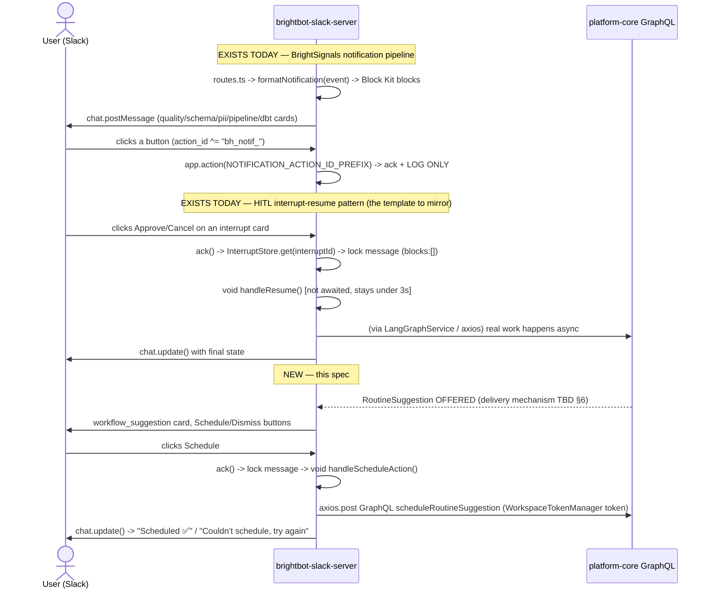

# SPEC: BrightRoutines — Slack Suggestion Cards (BH-887)

> Scope: deliver the "we noticed you keep asking for X — want to schedule it?"
> offer card **into Slack**, with real Schedule/Dismiss buttons that call
> platform-core. Today this surface exists only in the webapp
> (`routineSuggestionsForWorkspace` / `scheduleRoutineSuggestion` /
> `dismissRoutineSuggestion`, all live on staging). This spec closes the gap a
> live e2e simulation surfaced: **zero code, zero commits, zero branches** for
> a Slack suggestion card exist in `brightbot-slack-server` today.

## 1. Context

**Problem.** BrightRoutines detects recurring work and offers to schedule it
(webapp: `/context/workflows`). Users who live in Slack never see the offer —
they'd have to remember to check the webapp. The original epic scoped Slack
delivery as BH-887; it was never built.

**Why now.** The rest of the epic (capture → detect → judge → offer →
schedule/dismiss/unschedule) is verified live on staging (BH-975/976/977/978).
Slack is the last surface. A live user-simulation this session confirmed the
gap directly by inspecting `brightbot-slack-server`: no `workflow_suggestion`
stage, no Block Kit Schedule/Dismiss buttons, no branch, no PR.

**What already exists and must be reused, not rebuilt** (verified by direct
code inspection, not assumption):



## 2. Interface Contract (MDE)

### 2.1 New `NotificationStage`: `workflow_suggestion`

```typescript
// src/notifications/types.ts — add to the NotificationStage union (§5 gap #1)
// and to the runtime NOTIFICATION_STAGES mirror (§5 gap #2 — the two MUST
// stay in sync; there is no compile-time enforcement, per formatter.ts's own
// comment on the existing array).
type NotificationStage = /* ... existing stages ... */ | "workflow_suggestion";
```

**`NotificationEvent.metadata` shape for this stage** (mirrors the BH-948
contract snapshot already used by brighthive-e2e/brightbot — do not invent a
new shape):
```typescript
interface WorkflowSuggestionMetadata {
  routine_suggestion_id: string;
  workspace_id: string;
  title: string;
  description: string;
  proposed_cadence: "DAILY" | "WEEKLY" | "BIWEEKLY" | "MONTHLY" | "QUARTERLY";
  proposed_delivery: string;
  evidence_summary: {
    signal_count: number;
    distinct_user_count: number;
    window_start: string;
    window_end: string;
  };
  // Counts-only (§3 Invariant 1) — never raw prompt text, never user names
  // beyond what evidence_summary already exposes.
}
```

### 2.2 Block Kit — `STAGE_ACTIONS["workflow_suggestion"]`

```typescript
// src/notifications/blocks.ts — new entry, same ActionDefinition[] shape
// every other stage uses (quality_checks, pii_detected, etc.)
STAGE_ACTIONS.workflow_suggestion = [
  { actionId: "bh_notif_routine_schedule", label: "Schedule" },
  { actionId: "bh_notif_routine_dismiss", label: "Dismiss" },
];
```

The `value` payload already carries `{ event_id, msg_id, stage }`
(blocks.ts:105-118, unchanged shared code) — extend it for this stage only to
also carry `routine_suggestion_id` and `workspace_id`, since the schedule/
dismiss mutations need both and neither is otherwise recoverable from the
Slack payload alone.

### 2.3 New action handlers — mirror `interrupts/handlers.ts`, NOT the log-only path

The existing `app.action(NOTIFICATION_ACTION_ID_PREFIX, ...)` handler
(app.ts:103-141) is ack+log for every stage today. **Do not add routine logic
inside that shared handler** — register two new, specific handlers exactly the
way `interrupts/handlers.ts` registers `ACTION_IDS.SUBMIT`/`ACTION_IDS.CANCEL`,
so routine actions get real per-action semantics without touching the
generic log-only path other stages still rely on:

```typescript
// src/notifications/routine-actions.ts (new file, mirrors interrupts/handlers.ts)
app.action("bh_notif_routine_schedule", async ({ ack, action, body, client }) => {
  await ack();                                  // MUST be <3s (Slack contract)
  const payload = parseRoutineActionPayload(action); // routine_suggestion_id, workspace_id
  await lockMessage(client, body);              // strip buttons — no double-submit (mirrors resume.ts:137-143)
  void handleScheduleRoutine(payload, client, body); // NOT awaited — async work off the ack path
});

app.action("bh_notif_routine_dismiss", async ({ ack, action, body, client }) => {
  await ack();
  const payload = parseRoutineActionPayload(action);
  await lockMessage(client, body);
  void handleDismissRoutine(payload, client, body);
});
```

### 2.4 GraphQL calls — mirror `enricher.ts`'s pattern exactly

```typescript
// handleScheduleRoutine / handleDismissRoutine — reuse WorkspaceTokenManager +
// raw axios.post, the SAME pattern enricher.ts already uses against
// platform-core. Do NOT introduce a second GraphQL client library/pattern.
const token = await tokenManager.getWorkspaceToken(workspaceId);
const response = await axios.post(apiUrl, {
  query: SCHEDULE_ROUTINE_SUGGESTION_MUTATION, // or DISMISS_ROUTINE_SUGGESTION_MUTATION
  variables: { workspaceId, routineSuggestionId, recipientUserIds: [] },
}, { headers: { Authorization: `Bearer ${token}` } });
```

> ✅ **BH-990 checked, not just assumed**: `WorkspaceTokenManager.getWorkspaceToken()`
> mints its token directly from Cognito's `InitiateAuthCommand` response
> (`AuthenticationResult.IdToken`), not from a forwarded HTTP header — verified
> in `workspace-token-manager.ts`. Cognito's `IdToken` never carries a
> `"Bearer "` prefix, so `enricher.ts`'s existing `` `Bearer ${token}` `` template
> (line 188) is correct today, and the new Schedule/Dismiss calls reusing this
> same manager are **not** exposed to the BH-990 double-prefix bug (that bug was
> specific to platform-core's `Context.jwtToken`, which *did* forward a raw
> `Authorization` header value — a different code path). Still worth a explicit
> "no double `Bearer`" assertion in the L2 test (§10a) as cheap insurance, not
> because this path is suspected broken.

## 3. Invariants (DbC)

1. **Counts-only, no raw prompt text** — `workflow_suggestion` metadata and its
   rendered card carry only `evidence_summary` counts + `title`/`description`
   (already-normalized model output, not verbatim user chat). Same governance
   invariant as the webapp surface (parent spec §9 inv. 3).
2. **A Schedule/Dismiss click is workspace-membership-scoped** — the mutation
   call must run with the *clicking user's* Slack-linked BrightHive identity
   (via `WorkspaceTokenManager`, which already resolves per-workspace tokens),
   never a service-wide credential. A user who isn't a member of the
   suggestion's workspace must get a clean failure card, not a leaked schedule.
3. **No double-submit** — `lockMessage()` (strip the `actions` block) MUST run
   before the async GraphQL call starts, mirroring `resume.ts:136-143`. A
   second click on an already-locked message is a no-op (Slack won't even
   deliver it once the interactive elements are gone).
4. **Ack within 3s, mutate off the ack path** — `handleScheduleRoutine`/
   `handleDismissRoutine` are `void`-called, never awaited inside the
   `app.action` callback (mirrors `resume.ts`'s `void handleResume(...)`).
5. **The card always resolves to a terminal visual state** — success
   ("Scheduled ✅ — runs {cadence}"), domain failure ("Couldn't schedule —
   {reason}"), or timeout/retry guidance. Never leave the user staring at a
   locked card with no feedback (a `chat.update()` must always fire, even on
   error — mirrors the try/catch shape the LocalStack-verified GraphQL
   mutations already return typed errors for).
6. **Idempotent on re-delivery** — if BrightSignals redelivers the same
   `event_id` (its own retry semantics, unrelated to this spec), rendering the
   same card twice must not double-post to Slack. Reuse whatever dedup
   BrightSignals' existing delivery path already guarantees (do not invent a
   new one here — confirm with the BrightSignals delivery-pipeline owner
   before assuming).

## 4. Acceptance Criteria (BDD)

```gherkin
Feature: BrightRoutines suggestion card in Slack

  Scenario: A new suggestion posts a card with Schedule/Dismiss buttons
    Given a RoutineSuggestion becomes OFFERED for a workspace with Slack connected
    When the workflow_suggestion notification is delivered
    Then a Block Kit card renders with title, cadence, evidence counts
    And it has exactly two buttons: Schedule and Dismiss

  Scenario: Clicking Schedule calls the real mutation and updates the card
    Given a posted suggestion card
    When the user clicks Schedule
    Then the card's buttons are removed within 3s (ack + lock)
    And scheduleRoutineSuggestion is called with the clicking user's workspace token
    And the card updates to a "Scheduled" state on success

  Scenario: Clicking Dismiss calls the real mutation and updates the card
    Given a posted suggestion card
    When the user clicks Dismiss
    Then dismissRoutineSuggestion is called
    And the card updates to a "Dismissed" state

  Scenario: A domain failure shows an honest error, not a silent hang
    Given a posted suggestion card
    When Schedule is clicked and the mutation returns a domain error
    Then the card updates to show the failure reason
    And the user is told they can retry (a fresh Schedule/Dismiss pair, or a link to the webapp)

  Scenario: A non-member cannot leak a schedule via Slack
    Given a user who is not a member of the suggestion's workspace
    When that user's Slack identity is resolved for the click
    Then the mutation call fails the platform-core membership gate
    And the card shows a clean permission error, not a stack trace

  Scenario: Double-click does not double-schedule
    Given a posted suggestion card
    When the user clicks Schedule twice in quick succession
    Then only one scheduleRoutineSuggestion call is made
    (enforced by button removal on first ack, per Invariant 3)
```

## 5. Out of Scope

- Editing cadence/recipients from the Slack card (webapp-only, for now).
- Turning a routine off from Slack (`unscheduleRoutine` — this spec covers the
  offer-time Schedule/Dismiss pair only; a "Your routines" Slack surface is a
  separate future ticket).
- Building the BrightSignals delivery trigger itself if it doesn't already
  fire on `RoutineSuggestion` OFFERED (see §6 dependency — this needs
  confirming, not assuming, before implementation starts).
- Any change to the webapp surface (BH-975/976/977, already shipped).
- Slack "your routines" list / home-tab view.

## 6. Dependencies

- **Confirm before starting** (genuinely unknown, not yet verified this
  session): does anything today publish a BrightSignals `NotificationEvent`
  when a `RoutineSuggestion` becomes OFFERED? The BrightSignals pipeline
  (`docs/specs/proactive-slack-notifications.md`, itself still `status: Draft`)
  describes DynamoDB Streams/EventBridge → dispatcher → `/notifications/deliver`
  for other stages, but this spec found **no evidence a routine OFFERED event
  is published into that pipeline today**. If it isn't, that publish step
  (likely in `brighthive-platform-core`'s suggestion-write path, or a
  brightbot-side hook after the judge offers) is itself a prerequisite ticket,
  not part of this repo's scope — file it separately once confirmed.
- **Reuse, do not duplicate** (all verified present in
  `brightbot-slack-server` this session):
  - `STAGE_ACTIONS` / `buildNotificationBlocks` (`notifications/blocks.ts`) —
    the Block Kit button registration pattern.
  - The interrupt-resume flow's ack→lock→async→update shape
    (`interrupts/handlers.ts`, `interrupts/resume.ts:136-163`) — the *correct*
    template for real per-action semantics, NOT the log-only
    `app.action(NOTIFICATION_ACTION_ID_PREFIX)` handler other stages use today.
  - `WorkspaceTokenManager.getWorkspaceToken()` + raw `axios.post` GraphQL call
    (`notifications/enricher.ts:170-185`) — the existing platform-core call
    pattern; do not introduce a second GraphQL client.
  - `NotificationStage`/`classify.ts`/`formatter.ts` wiring steps — follow the
    exact file list `scheduled_workflow_success` used (types.ts, classify.ts,
    formatter.ts, blocks.ts — see §7 for the concrete diff shape).
- **Platform-core**: `scheduleRoutineSuggestion` / `dismissRoutineSuggestion`
  mutations — live on staging, verified in this session's e2e run (modulo
  BH-990, now fixed in PR #1005 — schedule was silently broken against any
  real deployed brightbot until this session; confirm #1005 is merged +
  promoted before relying on Schedule actually succeeding end-to-end).

## 7. Correctness Properties

A security/permission boundary (workspace membership) and a concurrency-shaped
guarantee (no double-submit) are both in play.

### Property 1: A Slack click can never schedule/dismiss on behalf of a non-member

*For any* Slack user `u` and workspace `w`, a Schedule or Dismiss click
resolves to a GraphQL call authenticated as `u`'s own workspace-scoped token
(never a shared/service credential), so platform-core's existing
`@authenticated(workspaceIdLoc)` gate — already enforced today — is the only
thing that can approve or reject it.

**Validates: §3 Invariant 2, §4 Scenario "non-member cannot leak a schedule"**

### Property 2: At most one mutation call per suggestion per click-window

*For any* suggestion card, after the first click's `ack()` completes, the
buttons are already removed before the mutation call begins, so a second,
near-simultaneous click has no interactive element left to act on.

**Validates: §3 Invariant 3, §4 Scenario "double-click does not double-schedule"**

## 8. Eval Criteria

Not applicable — no LLM-generated content in this surface (the card renders
already-normalized `RoutineSuggestion` fields; no new model call is
introduced).

## 9. Observability Contract

- **Log events**: `bh_routine_action` (mirrors the existing `bh_notif_action`
  shape at app.ts:118-128) with `action_id`, `user_id`, `team_id`,
  `routine_suggestion_id`, `workspace_id`, `outcome` (`scheduled` /
  `dismissed` / `error` / `forbidden`).
- **No new span/trace** required beyond what the existing GraphQL call already
  emits server-side (platform-core's resolver logging, unchanged by this spec).
- **Never log** the card's rendered title/description text at more than
  info-level truncated form — same PII discipline as `bh_notif_action` today
  (it logs `event_id`/`stage`, not message content).

## 10. Test Coverage Update

### a. In-repo (`brightbot-slack-server`)

- **L0 (surface)**: `buildNotificationBlocks` for `workflow_suggestion`
  produces exactly the two-button `actions` block from §2.2 — extend
  `tests/notifications/blocks.test.ts` (or equivalent existing block-shape
  test file), not a new sibling.
- **L1 (routing)**: `formatNotification(event)` with `stage:
  "workflow_suggestion"` dispatches to the new render function — extend
  `tests/notifications/formatter-audit-all-stages.test.ts` (already iterates
  every stage; this is exactly the file that would have caught this stage's
  absence, per the earlier Explore finding that it currently only exercises
  `scheduled_workflow_success/error`).
- **L2 (behavior, real-behavior per org rule)**: a real Bolt `app.action()`
  test that fires a Schedule click against a **real staging** platform-core
  GraphQL endpoint (mirroring how `interrupts/handlers.ts` presumably has —
  or should gain — a real-LangGraphService-call test), asserting: ack fires
  <3s, message is locked, the mutation actually schedules a real seeded
  suggestion, and the follow-up `chat.update()` payload reflects success.
  Construct/mock-only coverage of this handler does NOT satisfy this spec —
  the whole reason BH-990 went undetected for weeks is that the equivalent
  webapp/platform-core mutation was only ever tested against mocked fetches.

### b. Cross-repo (`brighthive-e2e`)

- **Feature test**: extend
  `e2e/features/scheduler/test_brightroutines_chain.py` (already seeds
  SCHEDULED rows and drives the real GraphQL mutations this session) with a
  Slack-adjacent assertion once the BrightSignals publish-trigger (§6) exists:
  seed a signal chain → confirm a `workflow_suggestion` NotificationEvent is
  actually queued/delivered. Full Slack-side click simulation is likely out of
  reach for headless e2e (no real Slack workspace to click a real button in) —
  scope the e2e assertion to "the event reaches the Slack delivery boundary,"
  not "a human visually confirms the card," and say so explicitly in the PR
  rather than claiming full coverage.

### Self-verification

Before the implementation PR: confirm the BrightSignals publish-trigger
dependency (§6) either exists or has its own tracked ticket; confirm §2–§4
have corresponding new L0/L1/L2 cases per the list above; confirm the
BH-990-shaped bug can't recur here by writing an explicit "no double `Bearer`
prefix" assertion on the outbound `Authorization` header in the L2 test, not
just trusting `WorkspaceTokenManager`'s contract by reading it once.
