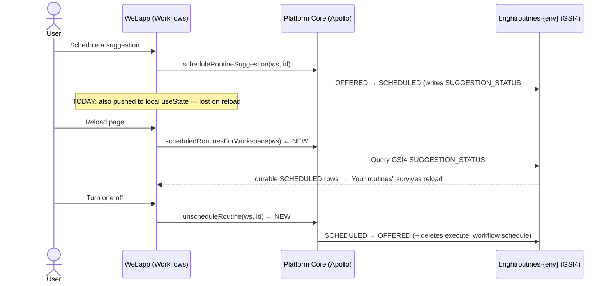

# SPEC: BrightRoutines — "Your routines" Persistence

> Scope: the read-back half of BH-885. The offer→schedule→dismiss **write**
> path already shipped and is live on staging (see parent spec
> `brightroutines-intent-loop.md` §7). This spec closes the one remaining gap
> that makes scheduled routines feel unreal: they vanish on reload.

## 1. Context

**Problem.** On the Workflows surface (`/context/workflows`), the "Your
routines" section — the routines a user has turned on — is held in React
`useState` in `SuggestedRoutinesSection.tsx`. Scheduling a suggestion moves it
into that local array; a page reload throws the array away. The backend row is
correctly transitioned to `SCHEDULED` (the `scheduleRoutineSuggestion` mutation
writes the `SUGGESTION_STATUS#{ws}#SCHEDULED` GSI4 partition), but the webapp
has no way to read it back, so "Your routines" renders empty after every
reload. There is also no way to turn a routine **off** — `handleUnschedule`
only mutates local state (`TODO(BH-885)` at `SuggestedRoutinesSection.tsx:166`).

**Who / why now.** The buyer persona (a data leader) turns on a routine, leaves
the page, comes back, and their routines are gone — the feature reads as broken
even though the backend is correct. This is the last blocker to "Your routines"
being a trustworthy, durable surface. The recurrence-detection loop (capture →
detect → offer) is verified live; this is purely the read-back + turn-off.



## 2. Interface Contract (MDE)

### 2.1 New query — read SCHEDULED routines

Mirrors the existing `routineSuggestionsForWorkspace` (which reads the OFFERED
partition) but targets the SCHEDULED partition. Same `RoutineSuggestion` type,
same membership gate.

```graphql
# schema/typedefs.ts — Query
scheduledRoutinesForWorkspace(workspaceId: ID!): [RoutineSuggestion!]!
  @authenticated(workspaceIdLoc: ["args", "workspaceId"])
```

- **Returns**: `RoutineSuggestion` rows with `status == "SCHEDULED"`, newest
  first, paginated over GSI4 with the same `MAX_PAGES` cap as the OFFERED read.
- **Auth**: `@authenticated(workspaceIdLoc:["args","workspaceId"])` — the same
  workspace-membership gate the OFFERED query uses (a bare `@authenticated`
  would be a cross-tenant read; see parent spec §9 and the BH-885 read-slice
  self-audit fix).

### 2.2 New mutation — turn a routine off

```graphql
# schema/typedefs.ts — Mutation
unscheduleRoutine(
  workspaceId: ID!
  routineSuggestionId: ID!
): RoutineSuggestion!
  @authenticated(workspaceIdLoc: ["args", "workspaceId"])
```

**Effect**: turns a `SCHEDULED` routine off, returning it to `OFFERED` with a
live re-offer, and deletes the backing `execute_workflow` schedule so it can
never fire again.

**Transition machine (mirrors the forward OFFERED→SCHEDULING→SCHEDULED lock —
`routine-suggestion.ts` L478-522 lock, L637-660 rollback).** A naive
"delete then flip" or "flip then delete" both leave a broken state on
partial failure, so unschedule runs the symmetric three-step:

1. **Lock**: conditional write `SCHEDULED → UNSCHEDULING`, condition
   `#status = :scheduled`. `UNSCHEDULING` is a transient, **non-firing** state
   (the cron is deleted in step 2 but the row is not yet re-offered). This
   single conditional write is the concurrency guard — at most one of N
   concurrent taps wins; the losers see the condition fail and return the
   current row.
2. **Delete the schedule** in brightbot via a new `deleteRoutineSchedule`
   client (see §6). **Delete-before-flip** is deliberate: if we flipped first
   and the delete failed, the row would read `OFFERED` while the cron kept
   firing — a routine the user turned off still emailing recipients (violates
   §3 Invariant 3 / §7 Property 2, the worst trust outcome). The delete MUST be
   **404-tolerant** (an already-absent schedule is success) so a retry after a
   partial failure can complete.
3. **Commit**: conditional write `UNSCHEDULING → OFFERED`, and in the same
   `UpdateExpression` **`REMOVE` every scheduled-only field** so the row
   decodes as a clean fresh offer:
   `linked_schedule_id, owner_user_id, recipient_user_ids, accepted_by,
   accepted_at, resolved_action_kind, resolved_output_artifact`. Also `SET
   offered_at` to now and rewrite `GSI4SK` so the re-offer sorts to the TOP of
   "Suggested" (the schedule commit never rewrites the sort key —
   `routine-suggestion.ts` L374 — so a stale `offered_at` would bury it at the
   bottom, effectively invisible).

**Failure / rollback**: if the delete (step 2) fails after retries, roll
`UNSCHEDULING → SCHEDULED` (the honest state — it IS still running) and surface
a typed retryable error. A stale `UNSCHEDULING` lock self-heals via a reclaim
window mirroring `SCHEDULING_LOCK_STALE_MS` (`routine-schedule-state.ts` L48).

- **Auth on the write**: needs `jwtToken` from context (as
  `scheduleRoutineSuggestion` does — `routine-suggestion.ts` L430/548) to
  authenticate the brightbot delete call.
- **Who may turn off**: the routine **owner** (`owner_user_id == token.sub`) or
  a workspace **admin**. Any-member turn-off is NOT allowed — a routine another
  member owns is theirs to stop. (`getSuggestion` keys on `WORKSPACE#{ws}`, so
  cross-workspace ids already 404; this is the intra-workspace rule.)
- **Return**: the updated `RoutineSuggestion` (status `OFFERED`, scheduled
  fields cleared), so the webapp moves it back into "Suggested" without a
  refetch.
- **Idempotent**: on a row already `OFFERED` (or absent) it is a no-op that
  returns the current row / typed not-found; never errors on a double-tap.

### 2.3 Webapp hook surface

`useRoutineSuggestions` gains a scheduled list and an unschedule action. The
call sites (`SuggestedRoutinesSection`) drop their local `scheduled` state.

```typescript
export interface UseRoutineSuggestionsResult {
  suggestions: RoutineSuggestion[];        // OFFERED (unchanged)
  scheduledRoutines: RoutineSuggestion[];  // NEW — SCHEDULED, server-fetched
  loading: boolean;
  error: Error | undefined;
  removeSuggestion: (id: string) => void;
  restoreSuggestion: (id: string) => void;
  scheduleSuggestion: (id: string, recipientUserIds?: string[]) => Promise<void>;
  dismissSuggestion: (id: string) => Promise<void>;
  unscheduleRoutine: (id: string) => Promise<void>;  // NEW
}
```

## 3. Invariants (DbC)

1. `scheduledRoutinesForWorkspace` returns ONLY rows whose `status == SCHEDULED`
   for the requested workspace. No OFFERED/DISMISSED/SUPPRESSED/EXPIRED leak in.
2. `WHERE the caller is not a member of workspaceId, THE System SHALL return a
   FORBIDDEN authorization error` (never rows from another tenant) — for both
   the new query and the new mutation.
3. `WHEN unscheduleRoutine succeeds, THE System SHALL delete the backing
   execute_workflow schedule` — a turned-off routine never fires again.
4. `unscheduleRoutine` is idempotent: applying it to a non-SCHEDULED row is a
   no-op that returns the current row, not an error.
5. After a successful schedule OR unschedule, a fresh page load reflects the new
   state with no client-held state — the server is the single source of truth
   for which routines are on.
6. The webapp holds NO scheduled-routine list in `useState`; "Your routines" is
   derived entirely from `scheduledRoutinesForWorkspace`. Optimistic UI is
   allowed (move-on-click) but every optimistic move is backed by a server
   mutation and reconciled on the next query result.
7. Counts-only evidence still holds (parent §9 invariant 3): the SCHEDULED read
   returns the same redacted `evidence_summary` shape as OFFERED — no raw text.
8. `unscheduleRoutine` is a **single conditional write from `SCHEDULED`**
   (condition `#status = :scheduled`). At most one of N concurrent calls
   deletes the schedule and flips; the rest see the condition fail and return
   the current row. (Concurrency guarantee — spec-driven §7 concurrency-sensitive.)
9. `WHILE a routine is in the transient UNSCHEDULING state, THE System SHALL NOT
   allow it to fire` (the cron is already deleted) `AND SHALL NOT strand it` —
   commit → OFFERED, or roll back → SCHEDULED on delete failure, or self-heal a
   stale lock via the reclaim window. Mirror of the forward "never stranded in
   SCHEDULING" guarantee.
10. **Clean re-offer**: after a successful unschedule the row decodes with
    `ownership == null` and `resolved_action_kind == resolved_output_artifact ==
    null` (all scheduled-only fields `REMOVE`d), and `offered_at` refreshed so it
    sorts to the top of "Suggested". A row returned to OFFERED with stale
    ownership/resolved fields renders a wrong card — this invariant forbids it.
11. **Delete idempotency**: deleting an already-absent `execute_workflow`
    schedule (HTTP 404 from brightbot) is treated as success, so a retry after a
    partial failure can complete.
12. **Detector non-duplication**: a routine returned to OFFERED does not cause
    the nightly detector to create a *second* OFFERED suggestion for the same
    `pattern_id`. (Must be verified against the brightbot `RoutineSuggestionStore`
    before the mutation PR lands — see §6.)

## 4. Acceptance Criteria (BDD)

```gherkin
Feature: "Your routines" persists across reloads

  Scenario: Scheduled routine survives a reload
    Given a workspace with one OFFERED routine suggestion
    And I schedule it
    When I reload the Workflows page
    Then the routine appears under "Your routines"
    And it is no longer under "Suggested"

  Scenario: Reading scheduled routines is membership-gated
    Given a workspace I am NOT a member of
    When I query scheduledRoutinesForWorkspace for that workspace
    Then I receive a FORBIDDEN error
    And no routine rows are returned

  Scenario: Turning a routine off stops it and returns it to Suggested
    Given a SCHEDULED routine in my workspace
    When I turn it off
    Then its status becomes OFFERED
    And the backing execute_workflow schedule is deleted
    And on reload it appears under "Suggested", not "Your routines"

  Scenario: Turning off is idempotent
    Given a routine that is already OFFERED
    When unscheduleRoutine is called on it
    Then it returns the routine unchanged
    And no error is raised

  Scenario: Empty scheduled list renders the anchored empty state
    Given a workspace with no SCHEDULED routines
    When I load the Workflows page
    Then "Your routines" shows its "No routines running yet" empty state
    And the section is still anchored (not hidden)
```

## 5. Out of Scope

- Editing a scheduled routine's cadence/recipients in place (that is BH-970
  editable-recipient + a future edit-schedule mutation).
- Slack "Your routines" parity (BH-887 surface; this spec is webapp-only).
- Pausing (vs. turning off) a routine — no PAUSED state in this slice; off means
  `SCHEDULED → OFFERED`.
- Any change to the capture/detect/offer path — that loop is done and verified.
- A "run history" / last-run view for scheduled routines (net-new, not filed).

## 6. Dependencies

- **Shipped**: `scheduleRoutineSuggestion` / `dismissRoutineSuggestion`
  mutations + `routineSuggestionsForWorkspace` query (BH-885 write/read slices,
  live on staging). The `SUGGESTION_STATUS#{ws}#SCHEDULED` GSI4 partition
  already exists — the schedule mutation writes it.
- **Shipped**: `execute_workflow` schedule **create** in brightbot (P1,
  BH-877/878), consumed by platform-core's `routine-scheduler-client.ts`
  (`createRoutineSchedule`, POST `/manage/scheduled-agents`).
- **⚠️ NOT confirmed shipped — verify before the mutation PR**:
  1. **brightbot exposes `DELETE /manage/scheduled-agents/{id}`.** If BH-877/878
     shipped create-only, that endpoint is a **cross-repo brightbot
     dependency** this ticket must add first (a blocking prerequisite, not part
     of the platform-core PR). Confirm against brightbot's scheduled-agents
     routes.
  2. **platform-core has NO delete client seam.** `routine-scheduler-client.ts`
     exports only `createRoutineSchedule`. The mutation PR must add a
     `deleteRoutineSchedule(scheduleId, jwtToken)` (mirror the create seam,
     404-tolerant per §3 Invariant 11). Grep confirms no existing
     `deleteRoutineSchedule` / DELETE-against-scheduled-agents anywhere in
     `src/graphql`.
  3. **Detector idempotency against a resurrected OFFERED row** (§3 Invariant
     12) — confirm the brightbot `RoutineSuggestionStore` / detector does not
     insert a duplicate suggestion for a `pattern_id` that already has an
     OFFERED row. If it does, unschedule needs a guard or a light cooldown; if
     it keys on "no live OFFERED/SCHEDULED row for the pattern," we're safe.
- **Reuse, do not duplicate**:
  - `RoutineSuggestionModel.listForWorkspace`-style GSI4 pagination
    (`routine-suggestion.ts` ~L220) — the new query is the same shape with a
    different status partition.
  - `filterRecipientsToWorkspaceMembers` / the `@authenticated` directive — the
    membership gate is identical to the OFFERED query.
  - The scheduling state machine + stale-lock reclaim in
    `routine-schedule-state.ts` — unschedule is the reverse transition; reuse
    the same conditional-write discipline.
  - `useRoutineSuggestions` mapper (`toRoutineSuggestion`) — the SCHEDULED read
    maps through the exact same camelCase→snake_case seam.

## 7. Correctness Properties

State machine + a cross-tenant boundary are both in play, so this section
applies (per spec-driven §7 required-when).

### Property 1: SCHEDULED read is status- and tenant-exact

*For any* workspace `w` and caller `c`, `scheduledRoutinesForWorkspace(w)`
returns exactly the rows with `status == SCHEDULED` and `workspace_id == w`,
and only if `c` is a member of `w`; otherwise FORBIDDEN with zero rows.

**Validates: §3 Invariant 1, §3 Invariant 2, §4 Scenario "membership-gated"**

### Property 2: Off means off

*For any* SCHEDULED routine `r`, a successful `unscheduleRoutine(r)` leaves no
live `execute_workflow` schedule that can fire `r`, and `r.status == OFFERED`.
This is enforced by the ordering in §2.2: the schedule is deleted **before** the
row commits to OFFERED, and a delete failure rolls the row back to SCHEDULED
(never OFFERED-with-a-live-cron). The intermediate UNSCHEDULING state is
non-firing, so there is no window where `r` is both "off" and able to fire.

**Validates: §3 Invariant 3, §3 Invariant 9, §4 Scenario "Turning a routine off…"**

### Property 4: Turn-off is race-free and never stranded

*For any* set of concurrent `unscheduleRoutine(r)` calls plus any concurrent
forward re-schedule attempt, exactly one unschedule commits (the conditional
`SCHEDULED → UNSCHEDULING` write), and `r` ends in a terminal-for-this-op state
(OFFERED on success, SCHEDULED on rollback) — never stuck in UNSCHEDULING.

**Validates: §3 Invariant 8, §3 Invariant 9**

### Property 3: Server is the source of truth for on/off

*For any* sequence of schedule/unschedule actions, a fresh page load with an
empty client cache renders "Your routines" identical to
`scheduledRoutinesForWorkspace`'s result.

**Validates: §3 Invariant 5, §3 Invariant 6, §4 Scenario "survives a reload"**

## 9. Observability Contract

This slice produces a production surface (two GraphQL operations), so:

- **Query `scheduledRoutinesForWorkspace`**: log events
  `routines.scheduled_read.started`, `routines.scheduled_read.success`
  (with `workspace.id`, `routines.scheduled_count`),
  `routines.scheduled_read.forbidden` (membership denial).
- **Mutation `unscheduleRoutine`**: log events `routines.unschedule.started`,
  `routines.unschedule.success` (with `workspace.id`, `routine.id`,
  `schedule.deleted=true`), `routines.unschedule.noop` (already OFFERED),
  `routines.unschedule.forbidden`.
- **Attributes**: never log raw routine title/summary — counts + ids only
  (parent §9 invariant 3).
- **Metrics**: none new; the P4 precision/acceptance metrics (BH-888) already
  cover schedule/dismiss rates. Turn-off rate is worth a counter later but is
  not gated here.

## 10. Test Coverage Update

### a. In-repo layered tests

**platform-core** (`src/graphql/models/__tests__/` + resolver tests):
- **L0** — `scheduledRoutinesForWorkspace` returns the `RoutineSuggestion` shape
  from §2.1; `unscheduleRoutine` returns the updated row shape from §2.2.
- **L1** — the query dispatches to the SCHEDULED GSI4 partition (not OFFERED);
  the mutation dispatches to the unschedule transition.
- **L2** — §3 invariants against a **real LocalStack DynamoDB** (mirror the
  BH-885 read-slice LocalStack tests): seed one SCHEDULED + one OFFERED row,
  assert the query returns only the SCHEDULED one; run `unscheduleRoutine` and
  assert the row flips to OFFERED, the GSI4 partition moves, and the schedule-
  delete client was invoked; assert idempotent no-op on an already-OFFERED row;
  assert a non-member caller gets FORBIDDEN (real `@authenticated` path).

**webapp** (`src/Context/routines/*.test.tsx`, jest — the repo uses jest, not
vitest):
- **L2** — `useRoutineSuggestions` exposes `scheduledRoutines` from a mocked
  `scheduledRoutinesForWorkspace` result; `unscheduleRoutine` calls the mutation
  and reconciles on refetch; `SuggestedRoutinesSection` renders scheduled rows
  from the hook (NOT `useState`) and shows the empty state when the list is
  empty. Extend the existing `SuggestedRoutinesSection.test.tsx` /
  `useRoutineSuggestions.test.tsx` — do not add sibling files.

### b. Cross-repo e2e (`brighthive-e2e`)

- **Feature test** — the §4 happy path end-to-end against staging: seed an
  OFFERED row, schedule via the real mutation, assert
  `scheduledRoutinesForWorkspace` returns it; unschedule, assert it flips back
  to OFFERED and the schedule is gone. Extend
  `e2e/surfaces/test_routines.py` (the file that already covers the read query
  + schedule/dismiss), not a new file.
- **Error path** — a non-member token calling `scheduledRoutinesForWorkspace`
  gets FORBIDDEN against the real backend.

### Self-verification (before the implementation PR)

Run platform-core jest + webapp jest + the brighthive-e2e routines surface
suite against staging; confirm each §2/§3/§4 entry has a corresponding new
case, and all green. A green run with no new SCHEDULED-read / unschedule cases
means the contract wasn't enforced.

## 11. PR Split

| PR | Repo | Scope | Est. lines |
|---|---|---|---:|
| 0 | `brightbot` | **(only if §6 verification finds it missing)** `DELETE /manage/scheduled-agents/{id}`, 404-tolerant + idempotent | ~150 |
| 1 | `brighthive-platform-core` | `scheduledRoutinesForWorkspace` query + resolver + model read, LocalStack L2 | ~250 |
| 2 | `brighthive-platform-core` | `unscheduleRoutine` mutation: UNSCHEDULING lock + rollback + stale-reclaim + field `REMOVE`s + `deleteRoutineSchedule` client (404-tolerant) + owner/admin gate + LocalStack L2 | ~400 |
| 3 | `brighthive-webapp` | hook `scheduledRoutines` + `unscheduleRoutine`; `SuggestedRoutinesSection` drops local state; jest L2 | ~250 |
| 4 | `brighthive-e2e` | surface + feature + FORBIDDEN + off-means-off cases against staging | ~150 |

Split so each PR stays under the 900-line ceiling and the backend read (PR 1)
can land + deploy before the webapp (PR 3) depends on it. PR 2 (unschedule) is
independent of PR 1 and can proceed in parallel — but PR 0 (if needed) blocks
PR 2. PR 2's estimate rose from the naive ~300 to ~400 once the full reverse
state machine (lock/rollback/reclaim, per the architecture review) is in scope;
if it approaches the ceiling, split the client seam into its own PR.
