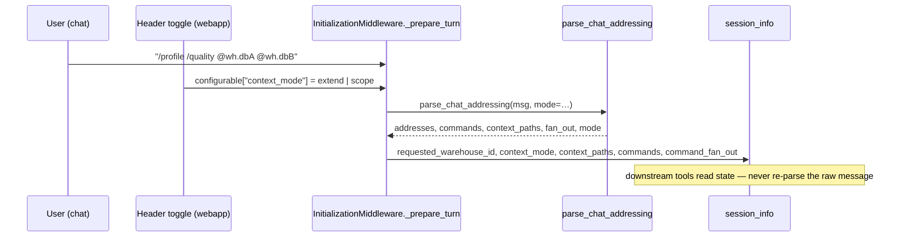

# Spec: Chat-native addressing grammar — `@`-context injection with extend/scope + n-to-n fan-out

**Ticket:** BH-1371 (BH-1370 identity-ladder epic) · **Status:** Draft · **Author:** Kuri · **Last-Reviewed:** 2026-08-06

## 1. Context

A user in BrightAgent chat needs to tell the agent *which* resources a turn is
about, and *what* to do with them — without leaving the chat. Before this grammar
there was no way to say "this warehouse, not that one": on a workspace with more
than one configured warehouse, `get_warehouse_config` picked whichever key came
first out of a dict (`next(iter(...))`) — a coin-flip the user could not steer.

The grammar is two tokens over the workspace identity ladder
(`WORKSPACE.WAREHOUSE.DATABASE.TABLE`, general→specific, defined by BH-1370). In
chat the workspace is implicit, so an address is **warehouse-relative**:

- **`@`-address** — points at a resource by its dotted path down from the
  warehouse. `@ec2_mssql` (warehouse), `@ec2_mssql.demo_dbA` (database),
  `@ec2_mssql.demo_dbA.TABLE_MARWAN` (table). The **full path is the identity**
  because names are not unique: one warehouse holds `demo_dbA` *and* `demo_dbB`
  both containing `TABLE_MARWAN`; two warehouses both hold `TABLE_HARBOUR`. Only
  the qualified path disambiguates — which is why `next(iter(...))` was wrong.
- **`/`-command** — the workflow/pipeline/action to run over the addressed
  resource(s): `/sync @ec2_mssql.demo_dbA`, `/profile @ec2_mssql.demo_dbA.TABLE_MARWAN`.

The real capability behind `@` is **context injection** — the mentions are the
resources the user hands the agent *as context*; the warehouse pin was just the
first thing that context disambiguated. Three properties make it a product, not a
parser trick:

1. **Multi-configurable layers** — `@` binds context at whatever rung it names,
   each independently, and one turn can mix rungs (a table *and* a whole database).
2. **extend vs scope** — a header toggle beside the resource list decides whether
   the mentioned resources are *added* to what the agent sees (extend, default) or
   the agent's view is *narrowed* to them (scope). Mentioning a resource never
   blinds the agent by default.
3. **n-to-n fan-out** — n `/verbs` × n `@paths` is the cartesian set of work; the
   turn `/profile /quality @wh.dbA @wh.dbB` is four units.



## 2. Interface Contract (MDE)

All in `brightbot/brightbot/utils/chat_addressing.py`:

```python
class ContextMode(str, Enum):
    EXTEND = "extend"   # listed resources ADDED; agent still sees the whole workspace
    SCOPE  = "scope"    # agent's read-visibility NARROWED to the listed resources only

@dataclass(frozen=True)
class ChatAddress:
    segments: tuple[str, ...]
    @property
    def warehouse_id(self) -> str: ...   # leading segment
    @property
    def level(self) -> str: ...          # "warehouse" | "database" | "table" (by depth)
    @property
    def path(self) -> str: ...           # ".".join(segments)

@dataclass(frozen=True)
class CommandOnPath:
    command: str
    path: str

@dataclass(frozen=True)
class ChatAddressing:
    addresses: tuple[ChatAddress, ...] = ()
    commands: tuple[str, ...] = ()
    requested_warehouse_id: str | None = None
    mode: ContextMode = ContextMode.EXTEND
    @property
    def is_scoped(self) -> bool: ...
    @property
    def context_paths(self) -> tuple[str, ...]: ...   # one dotted path per @mention
    @property
    def fan_out(self) -> tuple[CommandOnPath, ...]: ... # commands × context_paths, verbs-outer

def parse_chat_addressing(message: str, *, mode: ContextMode = ContextMode.EXTEND) -> ChatAddressing: ...
```

**State surface (`session_info`, set by `InitializationMiddleware._prepare_turn`):**

| Key | Type | Meaning |
|---|---|---|
| `requested_warehouse_id` | `str` | first-warehouse projection for the pre-existing resolver |
| `context_mode` | `"extend"` \| `"scope"` | the header toggle, read from `configurable["context_mode"]` |
| `context_paths` | `list[str]` | every `@`-mention as a `warehouse[.database[.table]]` dotted string |
| `commands` | `list[str]` | every `/verb` token |
| `command_fan_out` | `list[{"command": str, "path": str}]` | the n-to-n cartesian units |

Wire shape of `context_paths` = **full dotted-path strings**; each consumer
re-splits on `.` to the grain it operates at. No GraphQL/DTO change — this is a
`session_info` contract inside the LangGraph turn. `context_mode` rides in on the
turn config like `thread_id` — **never parsed from the message text**.

## 3. Invariants (DbC)

- **I-1** THE first `@`-mention's leading segment SHALL set `requested_warehouse_id`;
  later mentions SHALL NOT override a pin already taken this turn.
- **I-2** `context_mode` SHALL be read only from request state (`configurable`),
  NEVER inferred from the message text. WHERE the value is unknown, THE System
  SHALL fall back to `EXTEND`.
- **I-3** `EXTEND` SHALL never remove the rest of the workspace from view;
  mentioning a resource is additive. Restriction happens only under `SCOPE`.
- **I-4** Every `@`-mention SHALL land in `context_paths` as its full dotted path,
  at whatever rung it names; a turn MAY mix rungs.
- **I-5** `fan_out` SHALL be the cartesian product `commands × context_paths`,
  verbs-outer/paths-inner, and SHALL be empty WHEN there is no command OR no
  address (a bare `@`-mention is context, never an action).
- **I-6** A single-warehouse workspace SHALL resolve identically with or without a
  pin (no behavior change for the common case).

## 4. Acceptance Criteria (BDD)

```gherkin
Feature: chat @-addressing injects context and fans out commands

  Scenario: a warehouse mention pins that warehouse
    Given a workspace with two configured warehouses
    When the message is "row count on @ec2_mssql.demo_dbA"
    Then session_info.requested_warehouse_id is "ec2_mssql"

  Scenario: mixed-rung mentions both land as dotted paths
    When the message is "compare @ec2_mssql.demo_dbA.TABLE_MARWAN with @ec2_mssql.demo_dbB"
    Then context_paths is ["ec2_mssql.demo_dbA.TABLE_MARWAN", "ec2_mssql.demo_dbB"]
    And the address levels are ["table", "database"]

  Scenario: scope toggle narrows read-visibility, extend is the default
    Given the header toggle is set to scope
    When the message mentions resources
    Then session_info.context_mode is "scope"
    And with no toggle set the mode defaults to "extend"

  Scenario: scope is never inferred from the words in the message
    Given no toggle on the config
    When the message is "scope the query to @ec2_mssql.demo_dbA"
    Then session_info.context_mode is "extend"

  Scenario: n verbs over n paths fan out
    When the message is "/profile /quality @ec2_mssql.demo_dbA @ec2_mssql.demo_dbB"
    Then command_fan_out is the 4 (verb, path) pairs, verbs-outer

  Scenario: bare mentions do not fan out
    When the message is "look at @ec2_mssql.demo_dbA and @ec2_mssql.demo_dbB"
    Then command_fan_out is absent
    And context_paths still holds both databases
```

## 5. Out of Scope

- **Executing the fan-out.** This spec *captures* `command_fan_out` as state; a
  dispatcher that iterates the units and runs each verb is a follow-on slice.
- **Resolving database/table to identities.** Only the warehouse binds to a
  resolver today; deeper rungs land as context paths for the tools that read them.
- **The webapp header toggle UI.** The backend contract + default ship here; the
  header switch that sets `configurable["context_mode"]` is the front-end follow-on.
- **Scope as an action safety-fence.** Scope is a *read-visibility* focus (what the
  agent sees/retrieves), not a write-guard.

## 6. Dependencies

- **BH-1370** identity ladder (`WORKSPACE.WAREHOUSE.DATABASE.TABLE`) — the grammar's
  source of truth.
- **BH-1362** `isDefault` warehouse field + `setDefaultWarehouse` (platform-core
  PR #1176, shipped) — the unpinned default a workspace resolves to.
- `get_warehouse_config` / `get_requested_warehouse_id` (`brightbot/tools/`) —
  the resolver the pin steers.

## 7. Correctness Properties

### Property 1: The addressed warehouse is always the resolved one

*For any* turn with at least one `@`-mention, `get_warehouse_config` returns the
warehouse named by the first mention — never a `next(iter(...))` coin-flip.

**Validates: §3 I-1, I-6, §4 Scenario "a warehouse mention pins that warehouse"**

### Property 2: Mentioning never blinds by default

*For any* turn under `EXTEND`, the agent's view still contains the whole workspace;
narrowing occurs only under an explicit `SCOPE` toggle carried as request state.

**Validates: §3 I-2, I-3, §4 Scenarios "scope toggle…" + "scope is never inferred…"**

### Property 3: Fan-out is exactly the cartesian set

*For any* turn with n commands and m paths, `fan_out` has exactly n×m units when
both n>0 and m>0, and is empty otherwise.

**Validates: §3 I-5, §4 Scenarios "n verbs over n paths…" + "bare mentions do not fan out"**

## 8. Eval Criteria

Not applicable — this is a deterministic parser + state contract with no LLM
output to grade. Agent *use* of the injected context is graded by the downstream
tools' existing evals, not here.

## 9. Observability Contract

- **Log events** (`supervisor_logger`, `[INIT_MW]`):
  - `📍 Pinned warehouse from chat mention: '<id>'` — when a pin is taken.
  - `🧭 Context (<mode>) over N resource(s): <path[level], …>` — when context_paths land.
  - `🕸️ Fan-out: N verb(s) × M path(s) = K unit(s) of work` — when fan_out is non-empty.
  - `Unknown context_mode '<raw>' — falling back to extend` (warning) — I-2 fallback.
- **Span/metrics**: none new.

## 10. Test Coverage Update

**In-repo (`brightbot/tests/unit/`, real-behavior, 33 cases green on PR #1010):**

- **L0/parser** (`tools/test_chat_addressing_warehouse_pin.py`): bare + full-path
  pin, database-level address, first-mention-wins; extend default / scope carried /
  scope-never-from-text / empty keeps mode; multi-layer mixed-rung context_paths,
  span-warehouses, no-mentions→none; fan-out 2×2 verbs-outer, 1×3, empty-without-verb,
  empty-without-target. Only the AWS boundary (`get_workspace_secret`) is stubbed with
  a real multi-warehouse secret shape; selection logic runs for real.
- **L1/L2 middleware** (`agents/super_agent/test_initialization_middleware_warehouse_pin.py`):
  pin lands in session_info; context_mode defaults/scope/unknown→extend; multi-layer
  context_paths land; n-to-n `command_fan_out` lands; bare mentions leave no fan-out.
  Drives the real `_prepare_turn`; only `get_config` is stubbed.

**e2e (§10b), deferred + tracked (not silently skipped):**

- One brightbot integration run where a two-warehouse workspace + a chat turn with a
  `@`-pin resolves to the *addressed* warehouse (the bug's inverse), asserted against a
  real workspace secret shape.
- A dispatcher-execution e2e is out of scope here (fan-out is captured, not executed) —
  lands with the dispatcher follow-on slice.
