# Notify me on this chat session

> Not a new delivery channel — this spec adds a new *trigger* (a LangGraph chat thread reaching
> a terminal state or pausing on an interrupt) onto the existing, already-shipped delivery
> pipeline (`publishNotification` → Slack DM/channel + in-app inbox, per BH-1088). No new
> subscription scope, no new channel-adapter code.

## Contents

- [1. Context](#1-context)
- [2. Interface Contract (MDE)](#2-interface-contract-mde)
- [3. Invariants (DbC)](#3-invariants-dbc)
- [4. Acceptance Criteria (BDD — Gherkin)](#4-acceptance-criteria-bdd--gherkin)
- [5. Out of Scope](#5-out-of-scope)
- [6. Dependencies](#6-dependencies)
- [9. Observability Contract](#9-observability-contract)
- [10. Test Coverage Update](#10-test-coverage-update)
- [Areas Involved](#areas-involved)
- [Ticket Breakdown](#ticket-breakdown)
- [Related](#related)

## 1. Context

BrightAgent chat runs already execute independently of the browser tab — `useStreamReconnect.ts`
proves this: closing the tab does not kill the LangGraph run, and reopening the thread re-attaches
to a still-running stream via `GET /threads/{threadId}/runs?status=running`. The gap isn't "make
chat async" — it already is. The gap is that a user who starts a slow multi-minute agent turn (a
sub-agent delegation, a long tool chain, a HITL-gated flow) has no way to be told when it's safe to
come back; they either babysit the tab or periodically reload to check.

Today's closest precedent is `notifyScheduleOfRunCompletion()`
(`brighthive-platform-core/src/graphql/service/workflow/scheduler-bridge.ts:94`) — a specific
scheduled run reaching a terminal state, notifying only the schedule's owning user. This spec
copies that pattern's *shape* (idempotent claim → terminal-state detection → addressed
notification) for a fundamentally different trigger (an interactive chat run, not a cron-scheduled
one) — it does not call into or depend on the scheduler bridge at runtime; the only shared code is
the `publishNotification` mutation both callers invoke independently.

**Spike correction (BH-1100, resolved before this spec's other tickets started)**: the original
draft assumed brightbot would need either a LangGraph completion webhook of unknown existence, or
a poller. Direct inspection of the self-hosted `langgraph-api` package installed in brightbot's own
`.venv` (`langgraph_api==0.8.7`) confirms a **real per-run webhook already exists** in the platform
itself:
- `langgraph_api/webhook.py:call_webhook()` POSTs `{run, status, values, error, ...}` to a URL
  carried on the run.
- `langgraph_api/worker.py:73-78,138` — the webhook URL is `run["kwargs"]["webhook"]`, a **per-run
  field supplied at run-creation time** (same request as `assistant_id`/`input`), not a thread-level
  setting.
- `langgraph_api/worker.py:418` sets a distinct `status = "interrupted"` value (separate from
  `"success"`/`"error"`/`"timeout"`/`"rollback"`), and the `WorkerResult` (including `webhook`) is
  returned **unconditionally regardless of which status fired** (line 507-514) — one webhook
  mechanism covers both completion and interrupts, no separate plumbing needed for either.
- Confirmed the webapp's own run-creation call
  (`brighthive-webapp/src/BrightAgent/hooks/useAgentStream.ts:437`, `POST /threads/{id}/runs/stream`)
  goes **directly to LangGraph**, not through brightbot, and does not set `webhook` today — the
  field is unused and free to adopt.
- **Further simplification**: brightbot's own FastAPI app (`http/app.py`) is mounted *into the same
  deployed LangGraph Platform process* via `langgraph.json`'s `http.app` field — it is not a
  separate service. `webhook.py:202-204` (`if webhook.startswith("/"): ... get_loopback_client()`)
  confirms LangGraph explicitly supports a **relative-path webhook** for exactly this case. The
  webapp sets `webhook: "/manage/chat-sessions/webhook/run-complete"` (a relative path), not an
  absolute cross-service URL — no new domain allowlisting, no network reachability concern; only
  the shared-secret header (already implemented in BH-1101) guards the endpoint.

This **replaces** the original thread-metadata-flag design (§2.1/§2.2 below) with a simpler,
event-driven one: the webapp supplies `webhook` on the specific run being opted into, brightbot
runs a lightweight receiver endpoint, no polling, no thread-metadata read required for the trigger
itself. `notify_user_id` still rides on run metadata (see §2.2), reusing the same `user_id` field
already threaded by `useAgentStream.ts`.

```mermaid
sequenceDiagram
    participant User
    participant Webapp as brighthive-webapp
    participant LangGraph as LangGraph Platform (thread/run)
    participant Brightbot as brightbot (new webhook receiver)
    participant PlatformCore as brighthive-platform-core
    participant SlackServer as brightbot-slack-server

    User->>Webapp: Clicks the bell ("Notify me") on a thread
    Webapp->>LangGraph: POST /threads/{id}/state { values: { notify_enabled: true } } — persisted per-thread (see §2.1, corrected 2026-07-16)
    User->>Webapp: Sends a message (any message, while the toggle is on)
    Webapp->>LangGraph: POST /threads/{id}/runs/stream with webhook=<brightbot-url>, notify_user_id in run metadata
    Note over LangGraph: Run continues executing after tab closes (existing behavior)
    LangGraph->>Brightbot: POST webhook — fires on EVERY terminal run (confirmed: worker.py returns WorkerResult unconditionally for success/error/interrupted)
    Brightbot->>Brightbot: duration >= floor (skip for interrupts)? claim not already fired for run_id? generate AI summary of the run
    Brightbot->>PlatformCore: publishNotification(stage: chat_run_complete | chat_run_interrupt, visibility: "user", audienceUserIds: [notify_user_id], metadata: {summary, elapsed_seconds})
    PlatformCore->>SlackServer: (existing poller picks up the event)
    Note over SlackServer: deliver() gates on visibility:"user" BEFORE Subscription matching (fixed 2026-07-16 — a workspace-scope subscription previously could match and broadcast a personal event to a shared channel)
    SlackServer->>User: Slack DM: "Your BrightAgent run finished" + AI summary + duration + thread link + mute action
    PlatformCore->>User: In-app inbox card (existing Inbox fan-out)
```



### Use Case / Goal

A user turns on "notify me" for a BrightAgent thread and closes the tab (or keeps working
elsewhere). When a run in that thread finishes (or pauses waiting on their input via an
interrupt), they get a Slack DM / inbox card with a short AI-generated summary of what happened —
regardless of whether they were watching live (the original "only notify if not watching" gate
was built and then removed, see Invariant 2) — and only past a minimum duration floor for
completions, so the feature never fires for the common case of a normal few-second chat turn.

### How It Works Today

- **Thread identity**: a LangGraph `thread_id` is the entire "session" concept. There is no
  `Conversation`/`Thread` row in platform-core's Neo4j graph — `brighthive-webapp`'s adapters
  (`src/BrightAgent/hooks/adapters/*.ts`) build thread metadata (`workspace_id`, `graph_id`,
  `Title`, `Author`) client-side and POST it straight to the LangGraph API; platform-core is never
  in the loop for thread creation.
- **`user_id` IS available on thread metadata**, just not from the adapter layer that builds
  initial metadata — it's threaded in separately by `useAgentStream.ts:560,566,580`
  (`metadata: { ...metadata, user_id: userId }`) and by both session-sidebar components
  (`FullPage/SessionSidebar/index.tsx:209,260`, `StudioPage/StudioSessionSidebar/index.tsx:240,305`).
  This is the field this spec's `notify_user_id` piggybacks on — no new identity plumbing needed.
- **Runs survive tab closure today.** `useStreamReconnect.ts:checkForRunningStream()` queries
  `GET /threads/{threadId}/runs?status=running`; `useAgentLifecycle.ts:246-251` calls this on
  thread load and rejoins the SSE stream via `stream.joinExistingStream(threadId, runId)` if a run
  is still executing server-side. This is the existing "user comes back later" precedent this spec
  extends with a push instead of a pull.
- **HITL interrupts already pause runs indefinitely.** `brightbot/brightbot/utils/interrupt_utils.py`'s
  `interruptible()` wraps LangGraph's `interrupt()`; the webapp's `get_state` response surfaces
  `interrupts: [...]`, rendered by `useAgentInterrupt.ts`. A paused run can sit for hours/days —
  the checkpoint is the persistence layer.
- **Notification delivery — mostly reusable, TWO real gaps found post-launch (2026-07-16), in
  opposite directions.** `writeNotificationSignal()` (`brighthive-platform-core/src/graphql/
  service/aws/notification-signal.ts:51`) accepts `visibility` (`"workspace"` default | `"user"`)
  and `audienceUserIds: string[]` (line 18, 38), and platform-core's Inbox fan-out
  (`notification-preference.ts`'s `signalPassesPreferenceFilter`) genuinely does honor both
  fields with zero new code — that half of "reusable as-is" was correct.
  **Gap #1 (under-delivery)**: `brightbot-slack-server`'s `SlackChannel.deliver()`
  (`src/notifications/channels/slack.ts`) never read `visibility`/`audience_user_ids` at all — it
  matched events purely against pre-declared `Subscription` rows
  (`event_filter`/`asset_filter`/`severity_filter`), which nothing in this feature ever created.
  Every real chat-notify event published correctly but produced zero Slack messages, silently
  (`match_count: 0`, no error). Fixed by having brightbot's webhook receiver auto-provision a
  `PERSONAL`/`SLACK_DM` subscription for both stages on a user's first opt-in, via the same
  `createNotificationSubscription` mutation + `x-service-key`/`actingUserId` dual-auth path
  `scheduled_agents_routes.py`'s scheduler provisioning already uses (see §2.2).
  **Gap #2 (over-delivery, found on UAT)**: fixing Gap #1 by making `SlackChannel.deliver()`
  match against Subscription rows exposed the flip side of the SAME missing check — an event
  published with the correct `visibility: "user"` could ALSO match an unrelated *workspace-scope*
  subscription (`event_filter: "*"`, or one scoped to `chat_run_complete` specifically), because
  `deliver()` still only checked stage/asset/severity, never visibility, when deciding which rows
  to deliver to. A user's private chat session was broadcast to a shared channel. Fixed for real
  this time by gating `deliver()` on `event.visibility === "user"` BEFORE Subscription matching
  runs at all (§3 Invariant 9) — a personal event now structurally cannot reach a workspace-scope
  row, rather than merely being unlikely to in today's subscription set. "Same mechanism BH-1088's
  personal-scope Slack DMs already use" was never actually true for a *new* stage with no
  subscription UI of its own —
  BH-1088's precedent (a scheduled run's owner) works because *something* creates that
  subscription; this spec never specified what would for chat sessions.

### Hard Limitations

- **No server-side "is the user watching" signal exists today.** The SSE stream between browser
  and the LangGraph API is not observable from brightbot or platform-core — there is no
  active-listener count, no heartbeat, nothing. This spec's presence-check gate (§3 Invariant 2)
  requires *new* plumbing (a lightweight heartbeat the webapp sends while the stream tab is open,
  or a `last_seen` timestamp on thread metadata updated client-side) — this is a genuine gap, not
  something being "reused." **Still open after BH-1100** — the webhook spike resolved *how
  brightbot learns a run is terminal*, not *whether the user is watching when it happens*. These
  are separate problems; only the first is solved.
- ~~No completion webhook exists on the LangGraph run lifecycle today~~ — **resolved by BH-1100**,
  see the spike correction in §1 above. LangGraph Platform's own per-run `webhook` field covers
  both completion and interrupts; no poller needed.

### Gaps

1. The webapp's `runs/stream` call never sets `webhook` — no run is opted in today.
2. No brightbot receiver endpoint exists for LangGraph's per-run webhook POST.
3. No `chat_run_complete` / `chat_run_interrupt` stage constant exists in
   `notification_constants.py` (brightbot) or the webapp's `BackendStage` union
   (`brighthive-webapp/src/Notifications/types.ts`).
4. No presence-check / "is this session actively being watched" signal exists anywhere — genuinely
   unresolved even after BH-1100 (see Hard Limitations).
5. No minimum-duration gate exists for this trigger (the webhook payload includes
   `run_started_at`/`run_ended_at` per `worker.py:507-514` — the floor can be computed directly
   from the webhook payload itself, no separate metadata read required).
6. No UI affordance exists to opt in ("Notify me" toggle/offer in the chat header) or to mute after
   the fact (one-click mute action embedded in the delivered notification).
7. No idempotent claim exists to guarantee "fire once per run" the way `scheduleNotifiedAt` does
   for scheduled runs (§3 Invariant 4).

## 2. Interface Contract (MDE)

### 2.1 Webapp — persisted per-thread toggle, read at send time

```
Persisted setting (NEW 2026-07-16 — corrects the original "per-run, not persisted" design):
  POST /threads/{threadId}/state   { values: { notify_enabled: boolean } }
    Written by AgentHeader's bell click. Requires notify_enabled to be a declared field on
    brightbot's BBState (brightbot/workflows/states.py) — LangGraph's update_state silently
    drops any key not in the graph's own state schema before it reaches a channel, which is
    why this round-trip did not work until BBState declared the field (same bug class as
    §2.2's payload-shape fix: a 200 response with no actual effect).
  GET /threads/{threadId}/get_state → values.notify_enabled
    Read back on every thread load (useAgentLifecycle.ts / useLoadThread.ts) to hydrate the
    bell's on/off state — survives refresh, tied to the thread, not the browser tab/session.

POST /threads/{threadId}/runs/stream   (existing LangGraph call, brighthive-webapp/src/BrightAgent/hooks/useAgentStream.ts:437)
  New fields, set on EVERY send while the persisted toggle is on (not just the run that
  toggled it — see Invariant 7):
    webhook: "<BRIGHTBOT_BASE_URL>/manage/chat-sessions/webhook/run-complete"
    metadata.notify_user_id: string      # BrightHive user id — same value already
                                          # threaded as metadata.user_id elsewhere
```

LangGraph carries `webhook` and `metadata` through to the `WorkerResult` and includes them in the
POST described in §2.2. The persisted toggle and the per-run webhook fields are two different
mechanisms: the toggle is UI state that survives a refresh; the webhook/metadata fields are what
actually opts a specific run in, read fresh from the toggle at send time.

### 2.2 brightbot — new webhook receiver (confirmed mechanism, per BH-1100 spike)

```
POST /manage/chat-sessions/webhook/run-complete   (NEW)
  Called by LangGraph Platform's own langgraph_api/webhook.py:call_webhook() — brightbot does not
  poll or subscribe; LangGraph pushes this unconditionally once per run, for every terminal status
  (success | error | timeout | rollback) AND for interrupted (worker.py:418, returned in the same
  WorkerResult as any other status per worker.py:507-514).

  Request body — CORRECTED 2026-07-16 against a real captured payload (the original spec text
  here, and brightbot's original implementation, both wrongly assumed a nested "run" key —
  call_webhook() actually does `{**result["run"], "status": ..., ...}`, a SPREAD at the top
  level, per langgraph_api/webhook.py:180-192):
    { run_id, thread_id, assistant_id, metadata: { notify_user_id, workspace_id, Title?, ... },
      kwargs: { input, config, metadata: <LangGraph-internal config metadata, NOT the same dict —
      has no notify_user_id> }, status: "success"|"error"|"interrupted"|"timeout"|"rollback",
      run_started_at, run_ended_at, values: <checkpoint state>, error?: {...} }

Behavior:
  1. Skip if metadata.notify_user_id is absent (run was never opted in) — read metadata
     straight off the top level (payload["metadata"]), never payload["kwargs"]["metadata"].
  2. Skip if status != "interrupted" and (run_ended_at - run_started_at) < DURATION_FLOOR_SECONDS
     (default 20) — the floor does not apply to "interrupted".
  3. Skip if the thread is muted (§3 Invariant 5). (A presence/"actively watched" skip was built
     and shipped here, then removed 2026-07-15 — see Invariant 2's strikethrough note in §3.)
  4. Claim (see §3 Invariant 4) — skip if already claimed for this run_id.
  5. Ensure the user has a PERSONAL/SLACK_DM subscription for both chat_run_complete and
     chat_run_interrupt (added 2026-07-16 — see the Context note above and §6 Dependencies).
     First opt-in only, gated by a small idempotent DynamoDB row
     (BrightbotChatNotifySubscriptionsProvisioned); calls platform-core's
     createNotificationSubscription with the x-service-key + actingUserId dual-auth path
     (scheduled_agents_routes.py's scheduler provisioning uses the same mutation, but omits
     actingUserId and has therefore been silently failing on every call — do not copy that).
     Best-effort: a failure here (most commonly no linked Slack identity) never blocks the
     publish in step 7 — Inbox delivery is unaffected either way.
  6. Generate a 1-2 sentence AI summary of the run (NEW 2026-07-16) — `_summarize_run()` calls
     `end_proc_model` (the same cheap Haiku-tier Bedrock model `generate_thread_title` already
     uses for thread titling — brightbot/agents/super_agent/models.py), reading the last human/AI
     message from the webhook payload's `values.messages` (plain dicts at this boundary, the same
     shape `GET /threads/{id}/state` returns — NOT LangChain message objects). Best-effort: any
     failure (empty messages, model timeout/error) returns `None` and is logged, never raised —
     the notification still publishes with the summary field simply omitted.

  **Real bug found + fixed (2026-07-16)**: `thread_title` resolution read `metadata.get("Title")`
  first — a field only ever set by the webapp on a run's OWN metadata for that thread's FIRST
  message (`useAgentStream.ts`), never present on a later run in the same thread — falling through
  to `metadata.get("thread_id")` (never actually set) and then the raw `thread_id` itself. A real
  Slack message showed a UUID where the title should have been. Fixed by reading
  `values.thread_title` first — the real AI-generated title, set once by `generate_thread_title`
  in `end_processing_middleware.py` and already present in the same `values` dict this step reads
  for the summary above — falling back to `metadata.get("Title")` (first-message case) and finally
  a generic `"BrightAgent conversation"` label, NEVER the raw `thread_id`.
  7. Call platform-core's publishNotification:
       stage: "chat_run_interrupt" (status=="interrupted") | "chat_run_complete" (otherwise)
       status: "info" (interrupt) | "success"/"failed" (complete, mapped from LangGraph's status)
       visibility: "user"
       audienceUserIds: [notify_user_id]
       metadata: { thread_id, run_id, thread_title,
                   elapsed_seconds?: number,   # completion only — omitted on interrupt and on
                                                # a malformed/missing timestamp, never null
                   summary?: string }          # omitted (not null) when step 6 returns None
```

### 2.3 brighthive-platform-core — new stage constants only

```
No new mutation, no new resolver. Adds two stage string literals to the existing
PublishNotificationInput.stage free-text field (already untyped/string on the platform-core
side — brightbot's notification_constants.py and the webapp's BackendStage union are the only
places that need real enum-like additions):
  "chat_run_complete"
  "chat_run_interrupt"
```

### 2.4 brighthive-webapp — opt-in UI + mute action

```
Chat header (per open thread): a bell IconButton, persisted per-thread (§2.1 — corrects the
original "per-run, not persisted" design; see BH-1102 follow-up):
  Click:   flips the Zustand store flag immediately (instant UI feedback), then persists via
           POST /threads/{threadId}/state { values: { notify_enabled: !current } }. On failure,
           rolls back the optimistic flip and toasts an error (mirrors
           ThreadSessionSettingsDialog's session_info save pattern).
  On load: hydrated from values.notify_enabled via GET .../get_state, AFTER fetchNewThread (which
           itself resets the flag to false as part of its own thread-switch reset — hydration
           must come after, or it is silently stomped back to false).
  While on: EVERY send in this thread includes webhook + metadata.notify_user_id (§2.1) — not
           just the run that toggled it. Stays on until clicked off again, survives refresh.
  Thread switch: resets to off synchronously, then the new thread's real persisted value loads
           moments later once get_state resolves — never leaks one thread's setting into another.

Delivered notification (Slack block + inbox card): "Mute this session" action
  → Distinct from the toggle above — this is a one-way kill switch, not a way to turn the toggle
    back off from Slack. brightbot records a per-thread suppression (a lightweight store, keyed
    by thread_id, TTL'd) that the webhook receiver (§2.2) checks before publishing — NOT a webapp
    metadata PATCH, and NOT a write to notify_enabled. A muted thread still shows the bell as "on"
    in the webapp; muting only suppresses delivery, it does not flip the persisted toggle.
    Callable from the Slack action handler (mirrors BH-887's routine-suggestion action-button
    pattern, see slack-routine-suggestion-scheduling.md).

Delivered notification body (Slack): a 1-2 sentence AI-generated summary of the run (§2.2 step 6)
  as the primary line, falling back to a generic per-stage sentence when the summary is absent;
  duration on completion only ("Took 2m 30s."); a deep link back to the thread
  (`<BH_WEBAPP_URL>/workspace/{workspaceId}/brightagent/{threadId}|Open this conversation>`).
  Previously the message was header + footer + the mute button only, no body text, no link.
```

## 3. Invariants (DbC)

1. A notification for `chat_run_complete`/`chat_run_interrupt` is only ever addressed
   `visibility: "user"` with `audienceUserIds: [notify_user_id]` — never `"workspace"` broadcast.
   This is a personal action on a personal session; no other workspace member should see it.
   **Real bug found on UAT (2026-07-16)**: publishing with the right `visibility` was necessary
   but not sufficient — `brightbot-slack-server`'s `SlackChannel.deliver()` ignored the field
   entirely and matched purely on stage/asset/severity against pre-declared Subscription rows,
   so an ordinary workspace-scope subscription (`event_filter: "*"`, or one scoped to this exact
   stage — e.g. a shared channel alerting on every `chat_run_complete`) matched a personal event
   and broadcast one user's private chat session to that channel. Fixed by gating `deliver()` on
   `visibility === "user"` BEFORE Subscription matching: such an event now only ever reaches a
   `scope: "personal"` subscription whose `owner_user_id` is in `audience_user_ids` — never a
   `scope: "workspace"` row, regardless of what its filters would otherwise match. See Invariant 9.
2. ~~WHEN the thread's stream is confirmed actively connected at trigger time, THE System SHALL NOT
   publish the notification at all~~ — **removed post-launch (2026-07-15)**. A presence-heartbeat
   gate was built and shipped exactly as originally scoped (suppressing the whole publish, not
   just Slack, per the note struck through above), but real usage showed it actively worked
   against the point of opting in: a user who opts in, sends a message, and simply keeps the tab
   open (the common case) would never get notified even though they explicitly asked to be. The
   opt-in itself (an explicit per-message action) is a stronger signal of intent than tab-open
   state is a signal of attention — so notification now fires unconditionally once opted in,
   regardless of whether the thread is being watched. `useChatNotifyPresence.ts`, the
   `/heartbeat` endpoint, and `_is_thread_being_watched()` were removed from brightbot and the
   webapp; there is no replacement mechanism.
3. WHEN elapsed time since `notify_armed_at` is below `DURATION_FLOOR_SECONDS`, THE System SHALL
   NOT fire a completion notification — this floor does NOT apply to interrupts (an interrupt is
   always actionable immediately, per user decision in this session's design discussion).
4. Each `(thread_id, run_id)` pair fires at most once per trigger type (complete vs interrupt) —
   an idempotent claim (mirroring `scheduleNotifiedAt`'s conditional-write pattern in
   `scheduler-bridge.ts:136-139`) prevents a retry or a duplicate trigger path from double-sending.
5. Turning the opt-in off (mute) takes effect for any *subsequent* trigger check — an in-flight
   notification already queued for delivery is not required to be recalled (best-effort, matching
   this codebase's existing "notification delivery is best-effort, never blocking" convention,
   e.g. `publishWorkflowScheduleNotification`'s try/catch-and-log).
6. The completion/interrupt message copy MUST be visually and textually distinct (different verb,
   different icon) so a user cannot mistake "I'm blocked waiting on you" for "I'm done."
7. The "Notify me" toggle is a real persisted per-thread setting (`values.notify_enabled`), not a
   one-shot per-message flag — corrects the original design (§2.1/§2.4). It survives a page
   refresh and applies to every future send in that thread until explicitly toggled off, not just
   the message that turned it on. Switching threads resets the UI to off until the new thread's
   real persisted value loads — never leaks one thread's setting into another.
8. "Mute this session" (the Slack action) and the persisted toggle are independent — muting
   suppresses delivery server-side without changing `notify_enabled`; the webapp bell still shows
   as on after a mute. There is no action that flips `notify_enabled` from outside the webapp.
9. `SlackChannel.deliver()` MUST check `event.visibility` before matching against Subscription
   rows, not just `event.stage`/`asset_id`/severity — a `visibility: "user"` event is filtered to
   `scope: "personal"` subscriptions whose `owner_user_id` is in `audience_user_ids` ONLY;
   `scope: "workspace"` rows never match a personal event, no matter how broad their
   `event_filter`. This is the delivery-side enforcement of Invariant 1's addressing rule — the
   two are not the same guarantee: publishing with the correct `visibility` (Invariant 1) does
   nothing on its own if the delivery channel doesn't also honor it (this invariant).

## 4. Acceptance Criteria (BDD — Gherkin)

```gherkin
Feature: Notify me on this chat session

  Scenario: User opts in, closes tab, run finishes past the duration floor
    Given a user opts in to "Notify me" on an open BrightAgent thread
    And the run has been executing for more than 20 seconds
    And the user's stream is not currently connected
    When the run reaches a terminal success state
    Then publishNotification is called with stage="chat_run_complete", visibility="user",
      audienceUserIds=[the opted-in user]
    And the user receives a Slack DM and an in-app inbox card

  Scenario: User is actively watching when the run finishes (removed 2026-07-15)
    # No longer suppressed — opting in now always notifies past the duration floor,
    # regardless of tab/stream state. Kept here as a record of the original design;
    # see Invariant 2's strikethrough note in §3 for why it was removed.

  Scenario: Run finishes too quickly to matter
    Given a user opts in to "Notify me"
    And the run completes 10 seconds after opt-in
    When the run reaches a terminal state
    Then no notification is sent (below DURATION_FLOOR_SECONDS)

  Scenario: Agent pauses on an interrupt
    Given a user opts in to "Notify me" on an open BrightAgent thread
    When the run raises an interrupt requiring the user's input
    Then a notification is sent immediately regardless of elapsed duration
    And the message copy says the session needs the user's input, not that it's "finished"

  Scenario: Duplicate trigger does not double-notify
    Given a chat_run_complete notification has already been claimed and sent for run R
    When the same terminal-state trigger fires again for run R (retry/reconnect)
    Then no second notification is sent

  Scenario: User mutes from the delivered Slack message
    Given a user received a chat_run_complete Slack DM with a "Mute this session" action
    When they click "Mute this session"
    Then brightbot records a per-thread suppression (mute), independent of notify_enabled
    And no further notifications fire for that thread until unmuted
    And the webapp's bell still shows as on — muting suppresses delivery, not the persisted toggle

  Scenario: User toggles "Notify me" on, refreshes the page
    Given a user clicks the bell on for an open BrightAgent thread
    When they refresh the page
    Then the bell still shows as on (values.notify_enabled round-tripped via POST/GET .../state)
    And the next message sent in that thread still carries webhook + metadata.notify_user_id,
      with no need to re-click the bell
```

## 5. Out of Scope

- Any change to `scheduler-bridge.ts` or the scheduled-workflow notification path — this spec adds
  a sibling trigger calling the same downstream mutation, not a shared code path.
- A new subscription scope, channel type, or delivery adapter — Slack DM + in-app inbox via the
  existing `visibility: "user"` mechanism is sufficient; no Teams/email/webhook work here.
- A global, cross-thread notification *preference* (the webapp's Preferences tab is still
  PREVIEW/mock, per BH-1088's audit) — the toggle added 2026-07-16 IS a real persisted setting
  (§2.1/§2.4, Invariant 7), but it is scoped per-thread (`values.notify_enabled` on that thread's
  graph state), not a workspace- or account-wide default that pre-populates on every new thread.
- Notifying on intermediate progress within a run (e.g. "25% done") — only true terminal states and
  interrupts.
- Multi-user threads / shared sessions — `notify_user_id` assumes one requesting user per thread,
  matching today's `Author`/`user_id` single-value metadata shape.

## 6. Dependencies

| Dependency | Type | Status |
|------------|------|--------|
| LangGraph Platform per-run webhook | Blocking | **Resolved (BH-1100)** — confirmed present in `langgraph_api==0.8.7` (brightbot's installed version); fires for every terminal status and for `"interrupted"`; no polling needed. ~~Note (2026-07-15): the deployed managed runtime silently never dispatches a relative/loopback webhook URL, confirmed via direct staging test.~~ **Retracted (2026-07-16)**: that "confirmation" was a false positive. The real cause of every failed test that day was §2.2's payload-shape bug below — `chat_notify_webhook()` read `payload.get("run")` (always `None`; the real payload spreads `run_id`/`thread_id`/`metadata` at the top level) and therefore treated every arriving webhook as `not_opted_in`, indistinguishable from "never arrived" from outside. Once that bug was fixed, a webhook pointed straight at brightbot's own URL delivered correctly — proven with two independent real chat runs. The webapp's absolute-URL change (still in place, harmless) was not the fix and was not reverted, since it works fine and touching it again is pure risk for no benefit. |
| Presence-check / active-stream signal | ~~Blocking~~ | **Built (BH-1102), then removed (2026-07-15)** — see Invariant 2's strikethrough note in §3. Not a dependency anymore; nothing replaces it. |
| Per-thread mute suppression store (brightbot) | Blocking (new, small scope) | **Resolved (BH-1101)** — a TTL'd DynamoDB key-value table, no new database |
| `writeNotificationSignal` / `publishNotification` (`visibility: "user"` path) | Non-blocking (reused) | Ready — proven by BH-1088 + `scheduler-bridge.ts` |
| Thread/run metadata `user_id` field | Non-blocking (reused) | Ready — already threaded by `useAgentStream.ts` |
| brightbot-slack-server delivery pipeline (poller, `SlackChannel.deliver()`) | Non-blocking, but genuinely new work | **Resolved (2026-07-16)** — `deliver()` matches Subscription rows, not `visibility`/`audienceUserIds`; nothing auto-created a row for the two new stages. Fixed by auto-provisioning one on first opt-in (§2.2 step 5), not by changing `deliver()` itself. |

## 9. Observability Contract

- **Log events** (brightbot, new hook): `chat_notify.armed`,
  `chat_notify.skipped_duration_floor`, `chat_notify.claimed`, `chat_notify.publish_success`,
  `chat_notify.publish_error` — bracketed-tag style matching `[SchedulerBridge]`'s existing
  convention in `scheduler-bridge.ts`. (`chat_notify.skipped_watching` existed briefly for the
  presence gate; removed with it on 2026-07-15.)
- **Span**: none new required — this is a lightweight webhook/poll handler, not an LLM/tool node.
- **Metrics**: a count of `chat_notify.skipped_duration_floor` vs `chat_notify.publish_success` is
  the single most useful signal for tuning the duration floor — worth a dashboard once live, not a
  blocking requirement for v1.

## 10. Test Coverage Update

| Repo | Suite | What to add |
|---|---|---|
| `brightbot` | `tests/unit/http_routes/test_chat_session_notify_routes.py` | One test per §4 scenario touching the hook: duration floor, mute skip, interrupt-always-fires, idempotent claim (Property-equivalent to `scheduleNotifiedAt`'s dedup test if one exists for it). Presence-check tests existed here through BH-1102, removed with the mechanism on 2026-07-15. **Added 2026-07-16**: `elapsed_seconds` present on completion / absent on interrupt; `_summarize_run` dict-shape parsing, model-failure fallback, and its threading through `_publish_chat_notification`'s metadata (10 new tests, `TestSummarizeRun` class + webhook-level publish assertions) — all pass, plus the pre-existing 110. |
| `brighthive-platform-core` | `tests/unit/` | Regression-only — confirm `publishNotification` accepts the two new stage strings with `visibility: "user"` (no resolver change expected, since `stage` is already a free-text field) |
| `brighthive-webapp` | `tests/e2e` (Playwright) | One spec: bell toggle persists via `POST/GET /threads/{id}/state` and survives a refresh; mute action from a rendered inbox card suppresses delivery without touching the toggle. Not yet written — Part 1's verification so far is manual (live staging click-through, confirmed via `POST .../state → 200` and a subsequent `GET .../get_state` round-trip once brightbot's `notify_enabled` schema fix deploys). |
| `brightbot-slack-server` | `tests/notifications/formatter-chat-notify-link.test.ts` | **Added 2026-07-16** — 9 tests: summary line rendered when present, generic fallback per stage when absent, duration shown on completion only (never on interrupt even if `elapsed_seconds` is somehow present), thread link present/absent (missing `thread_id` or unset `BH_WEBAPP_URL`), mrkdwn-escaping of an LLM-generated summary (BH-922). All pass, plus the pre-existing 638-test suite (`npx vitest run`). |
| `brightbot-slack-server` | `tests/notifications/channels-slack-dm-targeting.test.ts` | **Added 2026-07-16 (UAT fix)** — 5 tests for §3 Invariant 9: a `visibility:"user"` event never reaches a workspace-scope subscription (even a broadcast `event_filter:"*"` one); it DOES reach the addressed user's own personal subscription; it never reaches a DIFFERENT user's personal subscription; when both a workspace row and the addressee's personal row match, only the personal one is delivered to; a `workspace`-visibility event is unaffected (still matches both scopes as before). All pass, plus the full 643-test suite. |
| `brighthive-e2e` | `e2e/features/agents/test_chat_session_notify_chain.py` | Exists (BH-1105) but its `_worker_webhook_payload()` still builds the OLD disproven nested `{"run": {...}}` shape — needs correcting to the flat shape §2.2 documents, or every assertion in that file is testing the wrong contract. Flagged, not yet fixed as of 2026-07-16. |

**Real-behavior requirement**: the `brighthive-e2e` row must hit real staging services (LangGraph
run, platform-core mutation, brightbot-slack-server poller) — a construct-only test asserting the
webhook payload shape does not satisfy this.

## Areas Involved

| Area | Repo | Impact |
|------|------|--------|
| BrightBot | `brightbot` | New `/manage/chat-sessions/webhook/run-complete` receiver (confirmed mechanism, BH-1100); new mute-suppression store; new `chat_run_complete`/`chat_run_interrupt` stage constants; `notify_enabled` added to `BBState` (2026-07-16, required for §2.1's persisted toggle to round-trip at all); `elapsed_seconds`/AI-generated `summary` added to the publish metadata (2026-07-16) |
| Platform Core | `brighthive-platform-core` | No resolver change — `publishNotification`'s `stage` field already accepts arbitrary strings |
| Web App | `brighthive-webapp` | Bell toggle in chat header, now a persisted per-thread setting (§2.1/§2.4, corrected 2026-07-16 from the original per-run-only design) — writes `values.notify_enabled` via `POST .../state`, reads it back on thread load; every send while on sets `webhook`/`metadata.notify_user_id` on `runs/stream` (as an absolute URL — see §6); new `BackendStage` entries + `STAGE_LABELS`; presence heartbeat (built BH-1102, removed 2026-07-15 — see §3 Invariant 2) |
| Slack Server | `brightbot-slack-server` | New `renderChatNotifyDetails()` (2026-07-16) — previously NO delivery-side rendering existed for these two stages beyond the header/footer (fell through `renderDetails()`'s `default: return []`); now renders the AI-generated summary (or a generic fallback), completion-only duration, and a deep link to the thread. Existing Block Kit "Mute this session" action button (mirrors BH-887's action-button pattern) calling brightbot's mute store is unchanged. |

## Ticket Breakdown

| Ticket | Summary | Points | Epic |
|--------|---------|--------|------|
| BH-1100 | spike: determine LangGraph Platform's run-completion signal (webhook vs poll) — resolves §6 blocking dependency before the rest can be estimated | 2 | BH-409 |
| BH-1101 | brightbot: chat-session webhook receiver + idempotent claim + duration floor + mute store | 5 | BH-409 |
| BH-1102 | webapp: presence heartbeat + opt-in toggle/offer setting webhook/notify_user_id on run creation | 5 | BH-409 |
| BH-1103 | webapp: `chat_run_complete`/`chat_run_interrupt` stage labels, mapper entries, inbox rendering | 2 | BH-409 |
| BH-1104 | brightbot-slack-server: Block Kit "Mute this session" action for the two new stages | 2 | BH-409 |
| BH-1105 | brighthive-e2e: end-to-end chat-session-notify delivery chain test against staging | 3 | BH-409 |

## Related

- **Parent epic**: BH-409 (BrightSignals)
- **Precedent**: `notifyScheduleOfRunCompletion()` / `publishWorkflowScheduleNotification()`
  (`scheduler-bridge.ts`) — the reviewed, production pattern this spec's hook mirrors for a chat
  run instead of a scheduled workflow run. No runtime dependency between the two.
- **BH-1088**: the notification-subscription model this spec's delivery path relies on entirely
  unchanged — `visibility: "user"` + `audienceUserIds` + personal-scope Slack DM resolution.
- **slack-routine-suggestion-scheduling.md**: the action-button pattern this spec's "Mute this
  session" Slack action should mirror (`STAGE_ACTIONS`, Bolt `app.action(...)` handler).
