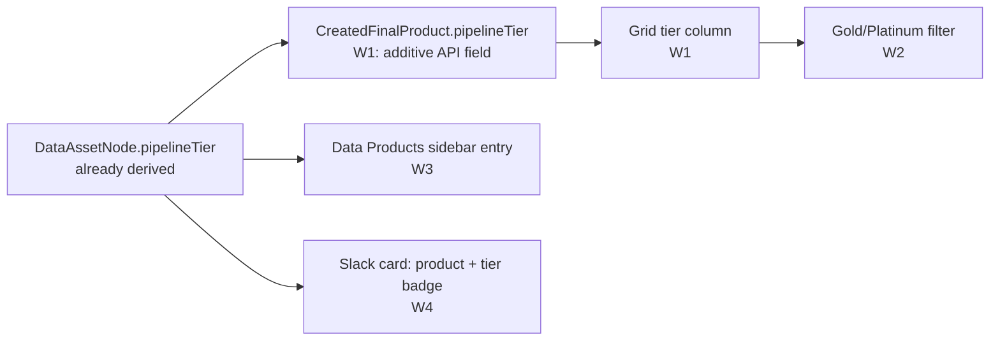

# Data Products by Tier — surfaced in-app, in the sidebar, and in Slack

> A **read-only surfacing layer** over the already-derived `pipelineTier` (§1 grounding, INV-1/INV-3):
> one additive API field, one grid column, one sidebar entry, one Slack grouping — no new tier logic.

## 1. Context

A data leader at Loop Capital wants to see, at a glance, **which data products are trusted (Gold /
Platinum)** and where each product sits in the medallion ladder — from the sidebar, on the product
grid, and in the Slack alerts they already receive. Today the tier exists and is even rendered, but
it's **buried**:

- `PipelineTier { RAW, BRONZE, SILVER, GOLD, PLATINUM, UNKNOWN }` is a real enum
  (`brighthive-platform-core/src/graphql/ogm/pipeline-typedefs.ts:15`), carried on
  `DataAssetNode.pipelineTier` (`src/graphql/ogm/typedefs.ts:567`, nullable) and
  `TransformationNode.pipelineTier` (`pipeline-typedefs.ts:87`), **derived** from the longest
  `DERIVES_FROM` chain (depth capped at 4) via a Cypher `CASE` — pure structure, no name inference
  (`service/neo4j/pipeline-lineage.ts:444-479`, mapping at `:464-472`; name-free tiering is BH-1265).
- The webapp **already renders tier chips** with per-tier color + a "trusted = GOLD/PLATINUM" insight
  — but only inside one per-project page (`src/Projects/ProjectObservabilityPage/PipelineLineageSection.tsx:65-83`,
  `lineageInsights.ts:4-50`).
- The **Created Data Products grid** (`src/Projects/CreatedDataProductsPage/CreatedDataProductsGrid.tsx:45`)
  shows name/status/group/owner/PII/tags — **no tier column** — because its API type `CreatedFinalProduct`
  (`src/graphql/schema/typedefs.ts:1314-1329`) never exposes `pipelineTier`. But the resolver **already
  returns the Neo4j `DataAssetNode`** keyed by `id` (merged via `DataAsset.find({id})`,
  `models/project.ts:131-150`) — the node carries the derived tier; the type just doesn't select it.
- The **sidebar** (`src/routes/index.tsx`, rendered by `SideBarV3`) has **no top-level "Data Products"
  entry** — it exists only as a per-project sub-tab. A workspace-wide observability view *does* exist
  (`src/Context/pages/ProjectContextPage.tsx`) but sits under "Knowledge → Projects & Context."
- **Slack** signals publish **one-at-a-time with no tier or product grouping**
  (`brightbot/agents/governance_agent/sub_agents/pipeline_watchdog_task.py:277-286`; dedup key is the
  4-tuple `(workspace_id, source_type, job_id, failure_type)`).

### Build waves (start simple, add the next wave only after the prior ships)

| Wave | Deliverable | Why first |
|---|---|---|
| **W1** | Tier badge column on the Created Data Products grid (additive `pipelineTier` on `CreatedFinalProduct` + column) | Smallest, highest-signal — one field + one column over data the resolver already loads |
| **W2** | Gold/Platinum **filter** on the grid, over the `pipelineTier` W1 already puts on each row | Answers "show me only trusted products" — pure client-side filter, no new backend query |
| **W3** | Top-level **"Data Products"** sidebar entry — promotes the workspace-wide view out of "Knowledge" | Navigation change; only worth it once the grid is tier-aware |
| **W4** | Slack: **group** watchdog signals by data-product + tier badge in the rendered card | Largest — touches the publish path + Slack renderer; do last |



## 2. Interface Contract (MDE)

### 2.1 W1 — additive tier field on the data-product API type (platform-core)

```graphql
# src/graphql/schema/typedefs.ts:1314 — CreatedFinalProduct gains ONE additive, nullable field.
# Value is READ from the resolved node's already-derived pipelineTier — never set here.
type CreatedFinalProduct {
  # ...existing fields (typedefs.ts:1315-1328) unchanged...
  pipelineTier: PipelineTier   # nullable: UNKNOWN/absent for a product with no resolved lineage
}
```

Resolver: `ProjectModel.getCreatedDataProducts` (`src/graphql/models/project.ts:1096`) already returns the
Neo4j `DataAssetNode` (re-fetched by `id` via `DataAsset.find({id})` and merged, `project.ts:131-150`).
That node already carries the derived, cached `pipelineTier` (`ogm/typedefs.ts:567`) — the field is simply
not selected onto the GraphQL type today. Exposing it is a select + map, **no new derivation, no Cypher change**.

### 2.2 W2 — grid tier filter (webapp, pure client-side over the W1 field)

```typescript
// src/Projects/CreatedDataProductsPage/ — filter state over the pipelineTier each grid row
// ALREADY carries after W1. No new backend query: there is NO workspace-wide products-by-tier
// query (pipelineLineage(tier:) requires a nodeId + direction — a single-node walk, not a list).
// "Trusted" preset = { GOLD, PLATINUM }.
type TierFilter = ReadonlySet<PipelineTier>;
```

### 2.3 W3 — top-level sidebar entry (webapp, route-tree change only)

```typescript
// src/routes/index.tsx — one new nav: true node under Workspace.routes, label "Data Products",
// pointing at the EXISTING workspace-wide view (Context/pages/ProjectContextPage.tsx).
// genNav() picks it up automatically (SideBarV3/genNav.tsx:37-183) — no sidebar-component edit.
```

### 2.4 W4 — Slack card carries product + tier (brightbot publish path + slack renderer)

```python
# brightbot pipeline_watchdog_task.py publish payload (:277-286) gains two OPTIONAL fields in metadata:
#   metadata.data_product: str | None   # the product/group name the signal's asset belongs to
#   metadata.pipeline_tier: str | None  # the asset's derived tier, read not computed
# Absent when the signal has no resolvable asset (e.g. source_disk_low) — never fabricated.
```
```typescript
// brightbot-slack-server formatter.ts renderDetails (:143-189): when metadata.pipeline_tier is
// present, prepend a tier badge line. Card grouping by data_product is a renderer change only —
// no new stage type, no button (action buttons stay as-is per blocks.ts).
```

## 3. Invariants (DbC)

- INV-1 **Tier is read-only everywhere in this spec.** No surface (grid, filter, sidebar, Slack) writes,
  edits, or re-derives `pipelineTier` — it is displayed exactly as the node carries it.
- INV-2 `CreatedFinalProduct.pipelineTier` is **nullable**; a product with no resolved lineage shows
  `UNKNOWN`/absent, never a defaulted or guessed tier.
- INV-3 Tier is **never inferred from a name or label** — the value comes only from the node's derived
  field (`pipeline-lineage.ts:444-479`); this spec adds no name-based fallback.
- INV-4 The Gold/Platinum filter (W2) uses the existing `pipelineLineage(tier:)` query — it never
  introduces a second, divergent tier computation on the client.
- INV-5 Slack `metadata.data_product`/`pipeline_tier` are **optional and omitted when unresolvable** —
  a signal with no asset (e.g. `source_disk_low`) never carries a fabricated product or tier.

Budget: 5 invariants.

## 4. Acceptance Criteria (BDD)

```gherkin
Feature: Data products surfaced by medallion tier

  Scenario: A Gold data product shows its tier badge on the grid
    Given a created data product whose terminal asset derives to GOLD
    When I open the Created Data Products grid
    Then that product's row shows a GOLD tier badge
    And the badge color matches the existing per-project tier chip

  Scenario: Filtering to trusted products shows only Gold and Platinum
    Given a workspace with products across RAW, SILVER, GOLD, and PLATINUM
    When I apply the "Trusted" tier filter
    Then only the GOLD and PLATINUM products remain visible

  Scenario: A product with no resolved lineage shows UNKNOWN, not a guess
    Given a created data product with no DERIVES_FROM chain
    When I open the grid
    Then its tier renders as UNKNOWN
    And no tier is inferred from the product's name

  Scenario: Data Products is reachable from the top-level sidebar
    Given I am anywhere in the workspace
    When I open the sidebar
    Then a top-level "Data Products" entry is present
    And it opens the workspace-wide data-products view

  Scenario: A Slack failure card names the affected product and its tier
    Given a pipeline failure on an asset that belongs to a GOLD data product
    When the watchdog publishes the signal
    Then the Slack card shows the data product name and a GOLD tier badge

  Scenario: A signal with no asset carries no product or tier
    Given a source_disk_low signal with no associated data asset
    When the watchdog publishes it
    Then the Slack card shows no data-product name and no tier badge
```

Budget: 6 scenarios.

## 5. Out of Scope

- **Changing how tier is derived** — the depth→tier rule (`pipeline-lineage.ts:464-472`) is untouched.
- **A tier column on any grid other than Created Data Products** in these waves — Data Assets catalog
  tiering is a follow-up once this pattern proves out.
- **Slack action buttons** — the disabled pipeline/dbt action buttons (`blocks.ts:44-58`) stay disabled;
  W4 is a display/grouping change only.
- **Re-tiering on demand** — tier recompute stays triggered by lineage upsert (`models/pipeline-lineage.ts:21`).
- **Sensitivity tiers** (`TIER_1/2/3`, `schema.graphql:14-16`) — unrelated to medallion; not touched.

## 6. Dependencies

- `PipelineTier` enum + derived `pipelineTier` on `DataAssetNode` (`ogm/typedefs.ts:567`, ships) — read-only source of truth.
- `ProjectModel.getCreatedDataProducts` (`project.ts:1096`) — W1 resolver already returns the tier-bearing node (`:131-150`).
- Client-side row filtering — W2 filters the `pipelineTier` W1 exposes; **no** workspace-wide tier query exists to depend on.
- `SideBarV3` + `genNav()` route-tree nav (`src/routes/index.tsx`, `genNav.tsx:37-183`) — W3 seam.
- Watchdog publish path (`pipeline_watchdog_task.py:277-286`) + Slack `renderDetails`
  (`formatter.ts:143-189`) — W4 seams. Reuses the existing signal→notification pipeline; no new stage type.

## 7. Correctness Properties

### Property 1: Tier is display-only, everywhere
*For any* surface in this spec (grid, filter, sidebar, Slack), the tier shown equals the node's derived
`pipelineTier` — no surface writes or recomputes it.
**Validates: §3 INV-1/INV-3, §4 "A Gold data product shows its tier badge"**

### Property 2: No fabricated tier or product
*For any* product with no resolved lineage, the tier renders `UNKNOWN`; *for any* signal with no asset,
the Slack card carries no product/tier.
**Validates: §3 INV-2/INV-5, §4 "shows UNKNOWN, not a guess" / "carries no product or tier"**

Budget: 2 properties.

## 8. Eval Criteria

Not applicable — this spec adds no LLM behavior. Tier is a deterministic derived field; surfacing is
pure read/display.

## 9. Observability Contract

- **Log events** (W4, brightbot): `pipeline_watchdog.signal_product_resolved`,
  `.signal_product_unresolved` (per signal, debug) — records whether a data-product/tier was attached.
- **Attributes**: `workspace_id`, `data_product` (name only), `pipeline_tier` — never raw asset content.
- **Metrics**: none new (rides the existing notification metrics).

## 10. Test Coverage Update

### a. In-repo layered tests
- **platform-core** — L0: `CreatedFinalProduct.pipelineTier` resolves to the node's derived tier for a
  GOLD product; resolves `UNKNOWN` for a product with no lineage (one case per §2.1 contract).
- **webapp** — L1: grid renders a tier badge for each `PipelineTier` value; "Trusted" filter reduces the
  set to GOLD+PLATINUM (one case per §4 grid scenario). L1: sidebar `genNav()` output contains a
  top-level "Data Products" entry (§4 sidebar scenario).
- **brightbot** — L2: watchdog publish payload for a signal on a GOLD-tier asset carries
  `metadata.data_product` + `metadata.pipeline_tier`; a `source_disk_low` signal carries neither
  (§3 INV-5, §4 both Slack scenarios).

### b. Cross-repo e2e (`brighthive-e2e`)
- **One feature test** (§4 happy path, real backend): seed a workspace whose product derives to GOLD;
  assert the grid row shows a GOLD badge against the real `getCreatedDataProducts` response — a
  **real-behavior test** hitting the real resolver, not a mocked shape (`~/.claude/rules/test-behavior-real.md`).
- **One surface test**: platform-core returns `pipelineTier` on `CreatedFinalProduct` against the real
  backend for a known GOLD product (guards §2.1).
- **One error-path test**: a product with no lineage returns `UNKNOWN`, not an error or a defaulted tier.

### Self-verification
Run platform-core + webapp + e2e suites; confirm each §2 field, §3 invariant, and §4 scenario has a case;
confirm the e2e grid test asserts against a **real** GOLD product from the real resolver, not a fixture
invented to match.

## 11. PR Split

One PR per Ticket Breakdown row (below) — each carries its repo, wave, and size. Order by wave:
W1 (grid tier column) → W2 (filter) → W3 (sidebar) → W4 (Slack), then the e2e tests. Each wave is
independently shippable.

## Ticket Breakdown

All children of epic **BH-1255**, `issueType=Task`. Surfaces the medallion tier (Gold/Platinum) a data
leader asked to see. Numbers to create at handover.

| Ticket | Summary | Wave | Size |
|---|---|---|---|
| BH-XXXX (to create) | `feat(platform-core): additive CreatedFinalProduct.pipelineTier reading the node's derived tier` | W1 | S |
| BH-XXXX (to create) | `feat(webapp): tier badge column on Created Data Products grid (reuse TierChip)` | W1 | S |
| BH-XXXX (to create) | `feat(webapp): Gold/Platinum client-side tier filter over the pipelineTier column from W1` | W2 | S |
| BH-XXXX (to create) | `feat(webapp): top-level "Data Products" sidebar entry → workspace-wide view` | W3 | S |
| BH-XXXX (to create) | `feat(brightbot): attach data_product + pipeline_tier to watchdog signal payload` | W4 | M |
| BH-XXXX (to create) | `feat(slack): tier badge + data-product grouping in signal card renderer` | W4 | S |
| BH-XXXX (to create) | `test(e2e): Gold data product shows tier badge end-to-end; no-lineage → UNKNOWN` | — | S |
