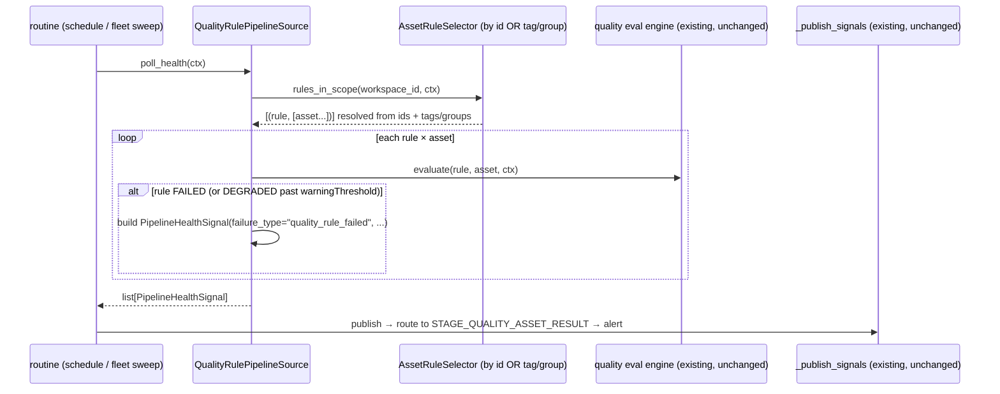

# Data Quality Rules on Assets — by Tag / Group, on a Routine

> **Axis 3 of the pipeline-monitoring model** (see `pipeline-self-healing-fleet.md` §1). Axis 1 is the *engine* a pipeline runs on; axis 2 is a *detector* (drift) watched across engines; **axis 3 is a declared quality rule — "what must be true of the data" — bound to a data asset or a tag/group of assets, evaluated on a routine, emitting the same `PipelineHealthSignal` the fleet already routes and alerts on.** Engine-agnostic by construction: a rule is expressed against an asset, never against dbt/SSIS/Snowflake — the same rule fires whatever engine produced the asset.

## 1. Context

BrightAgent **already** has a data-quality subsystem: `QualityRule` nodes with Great-Expectations-shaped expectation types (`ExpectColumnValuesToNotBeNull`, `ExpectColumnValuesToBeUnique`, `ExpectColumnValuesToBeBetween`, `ExpectColumnValuesToBeInSet`, `ExpectTableRowCountToBeBetween`, … — `quality_rule_translation.py:191-300`), a translation layer to GX + SQL (`quality_rule_translation.py:26,154`), persistence (`quality_rule_persistence.py`), GraphQL builders (`platform_queries_quality.py`), and an execution engine (`quality_tools.py:559,802`). Rules already declare **when** to run — `applyOnIngestion` / `applyOnSchedule` (`platform_queries_quality.py:10-34`, OGM context filter `ogm_queries.py:220-224`).

Three gaps stop this from being a *proactive, fleet-monitored* capability:

1. **Rules don't reach the signal backbone.** Rule execution writes a `QualityRuleExecution` node (`create_quality_rule_execution_mutation`, `platform_queries_quality.py:37-69`) and stops there. It never emits a `PipelineHealthSignal` (`pipeline_health.py:60-83`), so a failed quality rule is invisible to the watchdog's publish/route/alert path (`_publish_signals`, `pipeline_watchdog_task.py:192-345`) — even though the exact stage constant `STAGE_QUALITY_ASSET_RESULT = "quality_asset_result"` already exists (`notification_constants.py:15`). A rule can fail nightly and no one is told the way they're told about a disk-low or a dbt failure.
2. **No tag / group selection at the *rule* level.** A rule scopes to `SELECTED_ASSETS` (explicit id list) or `ALL_ASSETS` — the enum ships in platform-core (`QualityRuleScope`, `typedefs.ts:631-633`, honored in `findRules`, `service/neo4j/quality-rule.ts:255`). What's missing is scoping a rule to a *tag* or *group*: "every asset tagged `tier-0`", "the `holdings` group". The primitives already exist — `DataAsset.tags` TAGGED edges (`typedefs.ts:565`, NOT schema-only), a global `TagNode`, and `InputDataAssetGroupNode`/`FinalDataProductGroupNode` via INCLUDES edges — and `findRules` already resolves a *tagged asset's* rules (`tags_SOME.dataAssets_SOME`, `quality-rule.ts:257`). The gap is a **public resolver** that turns "tag/group → assets → rules-in-scope" into a first-class selector (§6 GAP #1), not tag storage.
3. **Not a fleet-monitored source.** Quality evaluation isn't a `PipelineSource` (`pipeline_health.py:86-95`), so it can't ride the fleet sweep, fairness, resilience, or the routine-scheduling seam (`brightroutine-approve-schedule.md`). It runs only inside the quality agent's own tools, on demand.

This spec closes all three by adding a **`QualityRulePipelineSource`** — a `PipelineSource` adapter (axis 3) that resolves the rules in scope for a workspace (by asset id *or* tag/group), runs the existing evaluation engine, and maps each **failed** rule to a `PipelineHealthSignal(failure_type="quality_rule_failed")`. It reuses the whole downstream backbone unchanged: publish → route (`_FAILURE_TYPE_TO_STAGE`) → alert. Healing is out of scope (a bad row is not auto-fixable); this is **detect + alert**, like drift.



## 2. Interface Contract (MDE)

Per `docs/CLAUDE.md`: the **port + registry come first**; the concrete selector/source below are the *first adapters, not the design*. No vendor engine string appears in any type here — a rule targets an *asset*, never dbt/SSIS/Snowflake.

### 2.1 The selector Port + registry (how assets are chosen — the agnostic seam)

```python
# brightbot/agents/governance_agent/tools/quality_rule_source.py (new)

@dataclass(frozen=True)
class AssetRef:                       # a monitored data asset, engine-neutral
    asset_id: str                     # the asset "id" surfaced by transform_asset_to_expected_format() (asset_management.py:47)
    display_name: str
    tags: frozenset[str] = frozenset()   # e.g. {"tier-0","holdings"} — the NEW governance dimension

@dataclass(frozen=True)
class RuleScope:                      # how a rule selects its assets — a CLOSED set of selector KINDS,
    kind: Literal["asset_ids", "all", "tag", "group"]   #   but the VALUES (which tags/groups) are open data
    asset_ids: tuple[str, ...] = ()   # kind="asset_ids": today's SELECTED_ASSETS (QualityRuleScope, typedefs.ts:633)
    selector: str | None = None       # kind="tag": tag name; kind="group": group node id — NEW public selector (GAP #1)
    # kind="all" maps to the existing ALL_ASSETS scope (typedefs.ts:632) — every asset in the workspace

class AssetRuleSelector(Protocol):    # listing rules+assets in scope is an external capability → a Port (PS-1)
    async def rules_in_scope(self, *, workspace_id: str,
                             ctx: RequestContext) -> list[tuple[QualityRule, list[AssetRef]]]:
        """Every ENABLED rule for the workspace, paired with the assets it targets —
        resolving asset_ids AND tag/group selectors to a concrete AssetRef list."""

SelectorBuilder = Callable[[SelectorConfig], AssetRuleSelector]
ASSET_RULE_SELECTORS: Final[dict[str, SelectorBuilder]] = {}   # single switch site (PS-3); + FakeAssetRuleSelector (PS-10)
```

```python
@dataclass(frozen=True)
class QualityRule:                    # a spec-introduced DTO, ASSEMBLED from the existing pieces (not a new engine)
    id: str
    expectation_type: str             # from expectation_to_rule_input() dict (quality_rule_persistence.py:49-83)
    expectation_params: dict[str, Any]  #   "  (same dict)
    severity: str                     #   "  (same dict); mapped via _SEVERITY_MAP (quality_rule_persistence.py:25)
    target_column: str | None         #   "  (same dict)
    warning_threshold: float | None   # from the GraphQL rule shape (platform_queries_quality.py), NOT the persistence dict
    apply_on_schedule: bool           # from the GraphQL rule shape / OGM context filter (ogm_queries.py:220-224)
```

**Note:** there is no `class QualityRule` in brightbot today — a rule is a **dict** (`expectation_to_rule_input()`, `quality_rule_persistence.py:49-83`) carrying `expectation_type`/`expectation_params`/`severity`/`target_column`, while `warningThreshold` + `applyOnSchedule` come from the GraphQL/OGM rule shape (`platform_queries_quality.py`, `ogm_queries.py:220-224`). This DTO is a thin read-model over both sources; the first adapter builds it, it does not redefine the persistence contract.

### 2.2 The evaluator Port (run a rule — reuse the existing engine behind a seam)

```python
@dataclass(frozen=True)
class RuleResult:
    status: Literal["passed", "failed", "degraded"]   # mirrors notification_constants.py:54-56
    observed: dict[str, Any]                            # unexpected_count, row_count, observed_value — for the diagnosis
    message: str

class QualityRuleEvaluator(Protocol):
    async def evaluate(self, *, rule: QualityRule, asset: AssetRef,
                       ctx: RequestContext) -> RuleResult: ...
# First adapter (NOT the design): GreatExpectationsEvaluator wraps the existing
# run_library_quality_check_direct / run_quality_validation_tool (quality_tools.py:802,559) +
# quality_rule_translation._rule_to_sql_fragment (quality_rule_translation.py:154). No new eval logic.
```

### 2.3 The source adapter (first adapter — axis 3 into the fleet backbone)

```python
class QualityRulePipelineSource:
    """PipelineSource (pipeline_health.py:86-95) over a workspace's quality rules.
    Resolves rules-in-scope, evaluates each, emits one signal per FAILED/DEGRADED rule×asset."""
    def __init__(self, *, selector: AssetRuleSelector, evaluator: QualityRuleEvaluator) -> None: ...
    def capabilities(self) -> frozenset[Capability]: ...      # {"QUALITY_RULES"}
    async def poll_health(self, *, ctx: RequestContext) -> list[PipelineHealthSignal]: ...

# Registered as an ENGINE-NEUTRAL detector, exactly like drift — a DETECTOR key in register_adapters()
# (pipeline_health.py:109-139), attached to pipelines/groups via a routine, NEVER a MonitoredPipeline.source_type.
QUALITY_RULES_ADAPTER_KEY: Final[str] = "quality_rules"
```

### 2.4 Signal mapping (§2 contract into the existing DTO)

```python
# Each FAILED/DEGRADED RuleResult → PipelineHealthSignal (pipeline_health.py:60-83), fields:
#   source_type   = "quality_rules"            (the detector key; source_type is `str` per fleet §2 CONTRACT CHANGE)
#   failure_type  = "quality_rule_failed"      (NEW — the one new failure_type this spec introduces)
#   job_id        = f"{asset.asset_id}:{rule.id}"   (stable per asset×rule → correct cooldown granularity)
#   severity      = rule.severity mapped (quality_rule_persistence.py:25): CRITICAL|WARNING|INFO
#   root_cause_class = DATA_SHAPE              (pipeline_health.py:53 — a quality failure is data-shape, never job-runtime)
#   diagnosis     = RuleResult.message
#   metadata      = {asset_id, asset_display_name, expectation_type, target_column, observed, matched_tags}
# ROUTING: add "quality_rule_failed" -> STAGE_QUALITY_ASSET_RESULT to _FAILURE_TYPE_TO_STAGE
#   (pipeline_watchdog_task.py:76-91). Stage constant already exists (notification_constants.py:15). No renderer to build.
```

## 3. Invariants (DbC)

- **INV-1 Engine-agnostic rule.** A `QualityRule`, `RuleScope`, `AssetRef`, and every routing decision SHALL be free of any pipeline-engine / warehouse identity. The same rule against the same asset fires identically whether dbt, SSIS, or Snowflake produced it. Grep test: no `if source_type ==`, no vendor string, in `quality_rule_source.py` or the selector.
- **INV-2 Tag/group is a governance dimension, not code.** Adding a new tag or group SHALL be workspace data (a tag applied to an asset), never a code change; `RuleScope.selector` is free-form. Only the four selector *kinds* (`asset_ids`/`all`/`tag`/`group`) are a closed set — the values are open.
- **INV-3 Only ENABLED, scheduled rules poll.** `poll_health` SHALL evaluate only rules with `applyOnSchedule=True` for the workspace (OGM context filter `SCHEDULED`, `ogm_queries.py:220-224`); on-ingestion-only rules are never swept here.
- **INV-4 One signal per FAILED/DEGRADED rule×asset; passing rules are silent.** A `passed` result SHALL emit no signal. A `degraded` result (past `warningThreshold`) emits a `warning`-severity signal; `failed` emits at the rule's mapped severity.
- **INV-5 Cooldown correct at rule×asset grain.** `job_id = "{asset_id}:{rule_id}"` so the existing 4-tuple cooldown (`pipeline_watchdog_task.py:249-275`) suppresses re-alerts per asset×rule, never collapsing two assets' failures of the same rule into one.
- **INV-6 Detect + alert only — no auto-heal.** This source SHALL NOT open a PR or mutate data; a failed quality rule surfaces a signal and stops. (No healer is registered for `quality_rule_failed`; `PIPELINE_HEALERS.find` returns `None` → terminal alert-only, per fleet INV-9.)
- **INV-7 Read-only evaluation.** Rule evaluation SHALL issue SELECT-only aggregate SQL (`_rule_to_sql_fragment`, `quality_rule_translation.py:154`) against the asset; it never writes to the warehouse.
- **INV-8 Reuse, don't fork.** Expectation translation, SQL generation, and execution SHALL reuse the existing `quality_rule_translation` / `quality_tools` code; this spec adds a selector + a signal bridge + an adapter, not a second quality engine.
- **INV-9 Unresolvable asset fails loud.** IF a `RuleScope` resolves to zero assets (bad tag, empty group) OR an asset can't be read, THE System SHALL emit a `quality_scope_unresolved` info-signal + log, never a silent no-op (mirrors the drift/SSIS "detection without a renderer is a documented failure mode" rule).
- **INV-10 Secret non-leakage.** `metadata.observed` SHALL carry aggregate counts/values only, never raw rows; everything on the wire passes `scrub_text` (`pipeline_watchdog_task.py:172-175`), so a value-in-set failure never leaks a PII cell.

Budget: 10 invariants.

## 4. Acceptance Criteria (BDD)

```gherkin
Feature: Quality rules on assets, by tag/group, on a routine

  Scenario: A failing rule on a tagged asset emits a routed signal
    Given a workspace with a NOT-NULL rule scoped by tag "tier-0"
    And two assets tagged "tier-0", one of which now has nulls in the target column
    When the quality-rules source is polled on its routine
    Then exactly one PipelineHealthSignal(failure_type="quality_rule_failed") is emitted
    And its job_id is "{failing_asset_id}:{rule_id}"
    And it routes to STAGE_QUALITY_ASSET_RESULT and reaches the alert surface

  Scenario: A passing rule is silent
    Given a uniqueness rule scoped to an asset whose key column is unique
    When the source is polled
    Then no signal is emitted for that rule×asset

  Scenario: Group selection resolves to concrete assets
    Given a row-count-floor rule scoped by group "holdings"
    And three assets in the "holdings" group
    When the source is polled
    Then the rule is evaluated once per asset in the group

  Scenario: A degraded result warns, a failed result alerts at rule severity
    Given a rule with warningThreshold=0.02 and severity CRITICAL
    When the observed bad-row fraction is 0.03 (past warn, under fail)
    Then a warning-severity signal is emitted
    And when the fraction crosses the fail bar a critical-severity signal is emitted

  Scenario: An empty tag scope fails loudly
    Given a rule scoped by tag "does-not-exist" resolving to zero assets
    When the source is polled
    Then a quality_scope_unresolved info-signal is emitted, not a silent skip

  Scenario: A quality failure never opens a PR
    Given a failing rule and no healer registered for "quality_rule_failed"
    When the signal is routed
    Then PIPELINE_HEALERS.find returns None and the outcome is terminal alert-only
```

Budget: 6 scenarios.

## 5. Out of Scope

- **Auto-remediation of a quality failure** — a bad row / null spike is not safely auto-fixable; detect + alert only (INV-6). If a class of failure ever becomes structurally fixable, it registers a healer against `SignalShape("quality_rules","quality_rule_failed")` later — a registration, not a change here.
- **Authoring new expectation types** — reuses the existing GX-backed set (`quality_rule_translation.py:191-300`); adding an expectation type is that subsystem's concern.
- **On-ingestion quality gating** — `applyOnIngestion` rules already run at ingestion; this spec covers the *scheduled/proactive* sweep only (INV-3).
- **The Slack-approval → schedule seam** — a quality routine is scheduled through the existing `brightroutine-approve-schedule.md` mechanism; not rebuilt here.
- **Tagging UI** — applying a tag/group to an asset in the webapp is a platform-core + webapp task (see §6 GAP); this spec consumes tags, it doesn't build the editor.

## 6. Dependencies

- `PipelineHealthSignal` + `PipelineSource` Protocol + `_publish_signals` + `_FAILURE_TYPE_TO_STAGE` (existing, reused unchanged).
- The `pipeline-self-healing-fleet.md` fleet backbone — this source registers as a detector key and rides the fleet sweep; `source_type` on the signal being `str` (fleet §2 CONTRACT CHANGE) is what lets `"quality_rules"` flow through the DTO.
- Existing quality subsystem: `quality_rule_translation.py`, `quality_tools.py`, `platform_queries_quality.py`, `ogm_queries.py:153-267`.
- **GAP #1 (platform-core — SMALLER than a greenfield build):** the storage already exists — `DataAsset.tags` TAGGED edges (`typedefs.ts:565`), a global `TagNode`, group nodes (`InputDataAssetGroupNode`/`FinalDataProductGroupNode` via INCLUDES), the `ALL_ASSETS`/`SELECTED_ASSETS` scope enum (`typedefs.ts:631-633`), and `findRules` resolving a tagged asset's rules (`tags_SOME.dataAssets_SOME`, `quality-rule.ts:257`). The **only** additions: (1) a public **`rulesInScope(workspace, tag|groupId)`** resolver (a thin traversal over the existing `findRules` + tag/group edges — not new storage), and (2) target **group *nodes*** (`InputDataAssetGroupNode`/`FinalDataProductGroupNode`), **NOT** a `DataAsset.group: String` scalar — no such scalar exists and grouping is modeled as nodes. Until the public resolver lands, `RuleScope.kind` is limited to `asset_ids`/`all` (both already honored) and tag/group scopes raise a clear "not yet supported" at save.
- **GAP #2:** the QualityRule→signal bridge is new — confirm `createQualityRuleExecution` (the existing result sink) and the new signal emission are **both** written (execution node for the quality history, signal for the alert), not one replacing the other.

## 7. Correctness Properties

### Property 1: Engine independence
*For any* asset A and rule R, `poll_health` produces the same signal (modulo `detected_at`) regardless of which engine populated A.
**Validates: §3 INV-1, §4 "A failing rule on a tagged asset emits a routed signal"**

### Property 2: Passing is silent, failing is loud
*For any* rule×asset, a signal is emitted **iff** the result is `failed` or `degraded`; `passed` yields none.
**Validates: §3 INV-4, §4 "A passing rule is silent"**

### Property 3: Scope resolution is total
*For any* `RuleScope`, `poll_health` either evaluates ≥1 asset or emits `quality_scope_unresolved` — never silently evaluates nothing.
**Validates: §3 INV-9, §4 "An empty tag scope fails loudly"**

Budget: 3 properties.

## 8. Eval Criteria

Not applicable — rule evaluation is deterministic SQL/GX (already evaluated under the existing quality subsystem's tests); this spec adds selection + signal mapping + scheduling around it, introducing no new LLM behavior.

## 9. Observability Contract

- **Span**: `gen_ai.tool.execute` with `gen_ai.tool.name=quality_rules_poll`.
- **Attributes**: `workspace.id`, `quality.rules_in_scope`, `quality.assets_evaluated`, `quality.signals_emitted`, `quality.scope_kind` — never raw column values.
- **Log events**: `quality_rules.poll_started`, `.rule_failed`, `.rule_degraded`, `.scope_unresolved`, `.poll_complete` (counts only).
- **Metrics**: `quality_rule_failures_total`, `quality_scope_unresolved_total`, tagged `workspace_id`, `expectation_type`.

## 10. Test Coverage Update

### a. In-repo layered tests (brightbot)
- **L0** — `QualityRulePipelineSource.poll_health` contract: signal shape per §2.4 (`failure_type="quality_rule_failed"`, `job_id="{asset}:{rule}"`, severity mapping); `AssetRuleSelector` / `QualityRuleEvaluator` Protocol conformance; `FakeAssetRuleSelector` + `FakeQualityRuleEvaluator` (PS-10) with a failure-injection mode.
- **L1** — routing: `"quality_rule_failed"` → `STAGE_QUALITY_ASSET_RESULT` via `_FAILURE_TYPE_TO_STAGE`; one case per §4 scenario where the scope-kind (id/tag/group/all) changes which assets resolve.
- **L2 (behavior, ≥1 real-behavior test)** — one per observable §3 invariant: a real NOT-NULL rule evaluated against a real captured asset fixture emits a routed signal (INV-1/INV-4); a passing uniqueness rule emits nothing (INV-4); an empty tag scope emits `quality_scope_unresolved` (INV-9); the emitted signal carries aggregate observed values only, no raw row (INV-10, `scrub_text` asserted). Span/log assertions (§9) sit in L2 alongside the behavior. Reuses the existing quality subsystem's real evaluation path — the GreatExpectationsEvaluator adapter over `run_library_quality_check_direct`, not a mock.

### b. Cross-repo e2e (`brighthive-e2e`)
- One feature test: a scheduled quality rule scoped by tag fails on a seeded asset; assert a `quality_asset_result` notification reaches the webapp/notification surface end-to-end (reuses the existing watchdog→notification path; new only in the quality trigger).
- One surface test: platform-core resolves `rulesInScope(workspace, tag)` to the expected AssetRefs against the real backend (guards GAP #1).

### Self-verification
Run brightbot's layered suite + the e2e; confirm every §2/§3/§4 entry has a case; confirm the L2 real-behavior test evaluates a real rule via the existing engine against a captured asset fixture, not an invented shape.

## 11. PR Split

1. **platform-core** — public `rulesInScope(workspace, tag|groupId)` resolver over the existing tag/group edges (GAP #1 — resolver only, storage already ships). (S)
2. **brightbot** — `AssetRuleSelector` port + registry + first adapter over the OGM query; `RuleScope` id/tag/group/all resolution. (M)
3. **brightbot** — `QualityRuleEvaluator` port + `GreatExpectationsEvaluator` wrapping the existing engine; `QualityRulePipelineSource` + signal mapping + `_FAILURE_TYPE_TO_STAGE` entry. (M)
4. **brightbot** — real-behavior L2 suite against captured asset fixtures (RUN_LIVE-gated). (S)
5. **brighthive-e2e** — feature + surface tests (GAP #1 + end-to-end alert). (S)

Ordered 1 → 2 → 3 → 4 → 5. Steps 2–3 can start behind a flag with `RuleScope` limited to `asset_ids`/`all` (both already honored) while step 1 lands the public tag/group resolver.

## Ticket Breakdown

All children of epic **BH-1255**, `issueType=Task`. Adds **axis 3** (declared quality rules on assets, by tag/group, on a routine) to the pipeline-monitoring family. Numbers to create at handover.

| Ticket | Summary | Size |
|---|---|---|
| BH-1283 | `feat(platform-core): public rulesInScope(tag\|groupId) resolver over existing tag/group edges` | S |
| BH-1284 | `feat(brightbot): AssetRuleSelector port + registry + OGM adapter (id/tag/group/all scope)` | M |
| BH-1285 | `feat(brightbot): QualityRulePipelineSource + QualityRule→PipelineHealthSignal bridge + routing` | M |
| BH-1286 | `test(brightbot): real-behavior L2 quality-rule eval against captured asset fixtures (RUN_LIVE-gated)` | S |
| BH-1287 | `test(e2e): scheduled tag-scoped rule failure reaches the quality_asset_result surface` | S |
