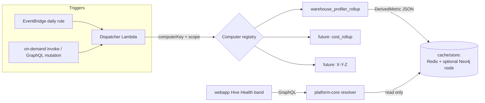

# Derived Metrics — switchable serverless compute framework

## 1. Context

Some workspace values are **expensive to compute** — e.g. the warehouse-profiler
roll-up (Σ row_count, avg missing %, total duplicate rows) must read and parse the
`result` JSON blob of every profiling capability execution, which for a large
workspace is thousands of blobs and can take tens of seconds. Computing these in a
GraphQL request (blocking the response) or in the browser (as the current
`useHiveHealth` widget mistakenly does) does not scale.

There is **no background compute or scheduler in platform-core today** (confirmed:
no CDK Lambda stack, no EventBridge, no worker; apoc is unavailable so Cypher can't
parse the JSON server-side). Rather than build a one-off Lambda for the profiler
number, this spec defines a **reusable, switchable serverless compute framework**:
a registry of named "computers" — each an isolated function that computes one
derived property for a scope (usually a workspace) — invocable **on a schedule**
(e.g. daily) or **on-demand**, writing its result to a cache/store that cheap
`-core` endpoints read. The warehouse-profiler roll-up is the **first computer**;
new heavy metrics are added as registry entries, not new infrastructure.

This is a Ports-&-Adapters shape (per `rules/pluggable-scalable.md`): the framework
is the port + registry; each "computer" is an adapter; adding a metric is a config +
registry change, never a call-site rewrite.



## 2. Interface Contract (MDE)

### 2.1 Computer port (the switchable unit)

```ts
type ComputeScope = { workspaceId: string };            // extensible: orgId, projectId later

interface DerivedMetricComputer {
  readonly key: string;                                  // registry discriminator, e.g. "warehouse_profiler_rollup"
  readonly version: number;                              // bump when output shape changes
  readonly ttlSeconds: number;                           // freshness budget for schedulers/cache
  compute(scope: ComputeScope): Promise<DerivedMetricValue>;
}

type DerivedMetricValue = {
  key: string;
  scopeId: string;                                       // workspaceId for now
  version: number;
  computedAt: string;                                    // ISO-8601, stamped by the runtime, not the computer
  value: Record<string, number | string | boolean>;      // the actual metric payload
  status: "ok" | "partial" | "error";
  detail?: string;                                        // plain-English note when partial/error
};

type ComputerFactory = () => DerivedMetricComputer;
const COMPUTER_REGISTRY: Record<string, ComputerFactory>; // the ONLY site naming concrete computers
```

### 2.2 Dispatcher invoke contract (Lambda event)

```
POST (invoke) DispatcherEvent:
  { computerKey: string, scope: { workspaceId: string }, reason: "scheduled" | "on_demand" }
  ->  { key, scopeId, status: "ok"|"partial"|"error", computedAt, durationMs }
```

### 2.3 Read endpoint (platform-core, cheap)

```graphql
# New field on WorkspaceAnalytics — reads the cached DerivedMetric, never computes inline.
type WarehouseProfilerRollup {
  totalRows: Int!
  totalColumns: Int!
  avgMissingPct: Float!
  totalDuplicateRows: Int!
  assetsProfiled: Int!
  computedAt: String            # null when never computed yet
  stale: Boolean!               # computedAt older than ttlSeconds
}
extend type WorkspaceAnalytics { warehouseProfilerRollup: WarehouseProfilerRollup }

# On-demand recompute trigger (service-key or workspace-admin authed).
recomputeDerivedMetric(input: { workspaceId: ID!, computerKey: String! }): DerivedMetricJobOutput!
```

## 3. Invariants (DbC)

- I-1: The read endpoint (`warehouseProfilerRollup`) **never computes inline** — it only reads the cached `DerivedMetricValue`. If none exists it returns `computedAt: null` + zeros, never a synchronous compute.
- I-2: A computer is invoked **only** via the registry by `key`; there is no direct call site. Grep test: the concrete computer class name appears only in its own file + the registry entry.
- I-3: Every `DerivedMetricValue` carries `computedAt` and `version`; a reader treats a value whose `version` ≠ current computer version as stale (schema drift safe).
- I-4: A computer runs in an **isolated** invocation (its own Lambda execution / timeout budget). One computer's timeout or crash never affects another or the GraphQL request path.
- I-5: `compute()` is **idempotent** for a `(key, scope)` within its freshness window — re-running overwrites the same cache key, never appends.
- I-6: Heavy compute is **off the request path and off the browser**: no GraphQL resolver and no React component parses the profiling `result` JSON. (Directly retires the current `useHiveHealth` client-side summation.)
- I-7: `ttlSeconds` and the schedule cadence are **config**, not literals in the computer body (per `rules/pluggable-scalable.md` PS-5).

## 4. Acceptance Criteria (BDD)

```gherkin
Feature: Switchable derived-metrics compute framework

  Scenario: Scheduled daily roll-up
    Given the warehouse_profiler_rollup computer is registered with a daily schedule
    When the dispatcher fires for a workspace on schedule
    Then it computes Σrows/avg-missing/dupes by reading profiling results server-side
    And writes one DerivedMetricValue to the cache with a fresh computedAt
    And the GraphQL warehouseProfilerRollup field returns those numbers without recomputing

  Scenario: On-demand recompute
    Given a workspace admin triggers recomputeDerivedMetric(warehouse_profiler_rollup)
    When the dispatcher runs the computer on-demand
    Then the cached value is overwritten (idempotent, not appended)
    And the read endpoint reflects the new computedAt

  Scenario: Never-computed workspace
    Given a workspace whose roll-up has never been computed
    When the webapp reads warehouseProfilerRollup
    Then it returns computedAt=null and zeros
    And no inline JSON parsing happens in the resolver or browser

  Scenario: One computer failing does not affect others
    Given two registered computers, one of which throws
    When the dispatcher runs both
    Then the failing one records status="error" with a detail
    And the other still writes its ok value

  Scenario: Adding a new metric is a registry change
    Given a new heavy metric "cost_rollup"
    When a developer adds a computer class + one registry entry + a read field
    Then no existing call site or dispatcher code changes
```

## 7. Correctness Properties

### Property 1: read path is compute-free
*For any* read of `warehouseProfilerRollup`, no profiling `result` JSON is parsed in
the resolver. **Validates: §3 I-1, I-6, §4 "Never-computed workspace".**

### Property 2: isolation
*For any* pair of computers, a timeout/exception in one yields its own `status:"error"`
and does not change the other's outcome. **Validates: §3 I-4, §4 "One computer failing".**

### Property 3: idempotent recompute
*For any* `(key, scope)`, N sequential computes leave exactly one cache entry with the
latest `computedAt`. **Validates: §3 I-5.**

## 5. Out of Scope

- Migrating other existing analytics counts (data assets, projects, members) into this
  framework — those are cheap Cypher and stay as direct resolver counts (fixed in PR #1106).
- A UI to browse/trigger computers (the `recompute` mutation is API-only for now).
- Cross-workspace / org-level aggregates (scope is `workspaceId` in v1; `ComputeScope`
  is designed to extend).
- Backfilling historical `computedAt` — first schedule run populates each workspace.

## 6. Dependencies

- New CDK stack (dispatcher Lambda + EventBridge daily rule + IAM) — none exists today.
- Redis (general-purpose client exists, `service/redis/client.ts` `setEx`/`get`/`ttl`).
- Neo4j read access for the profiler computer (reads `HAS_CAPABILITY_EXECUTION` → `result`).
- The profiling `result` JSON shape (`dataAssetProfileV2.overview` / `profileSummary`) —
  captured real sample lives in the Hive Health spec + tests.

## 8. Eval Criteria

N/A — deterministic compute; §3 invariants + §4 scenarios cover it. (If a future
computer wraps an LLM, that computer's own spec adds §8.)

## 9. Observability Contract

- **Span**: `derived_metric.compute` with attributes `derived_metric.key`,
  `workspace.id`, `derived_metric.version`, `derived_metric.duration_ms`,
  `derived_metric.status`.
- **Log events**: `derived_metric.started`, `derived_metric.ok`,
  `derived_metric.partial`, `derived_metric.error` (with curated reason, never a raw
  stack to a user surface).
- **Metric**: `derived_metric.duration_ms` histogram tagged by `key` — this is how we
  *know* which computers are the ~40s heavy ones and should stay scheduled vs on-demand.

## 10. Test Coverage Update

- **L0**: `warehouseProfilerRollup` GraphQL field returns the contract shape from a
  cached value fixture (built from the real captured profiling result).
- **L1**: dispatcher routes `computerKey` → correct computer via the registry; unknown
  key → typed error, not a crash.
- **L2 (real-behavior)**: run the `warehouse_profiler_rollup` computer against a real
  captured set of profiling results (Loop Capital's 11 assets → 2,394 rows, the
  live-verified number) and assert the written `DerivedMetricValue`; then assert the
  read endpoint returns it **without** re-parsing. Isolation test: two computers, one
  throws, assert the other's value still lands (Property 2).

## Verified-live basis (2026-07-19)

- Profiling numbers exist only inside `AgentCapabilityExecutionNode.result: String!`
  (no numeric node props) — confirmed from OGM typedefs.
- No apoc, no scheduler/Lambda, no analytics caching in platform-core — confirmed.
- Redis client is general-purpose (`setEx`/`get`/`ttl`) — confirmed.
- Real roll-up for Loop Capital: 2,394 rows across 11 profiled assets (computed live
  this session) — the L2 target number.

## Rollout sequence (per spec-first decision)

1. **This spec** (here) — reviewed before code.
2. **platform-core**: `DerivedMetricComputer` port + registry + `warehouse_profiler_rollup`
   computer + Redis read/write + read GraphQL field + `recomputeDerivedMetric` mutation.
   (Computer is invokable in-process first; the read endpoint works as soon as one value
   is cached.)
3. **New CDK stack**: dispatcher Lambda wrapping the registry + EventBridge daily rule.
   (The port is deploy-agnostic — same computer runs in-process or in the Lambda.)
4. **webapp**: point `useHiveHealth`'s profiler roll-up at `warehouseProfilerRollup`
   (drop client-side JSON summation — retires I-6 violation). Health/tiers/coverage
   stay as-is (already cheap).
