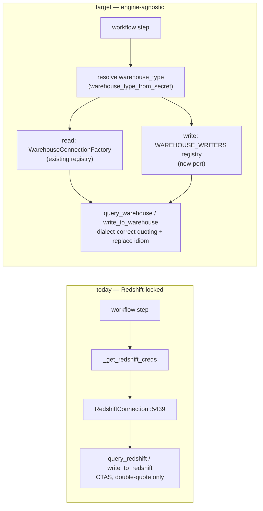

# Engineering agent — warehouse-agnostic read + write

## 1. Context

The engineering agent (`workflow_agent`) runs data-engineering workflow steps: it
reads from declared input tables, transforms via LLM-generated SQL, and writes
results into declared output tables. Today its tools are hardcoded to Redshift
end-to-end and **never consult the workspace's warehouse type** — so on a
Snowflake (oneten) or SQL Server / Synapse (loopcapital) workspace, every read and
every write silently fails or connects to the wrong engine.

Concretely, in `brightbot/agents/workflow_agent/tools.py`:

- `_get_redshift_creds` (`:52`) + `_redshift_connection` (`:64`) construct a
  `RedshiftConnection` on port 5439 regardless of engine.
- The write path (`write_to_redshift:219`, `_execute_write_sql:78`) does Redshift
  CTAS (`DROP TABLE IF EXISTS` + `CREATE TABLE … AS`) via the raw driver cursor.
- `_requote_fqns` (`:104`) restores **double-quote** identifiers only — breaks
  SQL Server, which brackets identifiers (`[schema].[table]`).
- `generate_sql` (`:298`) prompts the LLM for "Redshift SQL" / "standard Redshift".
- The tools are named `query_redshift` / `write_to_redshift` — the engine leaks
  into the product surface the LLM (and, in traces, the operator) sees.

The read side of the platform is **already engine-agnostic**: the retrieval agent
resolves `warehouse_type` and dispatches through `WarehouseConnectionFactory`
(`warehouse_connections.py:1271`) over the `CONNECTION_CLASSES` registry
(`:1263`), which covers Redshift, Snowflake, Synapse/SQL Server, and Postgres.
The engineering agent must adopt that same seam for reads — and the platform must
grow the one piece that genuinely does not exist yet: a **cross-engine write
port**, since CTAS-style "replace this output table" is implemented for Redshift
only and nowhere in the shared abstraction.



This spec makes the engineering agent read **and** write correctly on all three
live staging warehouses (Snowflake, SQL Server/Synapse, Redshift). It is the last
Redshift-locked capability in the engine-branch sweep (see BH-1314/1315/1317/1318/1319).

## 2. Interface Contract (MDE)

### 2a. Port + registry FIRST — the write seam (new)

Writes are the missing capability. The port describes *replace an output table
with the result of a SELECT*, in domain terms, per dialect. The first adapter is
Redshift (today's behavior, extracted); Snowflake and SQL Server / Synapse are
registry slots filled by this spec.

```python
# brightbot/tools/warehouse_writers.py  (new module)
from typing import Protocol, Callable, Final
from brightbot.utils.warehouse_types import (
    WarehouseType, REDSHIFT, SNOWFLAKE, AZURE_SYNAPSE, POSTGRES,
)
from brightbot.tools.warehouse_base import WarehouseConnection

class WarehouseWriter(Protocol):
    """Replace a declared output table with the rows a SELECT produces."""

    def replace_table_as_select(
        self, *, conn: WarehouseConnection, target_fqn: str, select_sql: str
    ) -> int:
        """Atomically (re)create target_fqn from select_sql; return rows written."""
        ...

WriterFactory = Callable[[], WarehouseWriter]

WAREHOUSE_WRITERS: Final[dict[WarehouseType, WriterFactory]] = {
    REDSHIFT:      RedshiftTableWriter,       # adapter #1 — today's DROP + CREATE TABLE AS
    SNOWFLAKE:     SnowflakeTableWriter,      # CREATE OR REPLACE TABLE … AS
    AZURE_SYNAPSE: SqlServerTableWriter,      # DROP TABLE IF EXISTS + SELECT … INTO
    # POSTGRES: registry slot — no live Postgres workspace yet
}

def build_writer(*, warehouse_type: WarehouseType) -> WarehouseWriter:
    writer = WAREHOUSE_WRITERS.get(warehouse_type)
    if writer is None:
        raise UnsupportedWarehouseWrite(warehouse_type)   # typed, never silent
    return writer()
```

Per-dialect replace idiom encapsulated in each adapter (the whole point of the port):

| Engine | Replace idiom |
|---|---|
| Redshift | `DROP TABLE IF EXISTS {t}` then `CREATE TABLE {t} AS {select}` |
| Snowflake | `CREATE OR REPLACE TABLE {t} AS {select}` (single atomic statement) |
| SQL Server / Synapse | `DROP TABLE IF EXISTS {t}` then `SELECT … INTO {t} FROM (…)` (T-SQL has no CTAS) |

### 2b. Reuse the existing read seam — no new read port

Reads dispatch through the abstraction the retrieval agent already uses:

```python
# existing — brightbot/tools/warehouse_connections.py
WarehouseConnectionFactory().create_connection(
    params=warehouse_config, warehouse_type=resolved_type
)  # -> WarehouseConnection  (Redshift | Snowflake | Synapse | Postgres)
```

### 2c. Engineering-agent tool surface (renamed, engine-neutral)

```
query_warehouse(sql: str) -> str            # was query_redshift
write_to_warehouse(sql: str, target_fqn) -> str   # was write_to_redshift
inspect_schema(fqn: str) -> str             # unchanged name; dialect-correct catalog query
```

Wire note: `query_redshift` / `write_to_redshift` are tool names the agent's tool
loop pins. Renaming follows the wire-rename discipline — the agent prompt +
tool list ship in the same change; no external consumer pins these names (they are
internal LLM tools created per-run by `create_workflow_tools`).

### 2d. Credentials + quoting (shared, not re-derived)

- Credentials: `get_warehouse_config_from_secrets(workspace_id)`
  (`platform_queries.py:460`) replaces the Redshift-specific `_get_redshift_creds`.
  This also drops the divergent `secret["warehouses"][workspace_id]` key access
  (a latent bug — warehouses are keyed by warehouse_id, resolved by
  `next(iter(values()))` in the generic helper).
- Identifier quoting: dialect-aware quoting via the existing
  `_quote_identifier(identifier, *, warehouse_type)` (`data_profiler.py:591`)
  family (bracket for Synapse, double-quote elsewhere, upper-fold for Snowflake),
  replacing the double-quote-only `_requote_fqns`.

## 3. Invariants (DbC)

Budget: ≤15.

1. WHEN the engineering agent builds a read connection, THE System SHALL obtain it
   from `WarehouseConnectionFactory` keyed on the resolved `warehouse_type` — never
   by constructing `RedshiftConnection` directly.
2. WHEN the engineering agent writes an output table, THE System SHALL route through
   `build_writer(warehouse_type=…)` — never inline CTAS in the tool body.
3. `warehouse_type` SHALL be resolved via `warehouse_type_from_secret` (idempotent
   normalizer) — never a raw `.lower()` on the stored secret type.
4. IF `warehouse_type` has no writer registered, THEN THE System SHALL raise a typed
   `UnsupportedWarehouseWrite`, never fall through to a Redshift default or a silent
   no-op.
5. THE read tools SHALL preserve the SELECT/WITH-only guard on every engine
   (no INSERT/UPDATE/DELETE/DDL through `query_warehouse`).
6. `write_to_warehouse` SHALL write only to an FQN in `trigger.allowed_output_fqns`.
7. THE SELECT portion passed to a writer SHALL pass `_BLOCKED_WRITE_KEYWORDS`
   before any table is dropped or created.
8. Identifier quoting SHALL match the target dialect (brackets for SQL Server /
   Synapse, double-quotes for Redshift/Snowflake/Postgres) — never double-quote-only.
9. PII masking (`enforce_pii_masking`) SHALL run on read rows before they reach the
   LLM, unchanged, on every engine.
10. Credentials SHALL be fetched via `get_warehouse_config_from_secrets` — one code
    path for all engines.

## 4. Acceptance Criteria (BDD)

Budget: ≤20.

```gherkin
Feature: Engineering agent runs on any warehouse engine

  Scenario: Read on a Snowflake workspace
    Given a workspace whose stored warehouse type is SNOWFLAKE
    When the engineering agent calls query_warehouse with a SELECT
    Then it connects via SnowflakeConnection through the factory
    And returns rows (up to 500) as JSON

  Scenario: Write (replace table) on a Snowflake workspace
    Given a declared output FQN on a Snowflake workspace
    When the agent calls write_to_warehouse with a SELECT
    Then the writer issues CREATE OR REPLACE TABLE … AS
    And reports the row count of the new table

  Scenario: Read on a SQL Server / Synapse workspace
    Given a workspace whose stored warehouse type is SQL_SERVER
    When the agent calls query_warehouse with a SELECT
    Then it connects via SynapseConnection (pymssql, port 1433)
    And identifiers are bracket-quoted, not double-quoted

  Scenario: Write on a SQL Server / Synapse workspace
    Given a declared output FQN on a SQL_SERVER workspace
    When the agent calls write_to_warehouse with a SELECT
    Then the writer issues DROP TABLE IF EXISTS then SELECT … INTO
    And reports the row count

  Scenario: Redshift behavior unchanged
    Given a Redshift workspace
    When the agent reads and writes
    Then it uses RedshiftConnection and DROP + CREATE TABLE AS exactly as before

  Scenario: Unsupported write engine fails typed, not silent
    Given a workspace whose warehouse type has no registered writer
    When the agent calls write_to_warehouse
    Then it returns a typed unsupported-write error
    And no table is dropped or created

  Scenario: Output-FQN guard still enforced across engines
    Given a target_fqn not in the declared output bindings
    When the agent calls write_to_warehouse on any engine
    Then it refuses before connecting and lists the allowed outputs
```

## 5. Out of Scope

- Postgres write adapter (registry slot only — no live Postgres workspace).
- Consolidating the four duplicated quoting helpers into one utility (tracked
  separately; this spec reuses `_quote_identifier`, it does not refactor the others).
- Changing the workflow trigger / callback protocol or the Neo4j catalog tools.
- The `redshiftTableCreation.py` helper (unused by this path).

## 6. Dependencies

- `WarehouseConnection` ABC + `CONNECTION_CLASSES` + `WarehouseConnectionFactory`
  (`brightbot/tools/warehouse_connections.py`, `warehouse_base.py`) — exist.
- `warehouse_type_from_secret` (`brightbot/utils/warehouse.py:178`) — exists.
- `get_warehouse_config_from_secrets` (`brightbot/tools/platform_queries.py:460`) — exists.
- `_quote_identifier` (`brightbot/utils/data_profiler.py:591`) — exists.
- Live ground-truth configs for oneten / loopcapital / bh-demo — provisioned (task #8).

## 7. Correctness Properties

This spec crosses a security boundary (read-only enforcement, write-path FQN
allowlist) and a state transition (replace-table), so properties are required.

### Property 1: Reads are SELECT-only on every engine

*For any* engine E and any SQL S submitted to `query_warehouse`, if S is not
SELECT/WITH/SHOW/DESC, the call is rejected before a connection executes it.

**Validates: §3 Invariant 5, §4 Scenario "Read on a Snowflake workspace"**

### Property 2: No write escapes the output allowlist

*For any* `write_to_warehouse(sql, target_fqn)` on any engine, if `target_fqn` ∉
`trigger.allowed_output_fqns`, no DROP/CREATE/SELECT-INTO statement is issued.

**Validates: §3 Invariant 6, §4 Scenario "Output-FQN guard still enforced across engines"**

### Property 3: Writer dispatch is total or typed-failing

*For any* resolved `warehouse_type`, `build_writer` either returns the dialect's
writer or raises `UnsupportedWarehouseWrite` — it never returns a mismatched
writer and never silently no-ops.

**Validates: §3 Invariant 2 + 4, §4 Scenario "Unsupported write engine fails typed, not silent"**

### Property 4: Replace is dialect-correct

*For any* engine E, the SQL the writer emits to replace a table is valid for E
(Redshift/Synapse: drop-then-create/into; Snowflake: create-or-replace) — a
Redshift `CREATE TABLE AS` is never sent to SQL Server.

**Validates: §3 Invariant 2 + 8, §4 Scenarios "Write … Snowflake" / "Write … SQL Server"**

## 8. Eval Criteria

The engineering agent is LLM-driven (SQL generation), so behavior is gated.

| Evaluator | Node | Mode | Threshold | Method |
|---|---|---|---|---|
| GeneratedSqlDialectEvaluator | generate_sql | GATE | score ≥ 0.8 | LLM judge — SQL matches target dialect (no LIMIT on T-SQL, correct quoting) |
| WriteReplaceValidityEvaluator | write_to_warehouse | GATE | 1.0 | deterministic — emitted DDL parses for the target engine |

## 9. Observability Contract

- **Span**: `gen_ai.tool.execute` with `gen_ai.tool.name` ∈
  {`query_warehouse`, `write_to_warehouse`, `inspect_schema`}.
- **Attributes**: `workspace.id`, `brightagent.warehouse.type` (resolved literal),
  `brightagent.warehouse.write_idiom` (`create_table_as` | `create_or_replace` |
  `select_into`), `brightagent.tool.rows_written`.
- **Log events**: `workflow.read.success`, `workflow.write.replaced`,
  `workflow.write.unsupported_engine`, `workflow.write.fqn_not_allowed`.
- **Metrics**: none.

## 10. Test Coverage Update

### a. In-repo layered evals (brightbot)

- **L0** — one case per §2 tool: `query_warehouse` / `write_to_warehouse` /
  `inspect_schema` accept the documented args and shape errors as strings.
- **L1** — the engineering-agent tool loop routes a read to the factory and a
  write to `build_writer` for each of the three engines (assert the resolved
  connection class + writer class per `warehouse_type`).
- **L2** — one case per §3 invariant observable from outside:
  - writer emits the dialect-correct replace SQL for Redshift / Snowflake /
    Synapse (assert on the SQL string the writer would execute);
  - unsupported engine → `UnsupportedWarehouseWrite` (Invariant 4);
  - output-FQN guard refuses before connecting (Invariant 6);
  - SELECT-only guard holds on each engine (Invariant 5);
  - bracket vs double-quote quoting per engine (Invariant 8).
  - One case per §8 evaluator at threshold.

### b. Cross-repo / e2e (brighthive-e2e)

- One feature test: an engineering-agent workflow step that reads an input and
  writes an output table, run against a **Snowflake** staging workspace end-to-end
  (real backend — the §4 happy path on a non-Redshift engine).
- One surface test per engine the write path now touches (Snowflake + SQL Server),
  asserting the output table exists and row count matches after the run.
- Error-path: a `target_fqn` outside the allowlist is refused on a live non-Redshift
  workspace.

At least one L2 case and the e2e feature test MUST exercise the real
`SnowflakeConnection` / `SqlServerTableWriter` against a staging workspace, not a
mock (per test-behavior-real).

## Ticket breakdown (epic BH-1168)

1. **BH-1320a** — New `warehouse_writers.py`: `WarehouseWriter` port +
   `WAREHOUSE_WRITERS` registry + `RedshiftTableWriter` (extract today's CTAS) +
   `build_writer` + `UnsupportedWarehouseWrite`. Unit tests for dispatch.
2. **BH-1320b** — `SnowflakeTableWriter` (CREATE OR REPLACE) + `SqlServerTableWriter`
   (DROP + SELECT INTO) adapters + per-dialect replace-SQL tests.
3. **BH-1320c** — Rewire `workflow_agent/tools.py` reads through
   `WarehouseConnectionFactory` + generic `get_warehouse_config_from_secrets`;
   drop `_get_redshift_creds` / `_redshift_connection`.
4. **BH-1320d** — Rewire writes through `build_writer`; replace `_requote_fqns`
   with dialect-aware `_quote_identifier`; rename tools →
   `query_warehouse` / `write_to_warehouse`; de-Redshift the `generate_sql` prompt.
5. **BH-1320e** — §8 evaluators + §9 spans/log events.
6. **BH-1320f** — §10 e2e feature + surface tests on Snowflake + SQL Server.
