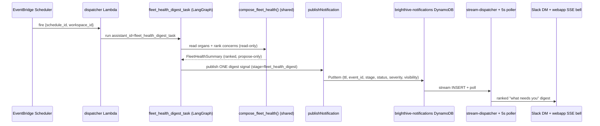

# Fleet-Health Digest — Proactive Push (BH-1340)

> **Status:** Draft · **Owner:** drchinca · **Epic:** BH-1331 (fleet-health companion)
> **Depends on:** BH-1331 (merged to develop #983, live on staging #984)

## 1. Context

BH-1331 built the fleet-health companion: `get_fleet_health` composes every
proactive organ — scheduled quality checks, profilers, the pipeline watchdog, the
BrightSignals stream, and the capability menu — into one ranked *"what needs you"*
view, each concern carrying a **proposed** (never executed) next action.

It has one gap that leaves the autonomy promise incomplete: **it is pull-only.** The
composition runs only when a user or agent explicitly invokes the MCP tool. The
per-signal alerts a *single* organ publishes already push to the user
(`publishNotification` → `brighthive-notifications-{env}` DynamoDB → stream-triggered
dispatcher Lambda + 5s poller → Slack DM/channel, email, webhook, Teams, and the
webapp SSE bell). But the *fleet-level synthesis* — the one view that ranks
everything and says what needs you first — never reaches the user unprompted.

This spec closes that gap the pluggable way: **no new delivery channel.** A new
scheduled action type `fleet_health_digest_task` runs on the existing EventBridge
Scheduler cadence, composes the existing fleet-health summary, and publishes **one
digest signal** (stage `fleet_health_digest`) onto the *same* push path every other
signal already rides. The composed "what needs you" view reaches Slack and the
webapp bell on a schedule, with zero user initiation — and stays read-only and
propose-only end to end.



## 2. Interface Contract (MDE)

The digest rides the **existing** scheduled-action + signal-push contract. Nothing
new on the wire except one action_type value, one stage value, and one
signal-catalog entry. Every gate below must agree on the two string constants or
the digest is provisioned-but-silent (INV-6).

### 2.1 The two load-bearing string constants (single source of truth)

```python
# brightbot/agents/governance_agent/sub_agents/notification_constants.py
ACTION_FLEET_HEALTH_DIGEST: Final[str] = "fleet_health_digest_task"  # == langgraph.json graph key
STAGE_FLEET_HEALTH_DIGEST:  Final[str] = "fleet_health_digest"       # signal `stage` (free String!, no enum)
```

`action_type` MUST equal the `langgraph.json` graph key exactly — the dispatcher
POSTs `assistant_id=<action_type>` to LangGraph Cloud, so a mismatch is a 404 at
run time, not a load-time error.

### 2.2 Scheduled action registration (brightbot)

```
langgraph.json graphs:
  "fleet_health_digest_task":
    "./brightbot/agents/governance_agent/sub_agents/fleet_health_digest_task.py:fleet_health_digest_task_graph"

routes/scheduled_agents_routes.py:
  SCHEDULABLE_ACTIONS            += {ACTION_FLEET_HEALTH_DIGEST}
  ACTION_REQUIRED_INPUTS[ACTION_FLEET_HEALTH_DIGEST] = {"workspace_id"}
  _provision_owner_notification_subscription stage_by_action[ACTION_FLEET_HEALTH_DIGEST] = STAGE_FLEET_HEALTH_DIGEST
```

### 2.3 Dispatcher routing (platform-core)

```python
# lambdas/scheduled_agent_dispatcher/action_registry.py
ACTION_REGISTRY[ACTION_FLEET_HEALTH_DIGEST] = _langgraph_handler   # reuses LangGraphActionHandler unchanged
```

The dispatcher passes the task graph `{action_payload:{workspace_id}, created_by}`
and **no user JWT** — see 2.6.

### 2.4 The digest task graph (brightbot)

```
build_fleet_health_digest_task_graph() -> CompiledGraph   # single-shot: compose node → publish node
  input state:  {workspace_id: str, created_by: str}
  compose node: token = generate_token_via_ogm()          # Cognito M2M service token (2.6)
                summary = compose_fleet_health_summary(    # shared helper, factored from the MCP tool (task #49)
                            workspace_id=workspace_id, token=token, now=<injected>)
  publish node: publish_fleet_health_digest_signal(summary=summary, workspace_id=..., created_by=...)
```

No per-concern loop (that is the quality-check template's shape and would re-create
the noise the digest folds — INV-3). One compose, one publish.

### 2.5 The digest signal (brightbot → platform-core `publishNotification`)

```graphql
publishNotification(input: {
  workspaceId:  $workspace_id
  stage:        "fleet_health_digest"          # STAGE_FLEET_HEALTH_DIGEST
  status:       "passed" | "degraded" | "failed"   # healthy→passed; any WARNING→degraded; any CRITICAL→failed
  assetId:      $workspace_id                  # fleet-level: no single asset; workspace is the subject
  assetName:    "Proactive fleet"
  runContext:   "fleet_health_digest"
  metadata:     <JSON string: {headline, concern_count, monitors_total, monitors_enabled,
                               signals_reviewed, organs_unavailable, top_concerns:[{title,urgency,proposed_verb}]}>
  visibility:   "VISIBILITY_USER"              # + audienceUserIds:[created_by] → owner inbox (profiler pattern)
})
```

`status` is **hard-validated** by platform-core `notification-signal.ts`
(`VALID_STATUSES = {passed, failed, degraded}`, checked line 98-100) — a value
outside the set is rejected at the resolver. The healthy→`passed` /
WARNING→`degraded` / CRITICAL→`failed` mapping is the only lawful encoding of the
summary's three-level urgency onto that set.

### 2.6 Auth contract — the resolved token gap

The dispatcher gives the task graph **no user bearer token**, but
`compose_fleet_health_summary` needs one for `fetch_workspace_signals`
(`getDataAssetNotifications`, public Bearer API). Resolution:

- **Signals read** → `generate_token_via_ogm()` (Cognito M2M service token; the
  same path `simple_messaging_agent` / `workflow_agent` / `slack_workspace_mapping`
  already use). Reused, not re-implemented (CEMAF protocol-first).
- **Schedules read** → direct boto3 (`SCHEDULED_AGENTS_TABLE`), no token — unchanged.
- **Publish** → `NOTIFICATIONS_API_KEY` + `x-service-key`, no user token — unchanged.

The service token authorizes as the OGM service user, **not** the schedule's
`created_by`. Whether that principal can read a given workspace's signals through
the *public* API (which enforces membership, unlike `/ogm`) is not assumed — it is
asserted by INV-7 and proven by the real-behavior test in §10.

### 2.7 Signal-catalog entry (platform-core, webapp rendering)

```json
// src/notifications/signal-catalog.json
"fleet_health_digest": {
  "hasLiveProducer": true,
  "severityRule": "<non-'computed' rule mapping status→severity for the bell/inbox>",
  "slackCopy": "<non-generic digest copy: headline + 'N need you' + deep link>"
}
```

Without this entry the webapp renders the stage with generic fallback copy and the
Slack card is a bare status line — the digest would deliver but read as noise.

## 3. Invariants (DbC)

- INV-1 The digest is **read-only**: composing it mutates no store (mirrors the
  `get_fleet_health` guarantee — reads the same organs, writes nothing but the signal).
- INV-2 The digest is **propose-only**: every concern's `proposed_action.requires_confirmation`
  is `True`; the task graph executes none of them.
- INV-3 **One signal per run.** WHEN a `fleet_health_digest_task` run completes, THE System
  SHALL publish exactly one `fleet_health_digest` signal — never one-per-concern (that would
  re-create the noise the digest exists to fold).
- INV-4 **A healthy fleet still publishes.** The digest publishes on every run regardless of
  health, encoding an all-clear as `status="passed"`. (No `publish_when_healthy` suppression
  lever in this spec — silent runs erode trust that the schedule fired; see §5.)
- INV-5 **Same compose, same answer.** The signal ranks the *same* concerns
  `get_fleet_health` would return for that workspace at that instant — both call the one shared
  `compose_fleet_health_summary`. The digest can never diverge from the pull view.
- INV-6 **No provisioned-but-silent stage.** IF the `fleet_health_digest` stage / 
  `fleet_health_digest_task` action_type is added, THEN it SHALL be registered on *every* gate
  it must clear — `SCHEDULABLE_ACTIONS`, `ACTION_REQUIRED_INPUTS`, the dispatcher
  `ACTION_REGISTRY`, the owner-subscription `stage_by_action`, the `langgraph.json` graph key,
  and `signal-catalog.json` with `hasLiveProducer:true` — before the spec is done. An
  unregistered gate is a digest that runs and never reaches anyone.
- INV-7 **Service-token reach is proven, not assumed.** The signals read authorizes as the OGM
  service principal (not `created_by`). WHERE that principal cannot read a workspace's signals
  through the membership-enforcing public API, THE System SHALL surface `brightsignals` in
  `organs_unavailable` (honest degradation), never fake an all-clear. This reach is asserted by
  a real-behavior test against staging (§10) before staging rollout — the copy-the-token-path
  shortcut is exactly where a silent cross-workspace authz gap would hide.
- INV-8 **Status maps lawfully onto the validated set.** The published `status` is always one of
  `{passed, degraded, failed}` (platform-core hard-validates); healthy→`passed`, worst
  urgency WARNING→`degraded`, worst urgency CRITICAL→`failed`. No other encoding.

## 4. Acceptance Criteria (BDD)

```gherkin
Feature: Proactive fleet-health digest push

  Scenario: scheduled digest reaches the user unprompted
    Given a workspace with a fleet_health_digest_task schedule and at least one unhealthy organ
    When the schedule fires on its cron cadence
    Then exactly one fleet_health_digest signal is published for the workspace
    And the signal ranks the same concerns get_fleet_health would return
    And it is delivered to the owner's Slack DM and the webapp SSE bell
    And no proposed action is executed

  Scenario: healthy fleet digest
    Given a workspace whose whole fleet is healthy
    When the schedule fires
    Then exactly one fleet_health_digest signal is published with status "passed"
    And its headline is the all-clear line
    # Always publishes — no suppression lever (INV-4): a silent run erodes trust the schedule fired

  Scenario: an unprovisioned organ degrades honestly in the digest
    Given the scheduled-agents store is unprovisioned in this environment
    When the digest composes
    Then the signal marks that organ unavailable rather than faking health
```

## 5. Out of Scope

- **New delivery channels** — reuses the existing push path only.
- **Auto-execution** of any proposed action — confirm gate unchanged.
- **New webapp UI** for the stage — renders through the existing signal/inbox path
  (a distinct digest card is a follow-up, not this spec).
- **New storage** — the digest composes existing read stores; the signal row uses
  the existing notifications table.
- **Non-admin default-on** — digest is opt-in via a schedule the workspace creates,
  matching BH-1331's admin-first rollout.

## 6. Dependencies

- BH-1331 fleet-health companion (`brightbot/fleet_health/`, `mcp/tools/fleet_health.py`) — merged, live on staging.
- Existing scheduled-agent path: EventBridge Scheduler + `scheduled_agent_dispatcher` Lambda + `SCHEDULED_AGENTS_TABLE` (platform-core).
- Existing signal push path: `publishNotification` resolver + `brighthive-notifications-{env}` table + `notification_dispatcher` Lambda + slack-server poller/SSE (platform-core + brightbot-slack-server).

## 7. Correctness Properties

> This spec crosses a proactive-delivery boundary (a scheduled job publishes to users
> without user initiation) and rides a service-token authz seam, so correctness
> properties are required.

### Property 1: Digest fidelity — push equals pull

*For any* workspace `w` and instant `t`, the concerns ranked in the published
`fleet_health_digest` signal are exactly those `get_fleet_health` would return for
`w` at `t` — both derive from the single `compose_fleet_health_summary(w, token, t)`.

**Validates: §3 INV-5, §4 Scenario "scheduled digest reaches the user unprompted"**

### Property 2: Exactly-one delivery

*For any* completed digest run, exactly one signal with `stage="fleet_health_digest"`
is written to `brighthive-notifications-{env}` — never zero (silent), never one-per-concern.

**Validates: §3 INV-3, INV-4, §4 Scenario "healthy fleet digest"**

### Property 3: Propose-only under automation

*For any* concern the digest carries, `proposed_action.requires_confirmation` is `True`
and the task graph invokes no mutating capability — a scheduled, unattended run has the
same execute-nothing guarantee as the human-invoked tool.

**Validates: §3 INV-1, INV-2, §4 Scenario "scheduled digest reaches the user unprompted"**

### Property 4: No silent authz gap

*For any* workspace where the OGM service principal cannot read signals through the
membership-enforcing public API, the digest marks `brightsignals` unavailable rather than
publishing a falsely healthy all-clear — and this reach is proven against staging before rollout.

**Validates: §3 INV-7, §4 Scenario "an unprovisioned organ degrades honestly in the digest"**

### Property 5: Every gate registered before delivery

*For any* environment where the schedule can be created, the `fleet_health_digest_task`
action_type and `fleet_health_digest` stage clear all six gates (INV-6) — a schedule that
can be created is a schedule that can deliver.

**Validates: §3 INV-6, §4 Scenario "scheduled digest reaches the user unprompted"**

## 9. Observability Contract

The digest is a production surface (a scheduled job that publishes to users), so it
emits telemetry the §10 tests assert on.

- **Span**: `gen_ai.tool.execute` with `brightagent.action.type=fleet_health_digest_task`
  wrapping the compose+publish; child span for the `generate_token_via_ogm` mint and the
  `fetch_workspace_signals` read.
- **Attributes**: `workspace.id`, `brightagent.digest.concern_count`,
  `brightagent.digest.status` (`passed|degraded|failed`),
  `brightagent.digest.organs_unavailable` (list), `brightagent.digest.signal_published` (bool).
- **Log events**: `fleet_health_digest.started`, `fleet_health_digest.composed`,
  `fleet_health_digest.published` (carries the notification `event_id`),
  `fleet_health_digest.signals_unavailable` (INV-7 degradation — the cross-workspace-reach
  gap surfaces here, not silently), `fleet_health_digest.publish_failed`.
- **Metrics**: none (per-run volume is low; the signal row itself is the durable record).

## 10. Test Coverage Update

- **L0** — the digest signal publisher emits the contracted `stage`/`status`/`visibility`/`audienceUserIds`/`metadata` shape (one case per §2.5 field); `status` ∈ `{passed,degraded,failed}` for each of healthy/WARNING/CRITICAL summaries (INV-8).
- **L1** — the dispatcher routes `fleet_health_digest_task` to the LangGraph handler; a created schedule of this action type passes `SCHEDULABLE_ACTIONS` + `ACTION_REQUIRED_INPUTS`; the owner subscription is provisioned with `stage=fleet_health_digest` (INV-6, one assertion per gate).
- **L2** — the task graph composes via the *same* `compose_fleet_health_summary` `get_fleet_health` uses (INV-5, assert on shared fn), publishes exactly one signal (INV-3), preserves propose-only under automation (Property 3); the healthy→one-`passed`-signal case (INV-4); the `signals_unavailable` degradation path emits the §9 log event (INV-7).
- **Real-behavior** — one test drives the digest task against **staging** with the real OGM service token, proving (a) a `fleet_health_digest` signal lands on `brighthive-notifications-stg` and (b) the service principal actually reads that workspace's signals through the public API — or, if it cannot, that `brightsignals` is honestly marked unavailable (INV-7 / Property 4). Not a mocked publisher. Extends the existing quality-signal test suite, not a sibling file.
