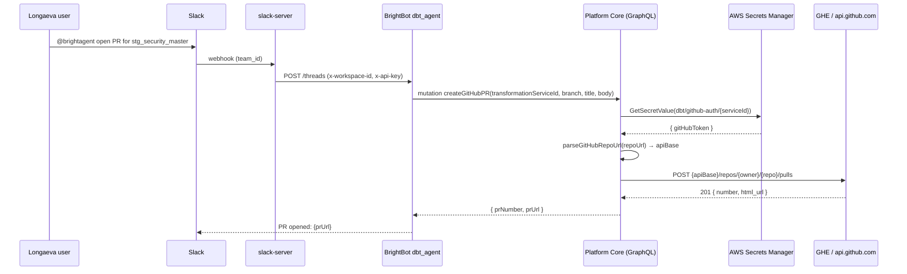

# GitHub Enterprise via Platform Core proxy

> **Note**: This spec describes the **target architecture** for [BH-529](https://brighthiveio.atlassian.net/browse/BH-529). Two PRs are open implementing it: [brighthive-platform-core#778](https://github.com/brighthive/brighthive-platform-core/pull/778) and [brightbot#490](https://github.com/brighthive/brightbot/pull/490). **Both PRs were senior-reviewed on 2026-06-02 and BLOCK merge** for security and completeness gaps — see §11 Implementation Gaps. The spec is the contract we ship against; the PRs need iteration before they meet it.

## 1. Context

Longaeva runs **GitHub Enterprise Server** (GHE). Every PR-raising milestone in their PoC scorecard ends in a PR against their GHE dbt repo. The original blocker (GAP-5 in `clients/trials/longaeva/BRIGHTHIVE_GAPS.md`) was framed as "thread `GITHUB_BASE_URL` through PyGithub in BrightBot." Implementation review found a load-bearing security gap underneath: **the GitHub PAT was entering BrightBot state, logs, Lambda memory, and serialised workflow checkpoints.** Fixing only `base_url` would have shipped GHE support while leaving credentials sprayed across the agent runtime.

BH-529 fixes both at once by **proxying every GitHub operation through Platform Core**. BrightBot's dbt agent now calls 7 GraphQL mutations on Platform Core; Platform Core resolves the customer's PAT from AWS Secrets Manager, derives the GHE API base URL from the repo URL, and executes the call via Octokit. The PAT never leaves Platform Core. PyGithub is **deleted** from BrightBot.

Multi-tenant routing is **derived, not configured**: each `TransformationService` already stores a `repoUrl`. `parseGitHubRepoUrl()` in `github-proxy.ts` extracts the host and produces the right Octokit `baseUrl` (`api.github.com` for dotcom, `https://{host}/api/v3` for everything else). No new schema, no new secret, no new admin UI required.



## 2. Interface Contract (MDE)

### 2.1 GraphQL surface (Platform Core)

Seven new mutations, all workspace-scoped. Each takes `transformationServiceId` + `workspaceId` and resolves the right host + token internally. **Note**: every output uses a `success/error` envelope pattern — failures return `{success: false, error: "..."}` rather than throwing GraphQL errors. BH-561 adds structured `errorCode` + `httpStatus`.

```graphql
type Mutation {
  readGitHubFile(input: ReadGitHubFileInput!): ReadGitHubFileOutput!
  listGitHubFiles(input: ListGitHubFilesInput!): ListGitHubFilesOutput!
  listGitHubBranches(input: ListGitHubBranchesInput!): ListGitHubBranchesOutput!
  createGitHubBranch(input: CreateGitHubBranchInput!): CreateGitHubBranchOutput!
  commitGitHubFiles(input: CommitGitHubFilesInput!): CommitGitHubFilesOutput!
  createGitHubPR(input: CreateGitHubPRInput!): CreateGitHubPROutput!
  mergeGitHubPR(input: MergeGitHubPRInput!): MergeGitHubPROutput!
}

input CreateGitHubPRInput {
  transformationServiceId: ID!
  workspaceId: ID!              # ⚠️ BH-559 will derive from context.token.sub instead
  repoId: ID                    # optional; defaults to the single ACTIVE repo
  title: String!
  body: String                  # optional; BH-566 will enforce template compliance
  headBranch: String!           # e.g. "bh/stg/vendor_security_master"
  baseBranch: String!           # e.g. "main"
}

type CreateGitHubPROutput {
  success: Boolean!
  prNumber: Int                 # populated on success
  prUrl: String                 # populated on success
  error: String                 # populated on failure; BH-561 adds errorCode + httpStatus
}

type ReadGitHubFileOutput {
  success: Boolean!
  content: String               # truncated at MAX_FILE_CONTENT_CHARS=20_000
  sha: String
  error: String
  # BH-561 adds: truncated: Boolean!
}
```

The other five mutations follow the same envelope pattern. Full schema in `brighthive-platform-core/src/graphql/schema/typedefs.ts` (134 lines added in BH-529).

### 2.2 BrightBot tool surface

`brightbot/agents/dbt_agent/tools/github_tools.py` (rewritten — 678 → 314 lines net). Eight LangChain tools: `github_read_file`, `github_list_files`, `github_list_branches`, `github_create_branch`, `github_commit_files`, `github_create_pull_request`, `github_merge_pull_request`, `github_describe_repo`. Each tool calls one mutation via `brightbot/tools/platform_queries.py` (190 lines, GraphQL client with workspace JWT auth). **No PyGithub import anywhere in BrightBot.**

Notable signature change:
- `github_merge_pull_request(pr_number: int, ...)` — was `(pr_url: str, ...)`. PR numbers are scoped to the proxy mutation; URL parsing is no longer the agent's job.

### 2.3 Workflow state (BrightBot)

`brightbot/workflows/states.py`:
- **Removed**: `github_pat: str` from `DbtCredentials` and any `*State` dataclass that carried it
- **Added**: `github_pr_number: int | None` (so the agent can hand a number to `github_merge_pull_request` later in the graph)

### 2.4 Credential storage

Unchanged from before BH-529 — secrets land where they already lived, just nobody downstream of Platform Core reads them anymore:

```
AWS Secrets Manager: dbt/github-auth/{transformationServiceId}
  { "gitHubToken": "ghp_..." }            # dotcom PAT or GHE PAT — same shape
```

The same PAT shape works against both hosts because GHE Server accepts personal access tokens identically. **No GitHub App, no OAuth Web Flow, no per-workspace OAuth secret.** A future ticket can add GitHub App installations; today's contract is "customer creates a PAT on whatever host they're on, pastes it once during dbt setup."

### 2.5 Host derivation

`parseGitHubRepoUrl()` in `brighthive-platform-core/src/graphql/service/github/github-proxy.ts:140-180`:

| Input shape | Example | apiBase |
|---|---|---|
| HTTPS dotcom | `https://github.com/brighthive/dbt-models` | `https://api.github.com` |
| HTTPS GHE | `https://ghe.longaeva.com/data-eng/dbt-models` | `https://ghe.longaeva.com/api/v3` |
| SSH dotcom | `git@github.com:brighthive/dbt-models.git` | `https://api.github.com` |
| SSH GHE | `git@ghe.longaeva.com:data-eng/dbt-models.git` | `https://ghe.longaeva.com/api/v3` |

GHE Server uses `/api/v3`; GitHub.com uses `api.github.com`. The function handles both forms, strips `.git` and trailing `/`, and rejects malformed URLs with `UserInputError`.

## 3. Invariants (DbC)

WHEN a BrightBot dbt_agent tool runs, THE System SHALL NOT contain the GitHub PAT in agent state, log statements, Lambda memory, or workflow checkpoints.

WHEN Platform Core resolves a `transformationServiceId`, THE System SHALL verify the requesting workspace_id owns that service before reading any secret.

WHEN Platform Core derives `apiBase` from `repoUrl`, THE System SHALL route to `api.github.com` only if the host string equals `github.com` (case-sensitive); every other host SHALL route to `https://{host}/api/v3`.

WHEN `gitHubAuthMethod = "DISABLED"`, THE System SHALL reject every GitHub mutation for that service with `UserInputError("GitHub integration is currently disconnected for this service.")`.

IF a service has no `gitHubAuthSecretArn`, THEN THE System SHALL reject every GitHub mutation with `UserInputError("No GitHub credentials configured for this transformation service.")`.

IF a `repoId` is omitted, THEN THE System SHALL select the single repo with `status = "ACTIVE"`; if zero or two-plus active repos exist, THE System SHALL raise `UserInputError`.

WHILE BrightBot is in flight, THE System SHALL authenticate to Platform Core using only the workspace JWT (`x-api-key` header); BrightBot SHALL NOT possess any token authoritative against GitHub directly.

WHERE `MAX_FILE_CONTENT_CHARS` is set (currently `20_000`), THE System SHALL truncate `readGitHubFile` output to that ceiling and emit `truncated=true` in the response.

## 4. Acceptance Criteria (BDD)

```gherkin
Feature: dbt agent opens a PR via Platform Core proxy

  Scenario: dotcom workspace opens a PR (legacy path preserved)
    Given a TransformationService with repoUrl "https://github.com/brighthive/dbt-models"
    And a valid PAT stored at dbt/github-auth/{serviceId}
    When BrightBot's dbt agent calls createGitHubPR
    Then Platform Core resolves apiBase = "https://api.github.com"
    And the PR is created on github.com
    And BrightBot receives { prNumber, prUrl }
    And the PAT does not appear in BrightBot logs or agent state

  Scenario: GHE workspace opens a PR
    Given a TransformationService with repoUrl "https://ghe.longaeva.com/data-eng/dbt-models"
    And a valid GHE PAT stored at dbt/github-auth/{serviceId}
    When BrightBot's dbt agent calls createGitHubPR
    Then Platform Core resolves apiBase = "https://ghe.longaeva.com/api/v3"
    And Octokit issues POST {apiBase}/repos/data-eng/dbt-models/pulls
    And the PR is created on the GHE host
    And no request is made to api.github.com during this turn

  Scenario: workspace ownership rejected
    Given workspace_id "ws-A" calls createGitHubPR with serviceId belonging to "ws-B"
    Then Platform Core rejects with "Transformation service does not belong to this workspace."
    And no secret is read from Secrets Manager
    And no GitHub call is made

  Scenario: GitHub disabled on the service
    Given a TransformationService with gitHubAuthMethod = "DISABLED"
    When any GitHub mutation is called
    Then Platform Core rejects with "GitHub integration is currently disconnected for this service."

  Scenario: malformed repo URL
    Given a TransformationService with repoUrl "not-a-url"
    When createGitHubPR is called
    Then Platform Core raises UserInputError with the offending URL
    And no Octokit call is made

  Scenario: missing PAT secret
    Given a TransformationService with gitHubAuthSecretArn = null
    When createGitHubPR is called
    Then Platform Core rejects with "No GitHub credentials configured for this transformation service."

  Scenario: BrightBot has no PyGithub dependency
    When `pip show PyGithub` runs in the BrightBot Lambda image
    Then the package is absent

  Scenario: mergeGitHubPR by number, not URL
    Given a successful createGitHubPR returned prNumber=42
    When the dbt agent calls github_merge_pull_request(pr_number=42)
    Then Platform Core merges PR #42 on the resolved host
```

## 5. Out of Scope

- **GitHub App / OAuth Web Flow auth** — current contract uses PAT only. Switching to a GitHub App (short-lived installation tokens, no user-token-on-leave problem) is the right next step but is a separate ticket. Documented in §6.
- **Per-workspace UI for GitHub host configuration** — not needed; host is derived from the repo URL the customer already enters during dbt setup. Webapp Settings does not need a "GitHub host kind" radio.
- **Self-signed CA bundle support** — Octokit currently uses Node.js system trust store. If Longaeva's GHE uses an internal CA not in the AWS Lambda Node trust store, this needs a `NODE_EXTRA_CA_CERTS` strategy. Surfacing as Phase 2 risk in §6.
- **Cross-host redirect handling** — if Longaeva fronts GHE with a CNAME redirect, Octokit's default `request.followRedirects` may strip the Authorization header. Surfacing as Phase 2 risk in §6.
- **GHE PR template / branch protection compliance** — `createGitHubPR` posts a body string; if GHE enforces required fields (CODEOWNERS, signed commits, JIRA-id in title), the PR may open but be unmergeable. The dbt agent's PR-body generator does not yet read `.github/pull_request_template.md`. Surfacing in §6.
- **Token refresh** — PATs don't expire programmatically. When customer rotates, they paste new PAT into webapp Settings → existing flow re-writes the secret. No refresh path needed for the PAT model.
- **Other BrightBot agents** — `super_agent`, `data_profiler_agent`, governance agents still use PyGithub directly via `brightbot/tools/github_*.py`. BH-529 explicitly limits scope to dbt_agent. Migrating the remaining 4 modules is a separate ticket.

## 6. Dependencies & Phase 2 Risks

### Hard prerequisites for Longaeva trial

| Item | Owner | Status |
|---|---|---|
| Longaeva provisions GHE PAT scoped to their dbt repo | Longaeva (Grant) | Blocker — needed before E2E test |
| Longaeva confirms GHE host URL and dbt repo URL | Longaeva | Blocker |
| Longaeva confirms TLS chain — public CA or internal | Longaeva | Determines whether Phase 2 CA-bundle work is needed |

### Open Phase 2 risks (from adversarial review)

| Risk | Severity | Mitigation |
|---|---|---|
| Cross-host redirect strips `Authorization` header on CNAME-fronted GHE → 401 → PAT-rotation spam | High | New ticket: configure Octokit `request.followRedirects: false` in github-proxy.ts; canonicalize host at write time; surface 30x as `GitHubHostMisconfigured` |
| Self-signed GHE CA not in Lambda trust store → TLS handshake fails | Medium | New ticket: `NODE_EXTRA_CA_CERTS` env or per-service CA bundle in Secrets Manager + write to disk on cold start |
| GHE PR templates / branch protections → PR opens but is unmergeable | Medium | New ticket: dbt-agent PR-body generator reads `.github/pull_request_template.md` and `CODEOWNERS` before formatting body |
| GHE rate limits differ from dotcom (often `60/hr` for self-hosted) → batching fails silently | Medium | New ticket: per-host rate-limit metric `github.api.requests{host}` + adaptive backoff in Octokit retry config |
| Existing BrightBot agents outside dbt_agent still hit `api.github.com` directly via PyGithub | Medium | New ticket: extend the proxy to `super_agent` + governance agents, then delete `brightbot/tools/github_tools.py` |

### Codebase preconditions (already satisfied by BH-529)

- Platform Core has Octokit dependency and a Secrets Manager IAM role with `secretsmanager:GetSecretValue` on `dbt/github-auth/*`
- BrightBot has `brightbot/tools/platform_queries.py` GraphQL client with workspace JWT auth
- TransformationService Neo4j model has `gitHubAuthSecretArn`, `gitHubAuthMethod`, `gitHubRepos { repoUrl, branch, status }` fields

## 7. Correctness Properties

State machine + security-boundary spec qualifies under `~/.claude/rules/spec-driven.md`.

### Property 1: PAT isolation

*For any* dbt-agent turn, the GitHub PAT exists only in (a) AWS Secrets Manager, (b) Platform Core process memory between `resolveGitHubToken()` return and the Octokit call, and (c) the in-memory request body of the Octokit HTTPS call. It SHALL NOT appear in any BrightBot variable, log line, agent state checkpoint, Lambda environment variable, or GraphQL response.

**Validates: §3 Invariant 1, §4 Scenario "BrightBot has no PyGithub dependency", §4 Scenario "dotcom workspace opens a PR"**

### Property 2: Host determinism

*For any* `repoUrl`, `parseGitHubRepoUrl(repoUrl)` returns the same `apiBase` regardless of caller, time, or workspace. The function is pure.

**Validates: §3 Invariant 3, §4 Scenarios "dotcom workspace" + "GHE workspace" + "malformed repo URL"**

### Property 3: Workspace tenant isolation

*For any* mutation invocation with `workspaceId = X` and `transformationServiceId = Y`, the operation succeeds if and only if `Y.workspace.id = X`. There exists no code path in `github-proxy.ts` that reads a secret before this check.

**Validates: §3 Invariant 2, §4 Scenario "workspace ownership rejected"**

### Property 4: Credential gating

*For any* GitHub mutation, if `gitHubAuthMethod = "DISABLED"` OR `gitHubAuthSecretArn = null`, no Octokit call is made and no secret read is attempted.

**Validates: §3 Invariants 4 + 5, §4 Scenarios "GitHub disabled on the service" + "missing PAT secret"**

## 8. Eval Criteria

This is not an LLM-generative capability — the dbt agent's prompts that *use* this layer have their own evaluators. The proxy itself is enforced by the §3 invariants and §7 properties above. No GATE evaluators on the proxy.

The dbt agent's existing PR-quality evaluators (`pr_open_for_generated_staging`, `surgical_fix_pr_after_dbt_test_failure` — see Longaeva scorecard) inherit the proxy and exercise it end-to-end during scorecard runs.

## 9. Observability Contract

Span `gen_ai.tool.github.execute` emitted by Platform Core for each proxied mutation:

| Attribute | Source |
|---|---|
| `gen_ai.tool.name` | mutation name (e.g. `createGitHubPR`) |
| `brightagent.workspace.id` | input.workspaceId |
| `brightagent.transformation_service.id` | input.transformationServiceId |
| `brightagent.github.host` | derived `apiBase` host (e.g. `ghe.longaeva.com`) |
| `brightagent.github.repo_url` | resolved repo URL (PAT NEVER attached) |
| `gen_ai.response.status_code` | Octokit response status |
| `brightagent.tool.output_size_bytes` | byte length of returned content (post-truncation) |

Log events:
- `github_proxy.started` — at mutation entry
- `github_proxy.workspace_check_failed` — on tenant mismatch
- `github_proxy.secret_resolved` — on Secrets Manager read success (no token in payload)
- `github_proxy.octokit_request` — before HTTP call (host, method, path)
- `github_proxy.success` — 2xx response
- `github_proxy.client_error` — 4xx (token revoked, branch protection, etc.)
- `github_proxy.host_misconfigured` — 30x redirect (Phase 2 risk)
- `github_proxy.tls_failed` — TLS handshake failure (Phase 2 risk)

Metrics:
- `github.proxy.requests{host, mutation, status_class}` counter
- `github.proxy.latency_ms{host, mutation}` histogram
- `github.proxy.token_resolution_ms` histogram
- `github.proxy.errors{host, error_kind}` counter

## 10. Ticket Breakdown

### Already shipped under BH-529

| # | Repo | Change | Status |
|---|---|---|---|
| BH-529-A | platform-core | `github-proxy.ts` (622 lines), 7 mutations, typedefs (+134), TransformationService model (+119) | [PR #778](https://github.com/brighthive/brighthive-platform-core/pull/778) — open, awaiting review |
| BH-529-B | brightbot | `platform_queries.py` (190), `dbt_agent/tools/github_tools.py` rewrite (678→314 net), `credentials_tools.py` PAT removal, `workflows/states.py` PAT removal | [PR #490](https://github.com/brighthive/brightbot/pull/490) — open, awaiting review |
| BH-529-C | brightbot | Migration guide `docs/BRIGHTBOT-GITHUB-PROXY-GUIDE.md` (342 lines) | Merged into BH-529-B |

### Remaining acceptance criteria on BH-529

- [ ] Both PRs reviewed and merged
- [ ] E2E test: dbt agent creates a PR against Longaeva GHE staging instance — blocked on Longaeva PAT + host

### Phase 2 follow-up tickets to cut under BH-526

| # | Title | Owner | Est | Trigger |
|---|---|---|---|---|
| TBD | feat(proxy): disable Octokit redirect-following + canonicalize host on write | Marwan | 1d | Before Longaeva trial |
| TBD | feat(proxy): self-signed CA bundle support via `NODE_EXTRA_CA_CERTS` or per-service PEM | Ahmed | 2d | Only if Longaeva confirms internal CA |
| TBD | feat(dbt-agent): read `.github/pull_request_template.md` + CODEOWNERS before composing PR body | Marwan | 2d | Before Longaeva trial |
| TBD | feat(proxy): per-host rate-limit metrics + adaptive backoff | Ahmed | 2d | Phase 2 |
| TBD | chore(brightbot): migrate non-dbt agents off PyGithub (super_agent, governance, profiler) | Kuri | 1 sprint | Post-Longaeva |
| TBD | feat(auth): GitHub App installation flow (replace PAT for GHE customers) | Kuri | 1 sprint | After GA |

### Hard Longaeva pre-conditions

| Item | Owner |
|---|---|
| Provision GHE PAT scoped to dbt repo | Longaeva (Grant) |
| Confirm GHE host + dbt repo URL | Longaeva (Grant) |
| Confirm TLS chain (public vs internal CA) | Longaeva (Grant) |

## 11. Implementation Gaps (as of 2026-06-02)

Senior review of both open PRs found these blockers. Both must close before merge.

### Platform Core PR #778 — `BLOCK MERGE`

| # | File:line | Severity | Gap |
|---|---|---|---|
| 1 | `github-proxy.ts:77-84`, all 7 resolvers in `transformation-service.ts:932-1033` | **P0 security** | `workspaceId` is taken from `args.input.workspaceId` (client-supplied) and the tenant check compares it to the service's `workspace.id` — both sides are client-controlled. Any caller with a valid JWT for workspace A can pass `workspaceId: B` and access B's PAT-mediated GitHub. **Fix**: derive `workspaceId` from `context.token.sub` like `createTransformationService` does (`transformation-service.ts:170`). |
| 2 | `github-proxy.ts:201` | **P0 security** | Native `fetch` follows redirects by default; Node 20 `undici` re-sends `Authorization` cross-origin. CNAME-fronted GHE → PAT leaks to redirected host. **Fix**: pass `redirect: 'manual'` and surface 30x as `GitHubHostMisconfigured`. |
| 3 | `github-proxy.ts:264-271` | **High** | `MAX_FILE_CONTENT_CHARS` slices content but never sets `truncated: true`. Dbt agent commits truncated models silently. **Fix**: add `truncated` bool to response. |
| 4 | All catch blocks | High | `err.message` from GHE forwarded raw; HTTP status dropped. dbt agent can't distinguish 401/403/404/422 → can't retry vs repair. **Fix**: structured `errorCode` + `httpStatus` + token-scrub on `err.message` before throw. |
| 5 | (entire branch) | High | Zero tests. No coverage of `parseRepoInfo`, `resolveServiceContext`, tenant check, error paths. |
| 6 | (Octokit absence) | Medium | Spec says Octokit; impl uses raw `fetch`. Either adopt Octokit (gets retry/throttle/pagination plugins for free) or document custom-fetch parity intentionally. |
| 7 | TLS / self-signed CA | Medium | No `dispatcher`/`Agent` with custom CA, no `NODE_EXTRA_CA_CERTS` doc. Failure surfaces as cryptic `UNABLE_TO_VERIFY_LEAF_SIGNATURE` to the dbt agent. **Fix**: doc env var + Lambda layer for GHE Server installs. |
| 8 | (no rate limiting) | Medium | No 403/`X-RateLimit-Remaining` handling. GHE Server admins commonly cap PATs at 60/hr → cascade-fail mid-PR (5+ calls per `commitGitHubFiles`). |

### BrightBot PR #490 — `BLOCK MERGE` (security headline is currently FALSE)

The spec's invariant 1 ("PAT never enters BrightBot state, logs, or Lambda memory") is **not satisfied on this branch**. Multiple legacy paths still import PyGithub and read `state["github_pat"]`.

| # | File:line | Severity | Gap |
|---|---|---|---|
| 1 | `pyproject.toml` | **P0** | `pygithub>=2.3.0` still pinned. Future re-introduction risk + import still works. |
| 2 | `super_agent/nodes/agents/dbt.py:8,159,177,327,385,639,657,667,753,1125` | **P0** | Parallel super_agent graph still uses `from github import Github` and reads/writes `state["github_pat"]`. Includes a Secrets Manager fetch poking the PAT into state at line 667. |
| 3 | `dbt_agent/utils.py:19,46,76,110,137,235,413,422,437` | **P0** | `_parse_github_url(url, github_pat)`, `Authorization: Bearer {github_pat}` headers, `get_models_list(dbt_folder_link, github_pat)` still PAT-shaped. Called by `simple_messaging_agent.py:430`. |
| 4 | `tools/github_file_commiter.py:4,36`, `tools/github_operations.py:3,42` | **P0** | Both still `from github import Github`. |
| 5 | `tests/unit/agents/test_dbt_react_tools.py:75,99,224,235,244,255,850,869` | High | Tests still pass `github_pat` and `from github import GithubException`. Pass against the deprecated path while new path is untested. |
| 6 | `bh_platform_api.py:130-135` | **P0 security** | Logs the full `requests.Session` (with `Authorization: Bearer {JWT}` header) and full payload at INFO. Same security boundary; JWT leak to CloudWatch. |
| 7 | (file does not exist) | Medium | `docs/BRIGHTBOT-GITHUB-PROXY-GUIDE.md` referenced in PR description but absent on the branch. |
| 8 | `platform_queries.py:738-922` | Medium | 7 mutation responses are `tuple[str, dict]` — no Pydantic models, violates `python-environment.md` strong-typing rule. |
| 9 | `github_tools.py:88,122,156,198,245,295` | Medium | `PlatformAPISession` instantiated inline in every tool. Not injectable → testing requires `patch()` → violates `testable-code.md`. |
| 10 | (no test) | Medium | No regression test asserting `import github` raises `ModuleNotFoundError` from inside BrightBot. Will fail today (PyGithub still a dep) — that's the point. |
| 11 | `workflows/states.py:254-260` | Medium | `github_pat` removed without checkpoint migration plan. In-flight LangGraph checkpoints from prod will deserialize against new schema. **Fix**: tolerant reader for one release, or document checkpoint flush. |

### Must-fix-before-Longaeva-trial summary

1. Tenant isolation derived from `context.token` (PR #778)
2. Disable redirects + token-scrub error messages (PR #778)
3. `truncated=true` + structured error codes to BrightBot (PR #778)
4. Finish PAT removal: drop `pygithub` from pyproject; migrate or delete `super_agent/dbt.py`, `dbt_agent/utils.py`, `tools/github_file_commiter.py`, `tools/github_operations.py`; update tests; add `import github` regression test (PR #490)
5. Stop logging session/Authorization at INFO in `bh_platform_api.py` (PR #490)
6. Type the 7 mutation responses with Pydantic + inject the GraphQL client (PR #490)
7. Author the actual migration guide `docs/BRIGHTBOT-GITHUB-PROXY-GUIDE.md` (PR #490)
