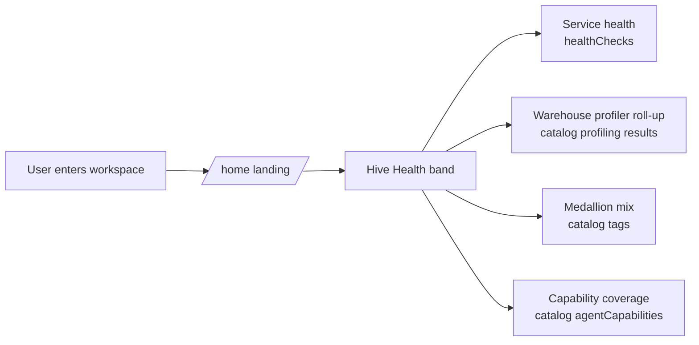

# Hive Health — landing value-added indicator

## 1. Context

The first thing a user sees on entering a workspace should answer "is my hive
healthy?" at a glance — the overall health of their connected warehouse(s), an
aggregate profile of the data in them, and how much of the catalog the agents have
already enriched. Today the workspace landing (`/workspace/:id/home`) is a chat/hero
screen with no health signal; users have to dig into the Analytics dashboard or the
catalog to learn anything about state.

This spec adds a **Hive Health band** as the first above-the-fold element on `/home`:
one compact indicator combining (a) service/warehouse health, (b) an overall
warehouse-profiler roll-up, (c) medallion-tier composition, and (d) agent capability
coverage. All from data that is already live and correct — deliberately **not** the
`analytics.overview` resolver, which has a confirmed edge bug returning
`totalDataAssets: 0` (see §5 / Out of Scope).



## 2. Interface Contract (MDE)

No new backend types. Consumes existing, verified-live GraphQL:

```graphql
# Already exists (src/graphql/queries/getHealthChecks.graphql) — verified live
workspace(input: {workspaceId}) {
  healthChecks { id service type status provider lastChecked }
}

# Already exists (GetDataAssets, consumed by useDataAssetsMetric) — verified live
workspace(input: {workspaceId}) {
  dataAssets(pagination: {limit: N}) {
    resultCount
    dataAssets {
      name tags
      qualityReportAvailable metadataAvailable embeddingAvailable hasSemanticView
      agentCapabilities { capabilityType result }
    }
  }
}
```

Frontend component contract:

```
HiveHealthBand(props: { workspaceId: string }) -> JSX
  // self-fetches via existing hooks; no new props threaded from parent
```

Derived view-model (computed client-side from the two queries above):

```ts
type HiveHealth = {
  services: { name: string; type: string; status: "Healthy"|"Degraded"|"Down"; lastChecked: string }[]
  overallStatus: "Healthy" | "Degraded" | "Down"          // worst of services
  warehouseProfile: {                                      // roll-up across assets that have a profiling result
    totalRows: number                                      // Σ row_count
    totalColumns: number                                   // Σ column_count
    avgMissingPct: number                                  // mean overall_missing_pct
    totalDuplicateRows: number                             // Σ duplicate_row_count
    assetsProfiled: number
  }
  tiers: { bronze: number; silver: number; gold: number; untiered: number }  // from tags
  coverage: { profiled: number; qualityChecked: number; semanticView: number; total: number }
}
```

## 3. Invariants (DbC)

- I-1: `overallStatus` = the worst status across `services` (Down > Degraded > Healthy). If any warehouse is Down, the band shows Down — never averaged away.
- I-2: Tier counts are derived from `tags` case-insensitively matching `BRONZE|SILVER|GOLD`; an asset with none counts as `untiered`, never dropped. `bronze+silver+gold+untiered == total`.
- I-3: `warehouseProfile` aggregates ONLY assets that actually carry a `profiling` capability result — an asset without one is excluded from sums, never counted as zero rows (which would understate the warehouse).
- I-4: The band never sources counts from `analytics.overview` (known-buggy). Asset total comes from `dataAssets.resultCount`.
- I-5: Every displayed number traces to a live field; no mocked/placeholder values (the existing Analytics page's `MOCK_ANALYTICS` must not leak into this band).
- I-6: Status is never conveyed by color alone — each status carries an icon + text label (accessibility; matches existing `HealthChecksPage` status config).

## 4. Acceptance Criteria (BDD)

```gherkin
Feature: Hive Health landing indicator

  Scenario: Healthy hive at a glance
    Given a workspace whose warehouse, dbt, and API health checks are all "Healthy"
    When the user opens /workspace/{id}/home
    Then the Hive Health band renders above the fold
    And the overall status reads "Healthy" with a success icon and label
    And the warehouse profiler roll-up shows summed rows, avg missing %, and duplicate count
    And the medallion mix shows bronze/silver/gold counts summing (with untiered) to the asset total
    And capability coverage shows profiled / quality-checked / semantic-view counts out of the total

  Scenario: A warehouse is unhealthy
    Given one warehouse health check reports "Down"
    When the band renders
    Then the overall status reads "Down" with the critical icon and label
    And the specific unhealthy service is identifiable by name, not color alone

  Scenario: Fresh workspace, no profiles yet
    Given a workspace with assets but no profiling capability results
    When the band renders
    Then the warehouse profiler roll-up shows "not yet profiled" rather than 0 rows
    And no fabricated numbers appear

  Scenario: Analytics resolver bug does not affect the band
    Given analytics.overview.totalDataAssets returns 0 for the workspace
    When the band renders
    Then the asset total still reflects the real catalog count (resultCount)
```

## 7. Correctness Properties

### Property 1: worst-status wins
*For any* set of service health checks, `overallStatus` equals the most severe
individual status. **Validates: §3 I-1, §4 "A warehouse is unhealthy".**

### Property 2: no phantom zeros in the profile roll-up
*For any* asset lacking a profiling result, it contributes nothing to
`warehouseProfile` sums and the UI distinguishes "not profiled" from "zero".
**Validates: §3 I-3, §4 "Fresh workspace, no profiles yet".**

### Property 3: tier partition is total
*For any* asset set, bronze+silver+gold+untiered == total. **Validates: §3 I-2.**

## 5. Out of Scope

- Fixing `analytics-resolver.ts` `getOverview` (`BELONGS_TO`→`USES` edge bug, line 147)
  and the `stubNull` `dataAssets`/`quality` sub-resolvers — real, confirmed, but a
  **separate platform-core PR**, not required for this band (band uses catalog data).
- Any new backend resolver, type, or Cypher.
- Trend-over-time / historical health sparklines (needs a metrics time series;
  longitudinal drift exists separately but isn't wired to a landing sparkline).
- Making `/home` stop redirecting to `/catalog/assets` for some users (BH-816) — if
  that redirect is active, the band placement question resurfaces; flag, don't fix here.

## 6. Dependencies

- `getHealthChecks` query + status→color/icon config (`Analytics/pages/HealthChecksPage.tsx`) — exists.
- `useDataAssetsMetric` hook (catalog counts + coverage) — exists.
- `KPICard` / `StatCard` / `AnimatedRing` / `Dot` primitives (`Analytics/components/`) — exists, reuse.
- Theme tokens (`src/theme/theme.ts`) for status/tier colors — exists, no invented hex.
- dataviz skill palette validation for the tier/coverage color choices.

## 8. Eval Criteria

N/A — no LLM behavior in this surface; §3 invariants + §4 scenarios fully cover it.

## 9. Observability Contract

- No new spans (pure read UI). Existing GraphQL query telemetry covers the fetches.

## 10. Test Coverage Update

- **L0 (surface)**: component test asserting the band renders the four sub-sections
  from a fixture built from a **real captured** `healthChecks` + `dataAssets` sample
  (the live shapes in this spec's §2, not invented).
- **L1**: the worst-status computation (I-1) and tier partition (I-2) as pure-function
  unit tests over the real sample.
- **L2**: a real-behavior test that mounts the band against the staging workspace
  `e3fc0917-...` (or a captured replay of its two queries) and asserts overall status
  "Healthy", tier mix 5/3/3, coverage 11/11 — the actual live state.

## Verified-live basis (2026-07-17)

Every field this spec relies on was confirmed returning real data for Loop Capital
(`e3fc0917-03a6-4ac6-aad4-ac265329bfb9`):
- `healthChecks`: 3 services, all Healthy (SQL Server / dbt / Platform Core API).
- `dataAssets.resultCount`: 11; tags → 5 BRONZE / 3 SILVER / 3 GOLD.
- profiling result carries `row_count`, `column_count`, `overall_missing_pct`,
  `duplicate_row_count` per asset — aggregatable into the warehouse roll-up.
- `analytics.overview.totalDataAssets`: 0 (BUGGY — this spec deliberately avoids it).
