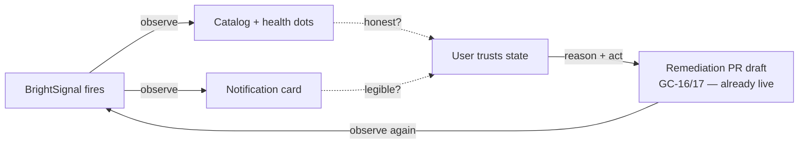

# Honest + stable observe surface — health dots, catalog, notification card

## 1. Context

BrightAgent is meant to work like an autonomous engineer: its own tools, its own
warehouse/dbt/git access, a standing loop that **observes** state, **reasons** about
cause, **acts** to remediate, then **observes again** to prove the fix. The pieces of
that loop already exist and run live for Loop Capital (`e3fc0917-…`): 50 BrightSignals
have landed, GC-14→17 watchdog drafts remediation PRs, `get_fleet_health` proposes
actions. What's weak is the **observe surface** the user reads — and if the surface
lies or thrashes, the whole loop looks untrustworthy.

Three concrete defects, all on the observe surface, all found while driving the live
Loop Capital catalog:

1. **The Preview health dot lies for BYOW assets.** All 11 `LoopCapitalAM` tables are
   Bring-Your-Own-Warehouse (Frank's SQL Server). Clicking Preview works — it queries
   his warehouse live every time (`data-asset.ts:3210`, the `isByow` branch). But the
   catalog's Preview dot calls a *different* resolver, `checkPreview`
   (`data-asset-health.ts:294`), which only ever does `s3.listObjects(…/_preview/)`.
   Nothing writes an S3 `_preview/` object for a BYOW asset (grep-confirmed: platform-core
   never writes that prefix), so the dot is **grey forever while preview genuinely works.**
2. **The catalog over-spins.** Every catalog load resolves health for N assets;
   `runFullHealthCheck` invalidates the *entire workspace* catalog Redis cache on every
   recompute, fire-and-forget (`data-asset-health.ts:392`). With a 5-minute freshness
   window that guarantees the next paint is a cold miss → spinner → repeat.
3. **The notification card is thin for the stages that matter most.** The live bell
   drawer (`Notification/index.tsx` `DrawerCard`) renders rich content only when the
   payload is a quality report. Pipeline-failure and agent-run signals — exactly the
   "something needs your attention" cases — collapse to icon + title + status chip. The
   card shows *that* something happened, never *what/why/what-next*.

This spec makes the observe surface **honest** (dots tell the truth), **stable** (catalog
stops thrashing), and **legible** (the card is a pane of glass onto the observe→reason→act
loop). It is deliberately scoped to the surface — the remediation loop itself
(BH-1329/GC-16/17) is already built and out of scope here.



## 2. Interface Contract (MDE)

No new GraphQL types, no new wire fields. Three behavior changes on existing surfaces.

### 2a. `checkPreview` — BYOW-aware (platform-core)

```
checkPreview(parent, dataAssetId: string) -> Promise<boolean>
  # previewAvailable is TRUE when the asset is previewable, by the SAME test
  # getDataAssetPreview uses to decide it will succeed:
  #   isByow(parent)  → true iff a live warehouse table is referenceable
  #   otherwise       → S3 `_preview/` object exists (unchanged, upload path)
```

The BYOW predicate is the existing one from `getDataAssetPreview` (`data-asset.ts:3143-3147`),
extracted to a shared pure helper so both resolvers agree by construction:

```ts
// data-asset-preview-eligibility.ts (new, dependency-free, unit-testable)
export const isByowPreviewable = (a: {
  tableFQN?: string | null;
  redshiftTableName?: string | null;
  uploadedFrom?: string | null;
  source?: { airbyteSourceId?: string | null } | null;
}): boolean =>
  !!(a.tableFQN || a.redshiftTableName) ||
  (!a.uploadedFrom && !a.source?.airbyteSourceId) ||
  (a.uploadedFrom ?? "").toUpperCase() === "OPENMETADATA";
```

### 2b. `runFullHealthCheck` — invalidate only on change (platform-core)

```
runFullHealthCheck(parent, context) -> Promise<HealthResult>
  # persists HealthResult to Neo4j (unchanged)
  # invalidates the workspace catalog Redis cache ONLY when at least one of the
  #   five booleans differs from the prior persisted value on `parent`.
  #   No change → no invalidation → catalog cache survives the load.
```

### 2c. `DrawerCard` — stage-agnostic richness (webapp)

```
DrawerCard({ item, expanded, onToggle, onMarkRead }) -> JSX
  # For EVERY stage (pipeline | agent | profiling | quality), render:
  #   - title + severity-colored icon (existing)
  #   - cause line: item.detail.failureReason ?? item.display.subtitle   (NEW for non-quality)
  #   - deep-link "View in observability" → item.display.url             (NEW when url present)
  #   - quality payloads keep the existing rule-count / pass-rate bars    (unchanged)
  # Ordering: sort drawer items by severity (critical → warning → info),
  #   then timestamp desc; passed/chore stages dimmed (NEW).
```

## 3. Invariants (DbC)

- I-1: `previewAvailable` is TRUE **iff** `getDataAssetPreview` would return rows for
  that asset. The health dot and the panel never disagree. *(closes defect 1)*
- I-2: `checkPreview` performs **no** S3 call for a BYOW asset — BYOW previewability is
  decided from Neo4j fields already on `parent`, never a bucket round-trip.
- I-3: `runFullHealthCheck` issues a catalog cache invalidation **only** when a persisted
  health boolean changed. A steady-state re-check invalidates nothing. *(closes defect 2)*
- I-4: The grid never blanks on a background refetch — rows stay visible; the spinner is
  first-load only (`gridLoading = loading && !hasRowsPayload`, already correct — must not regress).
- I-5: Every `DrawerCard`, regardless of stage, shows a cause line and (when a URL is
  present) a working deep-link. No stage collapses to icon-only. *(closes defect 3)*
- I-6: Severity ordering is total and stable: `critical > warning > info`, ties broken by
  timestamp desc; a passed/informational card never sorts above an unaddressed critical.
- I-7: No status conveyed by color alone — severity carries an icon + text (accessibility).

## 4. Acceptance Criteria (BDD)

```gherkin
Feature: Honest + stable observe surface

  Scenario: BYOW asset shows a green Preview dot
    Given a BYOW data asset with a live warehouse tableFQN and no S3 _preview/ object
    When the catalog resolves its health
    Then previewAvailable is true
    And opening the Preview panel returns first-10 + random rows from the warehouse

  Scenario: Uploaded asset preview dot unchanged
    Given a CSV-uploaded asset with an S3 _preview/first/preview.csv object
    When the catalog resolves its health
    Then previewAvailable is true
    And an uploaded asset with no _preview/ object shows previewAvailable false

  Scenario: Catalog does not thrash on a steady-state reload
    Given a workspace whose asset health has not changed since the last check
    When the catalog is loaded twice within the freshness window
    Then no workspace catalog cache invalidation is issued on the second load
    And the grid shows rows without a blocking spinner after the first load

  Scenario: Catalog cache is invalidated when health actually changes
    Given an asset whose profiler result newly lands between two loads
    When health is recomputed and profilerAvailable flips false → true
    Then the workspace catalog cache is invalidated exactly once

  Scenario: Pipeline-failure notification card shows cause and a deep-link
    Given a BrightSignal for a failed SQL Server job with a failureReason and an observability url
    When the card renders in the bell drawer
    Then it shows the failure cause line
    And a "View in observability" link that opens the observability page for that asset

  Scenario: Critical outranks a passed run
    Given a critical pipeline-failure signal and a passed agent-run signal
    When the drawer renders
    Then the critical card sorts above the passed card
    And the passed card is visually dimmed
```

## 5. Out of Scope

- The remediation loop itself — GC-16 PR drafting, GC-17 human-merge gate, BH-1329
  before/after run logs. Already built; this spec only makes their *output* legible.
- A "Rerun Preview" action. Preview for BYOW is live-on-open, not a materialized artifact
  — a rerun button there is theater (see §1). Rerun belongs to profiler/quality (artifacts),
  tracked separately, not here.
- Notification delivery/transport (SSE, DynamoDB store) — works; only card richness changes.
- Slack surfacing of these signals (task #48) — the drawer is a webapp surface.
- Any new backend resolver, GraphQL type, or Cypher.
- Backfilling S3 `_preview/` snapshots for BYOW assets — the fix is to stop asking S3 the
  wrong question, not to write objects that shouldn't exist.

## 6. Dependencies

- `getDataAssetPreview` `isByow` predicate (`data-asset.ts:3143-3147`) — the source of
  truth the extracted helper must match verbatim.
- `DataAsset.updateHealthStatus` + `RedisClient.invalidateWorkspaceDataAssetCatalog`
  (`data-asset-health.ts`) — exists; change is the *condition* under which the second fires.
- `useNotificationsStream` / `useNotificationsStore` + `GET_DRAWER_NOTIFICATIONS`
  (`Notification/index.tsx`) — the live bell path; `item.detail`, `item.display.url`,
  `item.severity` already on the wire.
- Theme status tokens (`src/theme/theme.ts`) for severity colors — reuse, no invented hex.

## 7. Correctness Properties

### Property 1: dot ⇔ panel agreement
*For any* data asset, `previewAvailable == (getDataAssetPreview returns non-null)`.
**Validates: §3 I-1/I-2, §4 "BYOW asset shows a green Preview dot", "Uploaded asset preview dot unchanged".**

### Property 2: invalidation is change-gated
*For any* two consecutive health checks with identical results, zero cache invalidations
are issued; *for any* pair that differs in ≥1 boolean, exactly one is issued.
**Validates: §3 I-3, §4 "Catalog does not thrash…", "Catalog cache is invalidated when health actually changes".**

### Property 3: every card is legible
*For any* drawer item of any stage, the rendered card contains a non-empty cause line and,
when `display.url` is set, a deep-link. **Validates: §3 I-5, §4 "Pipeline-failure notification card…".**

### Property 4: severity ordering is total
*For any* set of drawer items, the render order is a total order by (severity rank,
timestamp desc), and no passed card precedes an unaddressed critical.
**Validates: §3 I-6, §4 "Critical outranks a passed run".**

## 8. Eval Criteria

N/A — no LLM behavior in these surfaces; §3 invariants + §4 scenarios fully cover them.

## 9. Observability Contract

- No new spans. `checkPreview`'s existing `[WARN] Preview check failed` log stays; add a
  one-line debug log when the BYOW branch short-circuits the S3 call, keyed `dataAssetId`,
  so a grey BYOW dot in the field is diagnosable from logs.
- Catalog invalidation gets a debug log `catalog.cache.invalidated` with `workspaceId` +
  the changed field names, so thrash regressions are visible.

## 10. Test Coverage Update

Extends existing suites — no greenfield sibling files.

- **L0 (surface)** — `brighthive-platform-core/tests/`: unit-test `isByowPreviewable` over a
  table-driven matrix (tableFQN set / redshiftTableName set / OPENMETADATA / pure-BYOW /
  uploaded-with-airbyte) built from the real `dataAsset` shape in §2a. Webapp: `DrawerCard`
  component test asserting cause line + deep-link render for a **captured** pipeline-failure
  signal (real `GET_DRAWER_NOTIFICATIONS` item, not invented).
- **L1** — pure-function tests for the change-gated invalidation predicate (Property 2) and
  the severity comparator (Property 4).
- **L2 (real behavior)** — `brighthive-platform-core/tests/`: drive `checkPreview` against a
  BYOW asset fixture captured from the live LC workspace (`e3fc0917-…`, `LoopCapitalAM`) and
  assert `previewAvailable === true` with **zero** S3 calls (spy on the S3 client). This is
  the real-behavior guard: if `checkPreview` ever reaches for S3 on a BYOW asset again, it
  fails. Cross-repo `brighthive-e2e/`: one feature test loading the LC catalog and asserting
  the Preview dots for the 11 assets are green.

## Verified-live basis (2026-08-02)

- LC workspace `e3fc0917-03a6-4ac6-aad4-ac265329bfb9` = DB `LoopCapitalAM`, 11 BYOW assets on
  SQL Server `54.197.188.168:1433`; `getDataAssetPreview` returns live rows for them today.
- platform-core writes **no** S3 `_preview/` object anywhere (`grep -rn _preview src/` = 3
  read/list sites, 0 writes) — confirming BYOW dots can never go green under the S3-only check.
- 50 BrightSignals landed for LC incl. a critical; drawer path is `useNotificationsStream` SSE
  → `GET_DRAWER_NOTIFICATIONS`, live.
