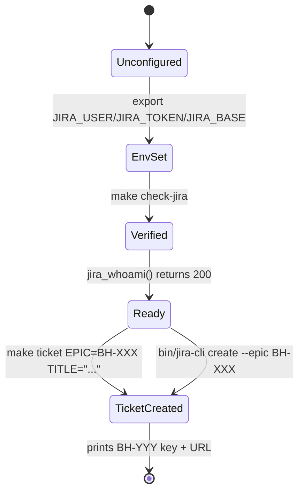

# Jira CLI Onboarding

## 1. Context

Today the only way to create a Jira ticket against the BrightHive board with the
correct shape (epic parent, Task type, template-formatted body) is to run the
`/create-jira-ticket` Claude Code skill, which calls the `mcp__jira__*` MCP
server. That works for Kuri but excludes every team member who isn't inside a
Claude Code session — engineers in a plain terminal, ops in CI, anyone writing
a quick bug report from `gh issue` triage.

We need a universal entrypoint: a Python CLI in this repo that any company
member can run after a 3-step onboarding (install + token + env). It mirrors
the same rules and template as the skill, so tickets created via either path
are indistinguishable.



## 2. Use Case / Goal

Any team member can run `make ticket EPIC=BH-170 TITLE="fix(cdk): X"` and
produce a properly-formatted Jira Task linked to the right epic, with the
canonical template body filled in via `$EDITOR`, in under 30 seconds. The same
binary works for listing epics, listing their own tickets, and transitioning
status.

## 3. Current Situation

### How It Works Today

- `mcp__jira__*` MCP server is the only programmatic surface — requires Claude
  Code running.
- `/create-jira-ticket` skill in `~/.claude/skills/create-jira-ticket/` builds
  technical notes from conversation context but does not call the API itself.
- `jira/TICKET_TEMPLATE.md` documents the rules (parent=BH-XXX, Task only,
  project=BH, account-ID assignees) and gives 3 examples.
- The `jira` Go CLI is installed on Kuri's machine but unused by the repo.
- `JIRA_USER`/`JIRA_TOKEN`/`JIRA_BASE` are exported in `~/.zshrc` for one
  user; no onboarding step asks others to do this.

### Hard Limitations

- MCP is unavailable to anyone not running Claude Code in this directory.
- The `mcp__jira__jira_create_issue` tool can't be invoked from CI, from a
  pre-commit hook, or from a one-shot terminal session.
- There is no shared programmatic source-of-truth for the BrightHive ticket
  shape — the rules live in three places (`CLAUDE.md`, `TICKET_TEMPLATE.md`,
  the MCP server). Drift is inevitable.

### Gaps

- No `make check-jira` to verify the prerequisites.
- No `make install-jira-cli` step in onboarding.
- No `ONBOARDING.md` section for Jira CLI setup.
- No CLI that enforces the template, blocks `issueType=Story`, requires a
  parent epic, and validates the epic exists.
- No way for a non-Claude-Code user to list live epics.

## 4. Proposals / Solutions

### Recommended Approach

A Python module `scripts/jira_cli/` exposing both a programmatic API and a
CLI entrypoint (`bin/jira-cli`). Talks to Jira REST API v3 directly with
`httpx`. Env-var auth. Template enforcement lives in `template.py`, REST in
`client.py`, CLI in `__main__.py`. Dependencies injected (no module-level
singletons) so contract tests don't need `patch()`.

Auth model: **REST-via-env-vars is the universal path.** The existing
MCP-backed `/create-jira-ticket` skill stays for users already inside Claude
Code (no migration). The CLI detects `CLAUDECODE=1` and prints a one-line
hint pointing at the skill — but still runs if invoked.

### Alternatives Considered

| Approach | Pros | Cons | Why Not |
|---|---|---|---|
| Shell wrapper around `go-jira` | Less code | Unmaintained upstream (last release 2023); ADF rendering buggy; can't enforce template at create time | Drift risk too high |
| MCP-only (no CLI) | Zero new code | Excludes 75% of the team; no CI path | Defeats the requirement |
| Python + raw `requests` | Self-contained | `requests` is sync-only and not in repo's dep tree | `httpx` is the modern choice and already used elsewhere |

## 5. Areas Involved

| Area | Repo | Impact |
|---|---|---|
| Onboarding | `agentic-project-mgmt` | New step 6.5: Jira CLI setup |
| Makefile | `agentic-project-mgmt` | `check-jira`, `install-jira-cli`, `ticket`, `my-tickets`, `transition`, `epics` |
| Python scripts | `agentic-project-mgmt/scripts/jira_cli/` | New module |
| Docs | `agentic-project-mgmt/jira/TICKET_TEMPLATE.md` | Add "CLI usage" section |
| Global rules | `~/.claude/rules/brighthive-jira.md` | (separate PR if it needs updates) |

## 6. Interface Contract (MDE)

### CLI surface

```
bin/jira-cli create --epic BH-XXX --title "<summary>" [--priority High] [--labels a,b,c] [--assignee me|<account-id>] [--from-stdin|--editor]
  → exit 0  → prints "{key}  {url}" to stdout
  → exit 2  → bad arguments (Story type requested, missing epic, etc.)
  → exit 3  → unknown epic (live lookup says it doesn't exist or is Done)
  → exit 4  → auth failure (env vars missing or token invalid)
  → exit 5  → API failure (5xx, network)

bin/jira-cli epics [--all|--open]
  → prints table: key | summary | status

bin/jira-cli my [--status "To Do,In Progress"]
  → prints table: key | summary | status | points

bin/jira-cli transition BH-XXX <state>
  → prints "BH-XXX: {old} → {new}"

bin/jira-cli whoami
  → prints {accountId, displayName, email}
```

### Python API

```python
# scripts/jira_cli/client.py
@dataclass(frozen=True)
class JiraConfig:
    base_url: str        # JIRA_BASE
    user: str            # JIRA_USER (email)
    token: str           # JIRA_TOKEN
    project_key: str = "BH"
    board_id: int = 152

class JiraClient:
    def __init__(self, config: JiraConfig, http: httpx.Client) -> None: ...
    def whoami(self) -> JiraUser: ...
    def list_epics(self, *, include_done: bool = False) -> list[JiraEpic]: ...
    def create_task(self, *, epic_key: str, summary: str, description: str,
                    priority: str = "Medium", labels: list[str] | None = None,
                    assignee_account_id: str | None = None) -> JiraIssue: ...
    def my_open_issues(self, *, statuses: list[str] | None = None) -> list[JiraIssue]: ...
    def transitions_for(self, key: str) -> list[JiraTransition]: ...
    def transition(self, key: str, *, to_state: str) -> JiraTransition: ...

# scripts/jira_cli/template.py
def render_task_body(*, description: str, scope_in: list[str], scope_out: list[str],
                     areas: list[str], acceptance_criteria: list[str],
                     technical_notes: str = "", business_notes: str = "",
                     related: list[str] | None = None) -> str: ...
```

## 7. Invariants (DbC)

1. `issueType` is always exactly `"Task"`. The client refuses `Story|Bug|Epic`.
2. Every created ticket has a non-empty `parentKey` matching `^BH-\d+$`.
3. `projectKey` is always exactly `"BH"`.
4. The parent epic referenced by `--epic` MUST exist in the live epic list
   AND have `statusCategory != Done` — checked before create, not after.
5. `summary` is ≤ 72 characters and is a single line. Newlines rejected.
6. `description` body MUST begin with the literal string `📝 Description`
   (template enforcement).
7. The Jira HTTP client MUST send `Authorization: Basic base64(user:token)`
   and `Accept: application/json`. No other auth shape.
8. The client MUST NOT call `customfield_10014` to set the epic link — only
   the modern `parent` field.
9. No `assignee` is passed if the value is empty or whitespace.
10. The CLI MUST exit non-zero on any non-2xx response and print the Jira
    error message verbatim to stderr.
11. `JIRA_TOKEN` MUST NOT appear in any stdout/stderr output, log line, or
    error message — even when the request fails.
12. Onboarding step is idempotent: running `make check-jira` twice produces
    the same exit code given the same env state.
13. Template enforcement happens in Python, NOT in shell. The CLI passes
    the rendered body to the API as a Python string.

WHEN a user runs `bin/jira-cli create` without `--epic`, THE System SHALL exit 2 with usage message.
WHEN a user passes `--epic BH-XXX` where the epic is Done, THE System SHALL exit 3.
IF the rendered description does not start with `📝 Description`, THEN THE System SHALL refuse to call the API.
WHILE `CLAUDECODE=1` is set, THE System SHALL print a one-line hint suggesting the `/create-jira-ticket` skill, but SHALL still execute the requested command.

## 8. Acceptance Criteria (BDD)

```gherkin
Feature: Jira CLI ticket creation

  Scenario: Happy path — create a Task under an open epic
    Given env vars JIRA_USER, JIRA_TOKEN, JIRA_BASE are set
    And epic BH-260 exists and is not Done
    When I run "bin/jira-cli create --epic BH-260 --title 'feat(studio): new widget'"
    And I save the editor with a body starting with "📝 Description"
    Then the exit code is 0
    And stdout contains a string matching "BH-\d+"
    And the new issue has issueType=Task, parent=BH-260, project=BH

  Scenario: Missing epic flag
    Given env vars are set
    When I run "bin/jira-cli create --title 'something'"
    Then the exit code is 2
    And stderr says "missing --epic"

  Scenario: Story type rejection (via CLI flag if attempted)
    Given env vars are set
    When I run "bin/jira-cli create --epic BH-260 --type Story --title 'x'"
    Then the exit code is 2
    And stderr says "issueType=Story is forbidden; use Task"

  Scenario: Unknown / closed epic
    Given env vars are set
    And BH-999 is not in the live epic list
    When I run "bin/jira-cli create --epic BH-999 --title 'x'"
    Then the exit code is 3
    And stderr says "epic BH-999 not found in open epics for board 152"

  Scenario: Missing env var
    Given JIRA_TOKEN is not exported
    When I run "bin/jira-cli whoami"
    Then the exit code is 4
    And stderr says "JIRA_TOKEN not set — see ONBOARDING.md step 6.5"

  Scenario: Auth failure surfaces clean error, no token leak
    Given JIRA_TOKEN is set to an invalid value
    When I run "bin/jira-cli whoami"
    Then the exit code is 4
    And stderr does not contain the JIRA_TOKEN value
    And stderr says "authentication failed"

  Scenario: List my open tickets
    Given env vars are set
    When I run "bin/jira-cli my"
    Then the exit code is 0
    And stdout has a header row "KEY  SUMMARY  STATUS  POINTS"

  Scenario: Transition to In Progress
    Given env vars are set
    And BH-12345 is assigned to me with status "To Do"
    When I run "bin/jira-cli transition BH-12345 'In Progress'"
    Then the exit code is 0
    And stdout says "BH-12345: To Do → In Progress"

  Scenario: Inside Claude Code — hint but proceed
    Given env vars are set
    And CLAUDECODE=1
    When I run "bin/jira-cli whoami"
    Then the exit code is 0
    And stderr contains "hint: inside Claude Code, prefer /create-jira-ticket"

  Scenario: check-jira green path
    Given env vars are set and the token is valid
    When I run "make check-jira"
    Then the exit code is 0
    And stdout contains "✓ jira-cli authenticated as"

  Scenario: check-jira red path — missing env
    Given JIRA_BASE is not set
    When I run "make check-jira"
    Then the exit code is 1
    And stderr says "JIRA_BASE not set"

  Scenario: Template enforcement — description does not start with marker
    Given env vars are set
    When I create a ticket whose description begins with "Hello world"
    Then the exit code is 2
    And stderr says "description must start with '📝 Description'"

  Scenario: Idempotent check-jira
    Given env vars are set
    When I run "make check-jira" twice
    Then both runs print the same output and exit code

  Scenario: Token never appears in error output
    Given JIRA_TOKEN=secret-deadbeef
    And the Jira API returns 500
    When I run "bin/jira-cli create --epic BH-260 --title 'x'"
    Then the exit code is 5
    And neither stdout nor stderr contains "secret-deadbeef"
```

## 9. Correctness Properties

### Property 1: Every CLI-created issue has a valid parent

*For any* successful `create` invocation, *the resulting issue* has
`fields.parent.key` matching `^BH-\d+$` AND that key is in the open-epic
list at the time of the call.

**Validates: §7 Invariants 2, 4 — §8 Scenarios "Happy path", "Unknown / closed epic"**

### Property 2: Token confidentiality

*For any* execution path (success, auth fail, 5xx, network error), the
value of `JIRA_TOKEN` does not appear in any byte written to stdout or
stderr.

**Validates: §7 Invariant 11 — §8 Scenario "Token never appears in error output"**

### Property 3: Template marker is the gate

*For any* `create` call, the request body is sent IFF the rendered
description starts with `📝 Description`.

**Validates: §7 Invariant 6 — §8 Scenario "Template enforcement"**

## 10. Out of Scope

- Editing existing tickets (only create + transition).
- Comments / worklogs / attachments.
- Subtasks (BrightHive doesn't use them).
- Bulk operations.
- Caching the epic list — every `create` does a fresh lookup. Cheap.
- Rewriting the MCP-backed `/create-jira-ticket` skill. It stays.
- Linear, Asana, or other backends.

## 11. Dependencies

| Dependency | Type | Status |
|---|---|---|
| `httpx` (Python) | Blocking | Add to `scripts/jira_cli/requirements.txt` |
| `uv` installed | Blocking | Already a prereq |
| Atlassian API token per user | Blocking — non-blocking after onboarding | User-generated at id.atlassian.com |
| Board ID 152 exists | Blocking | Already true |
| Project key `BH` exists | Blocking | Already true |

## 12. Eval Criteria

| Evaluator | Node | Mode | Threshold | Method |
|---|---|---|---|---|
| TemplateMarkerPresent | template.render_task_body | GATE | 100% of bodies start with `📝 Description` | Deterministic regex |
| EpicLookupBeforeCreate | client.create_task | GATE | 100% of create calls preceded by `GET /rest/agile/1.0/board/152/epic` in same client | Tracing assertion |
| NoTokenLeak | CLI entrypoint | GATE | 0 occurrences of `${JIRA_TOKEN}` in captured stdout+stderr across all scenarios | Deterministic substring search |
| FieldShapeMatch | client.create_task request body | GATE | `issueType.name == "Task"`, `parent.key matches ^BH-\d+$`, no `customfield_10014` | JSON Schema check |

## 13. Observability Contract

- **Log events** (stderr, structured prefix `[jira-cli]`):
  - `auth.ok` / `auth.failed`
  - `epic.lookup.ok` (with count) / `epic.lookup.failed`
  - `ticket.create.ok` (with key) / `ticket.create.refused` (with reason) / `ticket.create.failed` (with status)
  - `transition.ok` / `transition.failed`
- **Metrics**: none (CLI; track in caller's pipeline if needed).
- **Span**: none (one-shot process; future: emit OTel if invoked from CI).

## 14. Ticket Breakdown

Generated via `/create-jira-ticket` from this spec, parented to BH-170:

| Ticket | Summary | Points | Epic |
|---|---|---|---|
| — | feat(jira-cli): REST client + template + CLI entrypoint | 5 | BH-170 |
| — | feat(make): check-jira, install-jira-cli, ticket, my-tickets, transition targets | 2 | BH-170 |
| — | docs(onboarding): Jira CLI setup section + decision-rules update | 1 | BH-170 |
| — | test(jira-cli): contract tests with injected http client | 2 | BH-170 |

## 15. Related

- **Template doc**: `jira/TICKET_TEMPLATE.md`
- **Existing skill**: `~/.claude/skills/create-jira-ticket/SKILL.md` (mirrored, not replaced)
- **Onboarding bootstrap spec**: `docs/specs/onboarding-bootstrap.md`
- **Global rule**: `~/.claude/rules/brighthive-jira.md`
