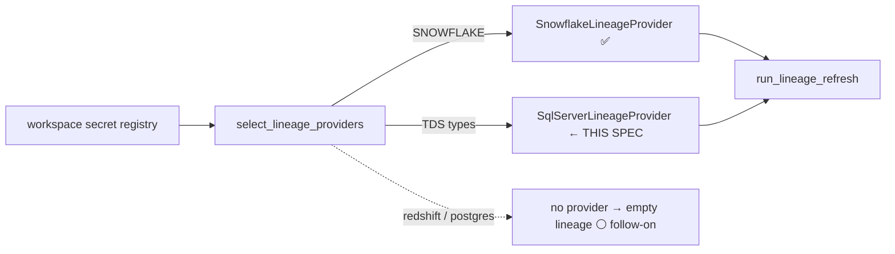

# Spec: Lineage adapter for SQL Server / Azure Synapse (close the 3-of-4-engine coverage gap)

**Ticket:** BH-1121 (BUGS-V3 epic) · **Status:** Draft · **Author:** Kuri · **Last-Reviewed:** 2026-07-31

## 1. Context

Lineage refresh is built as ports-&-adapters: `select_lineage_providers`
(`lineage_provider_selection.py`) reads a workspace's connection registry and assembles
a `list[EngineLineageProvider]`; `run_lineage_refresh` (`lineage_refresh_task.py`) runs
each provider's `build()` and persists the merged graph. Tiering is structure-based
(declared DERIVES_FROM chain depth — zero name inference), which is correct and untouched
here.

**The gap:** of the four BYOW engines (`snowflake`, `redshift`, `azure_synapse`,
`postgres`), only **Snowflake** has a wired provider. `select_lineage_providers` branches
on `_WAREHOUSE_TYPE_SNOWFLAKE` / `_WAREHOUSE_TYPE_DATABRICKS` only. A workspace on
azure_synapse / redshift / postgres matches no branch, gets only the always-on
`CustomSqlLineageProvider` (whose fetcher is a `return {}` stub), and **silently produces
zero lineage** — no error, just an empty graph. This violates the "all working at the 3
warehouses" bar: lineage works on 1 of 4 engines.

This spec closes the gap for **azure_synapse first** (Loop Capital's live engine). The
warehouse already exposes dependency metadata in `sys.sql_expression_dependencies` and is
already reachable via the existing TDS `WarehouseTool` chain (`SqlServerPipelineSource`
connects to it today). Redshift (`SVV_*`) and Postgres (`pg_depend`) are follow-on
adapters behind the same seam — one PR per engine.



## 2. Interface Contract (MDE)

The port and registry already exist — this adds the second warehouse adapter behind them,
matching the Snowflake adapter's shape exactly. Three additions, no signature changes to
the port or the orchestration loop:

```python
# lineage_fetchers.py — the warehouse-bound fetcher (the injected seam)
def fetch_sql_server_dependency_rows(*, workspace_id: str) -> list[dict[str, Any]]:
    """Fetch a workspace's SQL Server / Synapse sys.sql_expression_dependencies rows.
    Empty-on-error (no TDS connection / failed query → [])."""

# warehouse_lineage.py — the pure graph builder (no I/O)
def build_graph_from_sql_server_dependencies(*, dependency_rows: list[dict]) -> LineageGraph:
    """Build a LineageGraph from sys.sql_expression_dependencies rows (referenced → referencing)."""

# lineage_refresh_task.py — the provider pairing engine label + build()
class SqlServerLineageProvider:
    engine = "azure_synapse"
    def __init__(self, fetch_rows: Callable[[], list[dict]]): ...
    def build(self) -> LineageGraph: ...
```

`select_lineage_providers` gains one branch: when any configured warehouse `type` is in
`TDS_SECRET_TYPES` (AZURE_SYNAPSE / SYNAPSE_AZURE / SQL_SERVER — all TDS), append a
`SqlServerLineageProvider` wired to the live fetcher.

The T-SQL dependency query (per connected database; identity is `referenced` object →
`referencing` object, matching Snowflake's referenced→referencing direction):

```sql
SELECT
    DB_NAME() AS referencing_database,
    OBJECT_SCHEMA_NAME(d.referencing_id) AS referencing_schema,
    OBJECT_NAME(d.referencing_id) AS referencing_object,
    d.referenced_database_name,
    d.referenced_schema_name,
    d.referenced_entity_name
FROM sys.sql_expression_dependencies AS d
WHERE OBJECT_NAME(d.referencing_id) IS NOT NULL
  AND d.referenced_entity_name IS NOT NULL
```

No GraphQL / wire / DTO change. The persisted `LineageGraph` shape is identical to every
other adapter's.

## 3. Invariants (DbC)

- **I-1** WHEN a workspace has a TDS-shaped warehouse (`type` ∈ `TDS_SECRET_TYPES`),
  `select_lineage_providers` SHALL include a provider whose `engine == "azure_synapse"`.
- **I-2** `build_graph_from_sql_server_dependencies` SHALL emit one DERIVES_FROM edge per
  (referenced → referencing) row, keyed by object name with the full db.schema.object path
  kept in provenance — identical edge semantics to the Snowflake adapter.
- **I-3** A self-referential row (referenced == referencing) SHALL NOT create an edge.
- **I-4** The fetcher SHALL be empty-on-error: no TDS connection, or a failed query,
  returns `[]` — never raises, so `run_lineage_refresh` skips the engine and an empty graph
  never wipes existing lineage.
- **I-5** THE selector SHALL NOT route a non-TDS connection (Snowflake/Redshift/Postgres)
  to the SQL Server provider — it matches only `TDS_SECRET_TYPES`, mirroring
  `SqlServerPipelineSource`'s BH-1217 wire-protocol guard.
- **I-6** `sys.sql_expression_dependencies` is the engine's own dependency catalog, so
  its provenance adapter SHALL map to `DAG` confidence in `persist_lineage._DAG_ADAPTERS`
  — parity with the Snowflake/Databricks native adapters, never the `PARSED` (text-parsed)
  default.

## 4. Acceptance Criteria (BDD)

```gherkin
Feature: lineage works on azure_synapse, not just Snowflake

  Scenario: a Synapse workspace gets a lineage provider
    Given a workspace whose warehouse type is SQL_SERVER
    When select_lineage_providers runs
    Then the provider list includes one whose engine is azure_synapse

  Scenario: dependency rows become a lineage graph
    Given sys.sql_expression_dependencies rows for a view built on a table
    When build_graph_from_sql_server_dependencies runs
    Then the graph has a DERIVES_FROM edge from the table to the view
    And the source table with no upstream is tiered RAW

  Scenario: a Snowflake-only workspace is not routed to the SQL Server provider
    Given a workspace whose only warehouse type is SNOWFLAKE
    When select_lineage_providers runs
    Then no provider whose engine is azure_synapse is included

  Scenario: an unreachable Synapse connection never wipes lineage
    Given a workspace whose Synapse connection fails to connect
    When the fetcher runs
    Then it returns an empty list and the provider contributes no graph
```

## 5. Out of Scope

- **Redshift (`SVV_*`/`STL_`) and Postgres (`pg_depend`) adapters** — same seam, separate
  PRs, tracked as follow-on slices of task #37. This PR lands azure_synapse only.
- **Databricks live fetch** — already a deferred `return []` stub; unchanged.
- **Cross-database Synapse dependencies where `referenced_id` is NULL** — the query keeps
  rows with a `referenced_entity_name`, so named cross-db refs are captured; unresolved
  ambiguous refs (no name) are dropped, same as Snowflake drops nameless rows.
- **Tiering / pathing logic** — already structure-based and correct; not touched.

## 6. Dependencies

- `WarehouseTool(warehouse_type=AZURE_SYNAPSE, ...)` TDS chain — exists, used by
  `SqlServerPipelineSource`.
- `_graph_from_edge_pairs`, `refine_tiers_by_position`, `TDS_SECRET_TYPES`,
  `get_workspace_secret` — all exist.
- No new external dependency.

## 7. Correctness Properties

### Property 1: Every TDS workspace gets lineage coverage

*For any* workspace with a TDS-shaped warehouse, the provider list contains an
azure_synapse provider — closing the silent-empty gap for that engine.

**Validates: §3 I-1, I-5, §4 Scenario "a Synapse workspace gets a lineage provider"**

### Property 2: SQL Server edges are structurally identical to Snowflake edges

*For any* set of dependency rows, the built graph uses the same referenced→referencing
edge direction, name-keying, and RAW-at-zero-upstream tiering as the Snowflake adapter —
so downstream persist/tiering is engine-blind.

**Validates: §3 I-2, I-3, §4 Scenario "dependency rows become a lineage graph"**

## 9. Observability Contract

- **Log events**: existing `lineage_fetchers.*` / `lineage_refresh_task.*` pattern; add
  `lineage_fetchers.sql_server.no_connection` and `.query_failed` mirroring the Snowflake
  fetcher. `run_lineage_refresh`'s `byEngine` map gains an `azure_synapse` entry.

## 10. Test Coverage Update

- **L2 unit** (`brightbot/tests/unit/agents/governance_agent/`):
  - `build_graph_from_sql_server_dependencies`: table→view rows → one edge, table tiered
    RAW (I-2); self-ref row → no edge (I-3); empty rows → empty graph.
  - `select_lineage_providers`: a `SQL_SERVER`-typed secret yields an `azure_synapse`
    provider (I-1); a `SNOWFLAKE`-only secret yields none (I-5) — inject `get_secret`.
  - `fetch_sql_server_dependency_rows`: real-behavior via a fake `WarehouseTool` whose
    `query` returns rows / `{"success": False}` / raises → asserts rows / `[]` / `[]` (I-4).
- **e2e (§10b):** deferred to a live Loop Capital (azure_synapse) lineage-refresh run
  asserting `byEngine["azure_synapse"] > 0` on a workspace with views — logged as follow-up,
  not silently skipped. (Mirrors the profiler-landing e2e already in brighthive-e2e.)
