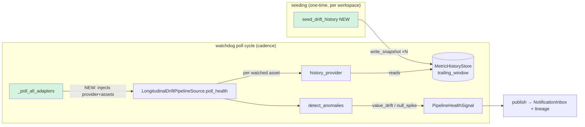

# Longitudinal Drift Watchdog Wiring

> **This spec wires an already-built engine. It is not greenfield.** The
> statistical authority (`detect_anomalies`), the persistence boundary
> (`MetricHistoryStore` / `OGMMetricHistoryStore`), the drift source adapter
> (`LongitudinalDriftPipelineSource`), and the seeder (`bootstrap_history`) all
> ship today. Two seams are unwired, so the drift source **silently emits zero
> signals in production on every poll**. This spec closes exactly those two seams
> and seeds real trailing-window history on staging Loop Capital so the watchdog
> fires live. Every existing symbol carries a real `file:line`; the one new file
> (`drift_watchdog_wiring.py`) and the one new seeder entrypoint are marked **NEW**.

## 1. Context

The pipeline watchdog (`pipeline_watchdog_task.py`, BH-1054/BH-1280) polls every
registered `PipelineSource` on a cadence and publishes a `PipelineHealthSignal`
per detected failure. `LongitudinalDriftPipelineSource` (BH-669/BH-1209) is
registered in that loop (`pipeline_health.py:139`,
`PIPELINE_SOURCE_ADAPTERS[LONGITUDINAL_DRIFT]`) and its `value_drift` / `null_spike`
signals are stage-mapped (`pipeline_watchdog_task.py:107-110`). So on paper the
drift watchdog is wired end to end.

It emits nothing. Two seams are the reason:

- **Seam 1 — the adapter is constructed blind.** `_poll_all_adapters` builds every
  source with `build_pipeline_source(source_type=source_type, config={})`
  (`pipeline_watchdog_task.py:156`) → `adapter_cls(config=config)`
  (`pipeline_health.py:155`). The drift adapter needs two runtime seams a JSON
  config can't carry — a `watched_assets` list and a `history_provider` callable
  (`longitudinal_drift_pipeline_source.py:106-115`). With neither injected,
  `poll_health` hits its guard `if self.history_provider is None: … return []`
  (`longitudinal_drift_pipeline_source.py:122-127`) and returns empty **every
  poll**. The `WARNING` log is the only trace.

- **Seam 2 — there is no trailing-window history to trend against.** Even with a
  provider wired, `detect_anomalies` needs a non-empty baseline (`baseline_of`
  returns `None` on empty history → no event; `longitudinal_detect.py:90-94`,
  `112-113`). A workspace that has never run the longitudinal capability node has
  zero `MetricSnapshotNode`s, so the first N polls trend against nothing and fire
  nothing. Loop Capital's staging workspace is exactly this: profiled, but no
  snapshot history.

**Engine-agnostic by construction — and this spec must keep it that way.** The
`history_provider` reads snapshots through `MetricHistoryStore.trailing_window`
(`metric_history_store.py:60`), which is a workspace-scoped OGM read over
`MetricSnapshotNode` rows — **no `warehouse_type` branch anywhere**. Snapshots are
written by the same store's `write_snapshot`, engine-neutral floats keyed by
`data_asset_id`. Snowflake, SQL Server (Loop Capital), and Redshift assets ride the
identical path; the seeder writes the same node shape for all three. There is no
per-engine code in this spec — that is the invariant, not an aspiration.



Legend: 🟢 green = NEW/changed in this spec; white = ships today.

## 2. Interface Contract (MDE)

### 2.1 The wiring seam — a provider factory, injected at poll time (NEW)

The watchdog must hand the drift adapter its two runtime seams **without** breaking
the `adapter_cls(config=config)` factory contract every other adapter uses. The
adapter already accepts `watched_assets` + `history_provider` as keyword-only
constructor args (`longitudinal_drift_pipeline_source.py:106`). The gap is only in
who calls the constructor with them. New module `drift_watchdog_wiring.py`:

```python
# brightbot/agents/governance_agent/tools/drift_watchdog_wiring.py  (NEW)

# The store-only history provider: current = latest snapshot, history = the prior
# `window` snapshots. Engine-agnostic — reads MetricSnapshotNode rows only, never
# touches a warehouse. Bound to one workspace + store.
def build_store_history_provider(
    *, store: MetricHistoryStore, window: int = DEFAULT_TRAILING_WINDOW
) -> MetricHistoryProvider: ...

# Resolve a workspace's golden assets into WatchedAssets. Uses the shipped
# get_data_assets_by_workspace_ogm query; specs default to COLUMN_AGNOSTIC_METRIC_SPECS
# (row_count — safe on every table/engine), overridable per asset by a configured
# longitudinal_anomaly rule (reuses load_longitudinal_config, BH-1209).
def resolve_watched_assets(
    *, workspace_id: str, session: OGMAPISession | None = None
) -> list[WatchedAsset]: ...

# The factory the watchdog registers for LONGITUDINAL_DRIFT instead of the bare
# adapter_cls. Closes over workspace_id so config={} still works at the call site.
def build_drift_source(
    *, workspace_id: str, config: dict[str, object] | None = None
) -> LongitudinalDriftPipelineSource: ...
```

`_poll_all_adapters` change (`pipeline_watchdog_task.py:154-157`): the drift
`source_type` is constructed via `build_drift_source(workspace_id=…)` (which injects
provider + assets); every other `source_type` keeps
`build_pipeline_source(source_type=…, config={})` unchanged.

### 2.2 The `history_provider` contract (already typed, now implemented)

```python
# longitudinal_drift_pipeline_source.py:81 — unchanged
MetricHistoryProvider = Callable[
    [str, RequestContext],
    Awaitable[tuple[dict[str, float], dict[str, list[float]]]],
]
# returns (current metric→value, history metric→trailing values)
```

`build_store_history_provider` implements it as: read `trailing_window(dataset,
window+1)` (DESC); the newest value per metric becomes `current`, the remaining
(≤`window`) become `history`. Returns `({}, {})` when a dataset has < 2 snapshots
(no current-vs-baseline possible) → adapter emits nothing for that asset, never
errors.

### 2.3 The seeder entrypoint (NEW — extends the shipped `bootstrap_history`)

```python
# brightbot/scripts/seed_drift_history.py  (NEW — thin CLI over the shipped seeder)
#
#   uv run python -m brightbot.scripts.seed_drift_history \
#     --workspace-id <WS> --asset-id <DA> --dataset-fqn <db.schema.table> \
#     --snapshots 8 --trend row_count:+0.05   # +5%/snapshot synthetic drift tail
#
# For a REAL warehouse it calls the shipped bootstrap_history over N historical
# partitions. For the staging LC seed (no N partitions to sample) it writes N
# synthetic-but-realistic MetricSnapshotNodes directly through write_snapshot with a
# controlled trend, so the newest snapshot deviates past tolerance and drift fires.
def seed_synthetic_history(
    *, store: MetricHistoryStore, dataset_fqn: str, data_asset_id: str,
    baseline: dict[str, float], snapshots: int, trend: dict[str, float],
) -> int: ...  # returns count written
```

Seeded nodes carry `runContext="SEED"` so they are distinguishable from real
`SCHEDULED`/`INGESTION` snapshots and reversible (delete-by-runContext).

## 3. Invariants (DbC)

- **INV-1** WHEN `_poll_all_adapters` builds the `LONGITUDINAL_DRIFT` source, THE
  System SHALL inject a non-null `history_provider` and a `watched_assets` list — the
  `history_provider is None` no-op guard (`longitudinal_drift_pipeline_source.py:122`)
  SHALL NOT be reachable in a scheduled production run.
- **INV-2** THE drift wiring SHALL contain no `warehouse_type` / dialect branch. The
  `history_provider` reads only `MetricSnapshotNode` rows via
  `MetricHistoryStore.trailing_window`; the seeder writes only via `write_snapshot`.
  Grep test: `grep -n "warehouse_type\|snowflake\|redshift\|synapse\|sqlserver" drift_watchdog_wiring.py` → zero business-logic hits.
- **INV-3** THE `history_provider` SHALL return `({}, {})` (never raise) for a dataset
  with fewer than 2 snapshots; the adapter SHALL emit zero signals for that asset and
  continue to the next (`poll_health` per-asset try/except, `:131-140`).
- **INV-4** Detection SHALL remain the sole authority of `detect_anomalies`
  (`longitudinal_detect.py:143`) — the wiring computes no deviation itself. One def,
  N callers.
- **INV-5** Every emitted drift signal SHALL carry a non-empty `job_id` = the watched
  asset's stable `asset_key` (already enforced, `:164`), so `value_drift` and
  `null_spike` bucket separately but never key on a timestamp.
- **INV-6** WHERE a `history_provider` fetch fails for one asset, THE System SHALL log
  and skip that asset only — one broken asset SHALL NOT abort the poll cycle (adapter
  `:131-140`; watchdog per-adapter guard `pipeline_watchdog_task.py:165`).
- **INV-7** Seeded snapshots SHALL carry `runContext="SEED"` and be deletable as a set
  — seeding a workspace SHALL be fully reversible with no effect on real snapshots.
- **INV-8** WHEN the longitudinal feature flag `LONGITUDINAL_MONITORING_ENABLED` is
  off, THE drift source SHALL still be constructible but the seeder and provider are
  inert wiring — this spec introduces no new always-on cost surface.

## 4. Acceptance Criteria (BDD)

```gherkin
Feature: Longitudinal drift watchdog fires on a cadence over seeded history

  Scenario: Watchdog injects a live history provider into the drift source
    Given a workspace with at least one data asset
    When _poll_all_adapters builds the longitudinal_drift source
    Then the source is constructed with a non-null history_provider and watched_assets
    And poll_health does not take the "no history_provider wired" no-op branch

  Scenario: Drift fires when the newest snapshot deviates past tolerance
    Given a data asset seeded with 8 trailing row_count snapshots trending +5% each
    And the newest snapshot's row_count exceeds the trailing baseline past the 20% tolerance
    When the drift source polls that asset
    Then it emits a value_drift PipelineHealthSignal with job_id equal to the asset key
    And the signal severity reflects the deviation magnitude

  Scenario: An asset with no history is skipped, not errored
    Given a data asset with zero MetricSnapshotNodes
    When the drift source polls that asset
    Then the history provider returns ({}, {})
    And zero signals are emitted for that asset
    And the poll cycle continues to the next asset

  Scenario: Engine-agnostic — same path for Snowflake, SQL Server, Redshift
    Given three assets on Snowflake, SQL Server, and Redshift respectively, each seeded
    When the drift source polls all three
    Then each emits drift from the identical store-read path
    And no warehouse_type branch is executed

  Scenario: Seeding is reversible
    Given a workspace seeded with SEED-context snapshots
    When the seed set is deleted by runContext
    Then no real SCHEDULED or INGESTION snapshots are affected

  Scenario: Live staging Loop Capital drift fires end to end
    Given the staging Loop Capital workspace seeded on a golden asset
    When the pipeline watchdog runs for that workspace
    Then a value_drift signal is published to the NotificationInbox
    And the drift is attributable to the seeded asset
```

## 5. Out of Scope

- **Drift remediation wiring** (auto-PR / self-heal off a drift signal) — the signal
  routes toward the data-shape modes; acting on it is a follow-up.
- **Per-column metric defaults** (BH-1209) — this spec keeps
  `COLUMN_AGNOSTIC_METRIC_SPECS` (row_count) as the safe default; richer per-column
  specs come from a configured `longitudinal_anomaly` rule, unchanged.
- **A new scheduler action type** — drift rides the existing
  `pipeline_watchdog_task` in `SCHEDULABLE_ACTIONS`; no new EventBridge/dispatcher work.
- **Warehouse-health strip surfacing of drift** — drift signals carry no
  `connection_key`, so they route to notification+lineage, not the health strip
  (`warehouse-health-snapshot.md` owns the strip; unchanged here).
- **Backfilling real historical partitions on staging LC** — the LC seed is synthetic
  trailing history (no N real nightly partitions exist to sample); real-partition
  bootstrap via `bootstrap_history` is the production path, tested but not run on LC.

## 6. Dependencies

- `detect_anomalies`, `MetricSpec`, `COLUMN_AGNOSTIC_METRIC_SPECS`, `baseline_of`
  (`longitudinal_detect.py`) — the statistical authority. **Ships.**
- `MetricHistoryStore` / `OGMMetricHistoryStore` (`metric_history_store.py`) — the
  snapshot read/write boundary. **Ships.**
- `LongitudinalDriftPipelineSource`, `WatchedAsset`, `MetricHistoryProvider`
  (`longitudinal_drift_pipeline_source.py`) — the adapter + its injectable seams.
  **Ships.**
- `bootstrap_history`, `load_longitudinal_config` (`longitudinal_node.py`) — the
  seeder + per-asset spec resolution. **Ships.**
- `get_data_assets_by_workspace_ogm` (`ogm_queries.py:4`) — watched-asset resolution.
  **Ships.**
- `_poll_all_adapters` (`pipeline_watchdog_task.py:145`) — the one call site to change.
- Staging Loop Capital workspace + a golden asset id — for the live seed
  (authorized-write, reversible).

## 7. Correctness Properties

### Property 1: The production drift path is never a silent no-op

*For any* scheduled watchdog run in a workspace with ≥1 data asset, the drift source
is constructed with a live `history_provider`, so the `history_provider is None`
guard is unreachable.

**Validates: §3 INV-1, §4 Scenario "Watchdog injects a live history provider"**

### Property 2: Engine-neutrality holds by read-path, not by branch

*For any* asset regardless of its warehouse engine, drift is computed from
`MetricSnapshotNode` floats read through one workspace-scoped query — the same code
executes for Snowflake, SQL Server, and Redshift.

**Validates: §3 INV-2, §4 Scenario "Engine-agnostic — same path"**

### Property 3: Seeding never corrupts real history

*For any* seeded workspace, every seeded node is `runContext="SEED"` and removable as
a set, leaving `SCHEDULED`/`INGESTION` snapshots untouched.

**Validates: §3 INV-7, §4 Scenario "Seeding is reversible"**

## 9. Observability Contract

- **Log events**: `drift_watchdog.provider.wired` (workspace_id, asset_count),
  `[DRIFT_WATCHDOG] … emitted N signals` (already, `:146`),
  `[DRIFT_WATCHDOG] … history fetch failed — skipping` (already, `:134`),
  `drift_seed.written` (workspace_id, dataset, snapshots).
- **Signal**: `PipelineHealthSignal(failure_type="value_drift"|"null_spike",
  root_cause_class=DATA_SHAPE, job_id=<asset_key>)` — folded into the existing
  watchdog publish + lineage path; no new sink.
- **Metrics**: none (rides the watchdog's existing published/suppressed counters).

## 10. Test Coverage Update

### a. In-repo layered evals (`brightbot/tests/`)

- **L0 (surface)** — `build_drift_source(workspace_id=…)` returns a
  `LongitudinalDriftPipelineSource` whose `history_provider is not None` and whose
  `watched_assets` reflect the resolved assets (fake OGM session). One case per §2.1
  entry.
- **L1 (wiring)** — `_poll_all_adapters` builds the `LONGITUDINAL_DRIFT` source via
  `build_drift_source` (not the bare `adapter_cls`), and every other source via the
  unchanged path — assert the drift source received the injected seams.
- **L2 (behavior)** — one case per §3 invariant observable from outside:
  - INV-3: provider returns `({}, {})` for <2 snapshots; adapter emits 0 signals.
  - Drift fires: seeded 8-snapshot +5% tail → `detect_anomalies` yields a
    `value_drift` event → adapter emits one signal with `job_id == asset_key`.
  - INV-6: a provider that raises for one asset skips only that asset.
  - INV-7: seed writes carry `runContext="SEED"`.

### b. Real-behavior test (mandatory per `test-behavior-real.md`)

One L2 case drives the **real** `LongitudinalDriftPipelineSource` +
`build_store_history_provider` over a **real** `OGMMetricHistoryStore` backed by a
seeded in-memory/fake OGM session capturing actual `write_snapshot` → `trailing_window`
round-trips (the store's real GraphQL shape, not a hand-typed history dict). Asserts a
`value_drift` signal is produced from the store round-trip — the forcing question: *if
`trailing_window` changed shape tomorrow, this test goes red.*

### c. Cross-repo / live staging (`brighthive-e2e/` + the authorized LC seed)

- **Live seed + fire**: seed the staging Loop Capital golden asset, run the watchdog
  for that workspace, confirm a `value_drift` BrightSignal lands in the
  NotificationInbox attributable to the seeded asset (§4 last scenario). Captured
  signal id recorded in the PR.
- Seed teardown (delete `runContext="SEED"` set) run and verified after the demo.

### Self-verification

Before the implementation PR: `uv run pytest brightbot/tests/ -k "drift"` green; the
grep gate (INV-2) shows zero engine branches in the new file; the real-behavior test
exercises the store round-trip; the staging seed→fire→teardown is captured.
