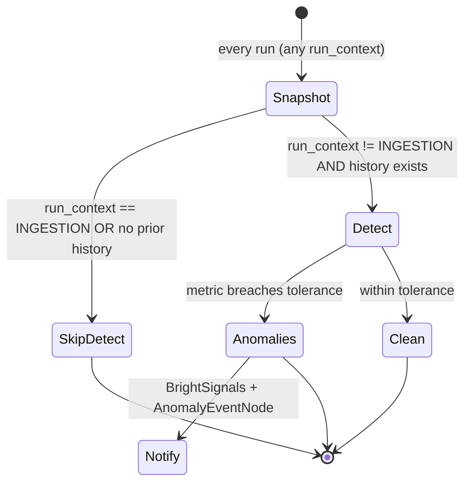
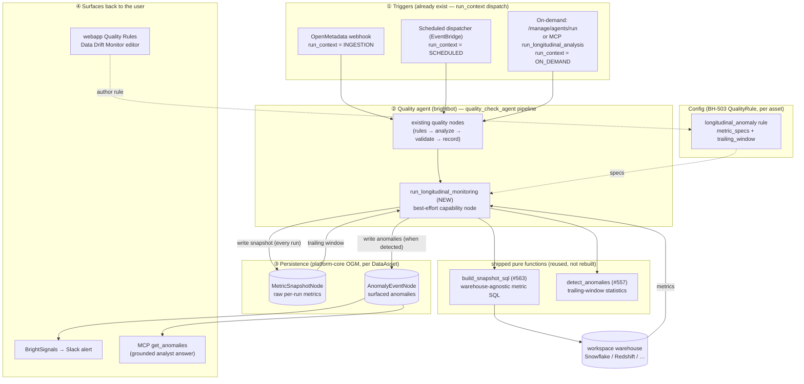
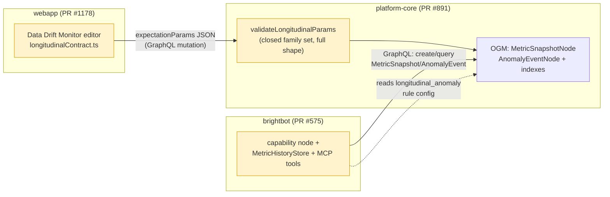
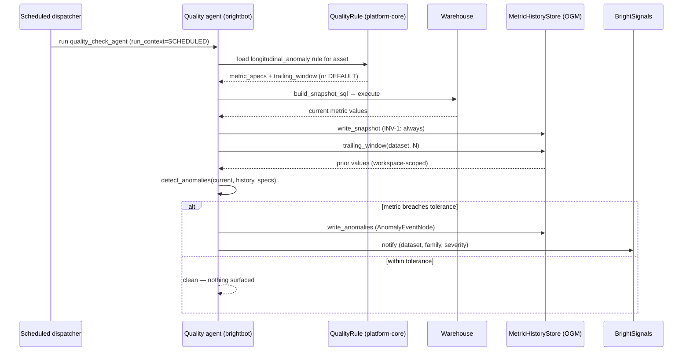

# Longitudinal Monitoring as an Agentic Capability

## 1. Context

GC-12 detection (`longitudinal_detect.py`) + metric SQL (`metric_snapshot_sql.py`) are shipped pure functions called only in tests. This spec is the interface contract for wiring them into the platform **as a capability of the quality agent**, reachable through the three trigger surfaces that already exist (`run_context ∈ {INGESTION, SCHEDULED, ON_DEMAND}`), configured through BH-503's `QualityRule`, and queryable on-demand. It complements the parent `longitudinal-monitoring.md` (which holds Problem/AC/Ticket-breakdown) — this doc fixes the typed boundaries before code.



## 1a. Architecture (what it does, how it works)

### Big picture — three trigger surfaces, one capability, two surfaces back

The same capability runs no matter *how* it is triggered; `run_context` decides whether it just snapshots or also detects. Configuration and results both ride per–data-asset nodes.



### Repo seams — who owns what, what crosses the boundary



> **Contract seams (yellow)**: the family vocabulary (`row_count_drift · cardinality_breakdown · distributional_skew · null_spike`) and the `expectationParams` shape are hardcoded in all three boxes and pinned by a test in each repo — drift fails CI. Tolerance is a **fraction** end-to-end. Source of truth: §2.2.

### One scheduled run — sequence



## 2. Interface Contract (MDE)

### 2.1 Persistence — platform-core OGM (mirrors existing idiom in `ogm/typedefs.ts`)

```graphql
# Raw per-run metric values — the trailing-window history GC-12 trends against.
# Distinct from QualityRuleExecutionNode (which stores rule pass/fail, not metrics).
type MetricSnapshotNode {
  id: ID! @id
  snapshotTs: DateTime! @timestamp(operations: [CREATE])
  dataset: String!          # e.g. GOLD.mart_daily_portfolio_exposure
  metricName: String!       # row_count | cardinality:<col> | null_rate:<col> | mean:<col> | stddev:<col>
  metricValue: Float
  runId: String!            # ties a snapshot batch to one agent run
  runContext: String!       # INGESTION | SCHEDULED | ON_DEMAND
  dataAsset: DataAssetNode! @relationship(type: "HAS_METRIC_SNAPSHOT", direction: IN)
}

# A surfaced anomaly — mirrors AnomalyEvent dataclass in longitudinal_detect.py.
type AnomalyEventNode {
  id: ID! @id
  detectedAt: DateTime! @timestamp(operations: [CREATE])
  dataset: String!
  metricName: String!
  family: String!           # row_count_drift | cardinality_breakdown | distributional_skew | null_spike
  severity: String!         # warning | error
  currentValue: Float!
  baselineValue: Float!
  deviationPct: Float!
  description: String!
  runId: String!
  dataAsset: DataAssetNode! @relationship(type: "HAS_ANOMALY_EVENT", direction: IN)
}
```

Indexes: `(dataset, metricName, snapshotTs)` for trailing-window reads; `(dataset, detectedAt)` for analyst queries.

### 2.2 Config — `longitudinal_anomaly` QualityRule (no schema change; reuse open `expectationType`)

`expectationType = "longitudinal_anomaly"`, with `expectationParams` (JSON string):

```json
{
  "metric_specs": [
    {"name": "row_count", "family": "row_count_drift", "tolerance": 0.20, "absolute": false},
    {"name": "cardinality:country_code", "family": "cardinality_breakdown", "tolerance": 0.20, "absolute": false},
    {"name": "null_rate:fiscal_period_id", "family": "null_spike", "tolerance": 0.15, "absolute": true}
  ],
  "trailing_window": 7
}
```

`metric_specs[]` maps 1:1 to `longitudinal_detect.MetricSpec`; the capability node passes them as `detect_anomalies(specs=…)`. Absent rule → `DEFAULT_METRIC_SPECS`. `applyOnIngestion`/`applyOnSchedule`/`status` reuse existing semantics. `assets` is the per-asset binding.

### 2.3 Capability node — brightbot (Python signatures, DI not patch)

```python
async def run_longitudinal_monitoring(
    *,
    workspace_id: str,
    data_asset_id: str,
    dataset_fqn: str,
    run_context: str,
    warehouse: WarehouseClient,      # injected — runs build_snapshot_sql output
    store: MetricHistoryStore,       # injected — persist/query MetricSnapshotNode + AnomalyEventNode
    specs: tuple[MetricSpec, ...],   # from QualityRule config, else DEFAULT_METRIC_SPECS
    trailing_window: int = DEFAULT_TRAILING_WINDOW,
) -> LongitudinalResult: ...

class MetricHistoryStore(Protocol):
    async def write_snapshot(self, *, dataset: str, run_id: str, run_context: str,
                             metrics: dict[str, float], data_asset_id: str) -> None: ...
    async def trailing_window(self, *, dataset: str, window: int) -> dict[str, list[float]]: ...
    async def write_anomalies(self, *, dataset: str, run_id: str, data_asset_id: str,
                              events: list[AnomalyEvent]) -> None: ...
    # `dataset` augments the original signature: AnomalyEventNode requires
    # dataset! but the AnomalyEvent dataclass carries none — passed explicitly
    # rather than as hidden store state (impl deviation, 2026-06-17).
    async def recent_anomalies(self, *, dataset: str, since: datetime,
                               severity: str | None = None) -> list[AnomalyEvent]: ...
```

### 2.4 On-demand MCP tools — brightbot (`mcp/capabilities.py`, exposure="routed")

```
run_longitudinal_analysis(workspace_id, data_asset_id, dataset_fqn) -> LongitudinalResult
get_anomalies(workspace_id, dataset_fqn, since_days=30, severity=None) -> list[AnomalyEvent]
```

## 3. Invariants (DbC)

- INV-1: a `MetricSnapshotNode` is written on **every** run, regardless of `run_context`.
- INV-2: detection runs **iff** `run_context != INGESTION` AND trailing window is non-empty.
- INV-3: no `AnomalyEventNode` exists without a backing `MetricSnapshotNode` for the same `(dataset, metricName, runId)`.
- INV-4: no duplicate `MetricSnapshotNode` for the same `(snapshotTs, dataset, metricName)`.
- INV-5: `metric_specs` from config validate against the closed `AnomalyFamily` enum; an invalid family is rejected at rule-create, never silently dropped.
- INV-6: severity escalates to `error` past 2× tolerance (preserve shipped `evaluate_metric` semantics — do not reimplement).

## 4. Acceptance Criteria (BDD)

```gherkin
Feature: Longitudinal monitoring as a quality-agent capability

  Scenario: ingestion run snapshots only
    Given a longitudinal_anomaly rule active on an asset
    When the quality agent runs with run_context INGESTION
    Then a MetricSnapshotNode batch is persisted
    And no detection runs and no AnomalyEventNode is written

  Scenario: scheduled run detects from history
    Given >= 1 prior snapshot for the dataset
    When the quality agent runs with run_context SCHEDULED and a metric breaches tolerance
    Then >= 1 AnomalyEventNode is written, classified into one of the 4 families
    And a BrightSignals notification is emitted

  Scenario: on-demand historical analysis
    Given AnomalyEventNodes exist for a dataset
    When a user calls get_anomalies via MCP
    Then the answer is grounded in the stored AnomalyEventNodes, not an LLM guess

  Scenario: history bootstrap
    Given an asset with no snapshots but >= window historical warehouse partitions
    When bootstrap mode runs
    Then the trailing window is seeded so the next run can detect on day 1
```

## 5. Out of Scope

- Anomaly → dbt-agent self-healing bridge (deferred — separate ticket).
- New scheduling infra (the EventBridge dispatcher already exists; we register a capability).
- Changing `longitudinal_detect.py` statistics.

## 6. Correctness Properties

### Property 1: Detection only on real history
*For any* run, an `AnomalyEventNode` is produced only when `run_context != INGESTION` and a non-empty trailing window existed at evaluation time.
**Validates: §3 INV-2, §3 INV-3, §4 Scenario "ingestion run snapshots only"**

### Property 2: Config drives vocabulary
*For any* `longitudinal_anomaly` rule, every emitted `family` is a member of the closed `AnomalyFamily` set.
**Validates: §3 INV-5, §4 Scenario "scheduled run detects from history"**

## 7. Observability Contract

- **Span**: `gen_ai.tool.execute` with `gen_ai.tool.name=longitudinal_monitoring`
- **Attributes**: `workspace.id`, `brightagent.dataset`, `brightagent.run_context`, `brightagent.anomaly_count`
- **Log events**: `longitudinal.snapshot.written`, `longitudinal.detect.skipped_ingestion`, `longitudinal.detect.no_history`, `longitudinal.anomaly.detected`, `longitudinal.bootstrap.seeded`
- **Capability record**: `AgentCapabilityExecutionNode` with `capabilityType="longitudinal_monitoring"`
