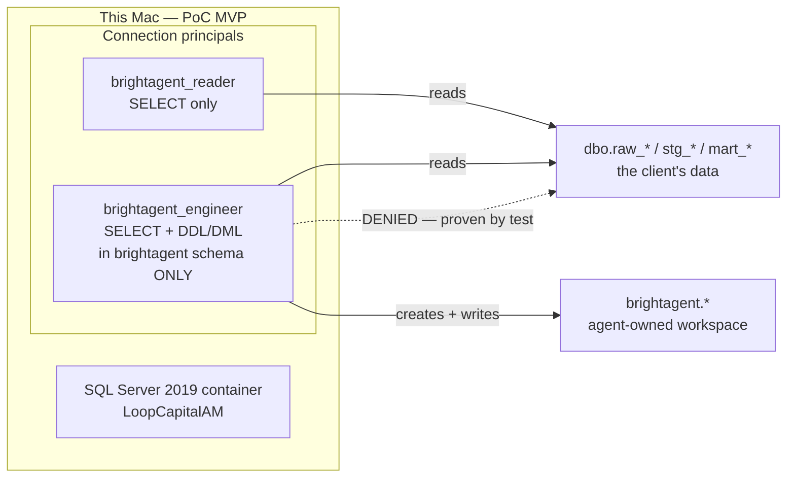

# Spec — On-Prem Read/Write Sandbox for Loop Capital (BH-1403)

> **Status**: Draft · **Owner**: Kuri · **Last-Reviewed**: 2026-08-13
> **Repo**: `agentic-project-mgmt` · **Branch**: `drchinca/BH-1403/loopcapital-sandbox` · **PR**: #176

## 1. Context

Loop Capital's trial connects BrightAgent to **Frank Sung's own Azure VM — SQL Server 2019 on
Windows Server 2019** — over an allowlisted public-internet TLS link. Per Doc 1
([`clients/trials/loopcapital/artifacts/2026-07-client-docs-trial-scope-and-demo.md`](../../clients/trials/loopcapital/artifacts/2026-07-client-docs-trial-scope-and-demo.md))
the trial grants **"scoped read + optional governed-write (reviewable PRs only, nothing applied
without approval)"**. Frank is off-cloud: there is no managed warehouse to lean on, so every
capability has to work over a plain T-SQL connection to a host we do not own.

The existing sandbox proves **read** against a real backend. It does not yet model the two
things the trial's write path depends on:

1. **A least-privilege connection principal.** Today everything runs as `sa`. `sa` cannot
   demonstrate a governed write, because `sa` can do anything — a write that succeeds proves
   nothing about whether the boundary holds. Frank's DBAs will not hand over `sa`.
2. **A contained write target.** "Governed write" means the agent creates tables/views inside a
   space it owns, and is structurally unable to modify the client's own data.

This spec adds both, plus raises sandbox fidelity from SQL Server 2022 to **2019** to match
Frank's actual host.



**Scope boundary**: this is the sandbox fixture only. Teaching brightbot's SQL Server client to
*execute* a write is a separate ticket in a separate repo — see §5.

## 2. Interface Contract (MDE)

### Principals (T-SQL, created by `sql/05_governed_principals.sql`)

```
brightagent_reader   : LOGIN + USER in LoopCapitalAM
  GRANT SELECT           ON SCHEMA::dbo
  GRANT VIEW SERVER STATE                    -- sys.dm_os_volume_stats (disk pressure)
  GRANT SELECT           ON msdb.dbo.sysjobs, sysjobhistory, sysjobactivity
  -- no INSERT/UPDATE/DELETE/ALTER/CREATE anywhere

brightagent_engineer : LOGIN + USER in LoopCapitalAM
  GRANT SELECT           ON SCHEMA::dbo      -- read the client's data
  ALTER AUTHORIZATION ON SCHEMA::brightagent TO brightagent_engineer
  GRANT CREATE TABLE, CREATE VIEW            -- scoped by schema ownership
  DENY  INSERT, UPDATE, DELETE, ALTER ON SCHEMA::dbo   -- explicit, not merely absent
```

### Verification script

```
governed_write_check.py --principal {reader|engineer} [--keep]
  exit 0  : every assertion held
  exit 1  : a boundary assertion FAILED (a principal did something it must not)
  exit 2  : could not connect / setup error
  stdout  : one line per assertion — "PASS <id> <description>" | "FAIL <id> <reason>"
```

## 3. Invariants (DbC)

| # | Invariant |
|---|---|
| INV-1 | `WHEN brightagent_reader issues any INSERT/UPDATE/DELETE/CREATE, THE System SHALL reject it.` |
| INV-2 | `WHEN brightagent_engineer writes into the brightagent schema, THE System SHALL allow it.` |
| INV-3 | `WHEN brightagent_engineer issues INSERT/UPDATE/DELETE/ALTER against dbo, THE System SHALL reject it.` |
| INV-4 | Neither principal is `sysadmin`, `db_owner`, or a member of any fixed admin role. |
| INV-5 | Both principals read `dbo` successfully — a boundary that blocks reads is a broken fixture, not a safe one. |
| INV-6 | Passwords are supplied via env var, never committed. The sandbox is local-throwaway; no credential is a real Loop Capital secret. |
| INV-7 | `governed_write_check.py` leaves no residue: every object it creates is dropped on exit unless `--keep`. |
| INV-8 | The sandbox NEVER connects to Loop Capital's real server. Every artifact here targets `localhost:1433`. (Carried from manifest mode's INV-11.) |

## 4. Acceptance Criteria (BDD)

```gherkin
Feature: Governed write boundary on an on-prem-shaped SQL Server

  Scenario: The reader can read the client's data
    Given a running SQL Server 2019 sandbox seeded with the bank schema
    When brightagent_reader selects from dbo.mart_daily_portfolio_exposure
    Then rows are returned

  Scenario: The reader cannot write anywhere
    Given a running sandbox
    When brightagent_reader inserts into dbo.raw_positions
    Then the write is rejected with a permission error

  Scenario: The engineer can write inside its own schema
    Given a running sandbox
    When brightagent_engineer creates and populates brightagent.exposure_check
    Then the table exists and returns the rows written

  Scenario: The engineer cannot modify the client's data
    Given a running sandbox
    When brightagent_engineer updates dbo.mart_compliance_breaches
    Then the write is rejected with a permission error

  Scenario: Neither principal holds admin rights
    Given a running sandbox
    When server role membership is checked for both principals
    Then neither is a member of sysadmin or db_owner

  Scenario: SQL Server 2019 runs the existing golden-case fixtures unchanged
    Given the sandbox image is SQL Server 2019
    When setup.sh seeds the baseline scenario
    Then validate.sh passes both disk-pressure and job-status queries
```

## 4a. What performs the write: dbt Core, on the customer's filesystem

> **Corrected 2026-08-13.** An earlier version of this section argued the write should run
> **cloud-side**, on the grounds that dbt is ELT so the warehouse computes wherever dbt runs.
> That is true of the **data** and irrelevant to the **files**. See
> [ADR-0002](../adr/0002-engineering-runs-on-the-customers-filesystem.md), which supersedes
> [ADR-0001](../adr/0001-dbt-core-runs-cloud-side-against-on-prem-sql-server.md).

dbt **Cloud** cannot serve this trial, for two independent reasons:

1. It has **no SQL Server destination** — plain SQL Server is the community `dbt-sqlserver`
   adapter, which dbt Cloud does not host.
2. It is **SaaS and cannot reach an on-prem box** behind the client's firewall — Frank's own
   objection, restated.

The write is performed by **dbt Core running on the customer's own network**, connecting as
`brightagent_engineer`. It must run there rather than in our cloud because **dbt Core is a
filesystem tool before it is a SQL tool**: the project tree, the models, `target/` artifacts and
the git working tree all live on disk. Executing cloud-side would put the customer's project on
*our* filesystem, where their engineers cannot open or edit their own models and any local change
is invisible to us.

This still preserves the platform pattern rather than breaking it: dbt remains what writes to the
warehouse; only its deployment moves from Cloud to Core, and its host moves to the customer's
network. BrightAgent keeps its existing role — author models, open governed PRs, orchestrate runs
— and needs **no raw write path**, so brightbot's SELECT-only enforcement remains intact.

**What does NOT move on-prem**: monitoring. Disk pressure, SQL Agent job status, catalog and
connection health already run from our cloud over the warehouse connection with nothing installed
on the customer's host (`SqlServerPipelineSource`, BH-1045/GC-15). Re-implementing those locally
would duplicate a working capability and bypass the hosted MCP's workspace scoping and
default-deny scopes. The split is by **what the work touches**, not by what computes it.

Verified on 2026-08-13 against this sandbox: `dbt run` materialized
`brightagent.portfolio_exposure_daily` (30 rows aggregated from `dbo.holdings_raw`) as the
governed principal, with the boundary check still holding 13/13 afterwards.

**Grant discovered by running the real adapter**: dbt's table materialization reads
`sys.sql_expression_dependencies`, which requires `VIEW DEFINITION` **and** an explicit `SELECT`
on that catalog view — the latter is granted to `db_owner` by default, and INV-4 forbids these
principals from being `db_owner`. Both grants are metadata-only and do not widen write access.

## 5. Out of Scope

- **A raw write path in brightbot.** `SynapseConnection` (`brightbot/tools/warehouse_connections.py`)
  exposes `execute_query` only, and per §4a it should stay that way — dbt Core performs the write,
  so no governed write method is needed on that client. Verified 2026-08-13: no adapter in that
  module exposes any write method, making SELECT-only a property of the code rather than a
  convention.
- **The on-prem engineering runner itself** (BH-1421). This spec covers the sandbox and the
  governed principals it exercises; the runner that carries dbt Core onto the customer's network
  is its own epic and needs its own spec.
- **SSISDB / ReportServer catalogs.** Success criteria 5 and 6 describe reading those catalogs;
  this sandbox stays file-based (`.dtsx` / `.rdl` on disk). Tracked as an open gap.
- **Windows / OS health monitoring** — explicitly not-this-trial per Doc 1.
- **The full autonomy loop** (criterion 7: detect → diagnose → PR → Slack approval → apply).

## 6. Dependencies

- Docker with an `linux/amd64` image path (Rosetta/QEMU on Apple Silicon — no native arm64 SQL Server image).
- `mcr.microsoft.com/mssql/server:2019-latest` pinned to a CU tag.
- Existing sandbox: `sql/01`–`04`, `setup.sh`, `reset.py`, `validate.sh`.
- `pymssql` (pulled per-invocation by `uv`, matching manifest mode's zero-footprint convention).

## 7. Correctness Properties

### Property 1: Read access is never a write vector

*For any* statement S issued by `brightagent_reader`, if S mutates state, S is rejected.

**Validates: §3 INV-1, §4 Scenario "The reader cannot write anywhere"**

### Property 2: Write authority is bounded by schema, not by intent

*For any* mutating statement S issued by `brightagent_engineer`, S succeeds if and only if its
target is in the `brightagent` schema. No prompt, no agent reasoning, and no tool-level guard is
required for this to hold — it is enforced by the database.

**Validates: §3 INV-2, INV-3, §4 Scenarios "The engineer can write inside its own schema" / "The engineer cannot modify the client's data"**

### Property 3: Neither principal can widen its own grant

*For any* principal P in {reader, engineer}, P is not a member of `sysadmin` or `db_owner`, and
therefore cannot GRANT itself additional permission.

**Validates: §3 INV-4, §4 Scenario "Neither principal holds admin rights"**

## 8. Eval Criteria

Not applicable — this spec adds no LLM behavior. The boundary is enforced by SQL Server
permissions and verified deterministically by `governed_write_check.py`.

## 9. Observability Contract

Not applicable — a local sandbox fixture emits no production telemetry. Assertion results go to
stdout in the `PASS/FAIL <id>` format defined in §2, which is what CI and a human reviewer read.

## 10. Test Coverage

This spec's test corpus **is** `governed_write_check.py` — it is a real-behavior test in the
[[test-behavior-real]] sense: a real pymssql connection, a real SQL Server, real permission
errors from the engine. There is no mock anywhere in it, and it is the only artifact that can
prove §7's properties.

| Layer | Coverage |
|---|---|
| L0 surface | Both principals connect and authenticate; `governed_write_check.py` exit codes match §2. |
| L1 routing | n/a — no dispatch layer in a sandbox fixture. |
| L2 behavior | One assertion per §3 invariant INV-1..INV-5, run against the live container. INV-7 verified by re-running the script twice and asserting a clean second pass. |
| e2e | `setup.sh` → `validate.sh` → `governed_write_check.py` on SQL Server 2019, proving the version bump did not regress the existing golden-case queries. |

**The forcing question**: if SQL Server's permission engine behaved completely differently
tomorrow, `governed_write_check.py` would fail. That is the test earning its place.
