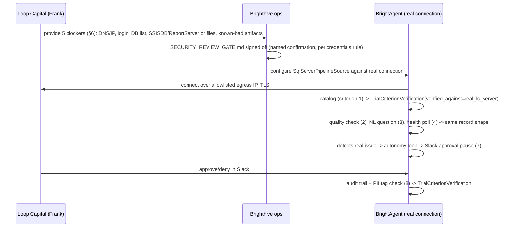

# SPEC: Loop Capital Trial Readiness

> Scope: this spec adds **no new Port/Protocol and no new adapter code**. Every mechanism
> referenced here (`PipelineSource`, `SqlServerPipelineSource`, `analyze_dtsx_package`,
> `analyze_rdl_report`, the surgical-PR remediation loop) already exists and is already proven —
> against a Docker sandbox and a stand-in EC2 SQL Server, per [`golden-cases-loopcapital.md`](./golden-cases-loopcapital.md) and
> `clients/trials/loopcapital/demo.md`. What doesn't exist is proof any of it works against **Loop
> Capital's actual environment** — the Trial has not started; access is blocked on 5 items Loop
> Capital hasn't provided (§6). This spec's only new artifact is a verification-record contract
> (§2) that turns "we think this works" into "here's the evidence it worked on their server,"
> plus the tickets and gate that make that evidence collection trackable and safe.

## 1. Context

Two client-facing documents were sent to Frank Sung (Loop Capital, VP Data Management) in July
2026, captured verbatim in
[`clients/trials/loopcapital/artifacts/2026-07-client-docs-trial-scope-and-demo.md`](../../clients/trials/loopcapital/artifacts/2026-07-client-docs-trial-scope-and-demo.md):

- **"Trial Scope & Success Criteria"** ("Doc 1") — a live SQL Server 2019 connection into Loop
  Capital's actual Azure VM, allowlisted by static egress IP, TLS, least-privilege login. Defines
  9 numbered success criteria; 1-4, 7, 8 are the **core** pass/fail bar, 5, 6, 9 are supporting
  evidence.
- **"Your Brighthive Demo — What to Expect"** ("Doc 2") — a *separate* pre-POC walkthrough in
  Brighthive's hosted demo workspace, on representative/synthetic data. Not the live connection.

**The discrepancy this spec resolves.** `LOOPCAPITAL.md` and [`golden-cases-loopcapital.md`](./golden-cases-loopcapital.md) were
written for an internal 7/17 rehearsal scoped to **dbt Cloud** (GC-14..17: a dbt job fails →
detected → alerted → surgical PR → merged → verified). Doc 1 describes **SQL Server 2019 / SSIS /
SSRS** — no dbt Cloud anywhere. GC-14..17 proved the *remediation mechanism* works; they were
never run against dbt Cloud *or* SQL Server data belonging to Loop Capital. Whether the dbt-Cloud
demo and the SQL-Server trial are the same client engagement described two ways, or two genuinely
parallel workstreams, is **not resolved by this spec** — it's flagged in `LOOPCAPITAL.md`'s
"three things this doc's ecosystem covers" table as an open question for Kuri. This spec proceeds
on the narrower, unambiguous claim: **Doc 1's 9 criteria are SQL-Server/SSIS/SSRS-scoped, and
that's what gets verified here, independent of how the dbt question resolves.**

**What's already proven, and where** (from this session's capability-gap research):

| Criterion | Mechanism status | Proven against |
|---|---|---|
| 1. Connect & catalog | `sql_server` WarehouseType + discovery (BH-1075/1107/1076) exists | Sandbox / demo EC2 — **not** Loop Capital's server |
| 2. Data quality + SQL shown | `quality_check_agent` exists | Sandbox / demo workspace |
| 3. NL question + SQL shown | Warehouse SQL tooling (BH-1120) exists | Sandbox / demo workspace |
| 4. Proactive SQL Server health | `SqlServerPipelineSource` (BH-1045) — real disk-check + Agent job detection | **Live-proven** on demo EC2 (`54.197.188.168`) |
| 5. SSIS diagnostics | `analyze_dtsx_package` (BH-823/863/865/866/869, Done) | Synthetic `.dtsx` fixture |
| 6. SSRS diagnostics | `analyze_rdl_report` | Sandbox `.rdl` fixture |
| 7. Autonomy loop, no self-merge | GC-14..17 (dbt) + `ssis_remediation_agent.py`/BH-1114 (SSIS) — both live-proven, PR opened, human merges | dbt Cloud demo stack + sandbox SSIS — **not** Loop Capital's environment; Slack-approval-gate specifically unconfirmed (only GitHub-PR-review path proven) |
| 8. Governed & auditable | Audit trail (BH-695) + human-review-before-merge proven; **PII tagging is a real code gap** — `scrub_text()` catches secret shapes only, not customer PII values (BH-1060, Needs Refinement) | Partial |
| 9. Platform capability (MCP + routine) | Routine-proposal proven live; external-agent-via-MCP unproven (BH-1038-1041 To Do, BH-1172 Needs Refinement) | Partial, demo-workspace territory |



## 2. Interface Contract (MDE)

**No new Port.** `PipelineSource` (the `Protocol` in
`brightbot/agents/governance_agent/tools/pipeline_health.py`, defined in
`proactive-pipeline-ingestion-monitoring.md` §2) and its `SqlServerPipelineSource` adapter
(BH-1045) are reused unchanged. Proactive SSIS/SSRS polling for criteria 5/6, if ever needed
beyond the reactive `analyze_dtsx_package`/`analyze_rdl_report` tools already shipped, is
`ssis-ssrs-proactive-pipeline-source.md`'s (BH-1110) scope — this spec cross-references it and
does not duplicate it.

**The one new contract** is a verification record — not production code, a tracking shape that
lives alongside `clients/trials/loopcapital/poc.yaml`/`TRACKER.md`:

```
TrialCriterionVerification
  criterion_number: int          # 1-9, per Doc 1
  mechanism_ticket: str          # e.g. "BH-1045" — the ticket that built the underlying capability
  verified_against: "sandbox" | "real_lc_server" | "hosted_demo_workspace"
  evidence_link: str             # PR, screenshot, transcript, or Jira comment with the real run
  verified_at: date              # YYYY-MM-DD
```

A criterion is not closeable in `TRACKER.md`'s Trial section until a record exists with
`verified_against != "sandbox"`.

## 3. Invariants (DbC)

- No criterion row in `TRACKER.md`'s Trial (Doc 1) section is marked done without a
  `TrialCriterionVerification` record where `verified_against` is `real_lc_server` (criteria
  1-8) or `hosted_demo_workspace` (criterion 9).
- Criterion 7's verification MUST exercise the **Slack-approval-gate** specifically — the only
  gate proven so far is GitHub-PR-review (GC-17); Doc 1 explicitly says "pauses for your approval
  in Slack," which is a different, unconfirmed code path.
- Criterion 8's verification MUST NOT run against real Loop Capital data until `BH-1060` (PII
  tagging) reaches at least "Ready for Dev" — `scrub_text()` alone is insufficient for real
  customer PII.
- No code in this repo or `brightbot`/`brighthive-platform-core` initiates a connection to Loop
  Capital's real Azure VM before `SECURITY_REVIEW_GATE.md` (§6) is signed off by name.

## 4. Acceptance Criteria (BDD — Gherkin)

```gherkin
Feature: Loop Capital Trial — core success criteria proven on their real SQL Server

  Scenario: Criterion 1 — connect & catalog
    Given Loop Capital has provided server DNS/IP, NSG confirmation, and a dedicated SQL login
    When BrightAgent connects over the allowlisted egress IP
    Then a browsable catalog of the in-scope databases (tables, columns, types) is produced
    And a TrialCriterionVerification record is written with verified_against="real_lc_server"

  Scenario: Criterion 2 — data quality on real data
    Given a real Loop Capital table is selected
    When the quality_check_agent authors and runs a quality check against it
    Then a quality score, a readable report, and the generated SQL are returned
    And any real issue is flagged with a plain-language root cause

  Scenario: Criterion 3 — ask in plain language
    Given a business question about Loop Capital's real SQL Server data
    When the question is asked in natural language
    Then it is answered correctly with the underlying SQL shown alongside the answer

  Scenario: Criterion 4 — proactive SQL Server health
    Given SqlServerPipelineSource is polling Loop Capital's real server
    When a SQL Agent job fails or disk pressure crosses the threshold
    Then BrightAgent surfaces the specific job name and actual error, unprompted

  Scenario: Criterion 7 — the autonomy loop, Slack-gated
    Given BrightAgent detects a real issue in a SQL Server/SSIS pipeline on Loop Capital's server
    When it diagnoses the issue and opens a governed remediation PR
    Then it pauses for approval in Slack, not merges automatically
    And it is structurally unable to approve its own change

  Scenario: Criterion 8 — governed & auditable
    Given BH-1060 has reached at least "Ready for Dev"
    When any agent action touches Loop Capital's real data
    Then the action is captured in a tamper-evident audit trail
    And any PII in the data is tagged, not just secret-shaped strings

  Scenario: Blocked — Trial cannot start
    Given Loop Capital has not yet provided all 5 items in §6
    When any verification ticket under BH-1245 is attempted
    Then it remains blocked, and no TrialCriterionVerification record is written
```

## 5. Out of Scope

- New `PipelineSource` adapter code — unchanged; BH-1045/BH-1110 own that surface if it ever needs
  to grow.
- Changes to `analyze_dtsx_package` or `analyze_rdl_report` — reused as-is.
- Criteria 5, 6, 9 as blocking — they're supporting evidence per Doc 1's own passing bar, verified
  but not required to declare the Trial's core criteria passed.
- The actual local-stack spin-up (`brightbot`/`brighthive-platform-core`/`brighthive-webapp`
  against staging, per `RUN_LOCAL_AGAINST_STAGING.md`) and the live SQL Server connection itself —
  both are a future phase, gated on `SECURITY_REVIEW_GATE.md` sign-off and Loop Capital providing
  the 5 items in §6.
- Resolving whether the dbt-Cloud GC-14..17 flow and this SQL-Server trial are the same client
  engagement — left open for Kuri, tracked in `LOOPCAPITAL.md`.

## 6. Dependencies

| Dependency | Type | Status |
|---|---|---|
| Loop Capital: server DNS/IP + NSG confirmation (TCP 1433 reachable) | Blocking | Not started |
| Loop Capital: dedicated least-privilege SQL login | Blocking | Not started |
| Loop Capital: in-scope database list | Blocking | Not started |
| Loop Capital: SSISDB/ReportServer confirmation, or `.dtsx`/`.rdl` files directly | Blocking | Not started |
| Loop Capital: known-bad sample artifacts (flawed package, slow report, quality-issue table) | Blocking | Not started |
| `SECURITY_REVIEW_GATE.md` — named sign-off before any real connection | Blocking | Not started |
| `BH-1060` — PII tagging beyond secret-shape scrubbing | Blocking (for criterion 8 only) | Needs Refinement |

## 10. Test Coverage Update

This spec's only shipped artifact is the `TrialCriterionVerification` record shape and the
process around it — not new production code. Coverage is therefore process-level, not a new L0/L1/
L2 layer:

| Repo | Suite | What to add |
|---|---|---|
| `brightbot` | `brightbot/brightbot/evals/` | One `RUN_LIVE`-gated case (reusing the gating pattern from `ssis-ssrs-proactive-pipeline-source.md` §10) asserting a `TrialCriterionVerification` with `verified_against="real_lc_server"` is rejected unless `evidence_link` resolves to a real artifact — not a construct/mock. |

No `brighthive-webapp`, `brighthive-platform-core`, or `brighthive-e2e` rows — this spec adds no
new endpoint, UI surface, or cross-repo flow of its own; each verification ticket in §Ticket
Breakdown exercises *existing* surfaces in those repos, which already carry their own test
coverage from the specs that shipped them (BH-1045, BH-1075/1107, BH-823, BH-1047, BH-695).

## Areas Involved

| Area | Repo | Impact |
|---|---|---|
| Monitoring/verification | `brightbot` | No code change; verification runs exercise existing `SqlServerPipelineSource`, `quality_check_agent`, `analyze_dtsx_package`, `analyze_rdl_report`, remediation loop against a real connection instead of sandbox. |
| PII tagging | `brightbot` | `BH-1060` (separate ticket, escalated by this spec, not authored here) closes the real gap for criterion 8. |
| Tracking | `agentic-project-mgmt` | `TrialCriterionVerification` records, `TRACKER.md`/`poc.yaml` updates, `SECURITY_REVIEW_GATE.md`. |

## Ticket Breakdown

All `issueType: "Task"` under epic `BH-1245` — never `"Story"`.

| Ticket | Summary | Epic |
|---|---|---|
| BH-1246 | verify(trial): SQL Server connect & catalog against LC's real Azure VM (criterion 1) | BH-1245 |
| BH-1247 | verify(trial): data quality check + SQL-shown against LC's real tables (criterion 2) | BH-1245 |
| BH-1248 | verify(trial): NL question answered with SQL shown against LC's real data (criterion 3) | BH-1245 |
| BH-1249 | verify(trial): proactive SQL Server health against LC's real Azure VM (criterion 4) | BH-1245 |
| BH-1250 | verify(trial): SSIS diagnostics against LC's real deployed packages (criterion 5) | BH-1245 |
| BH-1251 | verify(trial): SSRS diagnostics against LC's real reports (criterion 6) | BH-1245 |
| BH-1252 | verify(trial): autonomy loop + Slack-approval-gate against LC's real environment (criterion 7) | BH-1245 |
| BH-1253 | verify(trial): governed audit trail + PII tagging against LC's real data (criterion 8) | BH-1245 |
| BH-1254 | verify(trial): platform capability (MCP external-agent + routine proposal) on demo workspace (criterion 9) | BH-1245 |

## Related

- **Epic**: `BH-1245` — Loop Capital Trial Execution
- **Cross-referenced (not superseded)**: `BH-1036` — Monitoring Agents epic, owns the underlying
  mechanisms this spec verifies
- **Security gate**: `clients/trials/loopcapital/SECURITY_REVIEW_GATE.md`
- **Flow diagram**: `clients/trials/loopcapital/TRIAL_FLOW.md`
- **Tracker**: `clients/trials/loopcapital/TRACKER.md` (Trial (Doc 1) section)
