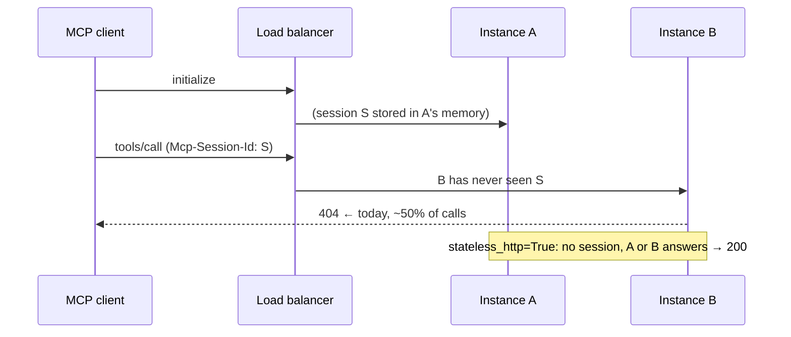

# MCP stateless transport — any instance answers any call

## 1. Context

brightbot serves MCP with FastMCP mounted as `get_mcp().http_app(path="/")` (`http/app.py:63`). FastMCP's default is `stateless_http=False`, so every MCP session lives only in the memory of the process that answered `initialize`. Any later call carrying that `Mcp-Session-Id` that lands on another process gets `404`.

**Measured on staging, 2026-10-06, with no deploy in flight:** 5 sessions × 30 `tools/list` calls gave **73 × 200 and 77 × 404**. Each session split about 50/50, which matches two instances behind a round-robin load balancer. Every redeploy also kills every open session. Effect: about half of all MCP calls fail. That includes Projects v2 project actions (`create_project`, `update_project`, …), the MCP e2e suite (6 failures on 2026-10-06), Claude MCP connectors, and the webapp's MCP connectivity card and fleet panels. Production runs the same kind of deployment and is probably affected (**not verified**).

The fix is to run MCP stateless (`stateless_http=True`), so no request depends on which instance handled `initialize`. No brightbot MCP tool reads or writes session state; grep for `ctx.session`, `elicit`, `report_progress`, `ctx.sample`, `set_state` and `get_state` under `brightbot/mcp` finds nothing. In stateless mode the server sends no `Mcp-Session-Id`, so every client must accept its absence **before** the server switches.



## 2. Interface Contract (MDE)

- **Server.** `get_mcp().http_app(path="/", stateless_http=True)`. `initialize` returns no `Mcp-Session-Id`, and `tools/list` and `tools/call` work without one.
- **Clients:**
  - The session id is optional. Send `Mcp-Session-Id` only when the server issued one.
  - On `404` for a request that carried a session id, re-run `initialize` and resend once. This is the MCP spec rule, and it's safe for mutations because the call never reached a tool.

| Client | File | State |
|---|---|---|
| webapp | `src/WorkspaceSettings/mcpSession.ts` (`openMcpSession` threw when there was no id) | ✅ fixed, merged to webapp `staging` (#1486, `991f2127`). **Not deployed:** needs the manual Amplify build (`brighthive-main` account, SSO login). |
| webapp | `src/WorkspaceSettings/useMcpToolCount.ts` | ✅ already tolerated a missing id |
| e2e | `e2e/core/mcp.py` (`initialize_mcp` raised when there was no id) | 🟡 draft PR brighthive-e2e #94: optional id plus reopen-on-404. Not yet run against staging. `ruff check` reports 4 errors, not yet checked against `master`. |
| brightbot | `http/app.py:63` | ⚪ not started |
| other MCP consumers | `brightbot-slack-server`, the brightagent-v3 client, any script that requires a session id | ⚪ grep before the server switch |

## 3. Invariants (DbC)

- **INV-1** THE System SHALL answer any MCP request on any instance, without reliance on a prior request reaching the same instance.
- **INV-2** WHEN a client receives 404 for a request carrying a session id, THE client SHALL re-initialize and resend at most once.
- **INV-3** THE server switch SHALL ship only after every known client tolerates a missing session id.
- **INV-4** The MCP auth middleware and tool authorization SHALL behave identically in stateless mode (auth is per request already).

## 4. Acceptance Criteria (BDD)

```gherkin
Feature: MCP works regardless of which instance answers

  Scenario: Many calls, no 404s
    Given staging runs the stateless MCP server
    When a client opens 5 sessions and makes 30 tools/list calls each
    Then all 150 calls return 200

  Scenario: Project lifecycle over MCP
    When the MCP e2e suite runs with --writes
    Then test_projects (create, update, set status, read, delete) passes

  Scenario: Redeploy does not break clients
    Given a client is mid-run
    When brightagent-staging rolls out a new revision
    Then the client's next call succeeds (stateless, or reopen-on-404)

  Scenario: Webapp surfaces
    Given the webapp build with #1486
    Then the MCP connectivity card and the fleet health panels load
```

## 5. Out of Scope

- Sticky sessions at the load balancer: not under our control on LangGraph Cloud, and fragile.
- Server-initiated streams (GET SSE), which stateless mode drops. Nothing uses them today.

## 6. Dependencies

1. The webapp Amplify staging build that includes #1486.
2. Merge e2e #94.
3. brightbot switches to `stateless_http=True`, merged to `staging` (which auto-builds `brightagent-staging`).
4. Verify on staging.
5. Promote to prod with explicit approval.

## 9. Observability Contract

- No new events. Verification is the 5 × 30 probe (0 × 404) and the e2e suite. MCP tool calls are already audited by brightbot's tool audit; platform-core mutations are audited by BH-1579.

## 10. Test Coverage Update

| Layer | Where | Case |
|---|---|---|
| L1 | brightbot `tests/unit/mcp_server/` | The app factory passes `stateless_http=True`. A test client calls `initialize`, then `tools/list` with **no** session id, and gets 200. |
| L2 | brighthive-e2e `e2e/core/mcp.py` | Missing session id accepted. A 404 reopens the session and resends once (unit test with a fake transport). |
| e2e | brighthive-e2e `e2e/features/mcp/` | The full suite with `--writes` on staging. `test_projects` passes, plus the 5 × 30 probe. |
