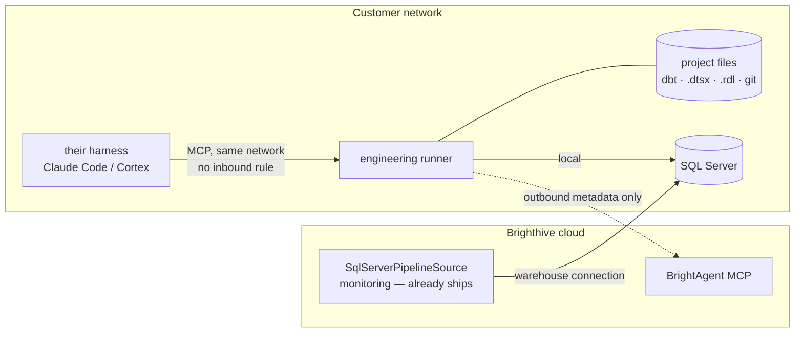

# On-prem engineering runner

## 1. Context

Off-cloud customers can already be **monitored** from our cloud. `SqlServerPipelineSource`
(BH-1045/GC-15) reads volume free space and SQL Agent job history over the customer's warehouse
connection, and its own docstring notes it needs "no new on-host collector, no agent installed on
the SQL Server itself." That ships.

They cannot be **engineered** from our cloud. dbt Core is a filesystem tool before it is a SQL
tool — project tree, models, `target/` artifacts, git working tree, all on disk. Executing
cloud-side puts the customer's project on *our* filesystem, where their engineers cannot open or
edit their own models. The legacy stack splits the same way: SSISDB holds *deployed* packages
(readable over the warehouse connection), while the *source* `.dtsx` files engineers open in SSDT
live on the filesystem.



**The split is by what the work touches, not by what computes it.** Re-conflating those is the
error [ADR-0001](../adr/0001-dbt-core-runs-cloud-side-against-on-prem-sql-server.md) made.

## 2. Interface Contract (MDE)

MCP tools exposed by the runner (`brightagent-engineering-runner`):

```
list_project_files()  -> {roots_searched: [str], file_count: int,
                          files: [{path, kind, size_bytes}]}
read_project_file(path: str)
                      -> {path, kind, size_bytes, truncated, content}
                       | {status: "refused", reason: str}
list_models()         -> {available: bool, model_count: int,
                          models: [{unique_id, name, schema, materialized, depends_on}]}
run_models(selector: str | None)   -> DbtOutcome.summary()
build_models(selector: str | None) -> DbtOutcome.summary()
test_models(selector: str | None)  -> DbtOutcome.summary()
check_connection()    -> {checked: bool, login_name: str,
                          is_sysadmin: 0|1, is_db_owner: 0|1}

DbtOutcome.summary(): {succeeded: bool, exit_code: int, command: str,
                       models: [{name, status, rows_affected, message}],
                       stdout_tail: str, stderr_tail: str}

kind ∈ {ssis_package, ssrs_report, dbt_model, project_config}
```

Configuration is environment-only, prefixed `BRIGHTAGENT_ONPREM_`, read once at boot.

## 3. Invariants (DbC)

| # | Invariant |
|---|---|
| INV-1 | `WHEN the configured login holds sysadmin or db_owner, THE System SHALL refuse to start.` Checked against the **live session**, not config — a login can join a fixed role long after provisioning. |
| INV-2 | `IF a requested path resolves outside every configured root, THEN THE System SHALL refuse the read.` Paths resolve **before** the containment check, so `..` and symlinks cannot escape. |
| INV-3 | `THE System SHALL NOT expose monitoring tools` — disk, Agent jobs, catalog, connection health ship in the hosted MCP. A second local copy is a weaker door onto the same data. |
| INV-4 | dbt is invoked argv-only, never through a shell. A selector arrives from an MCP caller; a shell would make it arbitrary command execution on the customer's host. |
| INV-5 | `THE System SHALL NOT report success it cannot evidence` — outcomes are read from dbt's own `run_results.json`, not parsed from stdout. |
| INV-6 | Only file types in the readable set are served, even inside an allowed root. The allowlist bounds *where*; the type set bounds *what*. |
| INV-7 | No dependency in the runner calls an external API. There is deliberately **no LLM client**: the agent reasons in our control plane; this executes. |

## 4. Acceptance Criteria (BDD)

```gherkin
Feature: Engineering work where the customer's files live

  Scenario: The runner refuses to serve as an administrator
    Given a configuration whose login is a member of sysadmin
    When the runner starts
    Then it exits with a non-zero code naming the offending account
    And no tool is served

  Scenario: A privileged login with an innocent name is still refused
    Given a login named svc_brightagent that is a member of sysadmin
    When the runner verifies its own privileges
    Then it refuses, because the check reads the live session and not a name list

  Scenario: Engineering files are readable from disk
    Given configured source roots containing SSIS packages and dbt models
    When the caller lists project files
    Then each file is returned with its kind and size
    And the roots that were searched are stated

  Scenario: A path outside the roots is refused
    Given configured source roots
    When the caller requests a path outside them, including via .. traversal
    Then the read is refused

  Scenario: dbt runs where the files are
    Given a dbt project on the local filesystem and a reachable warehouse
    When the caller runs the models
    Then the rows land in the agent-owned schema
    And the outcome reports per-model status read from dbt's own artifacts

  Scenario: A model targeting the client's data is rejected by the database
    Given the runner connected as the scoped engineer principal
    When a model attempts to write into the client's schema
    Then the database rejects it, without any check in the runner
```

## 5. Out of Scope

- **Monitoring tools** (INV-3) — already ship from the cloud.
- **Writing to the customer's working tree.** Reads only in v1; proposing edits goes through the
  governed PR path (BH-1414), never a direct write.
- **Metadata sync to the control plane** — real and required, tracked as BH-1425, not yet built.
- **Packaging and install** for Windows Server or an adjacent Linux host — BH-1427.

## 6. Dependencies

- ODBC Driver 18 for SQL Server on the host; `dbt-core` + `dbt-sqlserver` + `pyodbc`.
- Governed principals provisioned on the target (`sql/05_governed_principals.sql`, BH-1418),
  including the two metadata grants dbt needs: `VIEW DEFINITION` **and** explicit `SELECT` on
  `sys.sql_expression_dependencies`, neither granted to a non-`db_owner` by default.
- The Loop Capital sandbox for development (BH-1403).

## 7. Correctness Properties

### Property 1: Write authority is bounded by the database, not by this code

*For any* mutating statement the runner issues, it succeeds only if its target lies in the schema
the engineer principal owns. This holds **even if the runner's source is modified**, because the
boundary is `GRANT`/`DENY` in the customer's database rather than a check in our Python.

This matters more than usual here: the customer runs this on their own hardware and may read and
edit it. Any governance claim that lives in our code is a claim they can delete.

**Validates: §3 INV-1, §4 Scenario "A model targeting the client's data is rejected by the database"**

### Property 2: Filesystem reach is bounded by configuration

*For any* requested path P, the runner serves P only if P resolves inside a configured root. Since
resolution precedes containment, no `..` sequence or symlink yields a path outside the roots.

**Validates: §3 INV-2, INV-6, §4 Scenario "A path outside the roots is refused"**

### Property 3: Privilege is verified, not asserted

*For any* start-up, the refusal decision comes from the server's own `IS_SRVROLEMEMBER` /
`IS_ROLEMEMBER` answer on the live session, never from the configured username. A blocklist of
names cannot catch `svc_brightagent`; the server can.

**Validates: §3 INV-1, §4 Scenario "A privileged login with an innocent name is still refused"**

## 8. Eval Criteria

Not applicable — the runner executes instructions and performs no LLM inference (INV-7).

## 9. Observability Contract

- **Startup**: logs the resolved login and whether it is privileged; logs the readable source
  roots so an operator can see the runner's reach without reading config.
- **Refusals**: every path refusal states the attempted path and the configured roots.
- **Gap**: outcomes are not yet emitted to the control plane — that is BH-1425. Until it lands,
  a run performed through this runner is invisible to lineage and run history.

## 10. Test Coverage

| Layer | Coverage | State |
|---|---|---|
| L0 surface | Listing shape, file classification, truncation flag, refusal envelope | ✅ `tests/test_project_files.py` |
| L1 routing | Refused paths never reach the filesystem; unconfigured roots read nothing | ✅ `tests/test_project_files.py` |
| L2 behavior | Privilege refusal on a **real** SQL Server; containment against a **real** filesystem; dbt writing real rows | ✅ `tests/test_governed_login.py` + `tests/test_project_files.py` — **13 passing** |
| e2e | Harness → runner → dbt → SQL Server → metadata synced | ⬜ Blocked on BH-1425 |

Containment is tested against a real filesystem rather than a mocked `Path`, because the attacks
that matter — `..` traversal and symlinks — *are* filesystem behaviour. The traversal case asserts
its own precondition (that the raw string still starts with the allowed root), so it fails loudly
if someone later "simplifies" containment to a prefix comparison. The symlink case covers what
`..` checking alone misses: a path that never textually leaves the allowed directory while its
target does.

Verified against the sandbox on 2026-08-13: 12 files listed and classified across 3 roots, an SSIS
package read from disk, `/etc/passwd` and a `../../../../` traversal both refused, and `dbt run`
landing 30 rows — confirmed by querying the database rather than trusting the tool's payload.

**The forcing question**: if SQL Server's permission engine or the path resolver changed behaviour
tomorrow, the L2 cases go red. They construct no fakes.
