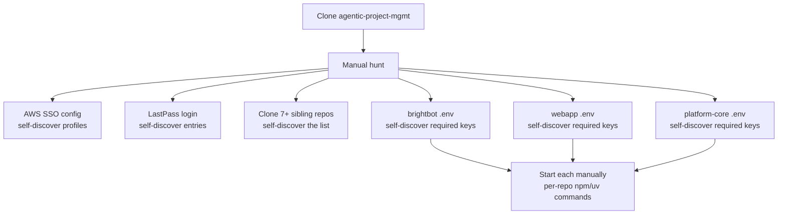

# BrightHive Engineering-Leader Onboarding — Layered Idempotent Bootstrap

## Problem

Today, getting a new engineering leader productive on BrightHive takes hours-to-days of tribal-knowledge transfer: which sibling repos to clone, which AWS profiles to set up, where each repo's `.env` template lives, which secrets it needs, which DynamoDB workspace row maps to staging, how to flip the whole stack between local / staging / production. The vaults (`aws-secrets-vault`, `dynamo-vault`, `lastpass-vault`) and skills (`/aws-auth`, `/bh-auth`) exist as building blocks, but nothing composes them into a clean clone-and-go experience.

This spec defines a **layered, atomic, idempotent** onboarding system. Atomic primitives at the bottom, multi-repo orchestrators in the middle, the single `make onboard` ceremony at the top. **Every command is safe to re-run** — it detects already-done state and skips, never re-pulls, never overwrites a working `.env`.

## Use Case / Goal

**Success**: A new BrightHive engineering leader can clone `agentic-project-mgmt`, supply their own AWS SSO config + LastPass session + GitHub token, and reach a working `make localstack` (all sibling services up locally) or `make stagingstack` (all services pointed at Staging) in **under 30 minutes** without asking anyone a question.

**End state**:
- A single `ONBOARDING.md` at the repo root with the linear 6-step new-leader flow
- A `Makefile` with a four-layer command hierarchy (primitive → repo → stack → onboard)
- Every command is **idempotent** — running it twice does nothing the second time except print "already done"
- State detection via `.state/` directory of timestamped sentinel files (gitignored)
- Per-sibling-repo `Makefile`s expose the same three targets: `make local`, `make staging`, `make start`
- New leader's incremental flow:
  1. Clone `agentic-project-mgmt`
  2. Fill in `.env` with their AWS profile + LastPass user + GitHub token
  3. `make onboard` (validates creds, clones siblings, caches secrets, materializes env files)
  4. `make localstack` (everything up locally) OR `make stagingstack` (everything pointed at staging)
  5. Done — open browser

**Who benefits**:
- New engineering hires / leaders — no tribal-knowledge transfer required
- Existing team — `make onboard` works on the existing setup without breaking it (idempotent guarantee)
- AWS partnership review — visible "the platform onboards in <30min" story

## Current Situation

### How It Works Today



What exists:
- `aws-secrets-vault/cli/secrets` — list, classify, export AWS Secrets Manager (4 accounts)
- `dynamo-vault/cli/secrets` — read workspace configs from DynamoDB
- `lastpass-vault/cli/secrets` — fetch, search, export LastPass entries
- `/aws-auth` skill — SSO login + creds refresh
- `/bh-auth` skill — Cognito JWT generation per env
- `Makefile` — only `slack-*` targets for the 3-repo Slack integration flow (no full stack)
- No `.env` materialization layer
- No `ONBOARDING.md`
- No state detection (every command is "do it again from scratch")

### Hard Limitations

1. **Tribal knowledge gates onboarding** — the list of sibling repos, the env-var requirements, the workspace-id → DynamoDB row mapping all live in heads, not files.
2. **No idempotency** — running setup twice either errors or silently overwrites work; not safe.
3. **Per-repo command divergence** — brightbot uses `local_bootstrap.py`, platform-core uses `npm run deploy:local`, webapp uses `npm start`. No shared `make local` contract.
4. **No env-switch primitive** — flipping the whole stack from local-mode to staging-mode requires editing many `.env` files manually.
5. **Vaults are read-only producers** — they output JSON/CSV but never write into a sibling repo's `.env`.

### Gaps

- No `.env` materialization step that turns vault data into `../brightbot/.env`, `../brighthive-webapp/.env.local`, etc.
- No sibling-repo cloner that knows the full set of repos to fetch.
- No state directory for tracking "session valid since", "secrets cached since", "siblings cloned".
- No per-sibling-repo standardization of `make local` / `make staging` / `make start`.
- No "starter" `.env.example` at the orchestrator repo with the user-supplied keys an engineering leader needs.

## Proposals / Solutions

### Recommended Approach: Four-Layer Make Hierarchy

```
Layer 4  make onboard
                │ composes ↓
Layer 3  make localstack | make stagingstack
                │ composes ↓
Layer 2  per-repo: make local | make staging | make start
                │ composes ↓
Layer 1  atomic primitives: check-* | refresh-* | pull-* | materialize-*
```

**Core invariant**: every command at every layer is **idempotent**. Re-running it on a fully-set-up workstation does nothing except verify state and exit 0.

### Layer 1 — Atomic Primitives (in `agentic-project-mgmt/Makefile`)

Each primitive is **one operation**. Detects state. Skips if already in desired state. Never destructive without explicit confirmation.

#### Credential primitives

| Target | What it does | State sentinel |
|---|---|---|
| `make check-aws` | For each BH profile (main, staging, production), check SSO session valid via `aws sts get-caller-identity`. Output a green/red status table. Exit 0. | `.state/aws/{profile}-checked` |
| `make refresh-aws` | For each profile whose session is invalid/expired, run `aws sso login --profile X`. Skip green ones. | `.state/aws/{profile}-session` |
| `make check-lastpass` | `lpass status` — print logged-in user or red. Exit 0. | `.state/lastpass/checked` |
| `make refresh-lastpass` | `lpass login $LASTPASS_USER` only if not logged in. | `.state/lastpass/session` |
| `make check-gh` | `gh auth status` — print red if not logged in. | `.state/gh/checked` |
| `make refresh-gh` | `gh auth login` only if needed. | `.state/gh/session` |
| `make check-git-ssh` | `ssh -T git@github.com` — print red if denied. | `.state/git-ssh/checked` |
| `make check-creds` | Compose: check-aws + check-lastpass + check-gh + check-git-ssh. Single status report. | — |

#### Sibling-repo primitives

| Target | What it does | State sentinel |
|---|---|---|
| `make check-siblings` | List every sibling repo we expect (`config/siblings.txt`) and which exist at `../<name>`. Output table: present / missing / dirty. | — |
| `make clone-siblings` | `git clone` each missing sibling into `../`. Skip ones already present. Never touch dirty trees. | — |
| `make pull-siblings` | `git pull --ff-only` on each sibling's default branch ONLY if working tree is clean. Skip dirty ones with warning. | — |
| `make list-siblings` | Print the full sibling list with current branch + dirty status. | — |

`config/siblings.txt`:
```
brightbot
brightbot-v2
brighthive-platform-core
brighthive-webapp
brightbot-slack-server
brighthive-admin
brighthive-data-organization-cdk
brighthive-data-workspace-cdk
brighthive-jobs
brighthive-ibm-wxo
brighthive-docs
```

#### Secret cache primitives

| Target | What it does | State sentinel |
|---|---|---|
| `make pull-aws-secrets` | Run `aws-secrets-vault/cli/secrets export` for each env into `secrets/aws/{env}.json`. Skip if cache <24h old (use `make pull-aws-secrets FORCE=1` to override). | `.state/secrets/aws-{env}-last-pull` |
| `make pull-dynamo-configs` | Run `dynamo-vault/cli/secrets list --account X` for each env into `secrets/dynamo/{env}.json`. Skip if cache <24h. | `.state/secrets/dynamo-{env}-last-pull` |
| `make pull-lastpass` | Run `lastpass-vault/cli/secrets export` for tagged-for-onboarding entries. Skip if cache <24h. | `.state/secrets/lastpass-last-pull` |
| `make pull-secrets` | Compose: pull-aws + pull-dynamo + pull-lastpass. | — |

`secrets/` directory is **gitignored**. Never committed.

#### Env materialization primitives

| Target | What it does | State sentinel |
|---|---|---|
| `make env-{repo}-{env}` | Generate `../{repo}/.env{.local}` from cached secrets + per-repo template at `config/env-templates/{repo}-{env}.env.tmpl`. Skip if existing file is newer than cache and matches checksum. | `.state/env/{repo}-{env}-materialized` |
| `make env-show {repo}` | Print which `.env` files exist for repo + their last-materialized timestamp. | — |
| `make env-diff {repo} {env}` | Show what would change if we re-materialized — non-destructive preview. | — |

Per-repo env templates live at `config/env-templates/`. Each is a Jinja-like template that pulls from cached secrets:

```
# config/env-templates/brightbot-local.env.tmpl
DATABASE_URL=postgres://localhost:5432/brighthive_local
COGNITO_USER_POOL_ID={{ aws.staging["us-east-1_EAYUbZPFk"] }}
LANGCHAIN_API_KEY={{ lastpass["langsmith-api-key"] }}
AWS_PROFILE=brighthive-staging
ENV=local
# ... etc
```

The materializer reads `secrets/aws/{env}.json` + `secrets/lastpass.json` + `secrets/dynamo/{env}.json`, resolves the template, writes `../brightbot/.env`. Never overwrites if existing file has user-modified content (heuristic: compare against last-known-materialized checksum stored in `.state/env/{repo}-{env}-materialized`).

#### Service primitives

| Target | What it does |
|---|---|
| `make start-{repo}` | Start one repo's local dev server in the background, write PID to `.pids/{repo}.pid`. Skip if already running. |
| `make stop-{repo}` | Kill the PID if present. |
| `make status` | Show all `.pids/*.pid` with running state. |
| `make logs-{repo}` | `tail -f` the repo's local log. |

### Layer 2 — Per-Repo Wrappers (in each sibling repo's own Makefile)

Each sibling repo MUST expose three uniform targets in its own `Makefile`:

| Target | Contract |
|---|---|
| `make local` | Read `.env` (already materialized by orchestrator), start the service against local Postgres/Redis/LocalStack. Idempotent: skip if already running. |
| `make staging` | Read `.env` (already materialized for staging), start the service pointed at Staging Cognito + Staging APIs. Idempotent. |
| `make start` | Default — equivalent to `make local` if no env explicitly set. |

This is a **standardization ticket per repo**. brightbot, webapp, platform-core, slack-server, brightbot-v2 each get one ticket to add these targets if they don't already exist (or rename existing ones to the convention).

### Layer 3 — Multi-Repo Stack Wrappers (in `agentic-project-mgmt/Makefile`)

| Target | What it does |
|---|---|
| `make localstack` | Compose: check-creds + check-siblings + env-all-local + start-all-local. Re-running with everything green: no-op. |
| `make stagingstack` | Compose: check-creds + check-siblings + env-all-staging + start-all-staging. |
| `make stack-status` | Print state of all sibling services (running / stopped / env mode). |
| `make stack-stop` | Stop all services started by stack commands. |

`env-all-local` is itself a composition of `env-brightbot-local + env-webapp-local + env-platform-core-local + ...` — one per sibling that has an env template.

`start-all-local` is `start-brightbot + start-platform-core + start-webapp + ...` in dependency order (e.g. platform-core before webapp).

### Layer 4 — Top-Level Onboard

| Target | What it does |
|---|---|
| `make onboard` | The ceremony for a fresh clone. Composes: validate `.env` exists, check-creds, refresh any missing creds, clone-siblings, pull-secrets, env-all-local. **Does not start services** (use `make localstack` after). |
| `make onboard-status` | Show what onboard would do — prints what's already done and what's pending. |
| `make onboard --force` | Force re-pull all caches (clears `.state/` first). |

### Idempotency Rules

1. Every primitive **MUST** check state before doing work and print `skipped (already done since YYYY-MM-DD HH:MM)` instead of repeating.
2. Cache TTL: secrets caches default 24h; sessions follow AWS SSO TTL (typically 8h); sentinel files use `touch` timestamps.
3. **Never overwrite a user-modified file** — env materializer compares against last-materialized checksum; if user edited, prints a diff + asks (or honors `--force`).
4. **Never** `rm -rf` or destructive ops without explicit `--force` flag.
5. Dirty git working trees are **never** auto-updated — print warning, skip.

### Worst-Case → Best-Case Spectrum

The system MUST handle every state along this spectrum without breaking:

| State | What `make onboard` does |
|---|---|
| Fresh clone, nothing set up | Validates `.env` (asks user to fill if missing), refreshes all sessions, clones all siblings, pulls all caches, materializes all envs |
| AWS SSO logged in, nothing else | Skips AWS refresh, refreshes LastPass + gh, clones missing siblings, pulls caches, materializes envs |
| Everything already set up | Prints "all green, nothing to do" + status table |
| Some siblings exist + are dirty | Skips dirty siblings with warning, processes clean ones |
| User has hand-edited a `.env` | Detects checksum mismatch, prints diff, asks (or honors `--force`) |
| Secrets cache is fresh (<24h) | Skips re-pull, uses cached values for env materialization |
| Some AWS profiles missing | Refreshes only the missing ones, skips valid ones |

### `.env.example` (at repo root)

The new engineering leader fills in **only** what's theirs:

```bash
# YOUR AWS profile name (after you run `aws configure sso`)
AWS_MAIN_PROFILE=brighthive-main
AWS_STAGING_PROFILE=brighthive-staging
AWS_PRODUCTION_PROFILE=brighthive-production

# YOUR LastPass account
LASTPASS_USER=you@brighthive.io

# YOUR GitHub token (with org:read + repo)
GITHUB_TOKEN=ghp_...

# Optional: where sibling repos live (default: ../)
SIBLINGS_DIR=../

# Optional: secrets cache TTL (default: 86400 = 24h)
SECRETS_CACHE_TTL=86400
```

No BrightHive shared secrets in `.env` — those come from the vaults.

### Alternatives Considered

| Approach | Pros | Cons | Why Not |
|---|---|---|---|
| Single mega-script `bootstrap.sh` | Easy to write | Not idempotent without lots of extra logic; hard to debug partial failures; can't run individual steps | Rejected — user explicitly asked for atomic-first |
| Devcontainer / Codespace | Zero local setup | Forces a specific IDE; doesn't help engineers who don't use it; doesn't solve the vault/secrets gap | Future: complementary, not blocker |
| Terraform-style desired-state engine | Best idempotency | Massive over-engineering for this scope | Rejected — Makefile + sentinel files is enough |
| Pip-installable CLI (`bh onboard`) | Nicer UX than make | Yet another tool to install; make is already there | Rejected — start with make, can wrap later |
| **Four-layer Make hierarchy with sentinel-file state (RECOMMENDED)** | Atomic, idempotent, composable, no new tooling, every step debuggable | Make syntax is a small learning curve | Chosen |

## Areas Involved

| Area | Repo | Impact |
|---|---|---|
| Orchestrator | `agentic-project-mgmt` | New `Makefile` (replaces current slack-only), `ONBOARDING.md`, `.env.example`, `config/siblings.txt`, `config/env-templates/`, `scripts/state.sh`, `.gitignore` updates for `secrets/` and `.state/` |
| Vaults | `agentic-project-mgmt/aws-secrets-vault`, `dynamo-vault`, `lastpass-vault` | Minor: ensure all three have a `export --json` mode that writes to a specified path the materializer can read |
| brightbot | `brightbot` | New `make local`, `make staging`, `make start` targets in repo Makefile |
| brightbot-v2 | `brightbot-v2` (or wherever the v2 rewrite lives) | Same — `make local/staging/start` |
| Platform Core | `brighthive-platform-core` | Same — wrap existing `npm run deploy:local` etc. into `make local` |
| Webapp | `brighthive-webapp` | Same — wrap `npm start` / vite into `make local` and `make staging` |
| Slack Server | `brightbot-slack-server` | Same — wrap `npm run dev` into `make local` and `make staging` |
| CDK repos | `brighthive-data-workspace-cdk`, `brighthive-data-organization-cdk` | Different contract — these don't run locally; their `make staging`/`make production` should run `cdk diff` |

## Acceptance Criteria

### Layer 1 — atomic primitives
- [ ] **AC-L1.1**: Every primitive listed in §"Layer 1" exists in `agentic-project-mgmt/Makefile` and is callable individually.
- [ ] **AC-L1.2**: Every primitive is idempotent — running twice in a row, the second run prints "skipped (already done)" within 1s.
- [ ] **AC-L1.3**: `make check-creds` runs in <5s when all sessions are valid.
- [ ] **AC-L1.4**: `make pull-secrets` honors 24h cache; re-running skips with `(cache fresh)` message.
- [ ] **AC-L1.5**: `make env-brightbot-local` writes `../brightbot/.env` from cached secrets + template; re-running does nothing if file is current.
- [ ] **AC-L1.6**: `make env-brightbot-local` detects user-edited file (checksum diff) and prints diff without overwriting.

### Layer 2 — per-repo wrappers
- [ ] **AC-L2.1**: `brightbot`, `brighthive-webapp`, `brighthive-platform-core`, `brightbot-slack-server` each have `make local`, `make staging`, `make start` in their own Makefile.
- [ ] **AC-L2.2**: Each `make local` works against an already-materialized `.env` — no internal vault calls.
- [ ] **AC-L2.3**: Each `make local` is idempotent — re-running while already up prints "already running" and exits 0.

### Layer 3 — stack wrappers
- [ ] **AC-L3.1**: `make localstack` brings up the full local stack from a clean (but onboarded) repo in <5min.
- [ ] **AC-L3.2**: `make stagingstack` brings up all services pointed at Staging Cognito + APIs.
- [ ] **AC-L3.3**: Re-running `make localstack` after success prints "all running" and exits 0 — no restart.
- [ ] **AC-L3.4**: `make stack-stop` cleanly stops all services started by stack commands.

### Layer 4 — onboard
- [ ] **AC-L4.1**: From a fresh clone on a workstation with NOTHING set up, `make onboard` succeeds end-to-end (after user fills `.env`).
- [ ] **AC-L4.2**: From a fully-set-up workstation, `make onboard` prints status table in <10s and exits 0.
- [ ] **AC-L4.3**: From any state in between, `make onboard` does only the missing work and exits 0.
- [ ] **AC-L4.4**: `make onboard-status` shows what would happen without doing anything.
- [ ] **AC-L4.5**: `make onboard --force` clears `.state/` and re-runs everything.

### Cross-cutting
- [ ] **AC-X.1**: `ONBOARDING.md` at repo root has linear 6-step flow with command + expected output per step.
- [ ] **AC-X.2**: Time to first working `make localstack` for a new engineering leader (no prior BrightHive knowledge) ≤ 30 minutes.
- [ ] **AC-X.3**: `secrets/` and `.state/` are gitignored.
- [ ] **AC-X.4**: All targets have `make help` documentation.

## Dependencies

| Dependency | Type | Status |
|---|---|---|
| `aws-secrets-vault` CLI | Blocking | Live |
| `dynamo-vault` CLI | Blocking | Live |
| `lastpass-vault` CLI | Blocking | Live |
| `/aws-auth` skill | Non-blocking | Live |
| AWS SSO config on user workstation | Blocking — user supplies | User responsibility |
| LastPass session | Blocking — user supplies | User responsibility |
| GitHub token | Blocking — user supplies | User responsibility |
| Sibling repos clonable via SSH | Blocking | Live (org access required) |
| Per-repo `make local/staging/start` targets | Blocking for L3+ | Need to be added (5 tickets) |

## Implementation Order (Atomic-First, Wrap-Later)

The whole point is to build the bottom up so each layer is proven before composition.

**Phase 1 — Layer 1 atomic primitives** (one ticket each, prove independently):
1. `make check-aws` + `make refresh-aws` + sentinel files
2. `make check-lastpass` + `make refresh-lastpass`
3. `make check-gh` + `make check-git-ssh`
4. `make check-creds` (composition smoke test)
5. `config/siblings.txt` + `make check-siblings` + `make clone-siblings` + `make pull-siblings`
6. `make pull-aws-secrets` + sentinel + 24h cache logic
7. `make pull-dynamo-configs` + sentinel
8. `make pull-lastpass` + sentinel
9. `make pull-secrets` (composition smoke test)
10. `config/env-templates/` structure + `make env-brightbot-local` as the first proof
11. `make env-{repo}-{env}` generalized for all repo × env combos
12. `make env-show` + `make env-diff`

**Phase 2 — Layer 2 per-repo wrappers** (one ticket per sibling repo):
13. `brightbot`: `make local/staging/start`
14. `brighthive-webapp`: `make local/staging/start`
15. `brighthive-platform-core`: `make local/staging/start`
16. `brightbot-slack-server`: `make local/staging/start`
17. `brightbot-v2`: `make local/staging/start` (when v2 lands)
18. CDK repos: `make staging/production` (cdk diff contract)

**Phase 3 — Layer 3 stack wrappers**:
19. `make start-{repo}` primitives + `.pids/` tracking
20. `make localstack` composition + `make stack-status` + `make stack-stop`
21. `make stagingstack` composition

**Phase 4 — Layer 4 onboard**:
22. `make onboard` composition
23. `make onboard-status`
24. `make onboard --force`
25. `ONBOARDING.md` written + tested with a real new-leader simulation

**Each phase ends with a working demo.** Phase 1 alone is useful (atomic primitives debuggable). Phase 2 alone is useful (a leader who's already cloned siblings can `make local` per repo). Phases 3+4 are the polish layer.

## Ticket Breakdown

| Ticket | Phase | Summary | Points |
|---|---|---|---|
| BH-TBD-1 | 1 | Make scaffold + `.state/` + `.gitignore` + `make check-aws` + `make refresh-aws` | 3 |
| BH-TBD-2 | 1 | `make check-lastpass` + `make refresh-lastpass` + `make check-gh` + `make check-git-ssh` + `make check-creds` | 3 |
| BH-TBD-3 | 1 | `config/siblings.txt` + sibling primitives (check/clone/pull/list) | 3 |
| BH-TBD-4 | 1 | `make pull-aws-secrets` + 24h cache + sentinel | 3 |
| BH-TBD-5 | 1 | `make pull-dynamo-configs` + `make pull-lastpass` + `make pull-secrets` | 3 |
| BH-TBD-6 | 1 | `config/env-templates/` design + `make env-brightbot-local` (first proof) | 5 |
| BH-TBD-7 | 1 | Generalize `make env-{repo}-{env}` + `make env-show` + `make env-diff` | 3 |
| BH-TBD-8 | 2 | brightbot: `make local/staging/start` | 2 |
| BH-TBD-9 | 2 | brighthive-webapp: `make local/staging/start` | 2 |
| BH-TBD-10 | 2 | brighthive-platform-core: `make local/staging/start` | 2 |
| BH-TBD-11 | 2 | brightbot-slack-server: `make local/staging/start` | 2 |
| BH-TBD-12 | 2 | CDK repos: `make staging/production` (cdk diff contract) | 3 |
| BH-TBD-13 | 3 | `make start-{repo}` primitives + `.pids/` tracking | 3 |
| BH-TBD-14 | 3 | `make localstack` + `make stack-status` + `make stack-stop` | 3 |
| BH-TBD-15 | 3 | `make stagingstack` | 2 |
| BH-TBD-16 | 4 | `make onboard` composition | 3 |
| BH-TBD-17 | 4 | `make onboard-status` + `make onboard --force` | 2 |
| BH-TBD-18 | 4 | `ONBOARDING.md` written + tested with a real new-leader run-through | 3 |

**Total: ~48 points across 18 tickets**, four phases. Each phase deliverable on its own.

## Related

- **Vaults**: `aws-secrets-vault/`, `dynamo-vault/`, `lastpass-vault/` (already built — read-only producers)
- **Skills**: `/aws-auth`, `/bh-auth` (already built — composable into primitives)
- **Existing Makefile**: current slack-only targets become a thin wrapper over the new stack commands (`make slack-local` → `make localstack SUBSET=slack`)
- **AgentCore migration epic (BH-453)**: this onboarding is a prerequisite for the AWS partnership "demo in 30 min" story
- **Sprint 10 release notes**: BrightStudio IA + AgentCore epic landed in Sprint 10 — onboarding is the natural follow-up for Sprint 11/12
