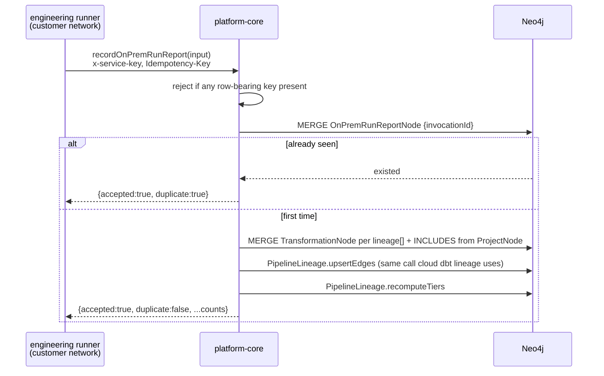

# On-prem run report receiver

## 1. Context

The on-prem engineering runner (BH-1425) already builds and delivers a run report — outbound,
idempotent on dbt's `invocation_id`, spooled and replayed through outages, guarded so nothing
row-shaped leaves the customer's tenant. Verified against a real HTTP listener, 48 tests.

Nothing receives it. `build_destination()` falls back to `LocalFileDestination` whenever
`control_plane_endpoint`/`control_plane_api_key` are unset, and even when they are set,
`ControlPlaneDestination` POSTs the bare report JSON with a `Bearer` token — not a GraphQL
mutation, and not the `x-service-key` header every other service-principal write in platform-core
uses. There is no receiving mutation, so this would fail the moment it reached a real endpoint.
Today a run performed on Loop Capital's network is invisible to lineage, run history, and
self-healing — exactly the gap ADR-0002 named as the cost of running engineering on the
customer's filesystem.

platform-core already has two things worth reusing rather than re-inventing:

- **`TransformationRunResult`/`updateTransformationRunStatus`** — read-side, polls a run the
  platform itself triggered via dbt Cloud's job API. An on-prem run has no `jobId`, no polling
  target, and an externally-supplied `invocation_id` instead of a platform-issued `runId`. Forcing
  it into this shape costs more than it saves.
- **The engine-agnostic lineage graph** (`SPEC-AGNOSTIC-PIPELINE-LINEAGE.md`) —
  `upsertPipelineLineageAsService` already exists precisely so "which engine wrote this" is a
  `sourceAdapter` string, not a new type. `dbt-onprem` is simply one more adapter value into the
  *same* `DERIVES_FROM` graph a cloud-executed dbt run writes into — this is what makes on-prem
  lineage "queryable identically to a cloud-executed run's" for free, instead of by building a
  parallel query surface.



**One sender-side gap this spec must also close.** The report body (§2, fixed by BH-1425) carries
no `workspaceId`/`projectId` — the runner never needed them to build or spool a report. A receiving
mutation cannot route a payload it cannot address, so `ControlPlaneDestination` gains the two
identifiers as constructor config (`workspace_id` already exists on `PluginSettings` for the
`workspace_secret` credential path; `project_id` is new) and sends them as GraphQL variables, never
inside the report body itself — keeping `build_run_report`'s contract, and its row-data guard,
untouched. This is corrective, not scope creep: `ControlPlaneDestination` has never been exercised
against a real receiver, because until this spec there was nothing to receive it.

## 2. Interface Contract (MDE)

### platform-core (new)

```graphql
input OnPremModelOutcomeInput {
  name: String!
  status: String!
  rowsAffected: Int
}

input OnPremLineageModelInput {
  uniqueId: ID!
  name: String!
  schema: String
  materialized: String
  dependsOn: [ID!]!
}

input RecordOnPremRunReportInput {
  workspaceId: ID!
  projectId: ID!
  invocationId: ID!
  dbtVersion: String
  generatedAt: String
  succeeded: Boolean!
  exitCode: Int
  command: String
  models: [OnPremModelOutcomeInput!]!
  lineage: [OnPremLineageModelInput!]!
  modelCount: Int
  testCount: Int
}

type RecordOnPremRunReportOutput {
  accepted: Boolean!
  duplicate: Boolean!
  transformationNodesWritten: Int!
  edgesWritten: Int!
}

extend type Mutation {
  recordOnPremRunReport(input: RecordOnPremRunReportInput!): RecordOnPremRunReportOutput!
}
```

Service-key auth (`x-service-key`, `SCHEDULER_SERVICE_API_KEY`) — same pattern as
`upsertPipelineLineageAsService` / `updateTransformationRunStatus`. Deliberately not `@authorized`;
the runner has no user JWT.

### brightagent-engineering-runner (corrected)

```
ControlPlaneDestination(endpoint, api_key, workspace_id, project_id)
  .send(report, idempotency_key) -> None | raises

to_graphql_request(report, *, workspace_id, project_id)
  -> {"query": str, "variables": {"input": {...RecordOnPremRunReportInput shape}}}
```

## 3. Invariants (DbC)

| # | Invariant |
|---|---|
| INV-1 | `IF a payload contains a row-bearing key (the same `ROW_BEARING_KEYS` set the sender guards), THEN THE System SHALL reject it before any write.` The sender already guards this (BH-1425); a guarantee enforced only on the client the customer can modify is not a guarantee. |
| INV-2 | `WHEN a report's invocationId has already been recorded, THE System SHALL write nothing further and SHALL return duplicate: true.` A retried or replayed delivery must never duplicate lineage or the run record. |
| INV-3 | `THE System SHALL NOT accept a report whose projectId is not INCLUDEd by a ProjectNode GOVERNed by the given workspaceId.` Prevents an on-prem runner (or a forged request bearing the shared service key) from writing lineage into a project it has no standing over. |
| INV-4 | Every `TransformationNode` this mutation creates carries `lineageEngine: "dbt-onprem"` and is `INCLUDES`-anchored from the target `ProjectNode` — the same anchor shape `workspaceScopeGuard` requires for `pipelineLineage`/`recomputeTiers` to see it at all. An unanchored node would write successfully and read back invisible (the exact "lineage split-brain" `pipeline-lineage.ts` already documents for a different cause). |
| INV-5 | Lineage edges are written through the existing `PipelineLineage.upsertEdges`, never a second Cypher path — one MERGE-by-(sourceId,targetId) rule, one confidence-upgrade rule, for every adapter. |
| INV-6 | `confidence` for on-prem edges is `DAG` — they come from dbt's own `manifest.json`, the same authority level as a cloud-executed dbt run's edges, not a text-guessed `PARSED` edge. |
| INV-7 | Service-key auth only; no `@authorized` directive, no user-session assumption. |

## 4. Acceptance Criteria (BDD)

```gherkin
Feature: platform-core receives an on-prem run report

  Scenario: A first-time report lands lineage and a run record
    Given a workspace with a project that has zero registered transformations
    And a valid x-service-key
    When recordOnPremRunReport is called with a report naming 3 models and 2 dependency edges
    Then the response reports accepted true and duplicate false
    And 3 TransformationNodes exist, each INCLUDES-anchored to the project
    And pipelineLineage for that workspace traverses the 2 edges with confidence DAG

  Scenario: The same invocation is delivered twice
    Given a report already recorded under invocation_id X
    When recordOnPremRunReport is called again with the identical invocation_id
    Then the response reports duplicate true
    And no additional TransformationNode or DERIVES_FROM edge is written

  Scenario: A payload carrying compiled SQL is refused
    Given a report whose lineage entry contains a compiled_code field
    When recordOnPremRunReport is called
    Then the call is rejected before any Neo4j write
    And no OnPremRunReportNode is created

  Scenario: The service key is missing or wrong
    Given a request with no x-service-key header
    When recordOnPremRunReport is called
    Then the call is rejected with Forbidden
    And no data is written

  Scenario: The projectId does not belong to the claimed workspace
    Given a projectId governed by a different workspace
    When recordOnPremRunReport is called with this workspaceId
    Then the call is rejected
    And no TransformationNode or edge is written

  Scenario: The runner's ControlPlaneDestination speaks the real contract
    Given a report built by build_run_report and a configured workspace_id/project_id
    When ControlPlaneDestination.send is called against a local platform-core instance
    Then the HTTP body is a valid GraphQL request naming recordOnPremRunReport
    And the request carries an x-service-key header, not Authorization: Bearer
```

## 5. Out of Scope

- **Resolving `depends_on` edges to raw source tables.** A model's upstream source in dbt's
  manifest carries dbt's own `unique_id` scheme (`source.project.name.table`), which will not, in
  general, match whatever id platform-core assigned that physical table as a `DataAssetNode`. Those
  edges are skipped by `upsertEdges`'s existing "missing endpoint" rule (§3 Inv 3 of
  SPEC-AGNOSTIC-PIPELINE-LINEAGE) — the same limitation cloud-executed dbt lineage already accepts.
  Reconciling dbt source ids to registered `DataAssetNode` ids is a separate, engine-agnostic
  problem, not unique to on-prem, and not solved here.
- **Per-model run status** (`lastRunStatus`/`gitPrUrl`/remediation surfaced per `TransformationNode`
  the way `updateTransformationRunStatus` does for cloud runs). The report's `models[]` array
  (name/status/rows_affected) is persisted on `OnPremRunReportNode` as a JSON-ish list for audit,
  not fanned out onto per-model run-status fields — doing that well needs its own design pass once
  there is a second on-prem customer to generalize from.
  - **Provisioning the shared service key onto the customer's runner install.** Key distribution and
  rotation follow whatever BH-1427's packaging lands as the config mechanism; this spec only
  consumes `BRIGHTAGENT_ONPREM_CONTROL_PLANE_API_KEY` as already-delivered configuration.

## 6. Dependencies

- BH-1425 (done) — the report shape this mutation accepts.
- `SPEC-AGNOSTIC-PIPELINE-LINEAGE.md` — `PipelineLineage.upsertEdges`/`recomputeTiers`, reused
  verbatim.
- A `ProjectNode` already registered and `GOVERNS`-anchored to the target workspace (out of this
  spec's scope to create).

## 7. Correctness Properties

### Property 1: A run report can never duplicate lineage, however many times it is replayed

*For any* report R with `invocationId` I, calling `recordOnPremRunReport` with R any number of
times writes the `OnPremRunReportNode` for I at most once and the lineage edges it describes at
most once. The spooled-replay path in the runner (BH-1425 Property 4) is what makes this matter in
practice — a control-plane outage WILL cause the same report to arrive more than once.

**Validates: §3 INV-2, §4 Scenario "The same invocation is delivered twice"**

### Property 2: On-prem lineage is unreadable unless anchored, by construction

*For any* `TransformationNode` this mutation creates, it is reachable from the target workspace
through the identical `GOVERNS`/`INCLUDES` walk `workspaceScopeGuard` already performs for every
other lineage node. There is no second, on-prem-specific read path — an anchoring bug here fails
exactly like the pre-BH-1265 "dbt lineage split-brain" already documented in `pipeline-lineage.ts`.

**Validates: §3 INV-4, §4 Scenario "A first-time report lands lineage and a run record"**

### Property 3: Row data cannot reach Neo4j even if the sender's guard is bypassed

*For any* payload containing a key in the shared `ROW_BEARING_KEYS` set, the resolver rejects it
before issuing any Cypher. This is the server-side half of BH-1425 Property 3 — the sender enforces
its half in Python; a customer who forks the runner controls the sender, not the receiver.

**Validates: §3 INV-1, §4 Scenario "A payload carrying compiled SQL is refused"**

## 8. Eval Criteria

Not applicable — no LLM inference in this write path.

## 9. Observability Contract

- **Log event**: `onprem_run_report.accepted` — `workspaceId`, `projectId`, `invocationId`,
  `duplicate`, `transformationNodesWritten`, `edgesWritten`.
- **Log event**: `onprem_run_report.rejected` — `reason` ∈ {`row_data_present`, `invalid_service_key`,
  `project_not_governed`}, never the offending payload itself (it may be the very thing INV-1 exists
  to keep out of logs).
- **Metrics**: none new — reuses the existing `[lineage.upsert]` / `[lineage.tier_derived]` console
  events `PipelineLineage` already emits.

## 10. Test Coverage Update

### platform-core

- **L0**: `recordOnPremRunReport` rejects a malformed input (missing `invocationId`) — GraphQL
  validation, no resolver code reached.
- **L1**: service-key check runs before any Neo4j access; a request with no header never reaches
  `PipelineLineage`.
- **L2 (real-behavior, real Neo4j)**:
  - First-time report creates the `OnPremRunReportNode`, the `TransformationNode`s, the
    `INCLUDES` edges, and the `DERIVES_FROM` edges — verified by querying Neo4j directly, not by
    trusting the resolver's return value (test-behavior-real.md).
  - Second delivery of the same `invocationId` writes nothing new — asserted by node/edge counts
    before and after, not by inspecting the response alone.
  - A payload with a `compiled_code` key anywhere under `lineage[]` is rejected and leaves zero
    trace in Neo4j.
  - `pipelineLineage(workspaceId, nodeId, direction: BOTH)` on a node written by this mutation
    returns the same shape a cloud-executed dbt run's lineage would.
- **e2e (brighthive-e2e or in-repo, whichever this project's harness runs)**: the full chain —
  Loop Capital sandbox dbt run → `build_run_report` → `ControlPlaneDestination.send` → local
  platform-core → Neo4j — is the DoD's own "testable locally, end to end" requirement; run it
  against a local platform-core instance with a live test Neo4j, not mocked.

### brightagent-engineering-runner

- **L0/L1**: `to_graphql_request` builds a well-formed `{query, variables}` body from a real
  `build_run_report()` fixture (not a hand-typed shape — testable-code.md "Fixtures Mirror
  Reality"); asserts the `x-service-key` header is present and `Authorization` is not.
- **L2**: `ControlPlaneDestination.send` against a real local HTTP listener (the existing pattern
  in `tests/test_control_plane_destination.py`) receiving the *new* shape, not the old bare-JSON one.
