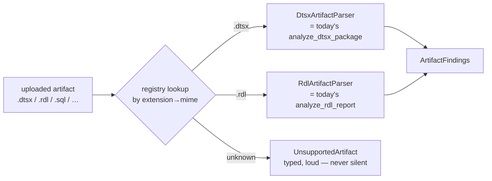

# Format-agnostic pipeline-artifact parser — a registry keyed by file type

> Diagnostics hardcode two formats today (`.dtsx`, `.rdl`; §1 + §6 grounding), so a third file type
> means editing the module. This spec adds a **`PipelineArtifactParser` port + registry keyed by
> extension/mime** (PS-1): the two existing parsers become adapters #1/#2, behaviour unchanged; a new
> format is then an adapter + one registry entry, never a call-site edit.

## 1. Context

Frank's SSIS/SSRS diagnostics land a `.dtsx` or `.rdl` and get back findings. But the trial surface
already receives files that aren't those two — a `.sql` stored proc, a `.json`/`.yml` job config, a
`.py` transform script — and the diagnostics path has **no seam to add them**: the format check is
hardcoded, so today an unknown extension either mis-parses or silently produces nothing. This is a
real gap, not a hypothetical: the ask is "files need to work for any type/format."

The fix is the same Ports & Adapters pattern the codebase already uses for `PipelineSource`
(`pipeline_health.py`) and warehouse/LLM providers: define **what parsing a pipeline artifact means**
in domain terms (a port), register **one adapter per format** keyed by extension/mime, and dispatch
by looking the format up in the registry. The two existing XML parsers (`parse_dtsx:130`,
`parse_rdl:52`) move behind the port with **zero behaviour change** — they become `DtsxArtifactParser`
and `RdlArtifactParser`, adapters #1 and #2, each still returning the same `dict[str, Any]` findings.
Adding `.sql` later is a `SqlArtifactParser` + one registry line.



## 2. Interface Contract (MDE)

### 2.1 The port (defined FIRST — this is the design, not an adapter)

```python
# brightbot/agents/analyst_agent/tools/artifact_parser.py (new)
from typing import Protocol

class PipelineArtifactParser(Protocol):
    """Parse one pipeline artifact into structured findings. One method, domain types only."""

    def formats(self) -> frozenset[ArtifactFormat]: ...   # e.g. {DTSX}, {RDL} — what this adapter handles

    def parse(self, *, artifact: ArtifactBytes) -> ArtifactFindings: ...  # today's parsers take no ctx; keep it so
```

```python
# Domain types — no vendor/XML types (xml.etree) leak across the port boundary.
class ArtifactFormat(StrEnum):
    DTSX = "dtsx"   # SSIS package
    RDL  = "rdl"    # SSRS report definition
    # future adapters extend this enum; the registry, not a call site, learns the new value

@dataclass(frozen=True)
class ArtifactBytes:
    filename: str          # source of truth for extension detection
    content: bytes
    mime: str | None       # fallback discriminator when extension is absent/ambiguous

@dataclass(frozen=True)
class ArtifactFindings:
    format: ArtifactFormat
    findings: dict[str, Any]   # EXACTLY what parse_dtsx/parse_rdl return today — e.g.
                               # {"components": [...], "has_staging_step": bool} or {"parse_error": str}.
                               # Wrapped, not reshaped: the dict is carried through unchanged (INV-1).
```

### 2.2 The registry (single dispatch site)

```python
ArtifactParserFactory = Callable[[], PipelineArtifactParser]

ARTIFACT_PARSERS: Final[dict[ArtifactFormat, ArtifactParserFactory]] = {
    ArtifactFormat.DTSX: DtsxArtifactParser,   # adapter #1 = today's analyze_dtsx_package, wrapped
    ArtifactFormat.RDL:  RdlArtifactParser,    # adapter #2 = today's analyze_rdl_report, wrapped
}

def resolve_parser(*, artifact: ArtifactBytes) -> PipelineArtifactParser:
    """Look up by extension, fall back to mime; raise UnsupportedArtifact if neither maps."""
```

### 2.3 Format detection (extension first, mime fallback)

```python
# _detect_format(filename, mime) -> ArtifactFormat | None
#   1. extension of filename (case-folded) → ArtifactFormat
#   2. else mime → ArtifactFormat
#   3. else None  → caller raises UnsupportedArtifact(filename, tried=[ext, mime])
```

## 3. Invariants (DbC)

- INV-1 The two existing parsers' **output is byte-for-byte unchanged** — `DtsxArtifactParser.parse`
  returns exactly what `analyze_dtsx_package` returns today for the same input. This is a refactor
  behind a seam, not a rewrite.
- INV-2 An unknown format raises a typed `UnsupportedArtifact` naming the filename + what was tried —
  **never a silent empty result and never a mis-parse** as a different format.
- INV-3 Format dispatch happens **only** through `ARTIFACT_PARSERS` — no call site branches on
  extension directly (PS-3: grep for `.dtsx`/`.rdl` string literals returns only the registry + detection).
- INV-4 The port speaks domain types (`ArtifactBytes`, `ArtifactFindings`) — no `xml.etree` / lxml
  type crosses the boundary (PS-4).
- INV-5 A new format is added by **a new adapter + one registry entry only** — no edit to
  `resolve_parser`, detection, or any caller (PS-1).

Budget: 5 invariants.

## 4. Acceptance Criteria (BDD)

```gherkin
Feature: Format-agnostic pipeline-artifact parsing

  Scenario: A .dtsx artifact parses through the registry with unchanged findings
    Given a real SSIS package with a missing error-row redirect
    When it is parsed via resolve_parser
    Then the DtsxArtifactParser handles it
    And the findings equal what analyze_dtsx_package returns for the same bytes

  Scenario: A .rdl artifact parses through the registry with unchanged findings
    Given a real SSRS report definition
    When it is parsed via resolve_parser
    Then the RdlArtifactParser handles it
    And the findings equal what analyze_rdl_report returns for the same bytes

  Scenario: An unsupported format fails loudly, never silently
    Given an artifact named forecast.parquet with no registered parser
    When it is parsed via resolve_parser
    Then an UnsupportedArtifact error is raised naming "parquet"
    And no findings are produced and no other parser is tried

  Scenario: Extension case is ignored
    Given an artifact named EXTRACT.DTSX
    When its format is detected
    Then it resolves to the DTSX parser

  Scenario: Mime is the fallback when extension is absent
    Given an artifact with no extension but mime application/xml-dtsx
    When its format is detected
    Then it resolves to the DTSX parser
```

Budget: 5 scenarios.

## 5. Out of Scope

- **Writing the third parser** (`.sql`, `.json`, `.py`, …) — this spec builds the *seam* and moves the
  two existing parsers behind it. A concrete third adapter is a follow-up ticket once a real trial file
  demands it — the whole point is that it's then additive.
- **Changing what a `.dtsx`/`.rdl` finding means** — the anti-pattern rules
  (`pipeline_diagnostics_tools.py:52-177`) are lifted verbatim into the adapters (INV-1).
- **Auto-remediation** — parsing surfaces findings; opening PRs stays `ssis_remediation_agent.py`'s job.
- **Binary/compiled formats** requiring extraction (`.zip`, `.7z` bundles) — the port takes bytes of a
  single artifact; container unpacking is a separate concern.

## 6. Dependencies

- `analyze_dtsx_package` / `analyze_rdl_report` (`pipeline_diagnostics_tools.py:52-177`) — lifted into
  the first two adapters unchanged.
- `Finding` dataclass (existing return shape) — reused as-is in `ArtifactFindings.findings`.
- `parse_dtsx` / `parse_rdl` (`pipeline_diagnostics_tools.py:130` / `:52`) — the pure functions the two adapters wrap; `analyze_*` are their `@tool` wrappers (`:161` / `:106`).
- Callers today: the `ssis-diagnostics`/`ssrs-diagnostics` chat skills and `ssis_remediation_agent.py`
  — repointed from direct calls to `resolve_parser(...).parse(...)` (INV-3).

## 7. Correctness Properties

### Property 1: Refactor preserves behaviour
*For any* `.dtsx`/`.rdl` bytes, parsing through the registry yields findings identical to the current
direct call. The seam changes dispatch, never output.
**Validates: §3 INV-1, §4 both "unchanged findings" scenarios**

### Property 2: Unknown is loud
*For any* artifact whose extension and mime both fail to map, `resolve_parser` raises
`UnsupportedArtifact` — never returns empty, never coerces to another parser.
**Validates: §3 INV-2, §4 "An unsupported format fails loudly"**

### Property 3: New format = additive only
*For any* new `ArtifactFormat`, enabling it touches only its adapter + one `ARTIFACT_PARSERS` entry —
no caller, `resolve_parser`, or detection code changes.
**Validates: §3 INV-5, §4 (structural — enforced by the registry test asserting call sites are format-blind)**

Budget: 3 properties.

## 8. Eval Criteria

Not applicable — the parsers are deterministic (already evaluated under GC-16 for `.dtsx`); this spec
is a structural seam around them, no new LLM behaviour.

## 9. Observability Contract

- **Log events**: `artifact_parser.resolved` (with `format`), `artifact_parser.unsupported`
  (with `filename`, `tried`) — at debug level.
- **Attributes**: `workspace_id`, `artifact_format`, `filename` — never the artifact content bytes.
- **Metrics**: `artifact_unsupported_total` tagged `workspace_id` — a rising count is the signal that a
  real new format is being handed in and an adapter is worth writing.

## 10. Test Coverage Update

### a. In-repo layered tests (brightbot)
- **L0** — `resolve_parser` contract: `.dtsx`→`DtsxArtifactParser`, `.rdl`→`RdlArtifactParser`,
  `.parquet`→`UnsupportedArtifact`; case-fold + mime-fallback detection (one case per §2.3 / §4).
- **L1** — dispatch is registry-only: a test asserts no caller branches on extension (grep-style
  guard for INV-3 / Property 3).
- **L2** — **real-behavior**: parse the real Loop Capital sandbox `.dtsx` and `.rdl` fixtures
  (`clients/trials/loopcapital/sandbox/ssis/`, `.../ssrs/`) through the registry and assert the
  findings **equal** the current direct-call output for the same bytes (Property 1 — a golden
  comparison against real files, not an invented shape; `~/.claude/rules/test-behavior-real.md`).

### b. Cross-repo e2e (`brighthive-e2e`)
- One feature test: hand the diagnostics surface a real `.dtsx`, assert findings return via the
  registry path end-to-end (proves the repointed callers still work against the real backend).
- One error-path test: hand it an unsupported extension, assert a loud typed error surfaces, not a
  blank result.

### Self-verification
Run brightbot's layered suite + e2e; confirm each §2 contract + §3 invariant + §4 scenario has a case;
confirm the L2 golden comparison runs against the **real** LC `.dtsx`/`.rdl` fixtures and matches the
pre-refactor output exactly.

## 11. PR Split

1. **brightbot** — port + domain types + registry + detection, with `DtsxArtifactParser` /
   `RdlArtifactParser` wrapping the existing parsers unchanged; repoint callers to `resolve_parser`. (M)
2. **brightbot** — L0/L1 + the L2 golden real-fixture comparison (RUN_LIVE-gated). (S)
3. **brighthive-e2e** — feature + unsupported-format error-path tests. (S)

Ordered 1 → 2 → 3. No platform-core or webapp changes — this is a brightbot-internal seam.

## Ticket Breakdown

All children of epic **BH-1255**, `issueType=Task`. Builds the in-trial format-agnostic seam so any
future file type is an additive adapter, not a call-site edit. Numbers to create at handover.

| Ticket | Summary | Size |
|---|---|---|
| BH-XXXX (to create) | `refactor(brightbot): PipelineArtifactParser port + registry keyed by format; move analyze_dtsx_package/analyze_rdl_report behind it as adapters #1/#2 (behaviour unchanged)` | M |
| BH-XXXX (to create) | `test(brightbot): golden L2 — registry path yields identical findings to direct calls on real LC .dtsx/.rdl fixtures (RUN_LIVE-gated)` | S |
| BH-XXXX (to create) | `test(e2e): .dtsx diagnostics via registry end-to-end; unsupported extension fails loudly` | S |
