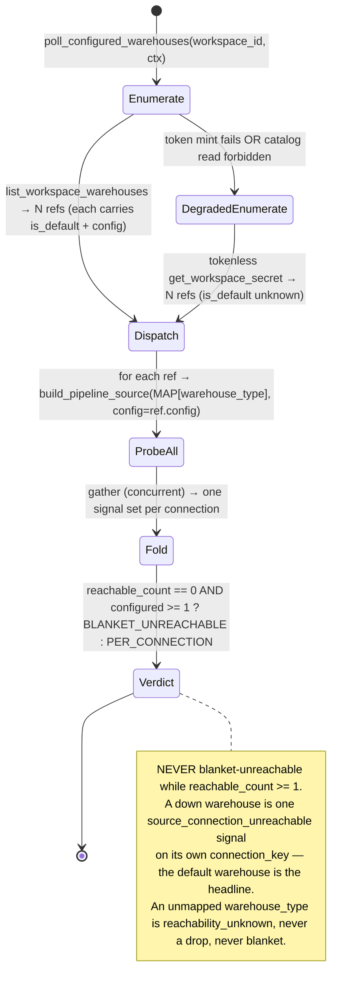

# Pipeline Connectivity Watchdog — probe every configured warehouse, never a blanket unreachable

> One agnostic orchestrator enumerates **every** configured warehouse for a workspace, probes each behind its own adapter, and returns a per-connection verdict. As long as **≥1** configured warehouse is reachable, the workspace is **never** reported blanket-unreachable — a down warehouse is a per-connection signal, not a workspace outage. Engine-agnostic by construction: the orchestrator branches on nothing; adding an engine is a map + registry entry.

## 1. Context

A workspace with **three** configured warehouses of which **one** is down reads as **workspace-wide "unreachable"** today, because the watchdog resolves and probes exactly **one** connection. On staging, Impact Capital (`e3fc0917-03a6-4ac6-aad4-ac265329bfb9`) has three TDS-shaped (Azure Synapse / SQL Server) warehouses; whichever one the adapter's `next(iter(...))` resolves first decides the whole workspace's health. If that one is down, two healthy warehouses are invisible and the workspace looks dead.

The driving requirement: **we must have access to all configured things.** Never a blanket "unreachable" when three are configured and one is missing — probe *all* configured connections, report each individually, and only ever call the *workspace* unreachable when *every* configured warehouse fails.

The root cause is not the Ports & Adapters design — that is sound (one `PipelineSource` Protocol + registry + factory in `pipeline_health.py`, one adapter file per engine). The bug is that **fan-out orchestration leaked into each warehouse adapter** and each adapter self-resolves exactly one connection. Two adapters copy-pasted the same single-select mistake: `sql_server_pipeline_source.py::poll_health` (`_get_warehouse_connection_key:196` → `next(iter(...)):236`) and `snowflake_pipeline_source.py::poll_health` (`_get_snowflake_connection_key:96` → `next(iter(...))`). And even for a *single* connection the behavior was wrong: it never honored the workspace's **default** warehouse — it picked the first secret entry, not the authoritative default.

The fix hoists orchestration **out** of every adapter into one agnostic coordinator, and makes adapters **implicit** — they probe the connection whose config was injected, and resolve nothing themselves.



> **Agnostic by construction — this is the whole point.** Nothing in the orchestrator, the fold, or the verdict names a concrete engine. The *only* sites that name `snowflake` / `azure_synapse` / `databricks` are `WAREHOUSE_TYPE_TO_SOURCE_TYPE` (the dispatch map), `PIPELINE_SOURCE_ADAPTERS` (the registry), and the adapter modules themselves. Support for a new warehouse engine is a map + registry entry (config, per PS-1/PS-3) — never a change to anything that enumerates, dispatches, probes, folds, or renders the verdict. This mirrors the fleet spec's **INV-16** ([`pipeline-self-healing-fleet.md`](pipeline-self-healing-fleet.md) §3) and applies it to the connectivity read.

> **What this spec owns vs. what it reuses.** One topic (CE-1): the **connectivity verdict** — enumerate all, probe all, never blanket unreachable, honor the default as headline. It does **not** own remediation/self-healing (that is [`pipeline-self-healing-fleet.md`](pipeline-self-healing-fleet.md), BH-1255), per-connection `SELECT 1` liveness mechanics ([`warehouse-connection-health.md`](warehouse-connection-health.md), BH-1245/1341), the alert card for a down connection ([`warehouse-connectivity-monitoring-alerts.md`](warehouse-connectivity-monitoring-alerts.md), BH-1036), or the persisted worst-of health snapshot ([`warehouse-health-snapshot.md`](warehouse-health-snapshot.md)). It **depends on** [`warehouse-catalog-enumeration.md`](warehouse-catalog-enumeration.md)'s `list_workspace_warehouses` for the default-honoring enumeration, and **closes the gap** [`proactive-pipeline-ingestion-monitoring.md`](proactive-pipeline-ingestion-monitoring.md) Invariant 16 flags (the "pick-the-first" connection).

## 2. Interface Contract (MDE)

All new types live in `brightbot`. Existing types are reused verbatim and cited. No vendor SDK or type crosses the port (PS-4).

### 2.1 The PORT + registry + factory (UNCHANGED — cited)

```python
# UNCHANGED (pipeline_health.py:86-95) — domain types only, two methods, no vendor type:
class PipelineSource(Protocol):
    def capabilities(self) -> frozenset[Capability]: ...
    async def poll_health(self, *, ctx: RequestContext) -> list[PipelineHealthSignal]: ...

# UNCHANGED registry + factory (pipeline_health.py:106, :142-155) — the single switch site (PS-3):
PIPELINE_SOURCE_ADAPTERS: dict[str, type[PipelineSource]] = {}   # register_adapters(): pipeline_health.py:109-139
def build_pipeline_source(*, source_type: str, config: dict) -> PipelineSource:  # → adapter_cls(config=config)
    ...
```

The registry already maps the source_type keys this spec dispatches to: `ETL_GENERIC="etl"` → `SqlServerPipelineSource` (the TDS family), `SNOWFLAKE_TASKS="snowflake"` → `SnowflakePipelineSource`, `DATABRICKS="databricks"` → `DatabricksPipelineSource` (`pipeline_health.py:109-139`). **The injection point already exists**: `build_pipeline_source` passes `config` straight into `adapter_cls(config=config)`, and both `SqlServerPipelineSource.__init__` and `SnowflakePipelineSource.__init__(self, *, config)` (`snowflake_pipeline_source.py:127`) already store `self._config`. "Adapters go implicit" (§2.4) means their `poll_health` finally **uses** that injected config instead of self-resolving.

> **DTO asymmetry to carry, not fix.** `PipelineHealthSignal.source_type` is `Literal["dbt","databricks","etl"]` (`pipeline_health.py:72`) — it has no `"snowflake"`, so the Snowflake adapter emits its signals as `"etl"` (`snowflake_pipeline_source.py:18`). This spec does **not** widen that Literal (the fleet spec's §2.2 owns that change). The orchestrator keys the verdict on each signal's `metadata["connection_key"]`, never on `source_type`, so the asymmetry is inert here.

### 2.2 The enumeration dependency (REUSED — honors the default)

```python
# REUSED verbatim (warehouse_catalog.py:39-54, :135-183) — the default-honoring enumeration:
@dataclass(frozen=True)
class WarehouseRef:
    id: str; name: str
    warehouse_type: WarehouseType      # NORMALIZED literal, warehouse_types.py — never a raw secret string
    provider_type: str
    is_default: bool                   # authoritative default from GraphQL (warehouse_catalog.py:171)
    config: dict[str, Any] | None      # the connectable config, id-joined (warehouse_catalog.py:162)

async def list_workspace_warehouses(*, workspace_id: str, client: PlatformClient) -> tuple[WarehouseRef, ...]:
    """Every configured warehouse, each ref carrying is_default AND config. Never drops a partial ref."""
```

One call yields everything the orchestrator needs: all refs, the authoritative `is_default`, and each connectable `config`. `warehouse_type` is already **normalized** (`warehouse_type_from_secret`, `warehouse.py:181`): the TDS family (`AZURE_SYNAPSE` / `SYNAPSE_AZURE` / `SQL_SERVER`) collapses to `azure_synapse`; `SNOWFLAKE` → `snowflake`; `POSTGRES`/`POSTGRESQL` → `postgres`; `DATABRICKS` → `databricks`; everything else → `redshift`. The dispatch map keys on this normalized set, never on a raw secret `type`.

### 2.3 The NEW agnostic orchestrator + dispatch map + verdict

```python
# brightbot/agents/governance_agent/tools/connectivity_watch.py (new)
from brightbot.utils.warehouse_types import WarehouseType, AZURE_SYNAPSE, SNOWFLAKE, DATABRICKS
from brightbot.agents.governance_agent.tools.pipeline_health import ETL_GENERIC, SNOWFLAKE_TASKS, DATABRICKS as DATABRICKS_SOURCE

# The ONLY site that maps a warehouse engine to its connectivity adapter (PS-3 single switch site).
# Adding an engine here is the entire cost of supporting it. Absence is handled, never a crash (INV-8).
WAREHOUSE_TYPE_TO_SOURCE_TYPE: Final[dict[WarehouseType, str]] = {
    AZURE_SYNAPSE: ETL_GENERIC,        # TDS family (Synapse / SQL Server) → SqlServerPipelineSource
    SNOWFLAKE:     SNOWFLAKE_TASKS,    # → SnowflakePipelineSource
    DATABRICKS:    DATABRICKS_SOURCE,  # → DatabricksPipelineSource
}   # redshift, postgres: no dedicated connectivity adapter yet → reachability_unknown (INV-8), deferred to §5.

ReachabilityState = Literal["reachable", "unreachable", "unknown"]

@dataclass(frozen=True)
class ConnectionReachability:
    connection_key: str                # stable connection id, NEVER a secret (metadata["connection_key"])
    warehouse_type: WarehouseType
    is_default: bool
    state: ReachabilityState
    detail: str | None = None          # e.g. "login timeout", "no adapter for redshift" — scrubbed, never a value

@dataclass(frozen=True)
class ConnectivityVerdict:
    workspace_id: str
    connections: tuple[ConnectionReachability, ...]
    default_connection_key: str | None            # the is_default warehouse's key, when known
    @property
    def configured_count(self) -> int: return len(self.connections)
    @property
    def reachable_count(self) -> int:
        return sum(1 for c in self.connections if c.state == "reachable")
    @property
    def workspace_reachable(self) -> bool:         # the driving invariant, encoded structurally
        return self.reachable_count >= 1
    @property
    def is_blanket_unreachable(self) -> bool:      # ONLY when >=1 configured AND none reachable (INV-3)
        return self.configured_count >= 1 and self.reachable_count == 0

async def poll_configured_warehouses(*, workspace_id: str, ctx: RequestContext,
                                     client: PlatformClient | None) -> list[PipelineHealthSignal]:
    """Enumerate every configured warehouse, dispatch each to its adapter, probe concurrently, aggregate.
    Zero branch on a concrete engine — dispatch is MAP[ref.warehouse_type] only."""
    refs = await _enumerate_or_degrade(workspace_id=workspace_id, ctx=ctx, client=client)
    tasks = [_probe_one(ref=ref, ctx=ctx) for ref in refs]
    results = await asyncio.gather(*tasks, return_exceptions=True)
    return _flatten_never_dropping(results, refs=refs)   # a raised probe → synthetic unreachable signal (INV-11)

def to_connectivity_verdict(*, workspace_id: str,
                            refs: tuple[WarehouseRef, ...],
                            signals: list[PipelineHealthSignal]) -> ConnectivityVerdict:
    """Fold per-connection signals into one verdict, keyed by metadata['connection_key']."""
```

Orchestrator backbone: mint a headless token via `generate_token_via_ogm()` (the one existing headless token path, used by sibling `fleet_health_digest_task.py:85`) → `make_platform_client(token=...)` → `list_workspace_warehouses(workspace_id, client)` → for each ref, `build_pipeline_source(source_type=WAREHOUSE_TYPE_TO_SOURCE_TYPE[ref.warehouse_type], config=ref.config)` → `poll_health(ctx)` concurrently → fold. This **replaces** the anti-pattern in `pipeline_watchdog_task.py::_poll_all_adapters` (`:165-219`), which sweeps `sorted(PIPELINE_SOURCE_ADAPTERS)` building every adapter with an **empty** config.

```python
# Degraded enumeration (PS-14) — the documented degraded mode:
async def _enumerate_or_degrade(*, workspace_id, ctx, client) -> tuple[WarehouseRef, ...]:
    """Full catalog enumeration when a token is available; tokenless secret enumeration otherwise.
    Probe-all/never-blanket survives the fallback — only the default-headline enrichment is lost."""
    # try: token → list_workspace_warehouses (is_default authoritative)
    # except (token mint failed | catalog read forbidden):
    #   refs from get_workspace_secret(workspace_id)["warehouses"] — config populated, is_default=False for all
```

### 2.4 CONTRACT CHANGE — adapters go implicit (both engines)

```python
# sql_server_pipeline_source.py::poll_health and snowflake_pipeline_source.py::poll_health SHALL probe
# the connection described by the INJECTED self._config, resolving nothing themselves.
#
# - SqlServer: poll_health stops calling _get_warehouse_connection_key on the health path; it probes
#   self._config. _get_warehouse_connection_key (:196) and _poll_blocking (:336) stay byte-for-byte
#   intact for the two NON-health callers (lineage_fetchers.py:159, custom_sql_pipeline_source.py:79).
#   _poll_blocking already builds its OWN WarehouseTool per call (:345, fresh pymssql socket) — that
#   per-call construction is what makes concurrent fan-out thread-safe; it MUST NOT be hoisted/shared.
# - Snowflake: poll_health stops calling _get_snowflake_connection_key (:96) on the health path; it
#   probes self._config. It runs tool.query INLINE on the event loop today — under fan-out it SHALL
#   offload via asyncio.to_thread so one blocking connection cannot stall the gather.
# Both already emit FAILURE_TYPE_CONNECTION_UNREACHABLE (sql_server:66, snowflake:51) with
# metadata["connection_key"] — the per-connection signal the verdict folds on. No fold change needed.
```

## 3. Invariants (DbC)

Budget ≤15; 14 declared.

- **INV-1 Enumerate every configured warehouse, never first-wins.** WHEN the connectivity watch runs, THE System SHALL probe one connection per warehouse returned by `list_workspace_warehouses` (or the degraded enumeration) — NEVER resolve a single connection via `next(iter(...))`. Replaces `_poll_all_adapters` (`pipeline_watchdog_task.py:165-219`); fixes `_get_warehouse_connection_key:236` and `_get_snowflake_connection_key` on the health path.
- **INV-2 Never a blanket unreachable while ≥1 reachable.** IF `reachable_count >= 1`, THEN THE System SHALL NOT emit a workspace-wide "unreachable" verdict; an unresponsive warehouse SHALL surface ONLY as a per-connection `source_connection_unreachable` signal keyed by its `connection_key`.
- **INV-3 Blanket unreachable only when all configured are down.** THE System SHALL treat the workspace as unreachable ONLY when `configured_count >= 1` AND `reachable_count == 0` — `is_blanket_unreachable` is false in every other case.
- **INV-4 Honor the default warehouse as headline.** WHERE a ref reports `is_default=True`, THE System SHALL surface that warehouse's own probe result as `default_connection_key`; the default's config SHALL come from the authoritative catalog (`warehouse_catalog.py:171`), never from a first-entry guess. (This spec references NO `resolve_default_warehouse_id` — no such symbol exists; the default arrives on the `WarehouseRef`.)
- **INV-5 Agnostic dispatch — zero per-engine branch.** THE orchestrator SHALL select an adapter solely via `WAREHOUSE_TYPE_TO_SOURCE_TYPE[ref.warehouse_type]` → `build_pipeline_source`; it SHALL contain no `if warehouse_type == "..."`. Grep test: the only sites naming a concrete engine string are the dispatch map, the registry entries, and the adapter modules — never the orchestrator, fold, or verdict.
- **INV-6 Adapters go implicit — probe the injected config.** Each connectivity adapter's `poll_health` SHALL probe the connection described by `self._config`, and SHALL NOT call `get_workspace_secret` / `next(iter(...))` on the health path. (Contract change to `sql_server_pipeline_source.py` + `snowflake_pipeline_source.py`; the explicit-resolution helpers stay for non-health callers.)
- **INV-7 No configured warehouse silently dropped.** For every enumerated ref, THE System SHALL fold ≥1 `ConnectionReachability` into the verdict — `reachable`, `unreachable`, or `unknown` — never omit a configured warehouse (BH-1363 "never leave a node stale").
- **INV-8 Unmapped warehouse type degrades informationally, never blanket.** WHEN `ref.warehouse_type` has no entry in `WAREHOUSE_TYPE_TO_SOURCE_TYPE` (today: `redshift`, `postgres`), THE System SHALL fold a per-connection `unknown` (`reachability_unknown`) reachability with a reason, continue, and NOT count it as unreachable, and NOT raise.
- **INV-9 Degraded enumeration fallback (PS-14).** IF the headless token mint fails OR the catalog read is forbidden, THEN THE System SHALL enumerate all configured warehouses tokenlessly via `get_workspace_secret(workspace_id)["warehouses"]` (config populated, `is_default=False` for all) so probe-all and the never-blanket verdict survive; only the default-headline enrichment is lost.
- **INV-10 Port intact.** `PipelineSource` SHALL remain the two-method Protocol; enumeration, dispatch, fan-out, and verdict live in the orchestrator, never in the Port; no vendor SDK/type crosses it (PS-4).
- **INV-11 Crash isolation across connections.** A probe that raises for one warehouse SHALL be folded into a synthetic per-connection `unreachable` signal (never silently dropped) and SHALL NOT prevent the other warehouses from being probed or the verdict from being produced.
- **INV-12 Concurrency without shared engine state.** Probes SHALL run concurrently (build-then-`gather`, never `await`-per-item in a loop); no adapter SHALL share a non-thread-safe engine handle across concurrent probes — SqlServer builds its own `WarehouseTool` per call, Snowflake offloads its blocking query via `asyncio.to_thread`.
- **INV-13 Bounded wall-clock under the MCP deadline.** Concurrent fan-out SHALL keep wall-clock ≈ the slowest single probe (worst case ≈ the connection `login_timeout`), staying under `SYNC_WAIT_TIMEOUT_S=90.0` (`mcp/tools/pipeline_health.py:32`).
- **INV-14 Workspace isolation + secret non-leakage.** Every `ConnectionReachability` and signal SHALL carry connection references only (`connection_key`, `warehouse_type`), never secret material; no cross-workspace warehouse is enumerated or probed; the `detail` field passes `scrub_text` before it is ever streamed or logged.

## 4. Acceptance Criteria (BDD)

```gherkin
Feature: Probe every configured warehouse, never a blanket unreachable

  Scenario: Three configured, one down — never blanket
    Given a workspace with three configured warehouses and one whose connection is down
    When the connectivity watch runs
    Then all three warehouses are probed
    And two reachable ConnectionReachability entries and one unreachable entry are folded
    And workspace_reachable is true and is_blanket_unreachable is false
    And no signal, verdict field, or MCP payload marks the workspace unreachable

  Scenario: All configured warehouses down — unreachable only then
    Given a workspace with three configured warehouses all of whose connections are down
    When the connectivity watch runs
    Then each warehouse yields its own per-connection unreachable entry
    And is_blanket_unreachable is true because reachable_count is zero
    And no warehouse is reported healthy

  Scenario: Mixed-engine workspace — each probed by its own adapter
    Given a workspace with one Snowflake and one Azure Synapse warehouse
    When the connectivity watch runs
    Then the Snowflake ref dispatches to SnowflakePipelineSource and the Synapse ref to SqlServerPipelineSource
    And each adapter probes only its own injected config
    And two ConnectionReachability entries are folded, one per connection

  Scenario: The default warehouse is the headline
    Given a workspace whose default warehouse is reachable and a secondary warehouse is down
    When the connectivity watch runs
    Then default_connection_key is the default warehouse's key
    And the down secondary is a per-connection unreachable entry, not the headline

  Scenario: A warehouse type with no connectivity adapter is reachability_unknown, never blanket
    Given a workspace with one reachable Snowflake warehouse and one Redshift warehouse
    When the connectivity watch runs
    Then the Redshift ref folds a reachability_unknown entry with a reason
    And it is not counted as unreachable and the run does not raise
    And workspace_reachable is true

  Scenario: Degraded enumeration when the token mint fails
    Given the headless token mint fails
    When the connectivity watch runs
    Then it falls back to a tokenless get_workspace_secret enumeration of all configured warehouses
    And every warehouse is still probed and folded, with is_default false for all
    And the never-blanket verdict still holds

  Scenario: One probe raising does not stop the cycle
    Given three configured warehouses and one whose probe raises unexpectedly
    When the connectivity watch fans out
    Then the raising warehouse folds a synthetic unreachable entry and is logged
    And the other two warehouses are still probed and folded

  Scenario: Fan-out stays under the MCP deadline
    Given a workspace with three configured warehouses, one of which times out at login
    When the connectivity watch runs
    Then the concurrent probes complete in about the slowest single probe's time
    And the result is returned before SYNC_WAIT_TIMEOUT_S
```

## 5. Out of Scope

- **No remediation / self-healing.** Detect → diagnose → heal → verify is [`pipeline-self-healing-fleet.md`](pipeline-self-healing-fleet.md) (BH-1255). This spec produces a connectivity verdict only.
- **No deep connectivity adapter for `redshift` / `postgres`.** They have no dedicated pipeline-source adapter; they fold `reachability_unknown` (INV-8). The follow-up: route unmapped warehouse types through the agnostic `WarehouseTool` `SELECT 1` liveness ([`warehouse-connection-health.md`](warehouse-connection-health.md)) so every configured warehouse gets a *real* reachability signal, not "unknown."
- **No widening of `PipelineHealthSignal.source_type`.** The Snowflake adapter continues to emit `"etl"`; the fleet spec's §2.2 owns the Literal→`str` change. The verdict keys on `connection_key`, not `source_type`.
- **No persisted health snapshot / alert card.** The worst-of fold + `recordWarehouseHealth` is [`warehouse-health-snapshot.md`](warehouse-health-snapshot.md); the Slack/inbox card for a down connection is [`warehouse-connectivity-monitoring-alerts.md`](warehouse-connectivity-monitoring-alerts.md). This spec emits the signals those consume; it does not render or persist them.
- **No `ConnectionDirectory` re-plumb.** The fleet spec introduces a generic `ConnectionDirectory` port keyed by `source_type` (§2.2). This spec reuses the already-shipped, default-honoring `list_workspace_warehouses` instead. When `ConnectionDirectory` lands, this orchestrator's enumerator can be re-expressed behind it — but the default-honoring + never-blanket verdict semantics stay here.
- **No new schedule / EventBridge wiring.** The connectivity watch runs on the existing watchdog cadence; fleet-sweep scheduling is the fleet spec's concern.

## 6. Dependencies

- **PipelineSource Port + registry + factory** — `pipeline_health.py:86-95, :106, :142-155` (reused; Port shape unchanged, PS-1). Source-type constants `ETL_GENERIC`, `SNOWFLAKE_TASKS`, `DATABRICKS` (`pipeline_health.py`).
- **`list_workspace_warehouses` + `WarehouseRef`** — `warehouse_catalog.py:39-54, :135-183` ([`warehouse-catalog-enumeration.md`](warehouse-catalog-enumeration.md), BH-1370); provides all refs + authoritative `is_default` (`:171`) + connectable `config` (`:162`).
- **`warehouse_type_from_secret`** — `warehouse.py:181`; the normalization the dispatch map keys on (TDS family → `azure_synapse`).
- **`generate_token_via_ogm()`** — the headless Cognito token path (`USER_PASSWORD_AUTH`, returns a real user IdToken), used by sibling `fleet_health_digest_task.py:85`; unlocks the `@authorized` catalog read `list_workspace_warehouses` performs. Requires the OGM service user to hold `WORKSPACE_ADMIN` on the target workspace; INV-9 degrades gracefully when it does not.
- **`get_workspace_secret(workspace_id)`** — `brightbot.tools.aws.secrets_manager`; the tokenless degraded enumeration source (INV-9), imported locally inside the function to preserve the unit-test override point (matching `_get_warehouse_connection_key:218`).
- **`SqlServerPipelineSource`** — `sql_server_pipeline_source.py`; `poll_health` (`:257`, offloads via `asyncio.to_thread`), `_poll_blocking` (`:336`, builds its own `WarehouseTool`), `FAILURE_TYPE_CONNECTION_UNREACHABLE` (`:66`), `HEALTH_WATCH_ENABLED_KEY` (`:104`). `_get_warehouse_connection_key` (`:196`) stays intact for `lineage_fetchers.py:159` + `custom_sql_pipeline_source.py:79`.
- **`SnowflakePipelineSource`** — `snowflake_pipeline_source.py`; `__init__(self, *, config)` (`:127`) stores `self._config`, `poll_health` (`:133`, inline `tool.query` — gains an `asyncio.to_thread` offload), `FAILURE_TYPE_CONNECTION_UNREACHABLE` (`:51`). `_get_snowflake_connection_key` (`:96`) stays intact for non-health callers.
- **`_fold_signals_into_warehouse_snapshots`** — `pipeline_watchdog_task.py:525-589`; already keys snapshots by `metadata["connection_key"]` (`:540`), so the fold layer needs no change once fan-out stamps `connection_key` on every signal (both adapters already do).
- **`WarehouseTool`** — `warehouse.py:209`; the agnostic `SELECT 1` liveness engine the §5 follow-up would call for unmapped types.
- **MCP host** — `mcp/tools/pipeline_health.py`; `SYNC_WAIT_TIMEOUT_S=90.0` (`:32`) is the wall-clock ceiling fan-out must stay under (INV-13).

## 7. Correctness Properties

### Property 1 — Probe-all completeness
*For any* workspace with N configured warehouses, exactly N connections are probed and ≥N `ConnectionReachability` entries are folded — none dropped. **Validates: §3 INV-1, INV-7; §4 "Three configured, one down".**

### Property 2 — Never blanket while ≥1 reachable
*For any* workspace with N≥1 configured warehouses of which k≥1 are reachable, `is_blanket_unreachable` is false and `workspace_reachable` is true. Only k==0 yields blanket unreachable. **Validates: §3 INV-2, INV-3; §4 "Three configured, one down", "All configured warehouses down".**

### Property 3 — Default honored as headline; degraded still enumerates
*For any* workspace with a default warehouse, `default_connection_key` reflects the default's own probe; *for any* degraded run (token/catalog unavailable), the verdict still enumerates and probes all warehouses, losing only the default enrichment. **Validates: §3 INV-4, INV-9; §4 "The default warehouse is the headline", "Degraded enumeration".**

### Property 4 — Agnostic dispatch, port intact
*For any* `warehouse_type`, the only engine-naming sites are the dispatch map, the registry, and the adapter modules; the orchestrator/fold/verdict have no engine branch, and no vendor type crosses the Port. **Validates: §3 INV-5, INV-10; §4 "Mixed-engine workspace".**

### Property 5 — Adapters implicit
*For any* connectivity adapter, `poll_health` probes `self._config` and performs no `get_workspace_secret` self-resolution on the health path. **Validates: §3 INV-6.**

### Property 6 — Crash isolation
*For any* single probe that raises, all other warehouses are still probed and the verdict is produced; the raising warehouse folds a synthetic unreachable entry, never a silent drop. **Validates: §3 INV-11; §4 "One probe raising does not stop the cycle".**

### Property 7 — Unmapped type is informational, never fatal
*For any* configured warehouse whose `warehouse_type` is unmapped, the verdict folds one `reachability_unknown` entry, the run does not raise, and the entry is not counted as unreachable. **Validates: §3 INV-8; §4 "A warehouse type with no connectivity adapter".**

## 8. Eval Criteria

No LLM node in this capability — connectivity enumeration, probing, and the verdict are fully deterministic and covered by the §3 invariants, not by evals. (The remediation LLM behavior downstream of a connectivity signal is [`pipeline-self-healing-fleet.md`](pipeline-self-healing-fleet.md) §8.)

## 9. Observability Contract

- **Spans** (OTel GenAI conventions):
  - Parent `gen_ai.tool.execute` with `gen_ai.tool.name=pipeline_connectivity_watch`, carrying `workspace.id`, `connectivity.connection_count`, `connectivity.reachable_count`, `connectivity.workspace_reachable`, `connectivity.degraded_enumeration` (bool). The parent SHALL NOT carry a single-valued `connection_key` — it is ambiguous across N children.
  - One **child span** per connection, `pipeline.connectivity.probe`, carrying `connection.key`, `warehouse.type`, `warehouse.is_default`, `pipeline.signals_emitted` — opened with a `try/finally: child.end()`. OTel `add_event`/`set_attribute`/`end` are thread-safe, so passing the child span object into the offloaded `_poll_blocking` is transparent.
- **Log events**: `connectivity.enumerated` (count, degraded flag), `connectivity.connection_reachable`, `connectivity.connection_unreachable` (per connection_key), `connectivity.reachability_unknown` (unmapped type + reason), `connectivity.degraded_enumeration` (token/catalog fallback), `connectivity.verdict` (workspace_reachable, reachable_count, configured_count). Every event's free-text `detail` passes `scrub_text` before emission (INV-14).
- **Metrics (saturation SLIs, PS-18)**: `connectivity.connections_probed` (per run), `connectivity.unreachable_total` (tagged `warehouse.type`), `connectivity.workspace_unreachable_total` (increments only on `is_blanket_unreachable`), `connectivity.probe_duration_ms` (gauge, per child).

## 10. Test Coverage Update

Extend the existing brightbot layered evals (`brightbot/evals/` L0/L1/L2) and the cross-repo `brighthive-e2e` suite — no greenfield sibling files. Extend the existing adapter tests in `tests/unit/agents/governance_agent/` rather than dropping siblings.

**L0 (surface)** — one per §2 contract entry: `WAREHOUSE_TYPE_TO_SOURCE_TYPE` maps `azure_synapse`→`etl`, `snowflake`→`snowflake`, `databricks`→`databricks` and has no `redshift`/`postgres` key; `build_pipeline_source("etl")` / `("snowflake")` return the right adapter type; `ConnectivityVerdict.workspace_reachable` is true iff `reachable_count>=1`; `is_blanket_unreachable` is true only when `configured_count>=1 and reachable_count==0`; `ConnectionReachability` state literal set (`reachable`/`unreachable`/`unknown`); an unmapped `warehouse_type` folds `unknown`, never raises.

**L1 (routing)** — the orchestrator enumerates N adapters for N configured warehouses (not the `sorted(PIPELINE_SOURCE_ADAPTERS)` sweep, not first-wins); each `warehouse_type` dispatches to the correct adapter with `config=ref.config`; the degraded path (token mint fails) routes to the tokenless `get_workspace_secret` enumeration and still dispatches all.

**L2 (behavior, ≥1 real-behavior test)** — one per observable §3 invariant: **three configured warehouses, one down → two reachable + one per-connection unreachable, `is_blanket_unreachable` false** (real `SqlServerPipelineSource` against a captured/sandboxed connection); all-down → each unreachable individually, blanket true only then; **mixed-engine (Snowflake + Synapse) → each probed by its own adapter on its own injected config**; a probe that raises folds a synthetic unreachable and the others still probe (INV-11); the degraded fallback still probes all when the token mint fails (INV-9); **adapters probe `self._config` — assert no `get_workspace_secret` self-resolution on the health path** (INV-6). Span/log assertions (§9): parent carries `connection_count`+`reachable_count` and no single `connection_key`; one child span per connection carrying `connection.key`. The existing `test_sql_server_pipeline_source.py` span-topology assertions (`len(spans)==1`, per-outcome events on `spans[0]`, single-valued `ATTR_CONNECTION_KEY`) must be rewritten for the parent+children topology; existing `poll_health` tests that monkeypatch `_get_warehouse_connection_key` must switch to driving the injected config.

**Cross-repo e2e (`brighthive-e2e`)** — happy-path: an Impact-Capital-shaped workspace (three TDS warehouses, one unreachable) polled through the real MCP `pipeline_health` tool returns per-connection states + `workspace_reachable=true`, **never** a blanket unreachable, within `SYNC_WAIT_TIMEOUT_S`. Surface test: the verdict payload shape over the real MCP boundary. Error-path: all-down workspace returns `is_blanket_unreachable=true` with one unreachable entry per connection.

Self-verification before the implementation PR: every new §2/§3/§4 entry has a matching test case, and all suites are green against the new code. Forcing question the fan-out must satisfy — *with three configured TDS warehouses and one down, does any signal, verdict field, span attribute, or MCP payload mark the **workspace** unreachable?* If yes, the fix is incomplete.

## 11. Ticket Breakdown

- **BH-1457** (parent epic **BH-1255**, also relates **BH-876**; assignee Kuri) — the agnostic connectivity watchdog: `connectivity_watch.py` (dispatch map + orchestrator + verdict), both adapters go implicit (`sql_server` + `snowflake` `poll_health` probe injected config), Snowflake `asyncio.to_thread` offload, per-connection child spans, and the full test coverage above.
- **Follow-up under BH-1255** (assignee Kuri) — deep connectivity adapters for `redshift` / `postgres`: route unmapped warehouse types through the agnostic `WarehouseTool` `SELECT 1` liveness ([`warehouse-connection-health.md`](warehouse-connection-health.md)) so every configured warehouse folds a *real* reachability signal instead of `reachability_unknown`; confirm the Databricks adapter's connectivity-signal semantics match.
