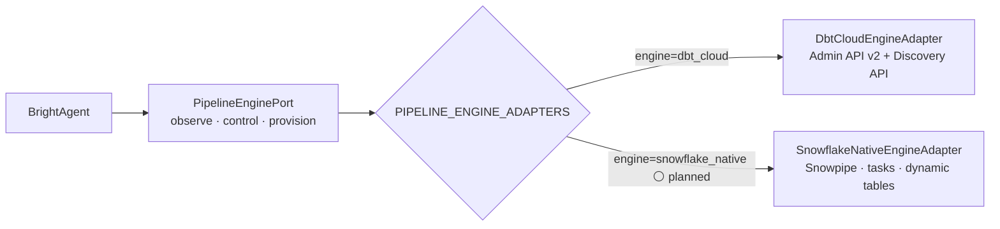

# Full-lifecycle pipeline-engine control from BrightAgent

> Full contract: `~/.claude/rules/spec-driven.md` + `~/.claude/rules/pluggable-scalable.md`
> (Ports & Adapters). Engine-agnostic by mandate (`agentic-project-mgmt/docs/CLAUDE.md`):
> the **port + registry come first**, dbt Cloud is **adapter #1**, Snowflake native pipelines
> is the **plausible adapter #2** — no vendor name is baked into the engine-agnostic domain
> paths. Reference architecture:
> `platform-saas-ai-context/docs/architecture/DBT_CLOUD_ACCOUNT_AND_PROJECT_LINKS.md` +
> `DBT_TRANSFORMATION_ARCHITECTURE.md` (BH-332 auto-provisioning plan) + `DBT_CLOUD_LEARNINGS.md`.
> Companion spec: `dbt-cloud-project-links.md` (tenant-scoped listing + project linkage — the
> dbt-Cloud-adapter view of §2's port contract).

## 1. Context

BrightAgent can today **trigger existing** dbt Cloud jobs and read their models/logs on demand,
but it cannot **provision** (new jobs, repos, an isolated project) and has **no standing
observability** (no persisted run history, no alerting). We want full lifecycle control —
**observe, control, provision** — over a **transformation pipeline engine**, tenant-scoped, so
an operator can stand up a clean Loop-Capital-only isolated pipeline and run transformations
end to end.

The transformation pipeline engine is a **swappable external system**. Today it's **dbt Cloud**;
the next plausible engine is **Snowflake native pipelines** (Snowpipe / streams + tasks /
dynamic tables) with no dbt Cloud account at all — same lifecycle verbs (observe a pipeline's
steps and logs, run/cancel a run, provision an isolated pipeline), entirely different backend.
Per the ports-&-adapters mandate this spec defines a **`PipelineEnginePort`** (the verbs, in
domain types) + a **`PIPELINE_ENGINE_ADAPTERS` registry**; dbt Cloud is the first adapter, not
the design.

Delivery is **hybrid** (decision 2026-07-31): **MCP for read/observability**, **brightbot +
platform-core Admin-API tools for provisioning writes**. The stale
`mcp-dbt.{env}.brighthive.net` CLI-wrapper server is NOT the target — the dbt Cloud adapter
extends the upstream `dbt-labs/dbt-mcp` whitelist and the `dbt_cloud_tools.py` / `dbt-api.ts`
Admin-API surfaces.



Legend: 🟢 built · 🔶 partial · ⚪ planned (no adapter yet).

### How It Works Today — the dbt Cloud adapter surface (verified 2026-07-31)

| Layer | What exists | file:line |
|---|---|---|
| Upstream dbt-mcp (Discovery API, read) | `get_all_models`, `get_model_details/parents/children`, `get_lineage`, `get_all_sources`, `get_source_details`, `list_job_run_artifacts`, `list_metrics`, `query_metrics`, `search_product_docs` | `brightbot/agents/dbt_agent/tools/dbt_mcp_loader.py:35` |
| brightbot Admin API (control, read) | `list_jobs`, `get_job_run_error`, `run_dbt_cloud_command` (trigger + `steps_override`), `run_models_to_stage`; run-logs via `_fetch_run_details_with_logs`, poll via `_poll_run` | `brightbot/agents/dbt_agent/tools/dbt_cloud_tools.py:567,650,742,1134,237,142` |
| platform-core Admin API | `getAllJobs`, `getJobs`, `postTriggerJob`, `getRun`, `getRawRunResults`, `pollRunUntilComplete`, `createValidationJob` (only create) | `brighthive-platform-core/src/graphql/service/dbt/dbt-api.ts:305,350,474,602,567,627,247` |

So on the port's three verbs: **observe ≈ 60% built** (via dbt-mcp + Admin reads), **control ≈
40%** (trigger only; no cancel, no schedule mutate), **provision ≈ 0%** — all for the dbt Cloud
adapter. No adapter exists for any second engine.

### Hard Limitations (dbt Cloud adapter today)

- **No provisioning**: BH-332's `createProject/createRepository/createConnection/createEnvironment/createJob/deleteProject` for dbt Cloud were never implemented (only `createValidationJob` exists).
- **No cancel** of a running job; **no schedule (cron/trigger) mutation** — schedule is read-only except the hardcoded one inside `createValidationJob`.
- **No standing observability**: run history is in-session only; no persisted trend store, no failure alerting, no cross-run dashboard/scheduled health check.
- **dbt-mcp `list_jobs` is unusable** (hardcodes prod env) — brightbot replaces it with its own; the upstream job-error/artifact tools are broken by dbt-mcp v1.15.
- **Shared account, soft tenancy** — every dbt Cloud listing sees all 17 projects incl. other clients; the MFA'd Snowflake credential on the Loop Capital dbt service blocks real runs (see reference docs).
- **No port abstraction yet** — the verbs are dbt-Cloud-shaped throughout; adding Snowflake native pipelines today means rewriting call sites, not adding an adapter. This spec fixes that.

### Gaps

Port: no `PipelineEnginePort` / registry — engine choice is implicit and vendor-hardcoded.
Provision (net-new, dbt Cloud adapter): create/update/delete jobs; create/link repos; create
warehouse connection; create environment; isolated-pipeline bootstrap in one flow; teardown.
Observability: persisted run history + trend store; failure alerting; scheduled health check.
Control: cancel a run; mutate a schedule.

## 2. Interface Contract (MDE)

> **Port first, adapter second** (per `docs/CLAUDE.md`). §2a is the engine-agnostic contract
> the domain/agent depends on. §2b is dbt Cloud as **adapter #1** — the concrete wiring, clearly
> not the design. §2c sketches adapter #2 to prove the port isn't dbt-shaped. Nothing outside an
> adapter names a vendor.

### 2a. The port + registry (engine-agnostic — this is the design)

```python
from typing import Protocol, Final
from collections.abc import Callable, Sequence

PipelineEngine = str          # "dbt_cloud" | "snowflake_native" (Literal + Final constants)
DBT_CLOUD: PipelineEngine = "dbt_cloud"
SNOWFLAKE_NATIVE: PipelineEngine = "snowflake_native"

class PipelineEnginePort(Protocol):
    def capabilities(self) -> frozenset[Capability]: ...        # {CANCEL, SCHEDULE_MUTATE, PROVISION_ISOLATED, ...}

    # observe
    async def list_pipelines(self, *, ctx: RequestContext, owned_only: bool = True) -> Sequence[Pipeline]: ...
    async def get_pipeline_steps(self, *, pipeline_id: str, ctx: RequestContext) -> PipelineSteps: ...   # the engine's transform commands
    async def get_run_logs(self, *, run_id: str, ctx: RequestContext) -> RunLogs: ...                    # untruncated per-step logs
    async def get_run_status(self, *, run_id: str, ctx: RequestContext) -> RunStatus: ...

    # control
    async def run_pipeline(self, *, pipeline_id: str, steps_override: Sequence[str] | None, ctx: RequestContext) -> RunHandle: ...
    async def cancel_run(self, *, run_id: str, ctx: RequestContext) -> bool: ...
    async def set_schedule(self, *, pipeline_id: str, schedule: Schedule, ctx: RequestContext) -> Pipeline: ...

    # provision  (guarded by capabilities(); atomic-or-compensating)
    async def provision_isolated(self, *, spec: IsolatedPipelineSpec, ctx: RequestContext) -> ProvisionResult: ...
    async def teardown(self, *, pipeline_ref: PipelineRef, ctx: RequestContext) -> bool: ...

AdapterFactory = Callable[[EngineConfig], PipelineEnginePort]
PIPELINE_ENGINE_ADAPTERS: Final[dict[PipelineEngine, AdapterFactory]] = {
    DBT_CLOUD:        DbtCloudEngineAdapter,       # adapter #1 (this spec)
    # SNOWFLAKE_NATIVE: SnowflakeNativeEngineAdapter,  # adapter #2 (planned — proves the seam)
}

def build_pipeline_engine(*, engine: PipelineEngine, config: EngineConfig) -> PipelineEnginePort:
    return PIPELINE_ENGINE_ADAPTERS[engine](config)
```

Domain types the port speaks (never vendor types like `DbtCloudJobOutput`): `Pipeline`,
`PipelineSteps`, `RunHandle`, `RunLogs`, `RunStatus`, `Schedule`, `IsolatedPipelineSpec`,
`ProvisionResult`, `Capability`. Adapters translate at the boundary.

### 2b. Adapter #1 — dbt Cloud (the concrete wiring, NOT the design)

`DbtCloudEngineAdapter` maps the port onto the real dbt Cloud surfaces. Existing methods
satisfy part of the port; the rest are net-new on `dbt_cloud_tools.py` / `dbt-api.ts`.

```
# observe  → brightbot Admin-API tools (MCP-exposed) + dbt-mcp whitelist
list_pipelines     → list_dbt_jobs(service_id, workspace_id, owned_only=true)   [tenant-filter over getDbtJobs]
get_pipeline_steps → get_dbt_job_commands(service_id, job_id) -> { execute_steps: [str] }
get_run_logs       → get_dbt_run_logs(service_id, run_id)  [full run_steps[].logs, untruncated]     # NEW tool wrapper
get_run_status     → get_dbt_run_status(service_id, run_id)

# control  → platform-core dbt-api.ts + agent tool
run_pipeline       → run_dbt_cloud_command / postTriggerJob (steps_override)     [EXISTS]
cancel_run         → cancel_dbt_run(service_id, run_id)                          [NEW — Admin API v2 cancel]
set_schedule       → set_dbt_job_schedule(service_id, job_id, cron|triggers)     [NEW]

# provision  → platform-core dbt-api.ts (Admin API v2), token-proxied
provision_isolated → createDbtCloudProject → createDbtConnection → createDbtEnvironment
                     → createDbtRepository (+ 2-step attach, DBT_CLOUD_LEARNINGS §2) → createDbtJob   [all NEW]
teardown           → deleteDbtProject(project_id)                                [NEW]
```

Exposed to the graph as GraphQL `provisionIsolatedTransformation(input: ProvisionInput!): ProvisionOutput!`:

```
ProvisionInput  { workspaceId, engine, projectName, warehouseConfigRef, repoTemplate }
ProvisionOutput { engine, isolatedPipelineId, resourceRefs { repositoryId, connectionId, environmentId, jobId }, status }
status: PENDING → CREATING_CONNECTION → CREATING_ENV → CREATING_REPO → CREATING_JOB → COMPLETE | FAILED
```

Note `engine` on the DTO — the wire contract is engine-parameterized, so `ProvisionOutput` for
Snowflake native carries `resourceRefs { streamName, taskName, dynamicTableName }` instead of
dbt refs, same envelope.

### 2c. Adapter #2 — Snowflake native pipelines (planned — proves the port isn't dbt-shaped)

Same seven port verbs, backed by Snowflake SQL/metadata — no dbt Cloud account:

```
list_pipelines     → SHOW TASKS / SHOW DYNAMIC TABLES in the workspace schema
get_pipeline_steps → GET_DDL('TASK', ...) / task graph (the SQL a task runs)
get_run_logs       → TABLE(INFORMATION_SCHEMA.TASK_HISTORY(...))  / COPY_HISTORY for Snowpipe
get_run_status     → TASK_HISTORY state
run_pipeline       → EXECUTE TASK
cancel_run         → SYSTEM$USER_TASK_CANCEL_ONGOING_EXECUTIONS  / suspend task
set_schedule       → ALTER TASK ... SET SCHEDULE = 'USING CRON ...'
provision_isolated → CREATE STREAM + CREATE TASK/DYNAMIC TABLE + CREATE PIPE (one isolated schema)
teardown           → DROP TASK/STREAM/PIPE cascade
```

This adapter is out of scope to *build* here (§5) — it exists in the contract to keep the port
honest. If any port verb can't express it, the port is wrong.

### 2d. Observability store (standing monitoring — engine-agnostic)

```
PipelineRunRecord { run_id, pipeline_id, workspace_id, engine, status, duration_s, started_at, finished_at }
Log events: pipeline.run.failed → routed to alerting (Slack/notification), not just in-session
```

## 3. Invariants (DbC)

```
WHERE more than one pipeline engine exists, THE System SHALL select the adapter via PIPELINE_ENGINE_ADAPTERS by engine discriminator — call sites SHALL depend only on PipelineEnginePort, never on a vendor SDK/type.
WHEN any list/read verb runs with owned_only=true, THE System SHALL return only the workspace's pipelines.
WHEN a call site needs an engine-specific behavior, THE System SHALL branch on capabilities(), never on adapter identity.
WHEN provision_isolated succeeds, THE System SHALL have created all resources bound, OR rolled back to no partial resources (atomic or compensating).
IF a provisioning step fails, THEN status SHALL be FAILED and any resources created before the failure SHALL be recorded for teardown (no silent orphans).
WHEN the dbt Cloud adapter's createDbtRepository returns a repository_id, THE System SHALL complete the two-step project attach before reporting success.   # DBT_CLOUD_LEARNINGS §2
WHEN a run reaches a terminal state, THE System SHALL persist a PipelineRunRecord.
IF a run terminates in ERROR, THEN THE System SHALL emit pipeline.run.failed to the alerting path.
THE System SHALL NOT expose an engine credential (dbt Cloud apiToken, Snowflake key) to the agent process — provisioning writes are proxied through platform-core (mirrors the GitHub-PAT proxy, BH-529).
```

Budget: 9 invariants (≤15).

## 4. Acceptance Criteria (BDD — Gherkin)

```gherkin
Feature: Full-lifecycle pipeline-engine control (engine-agnostic)

  Scenario: The engine is chosen by registry, not hardcoded
    Given a workspace configured with engine "dbt_cloud"
    When the agent builds a pipeline engine
    Then build_pipeline_engine returns a DbtCloudEngineAdapter via PIPELINE_ENGINE_ADAPTERS
    And the call site holds only a PipelineEnginePort reference

  Scenario: Observe a pipeline's steps and full run logs (dbt Cloud adapter)
    Given a linked transformation service on the dbt_cloud engine
    When I call get_pipeline_steps and get_run_logs for one of its pipelines
    Then I get the pipeline's transform commands and the untruncated per-step logs

  Scenario: Provision an isolated pipeline end-to-end (dbt Cloud adapter)
    Given a workspace and a warehouse config
    When I call provision_isolated
    Then a new project, connection, environment, repo and job exist and are bound
    And the repository is attached (two-step create completed)
    And status is COMPLETE

  Scenario: Provisioning rolls back on failure
    Given provisioning that fails at the environment step
    When the failure occurs
    Then status is FAILED
    And the already-created resources are recorded for teardown (no orphans)

  Scenario: Capability negotiation, not adapter sniffing
    Given an engine whose capabilities() omits SCHEDULE_MUTATE
    When a caller wants to change a schedule
    Then it checks capabilities() and degrades gracefully — it does not branch on adapter identity

  Scenario: Cancel a running pipeline
    Given a running run
    When I call cancel_run
    Then the run is cancelled

  Scenario: A failed run raises an alert
    Given a pipeline that errors
    When the run terminates in ERROR
    Then a PipelineRunRecord is persisted and pipeline.run.failed is emitted to alerting

  Scenario: Engine credential never reaches the agent
    Given the agent provisions a pipeline
    When the write executes
    Then it is proxied through platform-core and the agent never holds the engine credential
```

Budget: 8 scenarios (≤20).

## 5. Out of Scope

- **Building** the Snowflake-native adapter (§2c) — this spec ships the port + registry + dbt Cloud adapter #1 only; adapter #2 is a follow-on ticket, proven expressible here.
- Migrating dbt Cloud to per-tenant accounts (hard isolation) — separate infra decision.
- The stale `mcp-dbt.{env}.brighthive.net` CLI-wrapper server — not extended, not deprecated here.
- Fixing the MFA'd Snowflake credential — tracked separately (DBT_CLOUD_LEARNINGS §"Snowflake MFA"); blocks live dbt runs but not this contract.
- Webapp UI for provisioning (BH-336 in the BH-332 plan owns the stepper surface).

## 6. Dependencies

| Dependency | Type | Status |
|------------|------|--------|
| Tenant-scoped listing (`dbt-cloud-project-links.md` spec) | Blocking | Draft (PR #148) |
| dbt Cloud GitHub App "All repositories" access on `brighthive-dbt` org | Blocking (dbt adapter createRepository) | Not started (DBT_CLOUD_LEARNINGS §1) |
| GitHub-PAT proxy through platform-core (BH-529) | Non-blocking | Ready — extend for engine-credential proxy |
| MFA'd Snowflake credential fix | Non-blocking (blocks live dbt runs, not the contract) | Not started |
| dbt Cloud service account = full admin | Blocking (dbt adapter provisioning) | **Verify** — assumption, confirm scope before build |

## 7. Correctness Properties

### Property 1: The domain never names a vendor

*For any* engine-agnostic call site (agent, orchestrator, monitor), a `grep` for a vendor token
(`"dbt_cloud"`, `snowflake`, `DbtCloudJobOutput`) returns only the constant, the registry entry,
and the adapter body — never business logic.

**Validates: §3 Invariant 1, §4 Scenario "The engine is chosen by registry"**

### Property 2: Provisioning is atomic-or-compensating

*For any* `provision_isolated` call, the end state is either all resources created & bound, or no
orphaned resources (every pre-failure resource recorded for teardown).

**Validates: §3 Invariant 4 & 5, §4 Scenario "Provisioning rolls back on failure"**

### Property 3: Credential never leaves the proxy

*For any* provisioning write, the engine credential is read only inside platform-core; the agent
process never receives it.

**Validates: §3 Invariant 9, §4 Scenario "Engine credential never reaches the agent"**

### Property 4: Behavior branches on capability, not identity

*For any* engine-specific decision, the code inspects `capabilities()`; no `isinstance(adapter, …)`
or engine-string comparison drives behavior outside the registry.

**Validates: §3 Invariant 3, §4 Scenario "Capability negotiation, not adapter sniffing"**

## 8. Eval Criteria

| Evaluator | Node | Mode | Threshold | Method |
|---|---|---|---|---|
| ProvisioningOrchestration | provision_isolated (dbt adapter) | GATE | reaches COMPLETE or clean FAILED (no orphans) on a sandbox project | deterministic |
| RunLogRetrieval | get_run_logs | OBSERVE | returns non-empty steps for a real completed run | deterministic |

## 9. Observability Contract

- **Span**: `gen_ai.tool.execute` with `gen_ai.tool.name` ∈ {`pipeline_provision`, `pipeline_run`, `pipeline_cancel`, `pipeline_logs`}
- **Attributes**: `workspace.id`, `pipeline.engine`, `transformation_service.id`, `pipeline.id`, `pipeline.run_id`, `pipeline.provision_status`
- **Log events**: `pipeline.listed`, `pipeline.run.triggered`, `pipeline.run.cancelled`, `pipeline.run.failed`, `pipeline.provision.started/step/complete/failed`
- **Metrics**: `pipeline.run.duration_s`, `pipeline.run.failure_count` (tagged `workspace_id`, `engine`, `pipeline_id`) — feed the standing monitor

## 10. Test Coverage Update

| Repo | Suite | What to add |
|---|---|---|
| `brighthive-platform-core` | `brighthive-platform-core/tests/` | One test per §2b dbt method (`createDbtCloudProject/Connection/Environment/Repository/Job`, `deleteDbtProject`, `provisionIsolatedTransformation`); one per §3 invariant (registry selection with a **fake second adapter**; atomic rollback via forced mid-flow failure; credential-never-exposed); real-behavior: hit a **dbt Cloud sandbox project**, assert the two-step repo attach persisted |
| `brightbot` | `brightbot/tests/` + `brightbot/brightbot/evals/` | Port contract test with a `FakePipelineEngine` adapter (happy + failure-injection per PS-10); L0: each observe/control tool returns the §2a domain shape; L1: agent routes provisioning writes through the platform-core proxy (never holds a credential); L2 (real-behavior): `get_run_logs` returns non-empty steps for a real completed staging run; `cancel_run` cancels a real run |
| `brighthive-e2e` | `brighthive-e2e/e2e/` | One feature test: provision isolated pipeline → run → observe logs, end-to-end on a sandbox (dbt adapter); one error-path: provisioning fails mid-flow → status FAILED, no orphans |

**Real-behavior requirement** (`~/.claude/rules/test-behavior-real.md`): provisioning tests run
against a **dbt Cloud sandbox project** (never mocks), and assert the actual resource exists via
a follow-up Admin API read — the two-step repo attach is the exact place mocks would hide the
BH-332 bug (DBT_CLOUD_LEARNINGS §2). The port ships a `FakePipelineEngine` (PS-10) with a
failure-injection mode; happy-path-only fakes are rejected.

## Areas Involved

| Area | Repo | Impact |
|------|------|--------|
| Platform Core | `brighthive-platform-core` | `PipelineEnginePort` + `PIPELINE_ENGINE_ADAPTERS` registry; dbt Cloud adapter net-new provisioning methods in `dbt-api.ts`; `provisionIsolatedTransformation` mutation (engine-parameterized); credential-proxy; PipelineRunRecord store + alerting |
| BrightBot | `brightbot` | Port interface + `DbtCloudEngineAdapter`; new observe/control tools (logs, cancel, schedule, tenant-scoped list); dbt-mcp whitelist additions; provisioning proxied through platform-core; `FakePipelineEngine` |
| Web App | `brighthive-webapp` | (BH-336) provisioning stepper UI — out of scope here, consumes the mutation |

## Ticket Breakdown

| Ticket | Summary | Points | Epic |
|--------|---------|--------|------|
| — | Port + registry: `PipelineEnginePort`, `PIPELINE_ENGINE_ADAPTERS`, domain types, `FakePipelineEngine` (failure-injection) | 5 | BH-1323 |
| — | dbt adapter — observe: tenant-scoped `list_pipelines`, `get_pipeline_steps`, untruncated `get_run_logs`, `get_run_status` (brightbot + MCP whitelist) | 5 | BH-1323 |
| — | dbt adapter — control: `cancel_run` + `set_schedule` (platform-core method + agent tool) | 3 | BH-1323 |
| — | dbt adapter — provision: `dbt-api.ts` create* methods (project/connection/env/repo/job) + two-step repo attach | 8 | BH-1323 |
| — | Provision orchestrator: `provisionIsolatedTransformation` mutation (engine-parameterized), atomic-or-teardown, credential-proxied | 5 | BH-1323 |
| — | Standing observability: PipelineRunRecord persist + `pipeline.run.failed` alerting path | 5 | BH-1323 |
| — | Spike: confirm dbt Cloud service account is full admin + GitHub App "all repos" on brighthive-dbt | 2 | BH-1323 |
| — | e2e: provision→run→observe on a sandbox (dbt adapter) + fail-mid-flow no-orphans | 3 | BH-1323 |
| — | (follow-on) Snowflake-native adapter #2 — prove the port on a second engine | 8 | BH-1323 |

## Related

- **Ports & Adapters rule**: `~/.claude/rules/pluggable-scalable.md` (PS-1, PS-4, PS-10, PS-15 capability negotiation)
- **Engine-agnostic mandate**: `agentic-project-mgmt/docs/CLAUDE.md` §specs ("port-first, vendor-second")
- **Reference architecture**: `platform-saas-ai-context/docs/architecture/DBT_CLOUD_ACCOUNT_AND_PROJECT_LINKS.md`
- **BH-332 auto-provisioning plan** (never implemented): `…/DBT_TRANSFORMATION_ARCHITECTURE.md` §"Auto-Provisioning Pipeline"
- **Debugging checklist** (two-step repo attach, Discovery-needs-a-run, MFA): `…/DBT_CLOUD_LEARNINGS.md`
- **Companion spec**: `dbt-cloud-project-links.md` (tenant-scoped listing — the dbt-Cloud-adapter view of the port's observe verbs)
